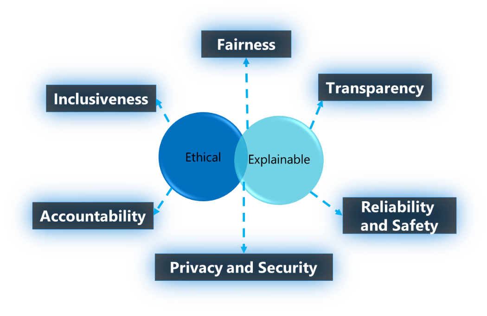
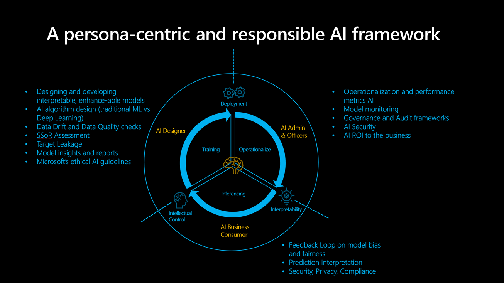

# Trusted AI

Microsoft provides six guiding principles for responsible AI: fairness, reliability and safety, privacy and security, inclusiveness, transparency and accountability. These principles are the cornerstone of a responsible and trustworthy AI, especially as AI moves into more mainstream products and services.

We can think of these principles from two lenses, ethical and explainable.

## Ethical

From an ethical perspective, AI should be fair and inclusive in its assertion and does not discriminate or hinder groups from various races, disability or background, and be accountable for the decision it makes.

Microsoft has an ethical AI committee called the [Aehter](/learn/modules/microsoft-responsible-ai-practices/3-microsoft-governance-model), which was established in 2017.  The core responsibility of the committee is to make recommendations on responsible issues, technologies, processes, and best practices.

More details on the body can be found on the following link:  [Aether Committee](https://www.microsoft.com/en-us/ai/our-approach?activetab=pivot1%3aprimaryr5)  

## Accountability ​

Accountability is an essential pillar of responsible AI. The people who design and deploy the AI system need to be accountable for the action or decision it takes, especially, as we are heading towards more autonomous systems. Organizations should consider establishing an internal review body, which provides oversight and insight, as well as guidance regarding the development and deployment on AI systems.  While these guidelines many vary depending on the company and region, it should however reflect their AI journey.  

## Inclusiveness​

Inclusiveness mandates that AI should consider all broad ranges of human race and experience. Where possible, technologies such as speech-to-text, text-to-speech, visual recognition, should be used to empower those with hearing, visual and other impairments.

Inclusive design practices can help developers to understand and address potential barriers that may unintentionally exclude people.

## Reliability and safety

AI systems need to be reliable and safe in order for it to be trusted.  It is important that the system performs as it was originally designed, and responses safely in unanticipated conditions.   It should have inherent resilience that resists from intended or unintended manipulation. A rigorous testing and validation should be mandated for various operating conditions to ensure that it responds safely even in edge cases.  Methods such as A/B testing and Champion/Challenger or other methods should be considered as part of the process.

AI system’s performance can degrade over time; therefore, a robust monitoring and model tracking process needs to be established that reactively and proactively measure the performance of the and retrain as necessary to refresh the model.

## What is explainable

Explainability is imperative for data scientist, auditors, and business decision makers to ensure that an AI system can reasonably justify its decision and how it came to this conclusion.  This is important to ensure compliance with company policies, industry standards, and government regulation. A data scientist should be able to explain to the stakeholder how they achieved a certain level of accuracy and what's influencing or attributing to this outcome. Likewise, an auditor needs a tool to validate the model in order to comply with the company’s policies. And a business decision maker needs to be able to provide transparency of the model in order to gain trust.

In order to achieve the model explainability, Microsoft has been developing an open-source toolkit, called InterpretML, which supports glass-box and black-box models.

Glass-box models are interpretable due to their structure. It's recommended to use Explainable Boosting Machine, which is the state of the algorithm based on decision tree or linear models. They provide lossless explanation and are editable by domain experts.

Black-box models are more challenging to interpret because of a complex internal structure, the Neural Network. For these types models, the explainer analyzes the relationship between the input and output to interpret the model. Typical explainers like LIME or SHapley Additive exPlanation are used for these types of models.

Azure Machine Learning integrates FairLearn as part of the offering, both for the SDK and the AutoML GUI.  It is recommended that explainers are used to understand the key influencer of the model, and domain experts are used to validate these influencers.

More details can be found on the following links: [InpretML](http://interpret.ml/), [AML Interpretability](/azure/machine-learning/how-to-machine-learning-interpretability)

## Fairness​

Fairness is a fundamental principle all human beings strive to achieve, as it's one of cornerstones of our ethical principles. This principle is even more important during the development of AI systems, where key checks and balances need to ensure that the system's decision doesn't discriminate or run a bias towards a certain group or individual that's based on their gender, race, sexual orientation, or religion.

As a starting point, Microsoft provides an **AI fairness checklist**, to guide the fairness in AI systems in a prescriptive way.  They can be broadly categorized in five stages, Envision, Prototype, Build, Launch and Evolve. Each category entails a list of recommended activities to ensure various due diligence is completed to minimize the impact of unfairness in the system.

More details can be found in the following link: [Fairness Checklist](https://query.prod.cms.rt.microsoft.com/cms/api/am/binary/RE4t6dA)

On a practical level, Microsoft has been working toward an open-source toolkit known, Fairlean, that supports data scientists and developers to assess and improve the fairness of their AI systems.  The toolbox provides various unfairness mitigation algorithms, as well as an interactive dashboard for visualizing the fairness of your model.  It is recommended that when a model is built, the toolkit's used to assess the fairness of the model, and it should be an integral part of the DS process. Fairlearn is also integrated with AzureML.  

More details of the toolbox can be found on the following links: [FairLearn](https://fairlearn.github.io/), [Azure Machine Learning FairLearn](/azure/machine-learning/concept-fairness-ml)

## Transparency

Transparency is important to understand which data was used to train the model, what transformation logic has been applied to the data, which algorithms were used to train the model, what was the final model generated, and what are the associated assets with the model.  These information help to get a better understanding of the process involved in creating the model, which can enable us to reproduce the model in a transparent way.  Azure Machine Learning workspace facilitates this by recording or retraining all training related assets using “Snapshot”, and all metrics associated with an experiment.  

More information can be found on the following link: [Azure Machine Learning workspace](/azure/machine-learning/concept-workspace)

## Privacy and security

Privacy and security are an integral part of the AI system, whereby protecting data is a mandatory obligation of the data holder.  More so, when dealing with personal data, one must not only ensure that it's secure but also accessed in a way that doesn'y compromise or infringe an individual's privacy. Microsoft ensues this through a technology known as **differential privacy**.  Differential privacy addresses this by adding randomness or “noise” to the data so that the data scientist can't identify any individual data, which preserves the data's privacy.

More details can be found on the following link: [Differential Privacy](/azure/machine-learning/concept-differential-privacy)

## Human AI guidelines​

Human AI design guidelines consist of 18 principles, and they are broadly categories in four areas: ‘initially’, ‘during interaction’, ‘when wrong’ and ‘over time’. These principles are designed to result in a more inclusive and more human-centric AI-infused system. Below are some of the key principles in each category.

## Initially

- **Make clear what the system can do**. As an example, if the AI system use/generate metrics, it's important to show all the metrics that are used and how they are tracked.
- **Make clear how well the system can do what it can do**. Help the users to understand that AI will not be 100% accurate and set the expectation when the AI system may make mistake.

## During interaction

- **Show contextually relevant information.** Visually provide information related to the user’s current context and environment. Such as searching for a hotel return details close proximity to the intended destination and date.
- **Mitigate social biases**. Ensure that the language and behaviour do not introduce any unintended stereotype and biases. As an example, an auto-complete feature considers both genders.

## When wrong

- **Support efficient dismissal.** Provide an easy mechanism to ignore or dismiss undesirable features/services.
- **Support efficient correction.** Provide an intuitive way of making it easier way to edit, refine or recover.
- **Make clear why the system did what it did.** Enable explainable AI to provide insights into assertion made by the AI system.

## Over time

- **Remember recent interactions.** Retain history of interaction for future reference.
- **Learn from user behavior**. Personalize the interaction based on user’s behaviour.
- **Update and adapt cautiously**. Limit disruptive changes, and update based on user’s profile.
- **Encourage granular feedback**. Facilitate user’s feedback based on their usual interactions with the AI system.

Full listings can be found on the following link: [Human AI Guidelines](/ai/guidelines-human-ai-interaction)

## Persona–centric Trusted AI Framework

## AI Designer

As an AI model Builder, the AI Designer has the responsibility for the following:

- Data drift and quality checks by enabling outlier detection, data quality checks for missing value elimination, distribution normalization, data imputation, and project/use-case level reporting
- Data Assessment of the source data in the System Source of Record to define the initial state of bias of data
- AI and algorithm design to remove bias such as define the elimination of minority groups within the data due to binning, grouping, normalization especially in traditional ML models (e.g. tree-based models). Furthermore, such categorical AI design reiterates bias implications by defining social, racial, gender classes especially in industry verticals that rely on PHI and PII.
- Identification and alerting of any risk of causing target leakage and strengthen development of the model.
- Best practice for model reporting and insights focusing on enabling a granular understanding of the model avoiding black-box approaches e.g. by using feature or vector importance, UMAP clustering, Friedman's H-statistic, feature effects, and others. The dimensionality and complexity of modern datasets requires identification metrics of correlations to the target to define the predictive influence, relationship and dependencies of features.
- Following Microsoft’s Ethical guidelines

## AI administrators and officers

AI administrator and officer responsibilities involve the operationalization and performance metrics of AI, governance and audit frameworks, and enablement of AI security and ROI to the business.

- Model monitoring​ is one of the central cornerstones of AI development and is served through a tracking dashboard that combines model metrics for production models by focusing specifically on accuracy and model degradation, data drift and deviation, and changes in speed/error of inference.
- Flexibility of deployment and re-deployment (REST API preferred) allows agile model implementation into an open tool-agnostic architecture integrating the model into business processes and business feedback loops generation value.
- Model governance and access sets boundaries to mitigate negative business and operational impact. Security implications based on RBAC standards preserve restricted production environments and IP.
- AI audit frameworks and compliance to track detailed model generations and changes of model development to adhere industry-specific regulations. The foundation of interpretable and trusted AI is based on explain-ability measures, concise features and model visualizations, and industry vertical specific language.

## AI business consumer

AI Business Consumers (Business experts) act as the conduit to close the feedback loop and provide input back to the AI Designer. AI systems are evaluated by their predictive decision-making, potential bias implications including fairness and ethical measures, privacy and compliance, and business efficiency:

- As part of a business ecosystem, a feedback loop on model bias, error, prediction speed, and fairness enable a framework of trust and balance in-between the AI Designer and AI Administrators & Officers. The AI should positively improve over time by such human-centric assessment and possibly limit the AI on learning on biased data by minimizing current approached learning on modern datasets of dimensionality and complexity (LO-shot Learning).
- Through enabled interpretability design and tools, the AI systems can be held accountable and any bias identified. Model bias and fairness issues should be flagged feeding into an alerting and anomaly detection system learning from unsatisfying model behavior ensuring addressing such issues downstream automatically.
- Each predictive value should be able to be broken down into individual feature or vector importance/impact delivering full explanations of predictions ready to be exported into a business report for audit and compliance reviews, customer transparency, and business readiness.
- Due to worldwide increasing security and privacy risks, best practices regarding data violations when running inference are required complying with regulations in individual industry verticals e.g. alerting by non-compliant PHI/PII usage, violation national security laws.