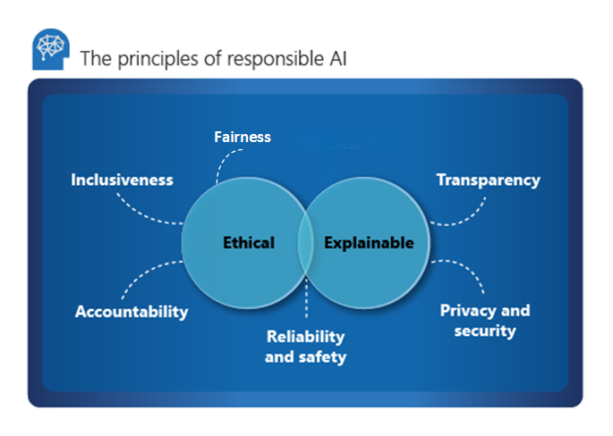
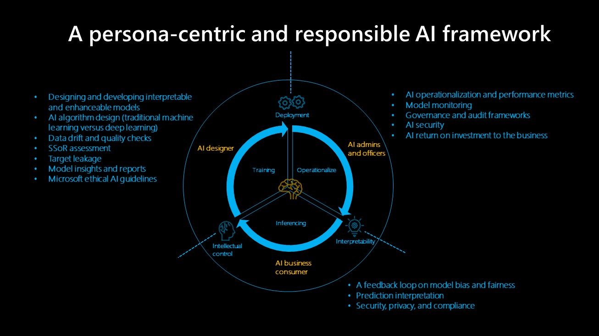

# Responsible and trusted AI

Microsoft outlines six key principles for responsible AI: accountability, inclusiveness, reliability and safety, fairness, transparency, and privacy and security. These principles are essential to creating responsible and trustworthy AI as it moves into more mainstream products and services. They are guided by two perspectives: ethical and explainable.

## Ethical

From an ethical perspective, AI should be fair and inclusive in its assertions, be accountable for its decisions, and not discriminate or hinder different races, disabilities, or backgrounds.

Microsoft established an ethical committee for AI, ethics, and effects in engineering and research [Aether](https://www.microsoft.com/ai/our-approach?activetab=pivot1%3aprimaryr5), in 2017. The core responsibility of the committee is to advise on responsible issues, technologies, processes, and best practices. Learn more about Aether [at this Microsoft Learn module](/learn/modules/microsoft-responsible-ai-practices/3-microsoft-governance-model).

### Accountability

Accountability is an essential pillar of responsible AI. The people who design and deploy the AI system need to be accountable for its actions and decisions, especially as we progress toward more autonomous systems. Organizations should consider establishing an internal review body that provides oversight, insights, and guidance about developing and deploying AI systems. While this guidance might vary depending on the company and region, it should reflect an organization's AI journey.

### Inclusiveness

Inclusiveness mandates that AI should consider all human races and experiences, and inclusive design practices can help developers to understand and address potential barriers that could unintentionally exclude people. Where possible, speech-to-text, text-to-speech, and visual recognition technology should be used to empower people with hearing, visual, and other impairments.

### Reliability and safety

AI systems need to be reliable and safe in order to be trusted. It's important for a system to perform as it was originally designed and for it to respond safely to new situations. Its inherent resilience should resist intended or unintended manipulation. Rigorous testing and validation should be established for operating conditions to ensure that the system responds safely to edge cases, and A/B testing and champion/challenger methods should be integrated into the evaluation process.

An AI system's performance can degrade over time, so a robust monitoring and model tracking process needs to be established to reactively and proactively measure the model's performance and retrain it, as necessary, to modernize it.

## Explainability

Explainability helps data scientists, auditors, and business decision makers to ensure that AI systems can reasonably justify their decisions and how they reach their conclusions. This also ensures compliance with company policies, industry standards, and government regulations. A data scientist should be able to explain to the stakeholder how they achieved certain levels of accuracy and what influenced this outcome. Likewise, in order to comply with the company's policies, an auditor needs a tool that validates the model, and a business decision maker needs to be able to provide a transparent model in order to gain trust.

### Explainability tools

Microsoft has developed [InterpretML](https://interpret.ml/), an open-source toolkit that helps to achieve model explainability and supports glass-box and black-box models.

- Glass-box models are interpretable because of their structure. For these models, use Explainable Boosting Machine, which is the state of the algorithm based on a decision tree or linear models, provides lossless explanations, and is editable by domain experts.

- Black-box models are more challenging to interpret because of a complex internal structure, the neural network. Explainers like LIME or SHapley Additive exPlanations (SHAP) interpret these models by analyzing the relationship between the input and output.

- [Fairlearn](https://fairlearn.org/) is an Azure Machine Learning integration and an open-source toolkit for the SDK and the AutoML graphical user interface. Use explainers to understand what mainly influences the model and domain experts to validate these influences.

Explore [model interpretability in Azure Machine Learning](/azure/machine-learning/how-to-machine-learning-interpretability) to learn more about explainability.

### Fairness

Fairness is a core ethical principle that all humans aim to understand and apply. This principle is even more important when AI systems are being developed. Key checks and balances need to make sure that the system's decisions don't discriminate or run a gender, race, sexual orientation, or religion bias toward a group or individual.

- Microsoft provides an [AI fairness checklist](https://query.prod.cms.rt.microsoft.com/cms/api/am/binary/RE4t6dA) that offers guidance and solutions for AI systems. These solutions are loosely categorized into five stages: envision, prototype, build, launch, and evolve. Each stage lists recommended due diligence activities that help to minimize the impact of unfairness in the system.

- Fairlearn integrates with Azure Machine Learning and supports data scientists and developers to assess and improve the fairness of their AI systems. The toolbox provides various unfairness mitigation algorithms and an interactive dashboard that visualizes the fairness of the model. Use the toolkit and closely assess the fairness of the model while it's being built; this should be an integral part of the data science process.

Learn how to [mitigate fairness in machine learning models](/azure/machine-learning/concept-fairness-ml).

### Transparency

Achieving transparency helps the team to understand the data and algorithms used to train the model, what transformation logic was applied to the data, the final model generated, and its associated assets. This information offers insights about how the model was created, which allows it to be reproduced in a transparent way. Snapshots within [Azure Machine Learning workspaces](/azure/machine-learning/concept-workspace) support transparency by recording or retraining all training-related assets and metrics involved in the experiment.

### Privacy and security

A data holder is obligated to protect the data in an AI system, and privacy and security are an integral part of this system. Personal needs to be secured, and it should be accessed in a way that doesn't compromise an individual's privacy. [Azure differential privacy](/azure/machine-learning/concept-differential-privacy) protects and preserves privacy by randomizing data and adding noise to conceal personal information from data scientists.

## Human AI guidelines

Human AI design guidelines consist of 18 principles that occur over four periods: initially, during interaction, when wrong, and over time. These principles are designed to produce a more inclusive and human-centric AI system.

### Initially

- **Clarify what the system can do.** If the AI system uses or generates metrics, it's important to show them all and how they're tracked.

- **Clarify how well the system can do what it can do.** Help users to understand that AI will not be completely accurate, and set expectations for when the AI system might make mistakes.

### During interaction

- **Show contextually relevant information.** Provide visual information related to the user's current context and environment, such as nearby hotels and return details close to the target destination and date.

- **Mitigate social biases.** Make sure that the language and behavior don't introduce unintended stereotypes or biases. For example, an autocomplete feature needs to acknowledge both genders.

### When wrong

- **Support efficient dismissal.** Provide an easy mechanism to ignore or dismiss undesirable features/services.
- **Support efficient correction.** Provide an intuitive way of making it easier to edit, refine, or recover.
- **Make clear why the system did what it did.** Optimize explainable AI to offer insights about the AI system's assertions.

### Over time

- **Remember recent interactions.** Retain a history of interactions for future reference.
- **Learn from user behavior.** Personalize the interaction based on the user's behavior.
- **Update and adapt cautiously.** Limit disruptive changes, and update based on the user's profile.
- **Encourage granular feedback.** Gather user feedback from their interactions with the AI system.

## A persona-centric, trusted AI framework

### AI designer

The AI designer builds the model and is responsible for:

- Data drift and quality checks. They detect outliers and perform data quality checks to identify missing values, standardize distribution, scrutinize data, and produce use case and project reports.

- Assessing data in the system's source to identify potential bias.

- Designing AI algorithms to minimize data biases, such as discovering how binning, grouping, and normalization (especially in traditional machine learning models like tree-based ones) can eliminate minority groups from data. Categorical AI design reiterates data biases by grouping social, racial, and gender classes in industry verticals that rely on protected health information (PHI) and personally identifiable information (PII).

- Optimizing monitoring and alerts to identify target leakage and strengthen the model's development.

- Establishing best practices for reporting and insights that offer a granular understanding of the model and avoiding black-box approaches that use feature or vector importance, UMAP clustering, Friedman's H-statistic, feature effects, and others. Identification metrics help to define predictive influence, relationships, and dependencies between correlations in complex and modern datasets.

### AI administrators and officers

The AI administrator and officers oversee AI, governance, and audit framework operations and performance metrics, plus how AI security is implemented and the business' return on investment.

- Monitoring a tracking dashboard that assists model monitoring, combines model metrics for production models, and focuses on accuracy, model degradation, data drift, deviation, and changes in speed/error of inference.

- Implementing flexible deployment and redeployment (preferably, REST API) allows models to be implemented into open, agnostic architecture, which integrates the model with business processes and generates value for feedback loops.

- Working toward building model governance and access sets boundaries and mitigates negative business and operational impact. Role-based access control standards determine security controls, which preserve restricted production environments and the IP.

- Using AI audit and compliance frameworks to track how models develop and change to uphold industry-specific standards. Interpretable and responsible AI is founded on explainability measures, concise features, model visualizations, and industry-vertical language.

### AI business consumer

AI business consumers (business experts) close the feedback loop and provide input for the AI designer. Predictive decision-making and potential bias implications like fairness and ethical measures, privacy and compliance, and business efficiency help to evaluate AI systems.

- Feedback loops belong to a business' ecosystem. Data showing a model's bias, errors, prediction speed, and fairness establish trust and balance between the AI designer, administrator, and officers. Human-centric assessment should gradually improve AI over time, and minimizing AI learning from multidimensional, complex data (LO-shot learning) can help to prevent biased learning.

- Using interpretability design and tools hold AI systems accountable for potential biases. Model bias and fairness issues should be flagged and fed to an alerting and anomaly detection system that learns from this behavior and automatically addresses biases.

- Each predictive value should be broken down into individual features or vectors by importance or impact and deliver thorough prediction explanations that can be exported into a business report for audit and compliance reviews, customer transparency, and business readiness.

- Due to increasing global security and privacy risks, best practices for resolving data violations during inference require complying with regulations in individual industry verticals; for example, alerts about noncompliance with PHI and PII, violation of national security laws, and more.

## Next steps

Explore [human AI guidelines](/ai/guidelines-human-ai-interaction/) to learn more about responsible AI.
