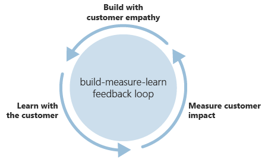

# Create customer partnerships through the build-measure-learn feedback loop

True innovation comes from the hard work of building solutions that demonstrate customer empathy, from measuring the impact of those changes on the customer, and from learning with the customer. Most importantly, it comes from feedback over multiple iterations.

If the past decade has taught us anything about innovation, it's that the old rules of business have changed. Large, wealthy incumbents no longer have an unbreakable hold on the market. The first or best players to market aren't always the winners. Having the best idea doesn't lead to market dominance. In a rapidly changing business climate, market leaders are the most agile.

Large or small, the companies that thrive in the digital economy as innovative leaders are those who listen to their customer base. That skill can be cultivated and managed. At the core of all good customer partnerships is a clear feedback loop. The process for building customer partnerships within the Cloud Adoption Framework is the build-measure-learn feedback loop.

## What is the build-measure-learn feedback loop?

The build-measure-learn feedback loop is a description of the process for building empathy with your customers, measuring their reactions, and learning what adjustments to make that improve customer interactions. As described in [Innovation in the digital economy](./index.md), innovation requires a balance between invention and adoption. Customer feedback and partnership drive adoption. By turning your customers into strong, loyal partners during innovation cycles, you can realize better products and gain quicker traction in the market.

This process for managing customer partnerships and integrating them into your innovation efforts includes three phases of development:

- [Build with customer empathy](./build.md)
- [Measure for customer impact](./measure.md)
- [Learn with customers](./learn.md)

Each phase of the build-measure-learn feedback loop process helps you build better solutions with your customers.

## Next steps

Learn how to [build with customer empathy](./build.md) to begin your build-measure-learn cycle.

> [!div class="nextstepaction"]
> [Build with customer empathy](./build.md)
