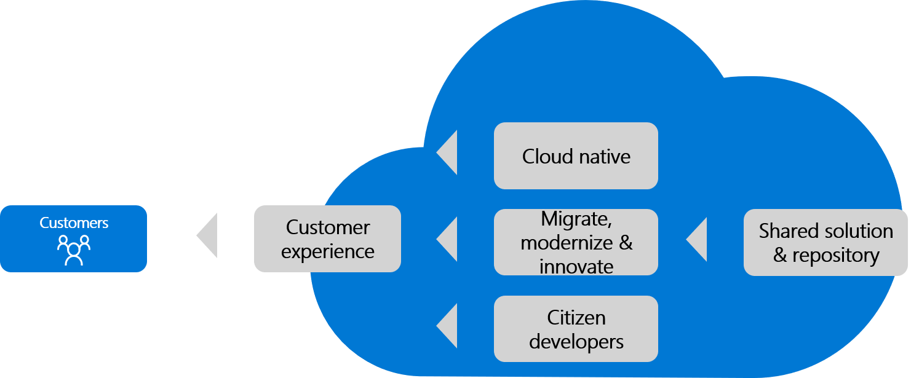

# Application development for innovative apps

As discussed in [Democratize data with digital invention](data.md), data fuels most innovations across the digital economy. Building on that analogy, applications are the fueling stations and infrastructure required to get that fuel into the right hands.

In some cases, data alone is enough to drive change and meet customer needs. More commonly though, solutions to customer needs require applications to shape the data and create an experience. Innovative applications engage and interact with the user, providing information and guidance. This article summarizes several principles that can help you find the right application development solution, based on the hypotheses to be validated.

## Shared code

Teams that are quick to respond to customer feedback, market changes, and opportunities typically innovate best. The first principle of innovative applications is an element of the [growth mindset](./learn.md#growth-mindset): "Share the code." Code sharing invites diverse perspectives and contributions, and spurs innovation. Therefore, application development should start with a shared code repository.

A widely adopted tool for managing code repositories is [GitHub](https://guides.github.com), which allows you to create a shared code repository quickly. An alternative is [Microsoft Azure Repos](https://azure.microsoft.com/services/devops/repos/), which is an [Azure DevOps](https://azure.microsoft.com/services/devops/) service that provides unlimited, cloud-hosted private repos for your project. For version control when you use Azure Repos, you can choose either Git, which is a distributed type, or Team Foundation Version Control (TFVC), which is centralized. For more information about Azure Repos, Git, and TFVC, see [Azure Repos Documentation](/azure/devops/repos/?view=azure-devops&preserve-view=true).

## Citizen developers

Professional developers are important to innovation. When a hypothesis proves accurate at scale, they can stabilize the solution and prepare it for scale. Unfortunately, professional developers may be in short supply, and professional development can increase costs and slow innovation.

Citizen developers are users who create new business applications using development and runtime environments sanctioned by corporate IT. The use of citizen developers can help to scale development efforts and accelerate early hypothesis testing. This strategy is viable and effective when early hypotheses can be validated through tools like [Power Apps](/powerapps/powerapps-overview) for application interfaces, [AI Builder](/powerapps/use-ai-builder) for processes and predictions, [Power Automate](/power-automate/) for workflows, and [Power BI](/power-bi/) for data consumption.

> [!NOTE]
> When you rely on citizen developers to test hypotheses, it's advisable to also have professional developers to support, review, and guide the work. The professionals can help develop a robust design that accelerates returns on the innovation. By involving professional developers at the right time, you can realize cleaner transitions later.

## Intelligent experiences

Intelligent experiences combine the speed and scale of modern web applications with the intelligence of cognitive services and bots. Alone, each of these technologies might be sufficient to meet your customers' needs. When properly combined, they broaden the spectrum of needs that can be met through a digital experience, while helping to contain application development costs.

### Modern web apps

Modern web applications can be the fastest way to meet the needs of internal or external customers. The experiences they provide can engage customers quickly and allow for rapid evolution of the solution.

### Adding intelligence

It gets easier all the time for professional and citizen developers to add machine learning and AI features to applications that help meet the needs of the customer and create an interactive experience. Some examples of these features are:

- Speech to text
- Text to speech
- Computer vision
- Visual search
- Predictive AI

Innovators should be alert to take advantage of such features to create an interactive and modern experience.

### Bots

A bot is a conversational AI application that provides users an experience that is more like dealing with a person, and less like dealing with a conventional computer application. Users converse with a bot through text, interactive cards, and speech. A bot interaction can range from a quick question and answer, such as making a dinner reservation, to a sophisticated conversation that intelligently provides access to services.

Bots can do the same things as other types of software: read and write files, use databases and APIs, and handle regular computational tasks. What makes bots unique is their use of mechanisms generally reserved for human-to-human communication. Bots are a lot like modern web applications: they live on the internet and use APIs to send and receive messages. What's in a bot varies widely depending on what kind of bot it is. Modern bot software relies on a stack of technology and tools to deliver increasingly complex experiences on a variety of platforms. However, a simple bot could just receive a message and echo it back to the user with very little code involved.

## Cloud-native solutions

Cloud-native architecture enables you to embrace rapid change, and run resilient and scalable applications more easily. Cloud-native applications are typically built using containers, [microservices](/azure/architecture/guide/architecture-styles/microservices), managed services, serverless functions, and event-based programming. Most commonly, cloud-native solutions use continuous delivery to achieve faster time to market.

A cloud-native solution allows centralized development teams to maintain control of the business logic without the need for monolithic, centralized solutions. It also creates an anchor to drive consistency across the input of citizen developers and modern experiences. Finally, cloud-native solutions provide an innovation accelerator by freeing citizen and professional developers to innovate safely and with a minimum of blockers.

## Innovate through existing solutions

Many customer hypotheses can best be delivered by a modernized version of an existing solution. This can happen when the current business logic comes close to meeting customer needs.

Most forms of modernization, including refactoring, are included in the [Migrate methodology](../../migrate/index.md) within the Cloud Adoption Framework. That methodology guides cloud adoption teams through the process of migrating a [digital estate](../../digital-estate/index.md) to the cloud. The [Azure migration guide](../../migrate/azure-migration-guide/index.md) provides a streamlined approach to the same methodology, which is suitable for a small number of workloads or even a single application.

After a solution has been migrated and modernized, there are a variety of ways it can be used to create new, innovative application solutions to meet customer needs. For example, [citizen developers](#citizen-developers) could test hypotheses, or professional developers could create [intelligent experiences](#intelligent-experiences) or [cloud-native solutions](#cloud-native-solutions).

### Extend an existing solution

Extending a solution is one common form of modernization. This can be the fastest path to innovation when the following are true of the customer hypothesis:

- Existing business logic meets or comes close to customer needs.
- An improved experience, not a new one, best meets the needs of customers.
- The business logic required by the minimum viable product (MVP) solution has been centralized, usually via an [n-tier](/azure/architecture/guide/architecture-styles/n-tier), web services, API, or [microservices](/azure/architecture/guide/architecture-styles/microservices) design. This approach consists of wrapping the existing solution within a new experience hosted in the cloud. In Azure, this solution would likely live in [Azure App Service](https://azure.microsoft.com/services/app-service/).

### Rebuild an existing solution

If an existing solution meets or comes close to meeting customer needs, but can't be easily extended, it may be necessary to refactor it. In this approach, the application is migrated to the cloud. After the application is migrated, parts of it are modified or duplicated, as web services or [microservices](/azure/architecture/guide/architecture-styles/microservices), which are deployed in parallel with the existing solution. The parallel service-based solution could be treated like an extended solution. This solution would simply wrap the existing solution with a new experience hosted in the cloud. In Azure, this solution would likely live in Azure App Service.

> [!CAUTION]
> Refactoring or rearchitecting solutions or centralizing business logic can quickly trigger a time-consuming [technical spike](./build.md#reduce-complexity-and-delay-technical-spikes) instead of a source of customer value. This is a risk to innovation, especially early in hypothesis validation. With a bit of creativity in the design of a solution, there should be a path to MVP that doesn't require refactoring of existing solutions. It's wise to delay refactoring until the initial hypothesis can be validated at scale.

## Operating model innovations

In addition to modern innovative approaches to application development, there have been notable innovations in application operations. These approaches have spawned many organizational movements. One of the most prominent is the [cloud center of excellence](../../organize/cloud-center-of-excellence.md) operating model. When fully staffed and mature, business teams have the option to provide their own operational support for a solution.

The type of self-service operational management model found in a cloud center of excellence allows for tighter controls and faster iterations within the solution environment. These goals are accomplished by transferring operational control and accountability to the business team.

If you're trying to scale or meet global demand for an existing solution, this approach might be sufficient to validate a customer hypothesis. After a solution is migrated and slightly modernized, the business team can scale it to test a variety of hypotheses. These typically involve customer cohorts who are concerned with performance, global distribution, and other customer needs hindered by IT operations.

## Reduce overhead and management

The more there is to maintain within an innovative application or solution, the slower that application or solution will iterate. This means you can accelerate innovation by reducing the impact of operations on available bandwidth.

To prepare for the many iterations required to deliver an innovative solution, it's important to think ahead. For example, minimize operational burdens early in the process by favoring serverless options. In Azure, serverless application options could include [Azure App Service](/azure/app-service/overview) or [containers](/azure/containers/).

In parallel, consider the serverless transaction data options in Azure that can also reduce overhead. The [Azure product catalog](/azure/) provides database options that host data without the need for a full data platform.

## Next steps

Depending on the hypothesis and solution, the principles in this article can aid in designing applications that meet MVP definitions and engage users. Up next are the principles for [empowering adoption](./ci-cd.md), which offer ways to get the application and data into the hands of customers more quickly and efficiently.

> [!div class="nextstepaction"]
> [Empower adoption](./ci-cd.md)
