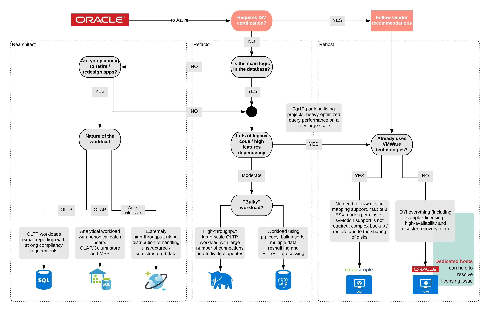

# Oracle migration decision tree

The following decision tree outlines options available for migrating an Oracle data structure to various data platforms in Azure.
This reference can aid in determining the most appropriate migration path for Oracle.

## Innovation paths based on this decision tree

Paths that lead to rearchitect outcomes in the left hand box pictured above will be modernized as part of the migration process. Each of those solutions will be ready to support cloud-native innovation or innovations going forward.

The box in the middle, labeled refactor, will result in a modernized data platform. However, additional extensions to that platform may be required to expose the business logic to modernized, cloud-native inventions or innovations.

The right-hand box includes paths that do not allow for modernization of the Oracle solution. Those paths could require additional extensions to the data platform or the application logic before they could be used in highly-reliable, cloud-native inventions or innovations.
