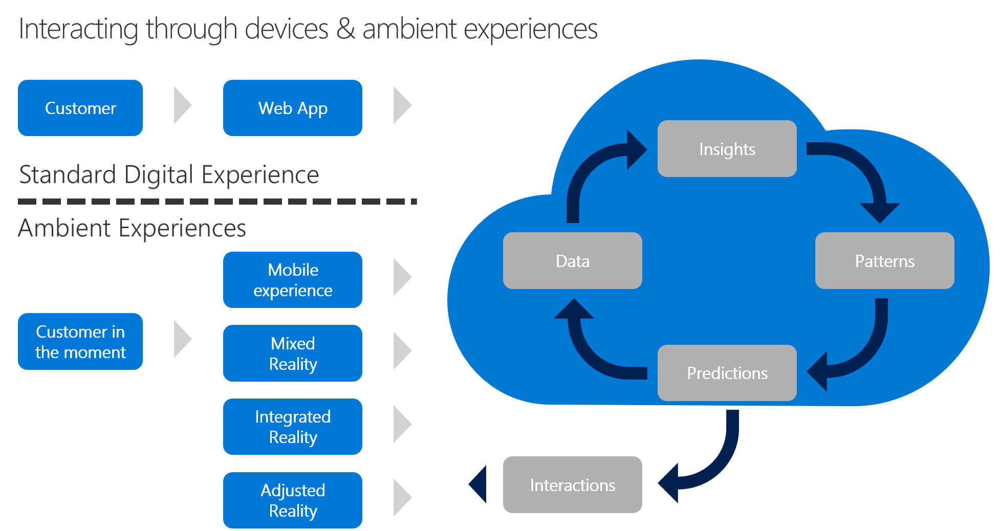

# Ambient user experiences: Interact with devices

In [Build with customer empathy](./build.md), we discussed the three tests of true innovation: solve a customer need, keep the customer coming back, and scale across a base of customer cohorts. Each test of your hypothesis requires effort and iterations on the approach to adoption. This article offers insights on advanced approaches to reduce that effort through *ambient user experiences*. By interacting with devices, instead of an application, the customer might be more likely to use your solution first.

## Ambient user experiences

An ambient user experience is a digital experience that relates to the immediate surroundings. Ambient user experiences occur when technology systems seamlessly interact with a user based on their needs and the context of their requests. A solution that features ambient user experiences tries to meet the customer in their moment of need. When possible, the solution meets the customer need without leaving the flow of activity that triggered it.

Life in the digital economy is full of distractions. We're all bombarded with social, email, web, visual, and verbal messaging, each of which is a risk of distraction. This risk increases with every second that passes between the customer's point of need and the moment they find a solution. Countless customers are lost in that brief time gap. To foster an increase in repeat adoption, you must reduce the number of distractions by reducing the time to solution.

## Interact with devices

A standard web experience is the most common application development technique used to meet a customer's needs. This approach assumes that the customer is in front of their computer. If your customer consistently meets their point of need while in front of their laptop, build a web application. That application will provide an ambient user experience for that customer in that scenario. However, we know that this scenario is less and less likely.

Ambient user experiences typically require more than a web application these days. Through [measurement](./measure.md) and [learning with the customer](./learn.md), the behavior that triggers the customer's need can be observed, tracked, and used to build a more ambient and digital experience. The following list summarizes a few approaches to integration of ambient solutions into your hypotheses, with more details about each in the following paragraphs.

Types of interactive devices for ambient user experiences:

- [Mobile experience](#mobile-experience): Mobile apps are ubiquitous in customer environments. In some situations, this might provide a sufficient level of interactivity to make a solution ambient.
- [Mixed reality](#mixed-reality): Sometimes a customer's typical surroundings must be altered to make an interaction ambient. This factor creates something of a false reality in which the customer interacts with the solution and has a need met. In this case, the solution is ambient within the false reality.
- [Integrated reality](#integrated-reality): Moving closer to true ambience, integrated reality solutions focus on the use of a device that exists within the customer's reality to integrate the solution into their natural behaviors. A Virtual Assistant is a great example of integrating reality into the surrounding environment. A less well-known option concerns Internet of Things (IoT) technologies, which integrate devices that already exist in the customer's surroundings.
- [Adjusted reality](#adjusted-reality): When any of these ambient solutions use predictive analysis in the cloud to define and provide an interaction with the customer through the natural surroundings, the solution has adjusted reality.

Understanding the customer need and measuring customer impact help you determine whether a device interaction or ambient user experience are necessary to validate your hypothesis. With each of those data points, the following sections will help you find the best digital experience solution.

## Mobile experience

In the first stage of ambient user experience, the user moves away from the computer. Today's consumers and business professionals move fluidly between mobile and PC devices. Each of the platforms or devices used by your customer creates a new potential experience. Adding a mobile experience that extends the primary solution is the fastest way to improve integration into the customer's immediate surroundings. While a mobile device is far from ambient, it might edge closer to the customer's point of need.

When customers are mobile and change locations frequently, that may represent the most relevant form of ambient and digital experience for a particular solution. Over the past decade, innovation has frequently been triggered by the integration of existing solutions with a mobile experience.

Azure App Service is a great example of this approach. During early iterations, the [web app feature of Azure App Service](/azure/app-service/overview) can be used to test the hypothesis. As the hypotheses become more complex, the [mobile app feature of Azure App Service](/previous-versions/azure/app-service-mobile/) can extend the web app to run in a variety of mobile platforms.

## Mixed reality

Mixed reality solutions represent the next step for ambient user experiences. This approach augments or replicates the customer's surroundings; it creates an extension of reality for the customer to operate within.

> [!IMPORTANT]
> If a virtual reality (VR) device is required and it's not already part of a customer's immediate surroundings or natural behaviors, augmented or virtual reality is more of an alternative digital experience and less of an ambient experience.

Mixed reality experiences are increasingly common among remote workforces. Their use is growing even faster in industries that require collaboration or specialty skills that aren't readily available in the local market. Situations that require centralized implementation support of a complex product for a remote labor force are particularly fertile ground for augmented reality. In these scenarios, the central support team and remote employees might use augmented reality to work on, troubleshoot, and install the product.

For example, consider the case of spatial anchors. Spatial anchors allow you to create mixed reality experiences with objects that persist in their respective locations across devices over time. Through spatial anchors, a specific behavior can be captured, recorded, and persisted, providing an ambient experience the next time the user operates within that augmented environment. [Azure Spatial Anchors](/azure/spatial-anchors/overview) is a service that moves this logic to the cloud, allowing digital experiences to be shared across interactive devices and even across solutions.

## Integrated reality

Beyond mobile reality or even mixed reality lies integrated reality. Integrated reality aims to remove the digital experience entirely. All around us are devices with compute and connectivity capabilities. These devices can be used to collect data from the immediate surroundings without the customer having to ever touch a phone, laptop, or VR device.

This digital experience is best when some form of device is consistently within the same surroundings in which the customer need occurs. Common scenarios include factory floors, elevators, and even your car. These types of large devices already contain compute power. You can also use data from the device itself to detect customer behaviors and send those behaviors to the cloud. This automatic capture of customer behavior data dramatically reduces the need for a customer to input data. Additionally, the web, mobile, or VR experience can function as a feedback loop to share what's been learned from the integrated reality solution.

<!-- docutune:casing "advanced computer vision" -->

Examples of integrated reality in Azure could include:

- [Azure Internet of Things (IoT) solutions](/azure/iot-fundamentals/): A collection of services in Azure that each aid in managing devices and the flow of data from those devices into the cloud and back out to end users.
- [Azure Sphere](/azure-sphere/): A combination of hardware and software that provides an intrinsically secure way to enable an existing device to securely transmit data between the device and Azure IoT solutions.
- [Azure Kinect DK](/azure/kinect-dk/), AI sensors with advanced computer vision and speech models. These sensors can collect visual and audio data from the immediate surroundings and feed those inputs into your solution.

You can use all three of these digital experience tools to collect data from the natural surroundings and at the point of customer need. From there, your solution can respond to those data inputs to solve the need, sometimes before the customer is even aware that a trigger for that need has occurred.

## Adjusted reality

The highest form of ambient user experience is adjusted reality, often referred to as *ambient intelligence*. Ambient intelligence refers to any electronic or digital environment that responds to the presence of people and adjusts automatically. Adjusted reality is an approach to using information from your solution to change the customer's reality without requiring them to interact directly with an application. In this approach, the application you initially built to prove your hypothesis might no longer be relevant at all. Instead, devices in the environment help modulate the inputs and outputs to meet customer needs.

Virtual assistants and smart speakers offer great examples of adjusted reality. Alone, a smart speaker is an example of simple integrated reality. But add a smart light and motion sensor to a smart speaker solution and it's easy to create a basic solution that turns on the lights when you enter a room.

Factory floors around the world provide additional examples of adjusted reality. During early stages of integrated reality, sensors on devices detected conditions like overheating, and then alerted a human being through an application. In adjusted reality, the customer might still be involved, but the feedback loop is tighter. On an adjusted reality factory floor, one device might detect overheating in a vital machine somewhere along the assembly line. Somewhere else on the floor, a second device then slows production slightly to allow the machine to cool and then resume full pace when the condition is resolved. In this situation, the customer is a second-hand participant. The customer uses your application to set the rules and understand how those rules have affected production, but they're not necessary to the feedback loop.

The Azure services described in [Azure Internet of Things (IoT) solutions](/azure/iot-fundamentals/), [Azure Sphere](/azure-sphere/), and [Azure Kinect DK](/azure/kinect-dk/) can all be components of an adjusted reality solution. Your original application and business logic would then serve as the intermediary between the environmental input and the change that should be made in the physical environment.

A digital twin is another example of adjusted reality. This term refers to a digital representation of a physical device, presented through computer, mobile, or mixed-reality formats. Unlike less sophisticated 3D models, a digital twin reflects data collected from an actual device in the physical environment. This solution allows the user to interact with the digital representation in ways that could never be done in the real world. In this approach, physical devices adjust a mixed reality environment. However, the solution still gathers data from an integrated reality solution and uses that data to shape the reality of the customer's current surroundings.

In Azure, digital twins are created and accessed through a service called [Azure Digital Twins](/azure/digital-twins/overview).

## Next steps

Now that you have a deeper understanding of device interactions and the ambient user experience or ambient intelligence tools that are right for your solution, you're ready to explore the final discipline of innovation, [predict and influence](./predict.md).

> [!div class="nextstepaction"]
> [Predict and influence](./predict.md)
