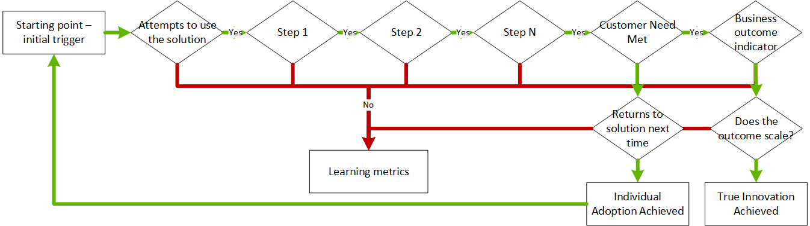

# How to measure for customer impact

There are several ways to measure for customer impact. This article will help you define business metrics to validate hypotheses that arise out of an effort to [build with customer empathy](./build.md).

## Strategic metrics

The [Strategy methodology](../../strategy/index.md) examines [motivations](../../strategy/motivations.md) and [business outcomes](../../strategy/business-outcomes/index.md). These practices provide a set of business metrics to test customer impact. When innovation is successful, you'll usually see results that are aligned with your strategic objectives.

What are metrics in business? Business metrics are quantifiable metrics used to track and assess a specific business goal. Before establishing customer impact learning metrics, define a small number of strategic business metrics that you want this innovation to affect. Generally, those strategic metrics align with one or more of the following outcome areas:

- [Business agility](../../strategy/business-outcomes/agility-outcomes.md)
- [Customer engagement](../../strategy/business-outcomes/engagement-outcomes.md)
- [Customer reach](../../strategy/business-outcomes/reach-outcomes.md)
- [Financial impact](../../strategy/business-outcomes/fiscal-outcomes.md)
- [Solution performance](../../strategy/business-outcomes/fiscal-outcomes.md), in the case of operational innovation.

Document the agreed-upon business metrics and track their impact frequently, but don't expect results in any of these metrics to emerge for several iterations. For more information about setting and aligning expectations across the parties involved, see [Commitment to iteration](./index.md#commitment-to-iteration).

Aside from motivation and business outcome metrics, the remainder of this article focuses on learning metrics designed to guide transparent discovery and customer-focused iterations. For more information about these aspects, see [Commitment to transparency](./index.md#commitment-to-transparency).

## Learning metrics

When the first version of any minimum viable product (MVP) is shared with customers, preferably at the end of the first development iteration, there will be no impact on strategic metrics. Several iterations later, the team may still be struggling to change behaviors enough to materially affect strategic metrics. During learning processes, such as build-measure-learn cycles, we advise the team to adopt learning metrics. These metrics enhance tracking and learning opportunities.

### Customer flow and learning metrics

If an MVP solution validates a customer-focused hypothesis, the solution will drive some change in customer behaviors. Those behavior changes across customer cohorts should improve business outcomes. Keep in mind that changing customer behavior is typically a multistep process. Because each step provides an opportunity to measure impact, the adoption team can keep learning along the way and build a better solution.

Learning about changes to customer behavior starts by mapping the flow that you hope to see from an MVP solution.

In most cases, a customer flow will have an easily defined starting point and no more than two endpoints. Between the start and endpoints are a variety of learning metrics to be used as measures in the feedback loop. Here are the steps to measure customer impact using the customer flow:

1. **Starting point (initial trigger):** The starting point is the scenario that triggers the need for this solution. When the solution is built with customer empathy, that initial trigger should inspire a customer to try the MVP solution.
2. **Customer need met:** The hypothesis is validated when a customer need has been met by using the solution.
3. **Solution steps:** This term refers to the steps that are required to move the customer from the initial trigger to a successful outcome. Each step produces a learning metric based on a customer decision to move on to the next step.
4. **Individual adoption achieved:** The next time the trigger is encountered, if the customer returns to the solution to get their need met, individual adoption has been achieved.
5. **Business outcome indicator:** When a customer behaves in a way that contributes to the defined business outcome, a business outcome indicator is observed.
6. **True innovation:** When *business outcome indicators* and *individual adoption* both occur at the desired scale, you've realized true innovation.

Each step of the customer flow generates learning metrics. After each iteration (or release), a new version of the hypothesis is tested. At the same time, tweaks to the solution are tested to reflect adjustments in the hypothesis. When customers follow the prescribed path in any given step, a positive metric is recorded. When customers deviate from the prescribed path, a negative metric is recorded.

These alignment and deviation counters create learning metrics. Each should be recorded and tracked as the cloud adoption team progresses toward business outcomes and true innovation. In [Learn with customers](./learn.md), we'll discuss ways to apply these business metrics to learn and build better solutions.

### Group and observe customer partners

The first measurement in defining learning metrics is the customer partner definition. Any customer who participates in innovation cycles qualifies as a customer partner. To accurately measure behavior, you should use a cohort model to define customer partners. In this model, customers are grouped to sharpen your understanding of their responses to changes in the MVP. These customer impact groups typically resemble the following:

- **Experiment or focus group:** Grouping customers based on their participation in a specific experiment designed to test changes over time.
- **Segment:** Grouping customers by the size of the company.
- **Vertical:** Grouping customers by the *industry vertical* they represent.
- **Individual demographics:** Grouping based on personal demographics like age and physical location.

These types of groupings help you validate learning metrics across various cross-sections of those customers who choose to partner with you during your innovation efforts. All subsequent metrics should be derived from definable customer grouping.

## Next steps

As learning metrics accumulate, the team can begin to [learn with customers](./learn.md).

> [!div class="nextstepaction"]
> [Learn with customers](./learn.md)

Some of the concepts in this article build on topics first described in [The Lean Startup](http://theleanstartup.com/book), written by Eric Ries.
