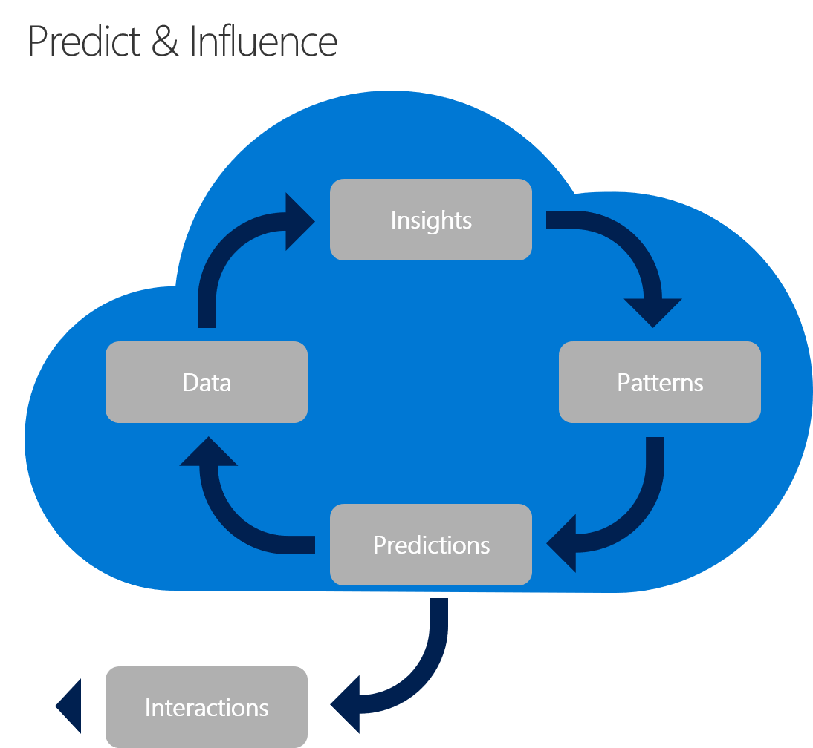

# Predictive modeling and influencing customer behavior

There are two classes of applications in the digital economy: *historical* and *predictive*. Many customer needs can be met solely by using historical data, including nearly real-time data. Most solutions focus primarily on aggregating data in the moment. They then process and share that data back to the customer in the form of a digital or ambient experience.

In contrast to historical modeling is predictive modeling. But, what is predictive modeling? Predictive modeling uses statistics and known results to process and create models that can be used to predict future outcomes, within reason. As predictive modeling becomes more cost-effective and readily available, customers demand forward-thinking experiences that lead to better decisions and actions. However, that demand doesn't always suggest a predictive solution. In most cases, a historical view can provide enough data to empower the customer to make a decision on their own.

Unfortunately, customers often take a myopic view that leads to decisions based on their immediate surroundings and sphere of influence. As options and decisions grow in number and impact, that myopic view may not serve the customer's needs. At the same time, as a hypothesis is proven at scale, the company providing the solution can see across thousands or millions of customer decisions. This big-picture approach makes it possible to see broad patterns and the impacts of those patterns. Predictive modeling capability is a wise investment when an understanding of those patterns is necessary to make decisions that best serve the customer.

## Examples of predictive modeling and how it influences customer behavior

Various applications and ambient experiences use data to make predictions:

- **E-commerce:** Based on what other similar consumers have purchased, an e-commerce website suggests products that may be worth adding to your cart.
- **Adjusted reality:** IoT offers more advanced instances of predictive functionality. For example, suppose a device on an assembly line detects a rise in a machine's temperature. A cloud-based predictive model determines how to respond. Based on that prediction, another device slows down the assembly line until the machine can cool.
- **Consumer products:** Cell phones, smart homes, even your car, all use predictive capabilities, which they analyze to suggest user behavior based on factors like location or time of day. When a prediction and the initial hypothesis are aligned, the prediction leads to action. At a very mature stage, this alignment can make products like a self-driving car a reality.

## Develop predictive capabilities

Solutions that consistently provide accurate predictive capabilities commonly include five core characteristics. The five core predictive modeling characteristics are:

- Data
- Insights
- Patterns
- Predictions
- Interactions

Each aspect is required to develop predictive capabilities. Like all great innovations, the development of predictive capabilities requires a [commitment to iteration](./index.md#commitment-to-iteration). In each iteration, one or more of the following characteristics is matured to validate increasingly complex customer hypotheses.

> [!CAUTION]
> If the customer hypothesis developed in [Build with customer empathy](./build.md) includes predictive capabilities, the principles described there might well apply. However, predictive capabilities require significant investment of time and energy. When predictive capabilities are [technical spikes](./build.md#reduce-complexity-and-delay-technical-spikes), as opposed to a source of real customer value, we suggest that you delay predictions until the customer hypotheses have been validated at scale.

## Data

Data is the most elemental of the characteristics mentioned earlier. Each of the disciplines for developing digital inventions generates data. That data, of course, contributes to the development of predictions. For more information on ways to get data into a predictive solution, see [Democratize data with digital invention](./data.md) and [Interact with devices](./devices.md).

Various data sources can be used to deliver predictive capabilities:

## Insights

Subject matter experts use data about customer needs and behaviors to develop basic business insights from a study of raw data. Those insights can pinpoint occurrences of the desired customer behaviors (or, alternatively, undesirable results). During iterations on the predictions, these insights can aid in identifying potential correlations that could ultimately generate positive outcomes. For guidance on enabling subject matter experts to develop insights, see [Democratize data with digital invention](./data.md).

## Patterns

People have always tried to detect patterns in large volumes of data. Computers were designed for that purpose. Machine learning accelerates that quest by detecting precisely such patterns, a skill that comprises the machine learning model. Those patterns are then applied through machine learning algorithms to predict outcomes when a new set of data is entered into the algorithms.

Using insights as a starting point, machine learning develops and applies predictive models to capitalize on the patterns in data. Through multiple iterations of training, testing, and adoption, those models and algorithms can accurately predict future outcomes.

[Azure Machine Learning](/azure/machine-learning/overview-what-is-azure-ml) is the cloud-native service in Azure for building and training models based on your data. This tool also includes a [workflow for accelerating the development of machine learning algorithms](/azure/machine-learning/concept-azure-machine-learning-architecture). This workflow can be used to develop algorithms through a visual interface or Python.

For more robust machine learning models, [ML Services in Azure HDInsight](/azure/hdinsight/r-server/r-server-overview) provides a machine learning platform built on Apache Hadoop clusters. This approach enables more granular control of the underlying clusters, storage, and compute nodes. Azure HDInsight also offers more advanced integration through tools like ScaleR and SparkR to create predictions based on integrated and ingested data, even working with data from a stream. The [flight delay prediction solution](/azure/hdinsight/hdinsight-hadoop-r-scaler-sparkr) demonstrates each of these advanced capabilities when used to predict flight delays based on weather conditions. The HDInsight solution also allows for enterprise controls, such as data security, network access, and performance monitoring to operationalize patterns.

## Predictions

After a pattern is built and trained, you can apply it through APIs, which can make predictions during the delivery of a digital experience. Most of these APIs are built from a well-trained model based on a pattern in your data. As more customers deploy everyday workloads to the cloud, the prediction APIs used by cloud providers lead to ever-faster adoption.

[Azure Cognitive Services](/azure/cognitive-services/) is an example of a predictive API built by a cloud vendor. This service includes predictive APIs for content moderation, anomaly detection, and suggestions to personalize content. These APIs are ready to use and are based on well-known content patterns, which Microsoft has used to train models. Each of those APIs makes predictions based on the data you feed into the API.

[Azure Machine Learning](/azure/machine-learning/) lets you deploy custom-built algorithms, which you can create and train based solely on your own data. For information about deploying predictions with Azure Machine Learning, see [Deploy machine learning models to Azure](/azure/machine-learning/how-to-deploy-and-where).

For information about the processes for exposing predictions developed for ML Services on Azure HDInsight, see [Set up HDInsight clusters](/azure/hdinsight/hdinsight-hadoop-provision-linux-clusters).

## Interactions

After a prediction is made available through an API, you can use it to influence customer behavior. That influence takes the form of interactions. An interaction with a machine learning algorithm happens within your other digital or ambient experiences. As data is collected through the application or experience, it's run through the machine learning algorithms. When the algorithm predicts an outcome, that prediction can be shared back with the customer through the existing experience.

Learn more about how to create an ambient experience through an [adjusted reality solution](./devices.md#adjusted-reality).

## Next steps

Review a prescriptive framework that includes the tools, programs, and content (best practices, configuration templates, and architecture guidance) to simplify adoption for the following innovation scenarios.

- [Kubernetes in the Cloud Adoption Framework](..\kubernetes\index.md)
- [AI in the Cloud Adoption Framework](..\ai\index.md)
