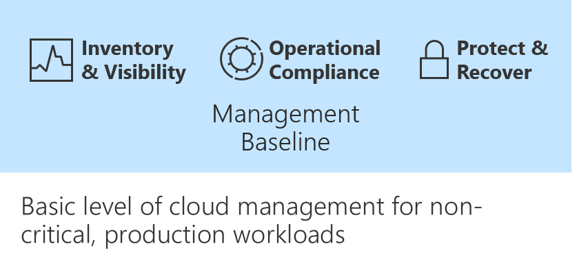

<!-- docutune:casing "Update Management" "Guest Configuration" "Blueprints: Getting started" "Blueprints: Blueprint definitions" MMA -->
<!-- cSpell:ignore WSUS -->

# Operational compliance in Azure

*Operational compliance* is the second discipline in any cloud management baseline.

Improving operational compliance reduces the likelihood of an outage related to configuration drift or vulnerabilities related to systems being improperly patched.

For any enterprise-grade environment, this table outlines the suggested minimum for a management baseline.

| Process | Tool | Purpose |
|---|---|---|
| Patch management | Azure Automation Update Management | Management and scheduling of updates |
| Policy enforcement | Azure Policy | Policy enforcement to ensure environment and guest compliance |
| Environment configuration | Azure Blueprints | Automated compliance for core services |
| Resource configuration | Desired State Configuration | Automated configuration on guest OS and some aspects of the environment |

::: zone target="docs"

## Update Management

::: zone-end
::: zone target="chromeless"

## [Update Management](#tab/UpdateManagement)

::: zone-end

Computers that are managed by the Update Management solution for Azure Automation use the following configurations to do assessment and update deployments:

- Microsoft Monitoring Agent (MMA) for Windows or Linux.
- PowerShell Desired State Configuration (DSC) for Linux.
- Azure Automation Hybrid Runbook Worker.
- Microsoft Update or Windows Server Update Services (WSUS) for Windows computers.

For more information, see [Update Management solution for Azure Automation](/azure/automation/update-management/overview).

> [!WARNING]
> Before using Update Management, you must onboard virtual machines or an entire subscription into Log Analytics and Azure Automation.
>
> There are two approaches to onboarding:
>
> - [Single VM](../azure-server-management/onboard-single-vm.md)
> - [Entire subscription](../azure-server-management/onboard-at-scale.md)
>
> You should follow one before proceeding with Update Management.

### Manage updates

To apply a policy to a resource group:

1. Go to [Azure Automation](https://portal.azure.com/#blade/HubsExtension/BrowseResource/resourceType/Microsoft.Automation%2FAutomationAccounts).
1. Select **Automation accounts**, and choose one of the listed accounts.
1. Go to **Configuration Management**.
1. **Inventory**, **Change Management**, and **State Configuration** can be used to control the state and operational compliance of the managed VMs.

::: zone target="chromeless"

<!-- markdownlint-disable DOCSMD001 -->

::: form action="OpenBlade[#blade/HubsExtension/BrowseResource/resourceType/Microsoft.Automation%2FAutomationAccounts]" submitText="Assign Policy" :::

<!-- markdownlint-enable DOCSMD001 -->

::: zone-end

::: zone target="docs"

## Azure Policy

::: zone-end
::: zone target="chromeless"

## [Azure Policy](#tab/AzurePolicy)

::: zone-end

Azure Policy is used throughout governance processes. It's also highly valuable within cloud management processes. Azure Policy can audit and remediate Azure resources and can also audit settings inside a machine. The validation is performed by the Guest Configuration extension and client. The extension, through the client, validates settings like:

- Operating system configuration.
- Application configuration or presence.
- Environment settings.

Azure Policy Guest Configuration currently only audits settings inside the machine. It doesn't apply configurations.

::: zone target="chromeless"

### Action

Assign a built-in policy to a management group, subscription, or resource group.

::: form action="OpenBlade[#blade/Microsoft_Azure_Policy/PolicyMenuBlade/GettingStarted]" submitText="Assign Policy" :::

::: zone-end

::: zone target="docs"

### Apply a policy

To apply a policy to a resource group:

1. Go to [Azure Policy](https://portal.azure.com/#blade/Microsoft_Azure_Policy/PolicyMenuBlade/GettingStarted).
1. Select **Assign a policy**.

### Learn more

To learn more, see:

- [Azure Policy](/azure/governance/policy/)
- [Azure Policy: Guest Configuration](/azure/governance/policy/concepts/guest-configuration)
- [Cloud Adoption Framework policy enforcement decision guide](../../decision-guides/policy-enforcement/index.md)

## Azure Blueprints

::: zone-end
::: zone target="chromeless"

## [Azure Blueprints](#tab/AzureBlueprints)

::: zone-end

With Azure Blueprints, cloud architects and central information-technology groups can define a repeatable set of Azure resources. These resources implement and adhere to an organization's standards, patterns, and requirements.

With Azure Blueprints, development teams can rapidly build and stand up new environments. Teams can also trust they're building within organizational compliance. They do so by using a set of built-in components like networking to speed up development and delivery.

Blueprints are a declarative way to orchestrate the deployment of different resource templates and other artifacts like:

- Role assignments.
- Policy assignments.
- Azure Resource Manager templates.
- Resource groups.

Applying a blueprint can enforce operational compliance in an environment if this enforcement isn't done by the cloud governance team.

### Create a blueprint

To create a blueprint:

::: zone target="chromeless"

1. Go to **Blueprints: Getting started**.
1. On the **Create a Blueprint** pane, select **Create**.
1. Filter the list of blueprints to select the appropriate blueprint.
1. In the **Blueprint name** box, enter the blueprint name.
1. Select **Definition location**, and choose the appropriate location.
1. Select **Next : Artifacts**, and review the artifacts included in the blueprint.
1. Select **Save draft**.

::: form action="OpenBlade[#blade/Microsoft_Azure_Policy/BlueprintsMenuBlade/GetStarted]" submitText="Create a blueprint" :::

::: zone-end

::: zone target="docs"

1. Go to [Blueprints: Getting started](https://portal.azure.com/#blade/Microsoft_Azure_Policy/BlueprintsMenuBlade/GetStarted).
1. On the **Create a Blueprint** pane, select **Create**.
1. Filter the list of blueprints to select the appropriate blueprint.
1. In the **Blueprint name** box, enter the blueprint name.
1. Select **Definition location**, and choose the appropriate location.
1. Select **Next : Artifacts**, and review the artifacts included in the blueprint.
1. Select **Save draft**.

::: zone-end

### Publish a blueprint

To publish blueprint artifacts to your subscription:

::: zone target="chromeless"

1. Go to **Blueprints - Blueprint definitions**.
1. Select the blueprint you created in the previous steps.
1. Review the blueprint definition, then select **Publish blueprint**.
1. In the **Version** box, enter a version like "1.0".
1. In the **Change notes** box, enter your notes.
1. Select **Publish**.

::: form action="OpenBlade[#blade/Microsoft_Azure_Policy/BlueprintsMenuBlade/Blueprints]" submitText="Blueprint definitions" :::

::: zone-end

::: zone target="docs"

1. In the Azure portal, go to [Blueprints: Blueprint definitions](https://portal.azure.com/#blade/Microsoft_Azure_Policy/BlueprintsMenuBlade/Blueprints).
1. Select the blueprint you created in the previous steps.
1. Review the blueprint definition, then select **Publish blueprint**.
1. In the **Version** box, enter a version like "1.0".
1. In the **Change notes** box, enter your notes.
1. Select **Publish**.

<!-- markdownlint-disable MD024 -->

### Learn more

To learn more, see:

- [Azure Blueprints](/azure/governance/blueprints/)
- [Cloud Adoption Framework resource consistency decision guide](../../decision-guides/resource-consistency/index.md)
- [Standards-based blueprints samples](/azure/governance/blueprints/samples/#standards-based-blueprint-samples)

::: zone-end
