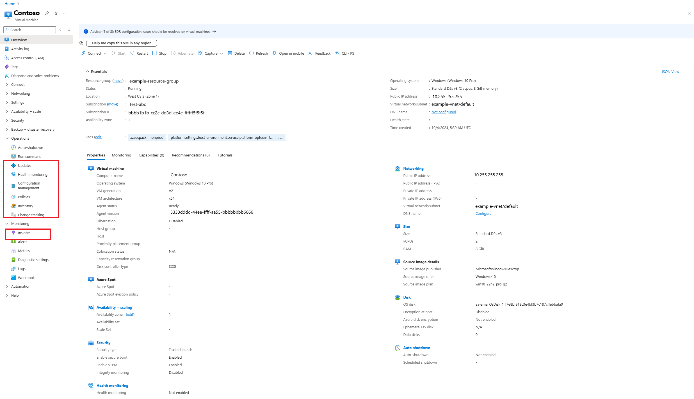

# Enable server management services on a single VM for evaluation

Learn how to enable server management services on a single VM for evaluation.

> [!NOTE]
> Create the required [Log Analytics workspace and Azure Automation account](./prerequisites.md#create-a-workspace-and-automation-account) before you implement Azure management services on a VM.

It's simple to onboard Azure server management services to individual virtual machines in the Azure portal. You can familiarize yourself with these services before you onboard them. When you select a VM instance, all the solutions on the list of [management tools and services](./tools-services.md) appear on the **Operations** or **Monitoring** menu. You select a solution and follow the wizard to onboard it.

## Related resources

For more information about how to onboard these solutions to individual VMs, see:

- [Onboard the Update Management solution and the Change Tracking and Inventory solution for a VM in Azure](/azure/automation/change-tracking/manage-inventory-vms)
- [Onboard Azure Monitor for VMs](/azure/azure-monitor/vm/vminsights-enable-portal)

## Next steps

Learn how to use Azure Policy to onboard Azure VMs at scale.

> [!div class="nextstepaction"]
> [Configure Azure management services for a subscription](./onboard-at-scale.md)
