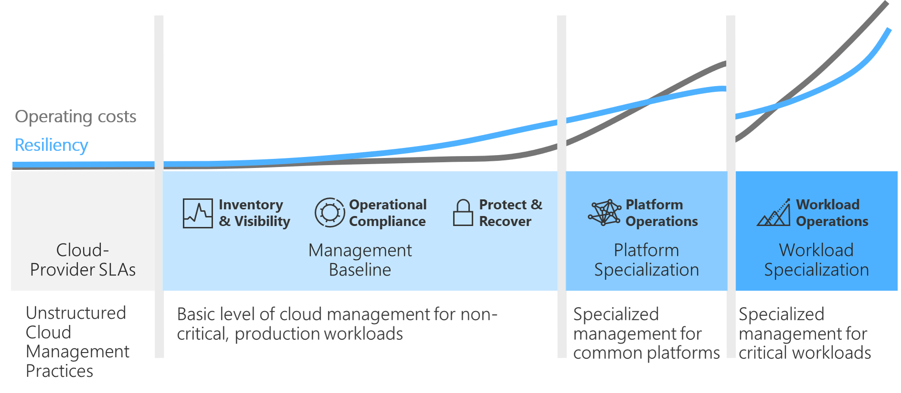

# Business commitment in cloud management

Defining *business commitment* is an exercise in balancing priorities. The objective is to align the proper level of operational management at an acceptable operating cost. Finding that balance requires a few data points and calculations, which we've outlined in this article.

Commitments to business stability, via technical resiliency or other service-level agreement (SLA) impacts, are a business justification decision. For most workloads in an environment, a baseline level of cloud management is sufficient. For others, a 2x to 4x cost increase is easily justified because of the potential impact of any business interruptions.

The previous articles in this series can help you understand the classification and impact of interruptions to various workloads. This article helps you calculate the returns. As illustrated in the preceding image, each level of cloud management has inflection points where cost can rise faster than increases in resiliency. Those inflection points will prompt detailed business decisions and business commitments.

## Determine a proper commitment with the business

For each workload in the portfolio, the cloud operations team and cloud strategy team should align on the level of management that's provided directly by the cloud operations team.

As you're establishing a commitment with the business, there are a few key aspects to align:

- IT operations prerequisites.
- Management responsibility.
- Cloud tenancy.
- Soft-cost factors.
- Loss avoidance ROI.
- Validation of management level.

To aid in your decision process, the remainder of this article describes each of these aspects in greater detail.

## IT operations prerequisites

The [Azure Management Guide](../azure-management-guide/index.md) outlines the management tools that are available in Azure. Before reaching a commitment with the business, IT should determine an acceptable standard-level management baseline to be applied to all managed workloads. IT would then calculate a standard management cost for each of the managed workloads in the IT portfolio, based on counts of CPU cores, disk space, and other asset-related variables. IT would also estimate a composite SLA for each workload, based on the architecture.

> [!TIP]
> IT operations teams often use a default minimum of 99.9 percent uptime for the initial composite SLA. They might also choose to normalize management costs based on the average workload, especially for solutions with minimal logging and storage needs. Averaging the costs of a few medium criticality workloads can provide a starting point for initial conversations.

<!-- -->

> [!TIP]
> If you're using the [operations management workbook](https://raw.githubusercontent.com/Microsoft/CloudAdoptionFramework/master/manage/opsmanagementworkbook.xlsx) to plan for cloud management, the operations management fields should be updated to reflect these prerequisites. Those fields include *Commitment level*, *Composite SLA*, and *Monthly cost*. Monthly cost should represent the cost of the added operational management tools on a monthly basis.

The operations management baseline serves as an initial starting point to be validated in each of the following sections.

## Management responsibility

In a traditional on-premises environment, the cost of managing the environment is commonly assumed to be a sunk cost that's owned by IT operations. In the cloud, management is a purposeful decision with direct budgetary impact. The costs of each management function can be more directly attributed to each workload that's deployed to the cloud. This approach allows for greater control, but it does create a requirement for cloud operations teams and cloud strategy teams to first commit to an agreement about responsibilities.

Organizations might also choose to [outsource some of their ongoing management functions to a service provider](https://aka.ms/adopt/partneroffers). These service providers can use [Azure Lighthouse](/azure/lighthouse/overview) to give organizations more precise control in granting access to their resources, along with greater visibility into the actions performed by the service providers.

- **Delegated responsibility:** Because there's no need to centralize and assume operational management overhead, IT operations for many organizations are considering new approaches. One common approach is referred to as *delegated responsibility*. In a cloud center of excellence model, platform operations and platform automation provide self-service management tools that can be used by business-led operations teams, independent of a centralized IT operations team. This approach gives business stakeholders complete control over management-related budgets. It also allows the cloud center of excellence (CCoE) team to ensure that a minimum set of guardrails has been properly implemented. In this model, IT acts as a broker and a guide to help the business make wise decisions. Business operations oversee day to day operations of dependent workloads.

- **Centralized responsibility:** Compliance requirements, technical complexity, and some shared service models might require a *Central IT team* model. In this model, IT continues to exercise its operations management responsibilities. Environmental design, management controls, and governance tooling might be centrally managed and controlled, which restricts the role of business stakeholders in making management commitments. But the visibility into the cost and architecture of cloud approaches makes it much easier for centralized IT to communicate the cost and level of management for each workload.

- **Mixed model:** Classification is at the heart of a *mixed model* of management responsibilities. Companies that are in the midst of a transformation from on-premises to cloud might require an on-premises-first operating model for a while. Companies with strict compliance requirements, or that depend on long-term contracts with IT outsourcing vendors, might require a centralized operating model.

  Regardless of their constraints, today's businesses must innovate. When rapid innovation must flourish, in the midst of a central-IT, centralized-responsibility model, a mixed-model approach might provide balance. In this approach, a central IT team provides a centralized operating model for all workloads that are mission-critical or contain sensitive information. At the same time, all other workload classifications might be placed in a cloud environment that's designed for delegated responsibilities. The centralized responsibility approach serves as the general operating model. The business then has flexibility to adopt a specialized operating model, based on its required level of support and sensitivity.

The first step is committing to a responsibility approach, which then shapes the following commitments.

**Which organization will be responsible for day-to-day operations management for this workload?**

## Cloud tenancy

For most businesses, management is easier when all assets reside in a single tenant. However, some organizations might need to maintain multiple tenants. To learn why a business might require a multitenant Azure environment, see [Centralize management operations with Azure Lighthouse](../centralize-operations.md).

**Will this workload reside in a single Azure tenant, alongside all other workloads?**

## Soft-cost factors

The next section outlines an approach to comparative returns that are associated with levels of management processes and tooling. At the end of that section, each analyzed workload measures the cost of management relative to the forecast impact of business disruptions. That approach provides a relatively easy way to understand whether an investment in richer management approaches is warranted.

Before you run the numbers, it's important to look at the soft-cost factors. Soft-cost factors produce a return, but that return is difficult to measure through direct hard-cost savings that would be visible in a profit-and-loss statement. Soft-cost factors are important because they can indicate a need to invest in a higher level of management than is fiscally prudent.

A few examples of soft-cost factors would include:

- Daily workload usage by the board or CEO.
- Workload usage by the top *x%* of customers that leads to a greater revenue impact elsewhere.
- Impact on employee satisfaction.

The next data point that's required to make a commitment is a list of soft-cost factors. These factors don't need to be documented at this stage, but business stakeholders should be aware of the importance of these factors and their exclusion from the following calculations.

## Calculate loss avoidance ROI

When it's calculating the relative return on operations management costs, the IT team that's responsible for cloud operations should complete the previously mentioned prerequisites and assume a minimum level of management for all workloads.

The next commitment to be made is an acceptance by the business of the costs associated with the baseline-managed offering.

**Does the business agree to invest in the baseline offering to meet minimum standards of cloud operations?**

If the business does not agree to that level of management, a solution must be devised that allows the business to proceed, without materially affecting the cloud operations of other workloads.

If the business wants more than the standard management level, the remainder of this section will help validate that investment and the associated returns (in the form of loss avoidance).

### Increased levels of management: Design principles and service catalog

For managed solutions, several design principles and template solutions can be applied in addition to the management baseline. Each of the design principles for reliability and resiliency adds operating cost to the workload. For IT and the business to agree on these additional commitments, it's important to understand potential losses that can be avoided through that increased investment.

The following calculations will walk through formulas to help you better understand the differences between losses and increased management investments. For guidance on calculating the cost of increased management, see [Workload automation](./workload.md) and [Platform automation](./platform.md).

> [!TIP]
> If you're using the [operations management workbook](https://raw.githubusercontent.com/Microsoft/CloudAdoptionFramework/master/manage/opsmanagementworkbook.xlsx) to plan for cloud management, update the operations management fields to reflect to reflect each conversation. Those fields include *Commitment level*, *Composite SLA*, and *Monthly cost*. Monthly cost should represent the monthly cost of the added operational management tools. After they're updated, the fields will update the ROI formulas and each of the following fields.

### Estimate outage (hours per year)

Composite SLA is the service-level agreement that's based on the deployment of each asset in the workload. That field drives *estimated outage* (labeled `Est.Outage` in the workbook). To calculate estimated outage in hours per year without using the workbook, apply the following formula:

> *Estimated outage = (1 - composite SLA percentage) &#215; number of hours in a year*

The workbook uses the default value of *8,760 hours per year*.

### Standard loss impact

*Standard loss impact* (labeled `Standard Impact` in the workbook) forecasts the financial impact of any outage, assuming that the *estimated outage* prediction proves accurate. To calculate this forecast without using the workbook, apply the following formula:

> *Standard impact = estimated outage @ three 9s of uptime &#215; time-value impact*

This serves as a baseline for cost, should the business stakeholders choose to invest in a higher level of management.

### Composite-SLA impact

*Composite-SLA impact* (labeled `Commitment level impact` in the workbook) provides updated fiscal impact, based on the changes to the uptime SLA. This calculation allows you to compare the projected financial impact of both options. To calculate this forecast impact without the spreadsheet, apply the following formula:

> *Composite-SLA impact = estimated outage &#215; time-value impact*

The value represents the potential losses to be avoided by the changed commitment level and new composite SLA.

### Comparison basis

*Comparison basis* evaluates standard impact and composite SLA impact to determine which is most appropriate in the return column.

### Return on loss avoidance

If the cost of managing a workload exceeds the potential losses, the proposed investment in cloud management might not be fruitful. To compare the *Return on Loss Avoidance*, see the column labeled *Annual ROI*****. To calculate this column on your own, use the following formula:

> *Return on loss avoidance = (comparison basis - (monthly cost &#215; 12) ) &#247; (monthly cost &#215; 12) )*

Unless there are other soft-cost factors to consider, this comparison can quickly suggest whether there should be a deeper investment in cloud operations, resiliency, reliability, or other areas.

## Validate the commitment

By this point in the process, commitments have been made: centralized or delegated responsibility, Azure tenancy, and level of commitment. Each commitment should be validated and documented to ensure that the cloud operations team, the cloud strategy team, and the business stakeholders are aligned on this commitment to manage the workload.

## Next steps

After the commitments are made, the responsible operations teams can begin configuring the workload in question. To get started, evaluate various approaches to [inventory and visibility](./inventory.md).

> [!div class="nextstepaction"]
> [Inventory and visibility options](./inventory.md)
