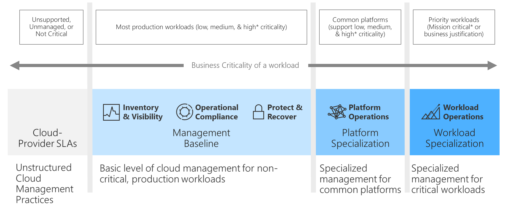

# Business criticality in cloud management

Across every business, there exist a small number of workloads that are too important to fail. These workloads are considered mission critical. When those workloads experience outages or performance degradation, the adverse impact on revenue and profitability can be felt across the entire company.

At the other end of the spectrum, some workloads can go months at a time without being used. Poor performance or outages for those workloads is not desirable, but the impact is isolated and limited.

Understanding the criticality of each workload in the IT portfolio is the first step toward establishing mutual commitments to cloud management. The following diagram illustrates a common alignment between the criticality scale to follow and the standard commitments made by the business.

## Criticality scale

The first step in any business criticality alignment effort is to create a criticality scale. The following table presents a sample scale to be used as a reference, or template, for creating your own scale.

| Criticality | Business view |
| --------- | --------- |
| Mission-critical |  Affects the company's mission and might noticeably affect corporate profit-and-loss statements. |
| Unit-critical | Affects the mission of a specific business unit and its profit-and-loss statements. |
| High | Might not hinder the mission, but affects high-importance processes. Measurable losses can be quantified in the case of outages. |
| Medium | Impact on processes is likely. Losses are low or immeasurable, but brand damage or upstream losses are likely. |
| Low | Impact on business processes isn't measurable. Neither brand damage nor upstream losses are likely. Localized impact on a single team is likely. |
| Unsupported | No business owner, team, or process that's associated with this workload can justify any investment in the ongoing management of the workload. |

It's common for businesses to include additional criticality classifications that are specific to their industry, vertical, or specific business processes. Examples of additional classifications include:

- **Compliance-critical:** In heavily regulated industries, some workloads might be critical as part of an effort to maintain compliance requirements.
- **Security-critical:** Some workloads might not be mission critical, but outages could result in loss of data or unintended access to protected information.
- **Safety-critical:** When lives or the physical safety of employees and customers is at risk during an outage, it can be wise to classify workloads as safety-critical.

## Importance of accurate criticality

Later in the cloud-adoption process, the cloud management team will use this classification to determine the amount of effort required to meet aligned levels of criticality. In on-premises environments, operations management is often purchased centrally and treated as a necessary business burden, with little or no additional operating costs. Like all cloud services, operations management is purchased on a per-asset basis as monthly operating costs.

Because there's a clear and direct cost to operations management in the cloud, it's important to properly align costs and desired criticality scales.

## Select a default criticality

An initial review of every workload in the portfolio can be time consuming. To ensure that this effort doesn't block your broader cloud strategy, we recommend that your teams agree on a default criticality to apply to all workloads.

Based on the preceding criticality-scale table, we recommend that you adopt *medium* criticality as the default. Doing so will allow your cloud strategy team to quickly identify workloads that require a higher level of criticality.

## Review operational compliance requirements

Understanding, identifying and designating business criticality is the first major step. The next management consideration topic is to ensure your operational compliance requirements, especially security compliances, are aligned. Performing the same methodologies for business criticality to your security compliance considerations will:

- Reveal the complexities of your business systems and their compliance requirements, such as sovereignty, industry, or privacy.
- Map any interdependencies with your development, operations, and security teams, ensuring that key point of contacts and subject matter experts are identified and well known across your organization.
- Ensure that your compliance adheres to any compliance audit and reporting requirements.

Apply the [operational compliance](./operational-compliance.md) content to ensure that your business requirements, criticality, and compliance requirements are aligned.

Next, review and use the [overview of the Azure Security Benchmark](/security/benchmark/azure/overview) content to ensure the various control domains are identified and mapped to your operational-compliance.

Lastly, ensure the incorporation of the governance and security content in [Security control v2: governance and strategy](/security/benchmark/azure/security-controls-v2-governance-strategy) is documented within your overall business operational methodologies.

## Use the template

The following steps apply if you're using the [operations management workbook](https://raw.githubusercontent.com/Microsoft/CloudAdoptionFramework/master/manage/opsmanagementworkbook.xlsx) to plan for cloud management.

1. Record the criticality scale in the `Scale` worksheet.
2. Update each workload in either the `Example` worksheet or the `Clean Template` worksheet to reflect the default criticality in the `Criticality` column.
3. The business should enter the correct values to reflect any deviations from the default criticality.

## Next steps

After your team has defined business criticality, you can [calculate and record business impact](./impact.md).

> [!div class="nextstepaction"]
> [Calculate and record business impact](./impact.md)
