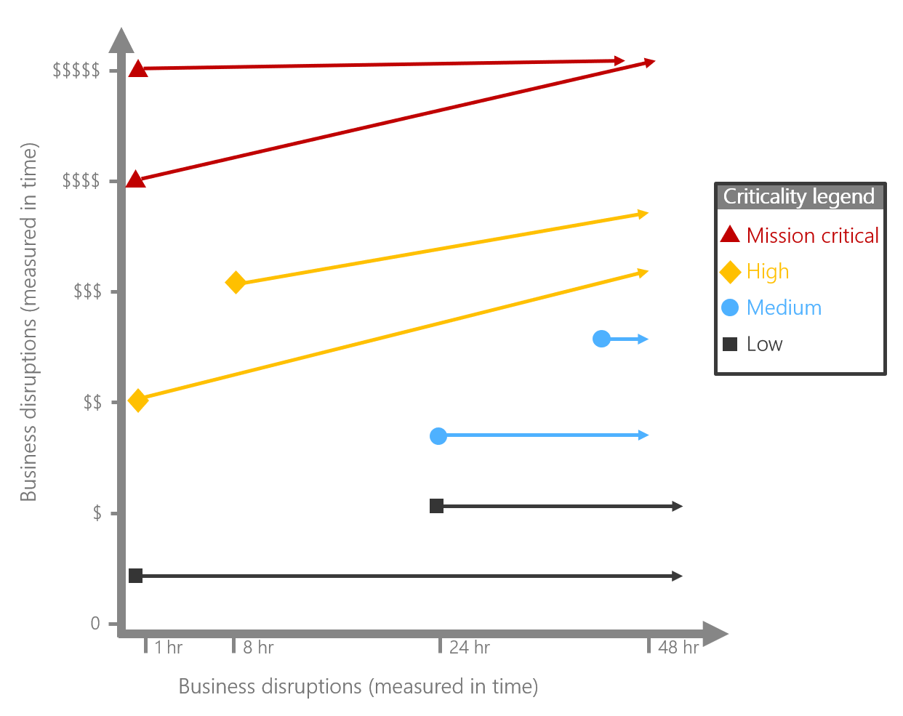

# Business impact in cloud management

Assume the best, prepare for the worst. In IT management, it's safe to assume that the workloads required to support business operations will be available and will perform within agreed-upon constraints, based on the selected criticality. However, to manage investments wisely, it's important to understand the impact on the business when an outage or performance degradation occurs. This importance is illustrated in the following graph, which maps potential business interruptions of specific workloads to the business impact of outages across a relative value scale.

To create a fair basis of comparison for the impact on various workloads across a portfolio, a time/value metric is suggested. The time/value metric captures the adverse impact of a workload outage. Generally, this impact is recorded as a direct loss of revenue or operating revenue during a typical outage period. More specifically, it calculates the amount of lost revenue for a unit of time. The most common time/value metric is *Impact per hour*, which measures operating revenue losses per hour of outage.

A few approaches can be used to calculate impact. You can apply any of the options in the following sections to achieve similar outcomes. It's important to use the same approach for each workload when you calculate protected losses across a portfolio.

## Start with estimates

Current operating models might make it difficult to determine an accurate impact. Fortunately, few systems need a highly accurate loss calculation. In the previous step, *Classify Criticality*, we suggested that you start all workloads with a default of *medium criticality*. Medium criticality workloads generally receive a standard level of management support with a relatively low impact on operating cost. Only when a workload requires additional operational management resources might you require an accurate financial impact.

For all standardized workloads, business impact serves as a prioritization variable when you're recovering systems during an outage. Outside of those limited situations, the business impact creates little to no change in the operations management experience.

## Calculate time

Depending on the nature of the workload, you could calculate losses differently. For high-paced transactional systems such as a real-time trading platform, losses per millisecond might be significant. Less frequently used systems, such as payroll, might not be used every hour. Whether the frequency of usage is high or low, it's important to normalize the time variable when you calculate financial impact.

## Calculate total impact

When you want to consider additional management investments, it's more important that the business impact be more accurate. The following three approaches to calculating losses are ordered from most accurate to least accurate:

- **Adjusted losses:** If your business has experienced a major loss event in the past, such as a hurricane or other natural disaster, a claims adjuster might have calculated actual losses during the outage. These calculations are based on insurance industry standards for loss calculation and risk management. Using adjusted losses as the total amount of losses in a specific time frame can lead to highly accurate projections.

- **Historical losses:** If your on-premises environment has suffered historically from outages resulting from infrastructure instability, it can be a bit harder to calculate losses. But you can still apply the adjuster formulas used internally. To calculate historical losses, compare the deltas in sales, gross revenue, and operating costs across three time frames: before, during, and after outage. By examining these deltas, you can identify accurate losses when no other data is available.

- **Complete loss calculation:** If no historical data is available, you can derive a comparative loss value. In this model, you determine the average gross revenue per hour for the business unit. When you're projecting loss avoidance investments, it's not fair to assume that a complete system outage equates to a 100 percent loss of revenue. But you can use this assumption as a rough basis for comparing loss impacts and prioritizing investments.

Before you make certain assumptions about potential losses associated with workload outages, it's a good idea to work with your finance department to determine the best approach to such calculations.

## Calculate workload impact

When you're calculating losses by applying historical data, you might have enough information to clearly determine the contribution of each workload to those losses. Performing this evaluation is where partnerships within the business are absolutely critical. After the total impact has been calculated, that impact must be attributed across each of the workloads. That distribution of impact should come from the business stakeholders, who should agree on the relative and cumulative impact of each workload. To that end, your team should solicit feedback from business executives to validate alignment. Such feedback is often equal parts emotion and subject matter expertise. It's important that this exercise represent the logic and beliefs of the business stakeholders who should have a say in budget allocation.

## Use the template

If you're using the [operations management workbook](https://raw.githubusercontent.com/Microsoft/CloudAdoptionFramework/master/manage/opsmanagementworkbook.xlsx) to plan for cloud management, consider doing the following:

- Each business should update each workload in either the `Example` worksheet or the `Clean Template` worksheet, along with the `Time/Value Impact` of each workload. By default, `Time/Value Impact` represents the projected losses per hour associated with an outage of the workload.

## Next steps

After the business has defined impact, you can [align commitments](./commitment.md).

> [!div class="nextstepaction"]
> [Align management commitments with the business](./commitment.md)
