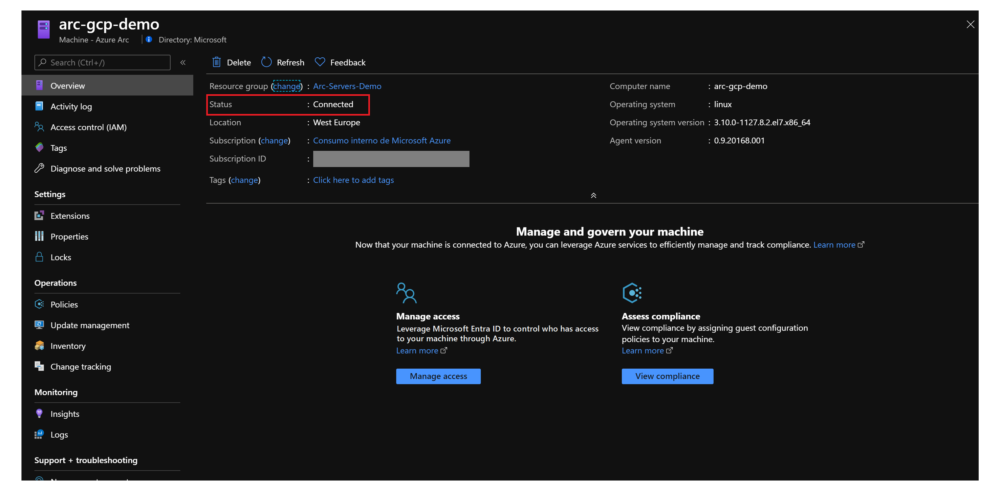

# Connect Azure Arc enabled servers to Azure Sentinel

This article provides guidance on how to onboard Azure Arc enabled servers to [Azure Sentinel](/azure/sentinel/). This enables you to start collecting security-related events and start correlating them with other data sources.

The following procedures will enable and configure Azure Sentinel on your Azure subscription. This process includes:

- Setting up a Log Analytics workspace where logs and events are aggregated for analysis and correlation.
- Enabling Azure Sentinel on the workspace.
- Onboarding Azure Arc enabled servers on Azure Sentinel using the extension management feature and Azure Policy.

> [!IMPORTANT]
> The procedures in this article assumes you've already deployed VMs, or servers that are running on-premises or on other clouds, and you have connected them to Azure Arc. If you haven't, the following information can help you automate this.

- [GCP Ubuntu instance](./gcp-terraform-ubuntu.md)
- [GCP Windows instance](./gcp-terraform-windows.md)
- [AWS Ubuntu EC2 instance](./aws-terraform-ubuntu.md)
- [AWS Amazon Linux 2 EC2 instance](./aws-terraform-al2.md)
- [VMware vSphere Ubuntu VM](./vmware-terraform-ubuntu.md)
- [VMware vSphere Windows Server VM](./vmware-terraform-windows.md)
- [Vagrant Ubuntu box](./local-vagrant-ubuntu.md)
- [Vagrant Windows box](./local-vagrant-windows.md)

## Prerequisites

1. Clone the Azure Arc Jumpstart repository.

    ```console
    git clone https://github.com/microsoft/azure_arc
    ```

1. As mentioned, this guide starts at the point where you already deployed and connected VMs or bare-metal servers to Azure Arc. For this scenario, we use a Google Cloud Platform (GCP) instance that has been already connected to Azure Arc and is visible as a resource in Azure. As shown in the following screenshots:

    

    

1. [Install or update Azure CLI](/cli/azure/install-azure-cli). Azure CLI should be running version 2.7 or later. Use `az --version` to check your current installed version.

1. Create an Azure service principal.

    To connect a VM or bare-metal server to Azure Arc, Azure service principal assigned with the Contributor role is required. To create it, sign in to your Azure account and run the following command. Alternatively, this can also be done in [Azure Cloud Shell](https://shell.azure.com/).

    ```console
    az login
    az ad sp create-for-rbac -n "<Unique SP Name>" --role contributor
    ```

    For example:

    ```console
    az ad sp create-for-rbac -n "http://AzureArcServers" --role contributor
    ```

    Output should look like this:

    ```json
    {
      "appId": "XXXXXXXXXXXXXXXXXXXXXXXXXXXX",
      "displayName": "AzureArcServers",
      "name": "http://AzureArcServers",
      "password": "XXXXXXXXXXXXXXXXXXXXXXXXXXXX",
      "tenant": "XXXXXXXXXXXXXXXXXXXXXXXXXXXX"
    }
    ```

> [!NOTE]
> We highly recommend that you scope the service principal to a specific [Azure subscription and resource group](/cli/azure/ad/sp).

## Onboard Azure Sentinel

Azure Sentinel uses the Log Analytics agent to collect log files for Windows and Linux servers and forward them to Azure Sentinel. The data collected is stored in a Log Analytics workspace. Since you can't use the default workspace created by Azure Security Center a custom one is required. You could have raw events and alerts for Azure Security Center within the same custom workspace as Azure Sentinel.

1. Create a dedicated Log Analytics workspace and enable the Azure Sentinel solution on the top of it. Use this [Azure Resource Manager template (ARM template)](https://github.com/microsoft/azure_arc/blob/main/azure_arc_servers_jumpstart/azuresentinel/arm/sentinel-template.json) to create a new Log Analytics workspace, define the Azure Sentinel solution, and enable it for the workspace. To automate the deployment you can edit the ARM template [parameters file](https://github.com/microsoft/azure_arc/blob/main/azure_arc_servers_jumpstart/azuresentinel/arm/sentinel-template.parameters.json), provide a name and location for your workspace.

    

1. Deploy the ARM template. Navigate to the [deployment folder](https://github.com/microsoft/azure_arc/tree/main/azure_arc_servers_jumpstart/azuresentinel/arm) and run the following command.

  ```console
  az deployment group create --resource-group <Name of the Azure resource group> \
  --template-file <The `sentinel-template.json` template file location> \
  --parameters <The `sentinel-template.parameters.json` template file location>
  ```

For example:

   

## Onboard Azure Arc enabled VMs on Azure Sentinel

After you've deployed Azure Sentinel to your Log Analytics workspace, you need to connect data sources to it.

There are connectors for Microsoft services, and third-party solutions from the security products ecosystem. You can also use Common Event Format (CEF), syslog, or REST API to connect your data sources with Azure Sentinel.

For servers and VMs, you can install the Log Analytics agent (MMA) agent or the Azure Sentinel agent that collects the logs and sends them to Azure Sentinel. You can deploy the agent in multiple ways with Azure Arc:

- [Extension management](./arc-vm-extension-mma.md): This feature in Azure Arc enabled servers allows you to deploy the MMA agent VM extensions to a non-Azure Windows or Linux VMs. You can use the Azure portal, Azure CLI, an ARM template, and PowerShell script to manage extension deployment to Azure Arc enabled servers.

- [Azure Policy](./arc-policies-mma.md): You can assign a policy to audit if the Azure Arc enabled server has the MMA agent installed. If the agent isn't installed, you can use the extensions feature to automatically deploy it to the VM using a remediation task, an enrollment experience that compares to Azure VMs.

## Clean up your environment

Complete the following steps to clean up your environment.

1. Remove the virtual machines from each environment using the teardown instructions from each of the following guides.

   - [GCP Ubuntu instance](./gcp-terraform-ubuntu.md) and [GCP Windows instance](./gcp-terraform-windows.md)
   - [AWS Ubuntu EC2 instance](./aws-terraform-ubuntu.md)
   - [VMware vSphere Ubuntu VM](./vmware-terraform-ubuntu.md) and [VMware vSphere Windows Server VM](./vmware-terraform-windows.md)
   - [Vagrant Ubuntu box](./local-vagrant-ubuntu.md) and [Vagrant Windows box](./local-vagrant-windows.md)

2. Remove the Log Analytics workspace by running the following script in Azure CLI. Provide the workspace name you used when creating the Log Analytics workspace.

  ```console
  az monitor log-analytics workspace delete --resource-group <Name of the Azure resource group> --workspace-name <Log Analytics Workspace Name> --yes
  ```
