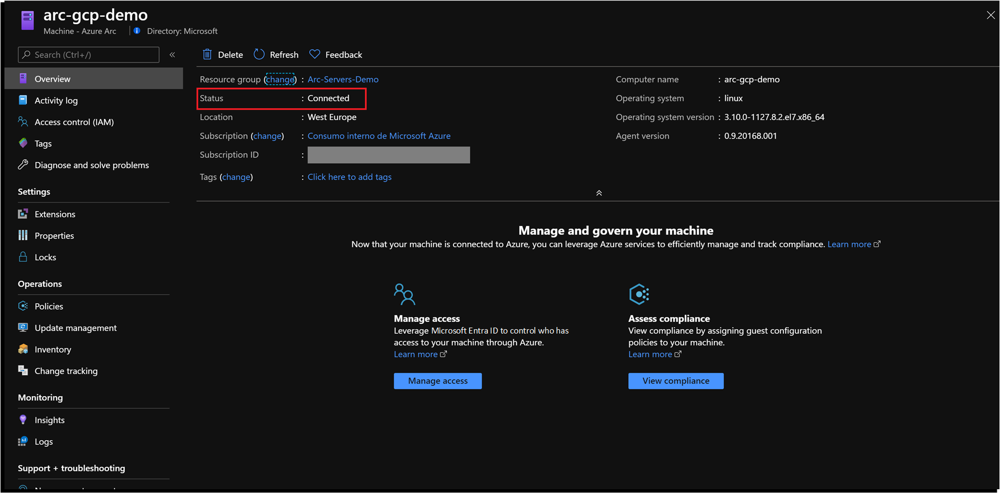

# Manage Azure policies and deploy the Azure monitoring agent extension to Azure Arc Linux and Windows servers

This article provides guidance on how to use Azure Arc enabled servers to assign Azure policies to VMs outside of Azure, whether they are on-premises or on other clouds. With this feature you can now use Azure Policy to audit settings in the operating system of an Azure Arc enabled server, if a setting is not compliant you can also trigger a remediation task.

In this case, you will assign a policy to audit if the Azure Arc connected machine has the Log Analytics agent installed. If not, use the extensions feature to automatically deploy it to the VM, an enrollment experience that levels to Azure VMs. This approach can be used to make sure all your servers are onboard to services such as Azure Monitor, Azure Security Center, Azure Sentinel, and so on.

You can use the Azure portal, an Azure Resource Manager template (ARM template) or PowerShell script to assign policies to Azure subscriptions or resource groups. The following procedures use an ARM template to assign built-in policies.

> [!IMPORTANT]
> The procedures in this article assumes you've already deployed VMs, or servers that are running on-premises or on other clouds, and you have connected them to Azure Arc. If you haven't, the following information can help you automate this.

- [GCP Ubuntu instance](./gcp-terraform-ubuntu.md)
- [GCP Windows instance](./gcp-terraform-windows.md)
- [AWS Ubuntu EC2 instance](./aws-terraform-ubuntu.md)
- [AWS Amazon Linux 2 EC2 instance](./aws-terraform-al2.md)
- [VMware vSphere Ubuntu VM](./vmware-terraform-ubuntu.md)
- [VMware vSphere Windows Server VM](./vmware-terraform-windows.md)
- [Vagrant Ubuntu box](./local-vagrant-ubuntu.md)
- [Vagrant Windows box](./local-vagrant-windows.md)

Review the [Azure Monitor supported OS documentation](/azure/azure-monitor/vm/vminsights-enable-overview#supported-operating-systems) and ensure that the VMs you use for these procedures are supported. For Linux VMs, check both the Linux distribution and kernel to ensure you are using a supported configuration.

## Prerequisites

1. Clone the Azure Arc Jumpstart repository.

   ```console
   git clone https://github.com/microsoft/azure_arc
   ```

2. As mentioned, this guide starts at the point where you already deployed and connected VMs or servers to Azure Arc. In the following screenshots a Google Cloud Platform (GCP) server has been connected with Azure Arc and is visible as a resource in Azure.

   

   

3. [Install or update Azure CLI](/cli/azure/install-azure-cli). Azure CLI should be running version 2.7 or later. Use `az --version` to check your current installed version.

4. Create an Azure service principal.

   To connect a VM or bare-metal server to Azure Arc, Azure service principal assigned with the Contributor role is required. To create it, sign in to your Azure account and run the following command. You can also run this command in [Azure Cloud Shell](https://shell.azure.com/).

   ```console
   az login
   az ad sp create-for-rbac -n "<Unique SP Name>" --role contributor
   ```

   For example:

   ```console
   az ad sp create-for-rbac -n "http://AzureArcServers" --role contributor
   ```

   The output should look like this:

   ```json
   {
   "appId": "XXXXXXXXXXXXXXXXXXXXXXXXXXXX",
   "displayName": "AzureArcServers",
   "name": "http://AzureArcServers",
   "password": "XXXXXXXXXXXXXXXXXXXXXXXXXXXX",
   "tenant": "XXXXXXXXXXXXXXXXXXXXXXXXXXXX"
   }
   ```

   > [!NOTE]
   > We highly recommend that you scope the service principal to a specific [Azure subscription and resource group](/cli/azure/ad/sp).

You'll also need to have a Log Analytics workspace deployed. You can automate the deployment by editing the ARM template [parameters file](https://github.com/microsoft/azure_arc/blob/main/azure_arc_servers_jumpstart/policies/arm/log_analytics-template.parameters.json) and providing a name and location for your workspace.


To deploy the ARM template, navigate to the [deployment folder](https://github.com/microsoft/azure_arc/tree/main/azure_arc_servers_jumpstart/policies/arm) and run the following command:

```console
az deployment group create --resource-group <Name of the Azure resource group> \
--template-file <The `log_analytics-template.json` template file location> \
--parameters <The `log_analytics-template.parameters.json` template file location>
```

## Assign policies to Azure Arc connected machines

After all the prerequisites are set, you can assign policies to the Azure Arc connected machines. Edit the [parameters file](https://github.com/microsoft/azure_arc/blob/main/azure_arc_servers_jumpstart/policies/arm/policy.json) to provide your subscription ID as well as the Log Analytics workspace.


1. To start the deployment, use the following command:

   ```console
   az policy assignment create --name 'Enable Azure Monitor for VMs' \
   --scope '/subscriptions/<Your subscription ID>/resourceGroups/<Name of the Azure resource group>' \
   --policy-set-definition '55f3eceb-5573-4f18-9695-226972c6d74a' \
   -p <The *policy.json* template file location> \
   --assign-identity --location <Azure Region>
   ```

   The `policy-set-definition` flag points to the initiative `Enable Azure Monitor` definition ID.

2. After the initiative is assigned, it takes about 30 minutes for the assignment to be applied to the defined scope. Azure Policy then starts the evaluation cycle against the Azure Arc connected machine and recognizes it as noncompliant because it still doesn't have the Log Analytics agent configuration deployed. To check this, go to the Azure Arc connected machine under the policies section.

   

3. Now, assign a remediation task to the noncompliant resource to put into a compliant state.

   

4. Under **Policy to remediate**, choose **\[Preview] Deploy Log Analytics Agent to Linux Azure Arc machines** and select **Remediate**. This remediation task is instructing Azure Policy to run the `DeployIfNotExists` effect and use the Azure Arc extension management capabilities to deploy the Log Analytics agent on the VM.

   

5. After you have assigned remediation task, the policy will be evaluated again. It should show that the server on GCP is compliant and that the Log Analytics agent is installed on the Azure Arc machine.

   

   

## Clean up your environment

Complete the following steps to clean up your environment.

1. Remove the virtual machines from each environment by following the teardown instructions from each guide.

   - [GCP Ubuntu instance](./gcp-terraform-ubuntu.md) and [GCP Windows instance](./gcp-terraform-windows.md)
   - [AWS Ubuntu EC2 instance](./aws-terraform-ubuntu.md)
   - [VMware vSphere Ubuntu VM](./vmware-terraform-ubuntu.md) and [VMware vSphere Windows Server VM](./vmware-terraform-windows.md)
   - [Vagrant Ubuntu box](./local-vagrant-ubuntu.md) and [Vagrant Windows box](./local-vagrant-windows.md)

2. Remove the Azure Policy assignment by executing the following script in Azure CLI.

   ```console
   az policy assignment delete --name 'Enable Azure Monitor for VMs' --resource-group <resource-group>
   ```

3. Remove the Log Analytics workspace by executing the following script in Azure CLI. Provide the workspace name you used when creating the Log Analytics workspace.

   ```console
   az monitor log-analytics workspace delete --resource-group <Name of the Azure resource group> --workspace-name <Log Analytics workspace Name> --yes
   ```
