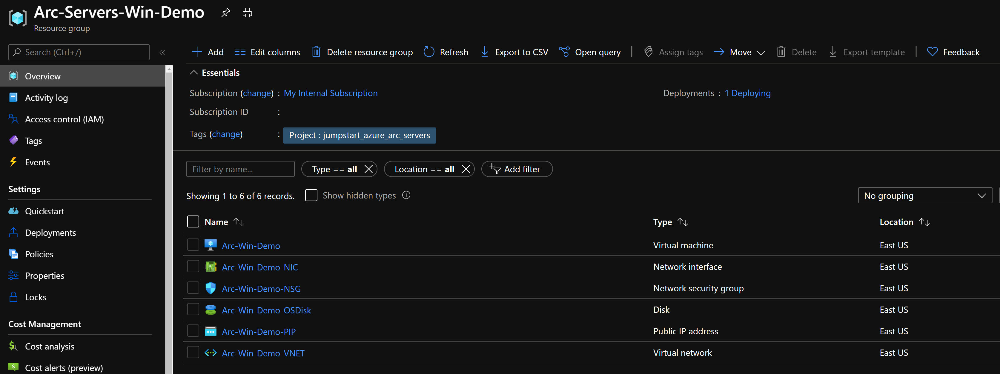
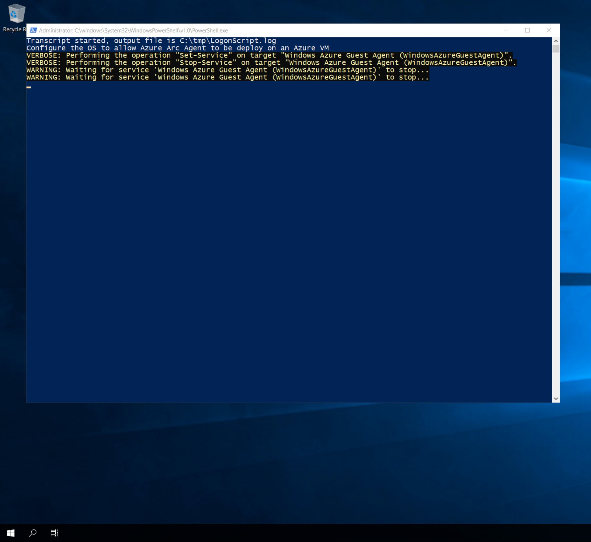
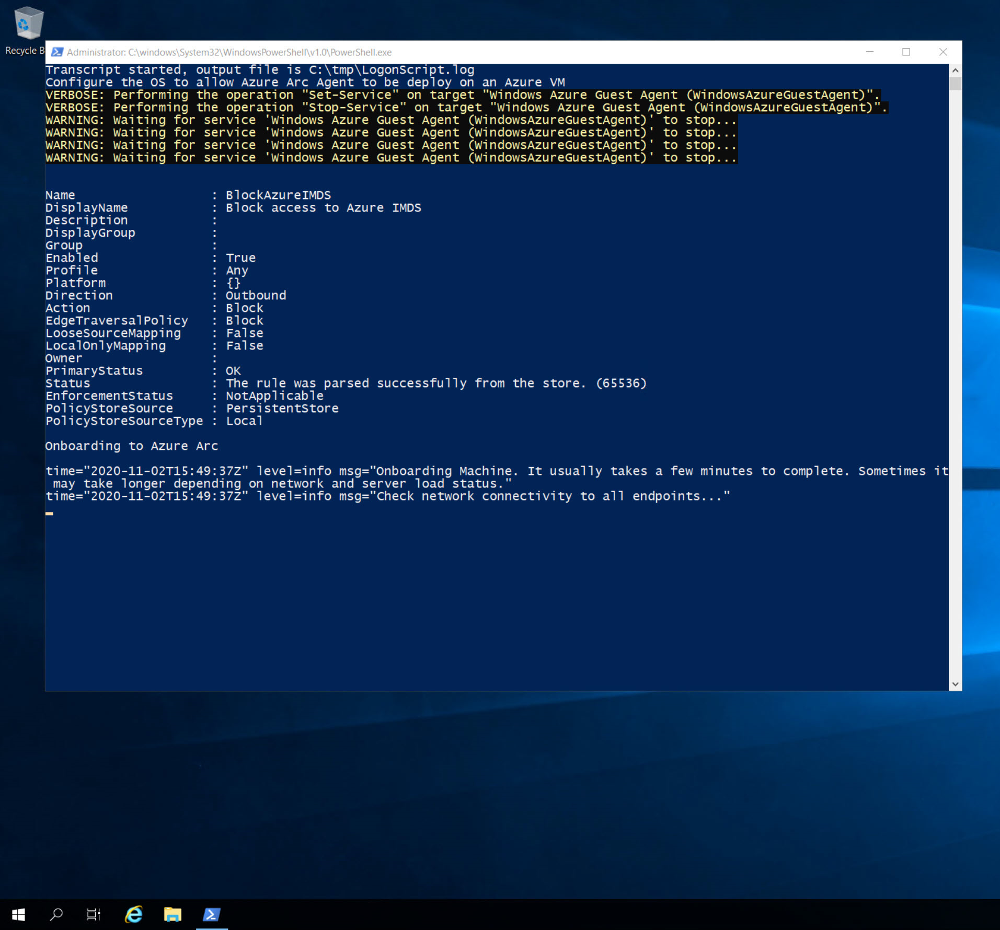
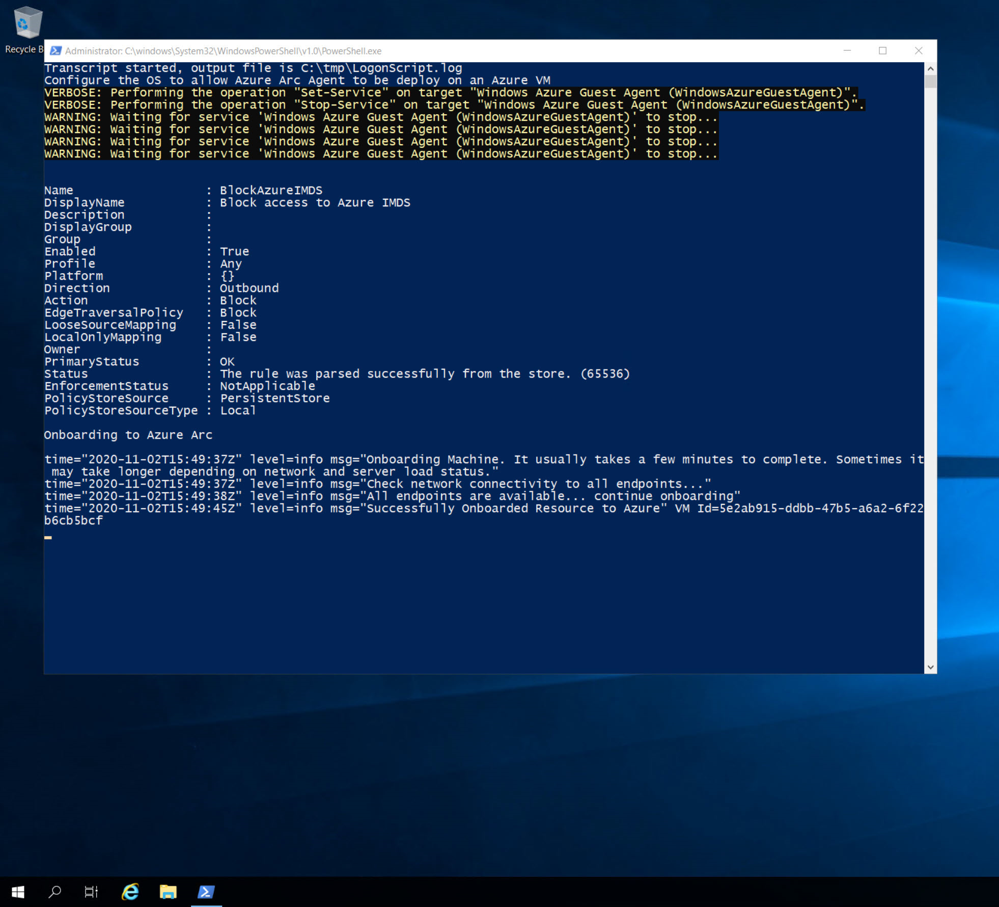
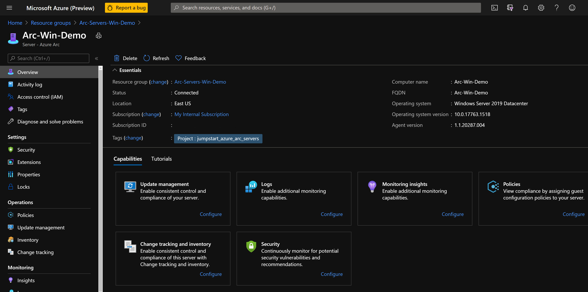

# Use an Azure Resource Manager template to deploy and connect an Azure virtual machine to Azure Arc

This article provides guidance for using an [Azure Resource Manager template (ARM template)](/azure/azure-resource-manager/templates/overview) to automatically onboard an Azure virtual machine (Azure VM) running Windows to Azure Arc. The provided ARM template is responsible for creating the Azure resources and executing the Azure Arc onboard script on the VM.

Azure VMs are using the [Azure Instance Metadata Service (IMDS)](/azure/virtual-machines/windows/instance-metadata-service) by default. By projecting an Azure VM as an Azure Arc enabled server, a *conflict* is created, which will not allow for the Azure Arc server resources to be represented as one when the IMDS is being used. Instead, the Azure Arc server will still "act" as a native Azure VM.

This guide will allow you to use and onboard Azure VMs to Azure Arc **for demo purposes only**. You will have the ability to simulate a server deployed outside of Azure, for example, on-premises or in other cloud platforms.

> [!NOTE]
> An Azure VM is not expected to be an Azure Arc enabled server. The following scenario is unsupported and should only be used for demo and testing purposes.

## Prerequisites

1. Clone the Azure Arc Jumpstart repository.

    ```console
    git clone https://github.com/microsoft/azure_arc.git
    ```

2. [Install or update Azure CLI to version 2.7 and above](/cli/azure/install-azure-cli). Use the following command to check your current installed version.

    ```console
    az --version
    ```

3. Azure subscription: if you don't have an Azure subscription, you can [create a free Azure account](https://azure.microsoft.com/free/).

4. Create an Azure service principal.

    In order for you to deploy the Azure resources using the ARM template, an Azure service principal assigned with the Contributor role is required. To create it, sign in to your Azure account and run the following command. You can also run this command in [Azure Cloud Shell](https://shell.azure.com/).

    ```console
    az login
    az ad sp create-for-rbac -n "<Unique SP Name>" --role contributor
    ```

    For example:

    ```console
    az ad sp create-for-rbac -n "http://AzureArcServers" --role contributor
    ```

    Output should look like this:

    ```json
    {
      "appId": "XXXXXXXXXXXXXXXXXXXXXXXXXXXX",
      "displayName": "AzureArcServers",
      "name": "http://AzureArcServers",
      "password": "XXXXXXXXXXXXXXXXXXXXXXXXXXXX",
      "tenant": "XXXXXXXXXXXXXXXXXXXXXXXXXXXX"
    }
    ```

    > [!NOTE]
    > We highly recommend that you scope the service principal to a specific [Azure subscription and resource group](/cli/azure/ad/sp).

## Automation flow

For you to get familiar with the automation and deployment flow, below is an explanation.

1. A user edits the ARM template parameters file (a one-time edit). These parameter values are being used throughout the deployment.

2. The ARM template includes an Azure VM custom script extension, which deploys the [`install_arc_agent.ps1`](https://github.com/microsoft/azure_arc/blob/main/azure_arc_servers_jumpstart/azure/windows/arm_template/scripts/install_arc_agent.ps1) PowerShell script.

3. In order to allow the Azure VM to successfully be projected as an Azure Arc enabled server, the script will:

    1. Set local OS environment variables.

    2. Generate a local OS sign-in script named `LogonScript.ps1`. This script will:

        - Create the `LogonScript.log` file.

        - Stop and disable the Windows Azure guest agent service.

        - Create a new Windows Firewall rule to block Azure IMDS outbound traffic to the `169.254.169.254` remote address.

        - Unregister the sign-in script Windows scheduled task so it won't run after first sign-in.

    3. Disable and prevent Windows Server Manager from running on startup.

4. A user connects via RDP to the Windows VM, which starts running `LogonScript.ps1` and onboards the VM to Azure Arc.

## Deployment

As mentioned, this deployment will use ARM templates. You will deploy a single template, responsible for creating all the Azure resources in a single resource group and onboarding the created VM to Azure Arc.

1. Before deploying the ARM template, sign in to Azure using Azure CLI with the `az login` command.

2. The deployment is using the ARM template parameters file. Before initiating the deployment, edit the [`azuredeploy.parameters.json`](https://github.com/microsoft/azure_arc/blob/main/azure_arc_servers_jumpstart/azure/windows/arm_template/azuredeploy.parameters.json) file located in your local cloned repository folder. An example parameters file is located [here](https://github.com/microsoft/azure_arc/blob/main/azure_arc_servers_jumpstart/azure/windows/arm_template/azuredeploy.parameters.example.json).

3. To deploy the ARM template, navigate to the local cloned [deployment folder](https://github.com/microsoft/azure_arc/tree/main/azure_arc_servers_jumpstart/azure/windows/arm_template) and run the following command:

    ```console
    az group create --name <Name of the Azure resource group> --location <Azure Region> --tags "Project=jumpstart_azure_arc_servers"
    az deployment group create \
    --resource-group <Name of the Azure resource group> \
    --name <The name of this deployment> \
    --template-uri https://raw.githubusercontent.com/microsoft/azure-arc/main/azure_arc_servers_jumpstart/azure/windows/arm_template/azuredeploy.json \
    --parameters <The `azuredeploy.parameters.json` parameters file location>
    ```

    > [!NOTE]
    > Make sure that you are using the same Azure resource group name as the one you used in the `azuredeploy.parameters.json` file.

    <!-- cspell:ignore arcwinsrvdemo -->

    For example:

    ```console
    az group create --name Arc-Servers-Win-Demo --location "East US" --tags "Project=jumpstart_azure_arc_servers"
    az deployment group create \
    --resource-group Arc-Servers-Win-Demo \
    --name arcwinsrvdemo \
    --template-uri https://raw.githubusercontent.com/microsoft/azure-arc/main/azure_arc_servers_jumpstart/azure/windows/arm_template/azuredeploy.json \
    --parameters azuredeploy.parameters.json
    ```

4. Once the Azure resources have been provisioned, you can see them in the Azure portal.

    

    

## Windows sign-in and post-deployment

1. Now that the Windows Server VM is created, the next step is connecting it. Using its public IP address, RDP to the VM.

    

2. Upon first sign-in, as mentioned in the [Automation flow](#automation-flow) section, a sign-in script will get executed. This script is created as part of the automated deployment process.

3. Let the script run and **do not close** the PowerShell session. The session closes for you automatically once completed.

    > [!NOTE]
    > The script run time is ~1-2 minutes long.

    

    

    

    

4. Upon successful completion, a new Azure Arc enabled server will be added to the resource group.




## Cleanup

To delete the entire deployment, delete the resource group from the Azure portal.


