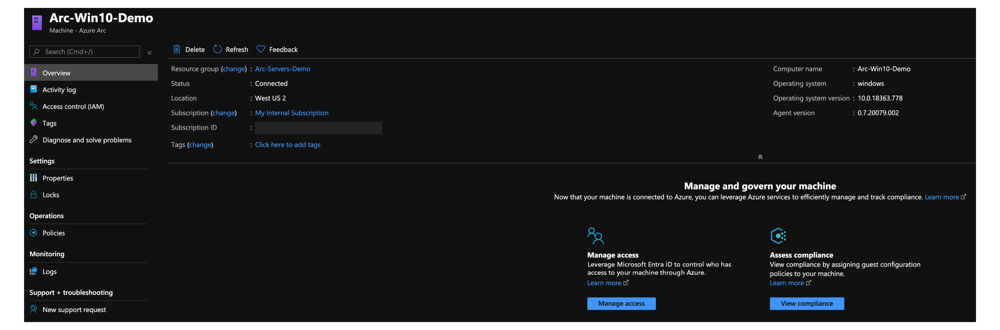

# Deploy a local Windows Server instance hosted by Vagrant and connect it to Azure Arc

The following article provides guidance for deploying a local **Windows 10** virtual machine using [Vagrant](https://www.vagrantup.com/) and connect it as an Azure Arc enabled server resource.

## Prerequisites

1. Clone the Azure Arc Jumpstart repository.

    ```console
    git clone https://github.com/microsoft/azure_arc.git
    ```

2. [Install or update Azure CLI to version 2.7 and above](/cli/azure/install-azure-cli). Use the following command to check your current installed version.

    ```console
    az --version
    ```

3. Vagrant relies on an underlying hypervisor. For this guide, we will be using Oracle VM VirtualBox.

    1. Install [VirtualBox](https://www.virtualbox.org/wiki/Downloads).

        - If you are an macOS user, run `brew cask install virtualbox`
        - If you are a Windows user, you can use the [Chocolatey package](https://chocolatey.org/packages/virtualbox)
        - If you are a Linux user, all package installation methods can be found [here](https://www.virtualbox.org/wiki/Linux_Downloads)

    2. Install [Vagrant](https://www.vagrantup.com/docs/installation)

        - If you are an macOS user, run `brew cask install vagrant`
        - If you are a Windows user, you can use the [Chocolatey package](https://chocolatey.org/packages/vagrant)
        - If you are a Linux user, look [here](https://www.vagrantup.com/downloads)

4. Create an Azure service principal.

    To connect the Vagrant virtual machine to Azure Arc, an Azure service principal assigned with the Contributor role is required. To create it, sign in to your Azure account and run the following command. You can also run this command in [Azure Cloud Shell](https://shell.azure.com/).

    ```console
    az login
    az ad sp create-for-rbac -n "<Unique SP Name>" --role contributor
    ```

    For example:

    ```console
    az ad sp create-for-rbac -n "http://AzureArcServers" --role contributor
    ```

    Output should look like this:

    ```json
    {
      "appId": "XXXXXXXXXXXXXXXXXXXXXXXXXXXX",
      "displayName": "AzureArcServers",
      "name": "http://AzureArcServers",
      "password": "XXXXXXXXXXXXXXXXXXXXXXXXXXXX",
      "tenant": "XXXXXXXXXXXXXXXXXXXXXXXXXXXX"
    }
    ```

    > [!NOTE]
    > We highly recommend that you scope the service principal to a specific [Azure subscription and resource group](/cli/azure/ad/sp).

- The vagrantfile executes a script on the VM OS to install all the needed artifacts and to inject environment variables. Edit the [`scripts/vars.ps1`](https://github.com/microsoft/azure_arc/blob/main/azure_arc_servers_jumpstart/local/vagrant/windows/scripts/vars.ps1) PowerShell script to match the Azure service principal you created.

  - `subscriptionId` = Your Azure subscription ID
  - `appId` = Your Azure service principal name
  - `password` = Your Azure service principal password
  - `tenantId` = Your Azure tenant ID
  - `resourceGroup` = Azure resource group name
  - `location` = Azure region

## Deployment

Like any Vagrant deployment, a [vagrantfile](https://github.com/microsoft/azure_arc/blob/main/azure_arc_servers_jumpstart/local/vagrant/windows/Vagrantfile) and a [Vagrant box](https://www.vagrantup.com/docs/boxes) is needed. At a high level, the deployment will:

- Download the Windows 10 image file [Vagrant box](https://app.vagrantup.com/StefanScherer/boxes/windows_10)
- Execute the Azure Arc installation script

After editing the `scripts/vars.ps1` script to match your environment, from the `Vagrantfile` folder, run `vagrant up`. As this is the first time you are creating the VM, the first run will be **much slower** than the ones to follow. This is because the deployment is downloading the Windows 10 box for the first time.


Once the download is complete, the actual provisioning will start. As shown in the following screenshot, the process takes can take somewhere between 7 to 10 minutes.


Upon completion, you will have a local Windows 10 VM deployed, connected as a new Azure Arc enabled server inside a new resource group.




## Semi-automated deployment (optional)

The last step of the run is to register the VM as a new Azure Arc enabled server resource.


If you want to demo/control the actual registration process, do the following:

1. In the [`install_arc_agent`](https://github.com/microsoft/azure_arc/blob/main/azure_arc_servers_jumpstart/local/vagrant/windows/scripts/install_arc_agent.ps1) PowerShell script, comment out the `run connect command` section and save the file. You can also comment out or change the creation of the resource group.

    

    

2. RDP the VM using the `vagrant rdp` command. Use `vagrant/vagrant` as the username/password.

    

3. Open PowerShell ISE **as Administrator** and edit the `C:\runtime\vars.ps1` file with your environment variables.

    

4. Paste the `Invoke-Expression C:\runtime\vars.ps1` command, the `az group create --location $env:location --name $env:resourceGroup --subscription $env:subscriptionId` command and the same `azcmagent connect` command you out and execute the script.

    

## Delete the deployment

To delete the entire deployment, run the `vagrant destroy -f` command. The vagrantfile includes a `before: destroy` Vagrant trigger that runs the command to delete the Azure resource group before destroying the actual VM.


