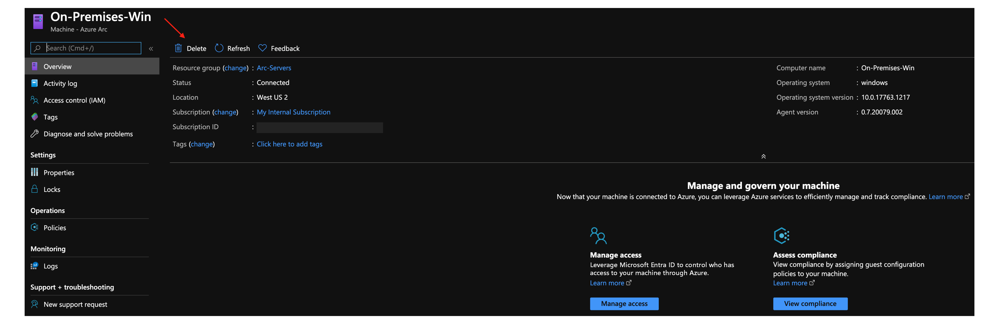

# Connect an existing Windows Server instance to Azure Arc

This article provides guidance for connecting a Windows machine to Azure Arc using a simple PowerShell script.

## Prerequisites

1. [Install or update Azure CLI to version 2.7 and above](/cli/azure/install-azure-cli). Use the following command to check your current installed version.

    ```console
    az --version
    ```

2. Create an Azure service principal.

    To connect a server to Azure Arc, an Azure service principal assigned with the Contributor role is required. To create it, sign in to your Azure account and run the following command. You can also run this command in [Azure Cloud Shell](https://shell.azure.com/).

    ```console
    az login
    az ad sp create-for-rbac -n "<Unique SP Name>" --role contributor
    ```

    For example:

    ```console
    az ad sp create-for-rbac -n "http://AzureArcServers" --role contributor
    ```

    Output should look like this:

    ```json
    {
      "appId": "XXXXXXXXXXXXXXXXXXXXXXXXXXXX",
      "displayName": "AzureArcServers",
      "name": "http://AzureArcServers",
      "password": "XXXXXXXXXXXXXXXXXXXXXXXXXXXX",
      "tenant": "XXXXXXXXXXXXXXXXXXXXXXXXXXXX"
    }
    ```

    > [!NOTE]
    > We highly recommend that you scope the service principal to a specific [Azure subscription and resource group](/cli/azure/ad/sp).

3. Create a new Azure resource group for your machines.

    

4. Download the [`az_connect_win.ps1`](https://github.com/microsoft/azure_arc/blob/main/azure_arc_servers_jumpstart/scripts/az_connect_win.ps1) PowerShell script.

5. Change the environment variables according to your environment and copy the script to the designated machine.

    

## Deployment

On the designated machine, open PowerShell ISE **as Administrator** and run the script. Note the script is using `$env:ProgramFiles` as the agent installation path, so **ensure you are not using PowerShell ISE (x86)**.


Upon completion, you will have your Windows Server instance, connected as a new Azure Arc resource inside your resource group.


## Delete the deployment

To delete the server, select the server and delete it from the Azure portal.



To delete the entire deployment, delete the Azure resource group from the Azure portal.


