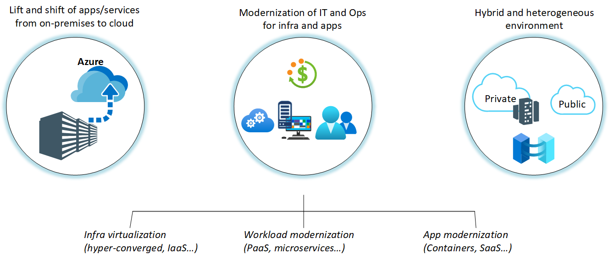

# Cloud monitoring guide: Introduction

The cloud fundamentally changes how enterprises procure and use technology resources. In the past, enterprises assumed ownership of and responsibility for all levels of technology, from infrastructure to software. Now, the cloud offers the potential for enterprises to provision and consume resources as needed.

Although the cloud offers nearly unlimited flexibility in design choices, enterprises seek proven and consistent methodologies for adopting cloud technologies. Each enterprise has different goals and timelines for cloud adoption, making a one-size-fits-all approach to adoption nearly impossible.

This digital transformation also enables an opportunity to modernize your infrastructure, workloads, and applications. Depending on business strategy and objectives, adopting a hybrid cloud model is likely part of the migration journey from on-premises to operating entirely in the cloud. IT must also understand how to effectively monitor the application or service migrating to Azure and continue to deliver efficient IT operations and DevOps.

Stakeholders often want to use cloud-based software as a service (SaaS) monitoring and management tools. They need to understand what services and solutions exist to achieve end-to-end visibility, reduce costs, and focus less on infrastructure and maintenance of traditional software-based IT operations tools.

The goal of this guide is to provide a detailed reference to help enterprise IT managers, business decision-makers, application architects, and application developers understand:

- Azure monitoring platforms, with an overview and comparison of their capabilities.
- The best-fit solution for monitoring hybrid, private, and Azure native workloads.
- The recommended end-to-end monitoring approach for both infrastructure and applications. This approach includes deployable solutions for migrating these typical workloads to Azure.

This guide isn't a how-to article for using or configuring individual Azure services and solutions, but it does reference those sources when they're applicable or available. After you've read it, you'll understand how to successfully operate a workload by following best practices and patterns.

If you're unfamiliar with Azure Monitor and System Center Operations Manager, and you want to better understand what makes them unique and how they compare to each other, review the [overview of our monitoring platforms](./platform-overview.md).

## Audience

This guide is useful primarily for enterprise administrators, IT operations, IT security and compliance, application architects, workload development owners, and workload operations owners.

## How this guide is structured

This article is part of a series. The following articles are meant to be read together, in this order:

- Introduction (this article)
- [Cloud monitoring strategy](../../strategy/monitoring-strategy.md)
- [Monitoring platform strategy for cloud deployment models](./cloud-models-monitor-overview.md)
- [Observability](./observability.md)
- [Service Level Objectives](./service-level-objectives.md)
- [Collect the right data](./data-collection.md)
- [Response](./response.md)

## Products and services

A few software and services are available to help you monitor and manage various resources that are hosted in Azure, your corporate network, or other cloud providers. They are:

- [System Center Operations Manager](/system-center/scom/welcome)
- [Azure Monitor](/azure/azure-monitor/overview) (includes Log Analytics and Application Insights)
- [Azure Policy](/azure/governance/policy/overview) and [Azure Blueprints](/azure/governance/blueprints/overview)
- [Azure Arc](/azure/azure-arc/)
- [Azure Automation](/azure/automation/automation-intro)
- [Azure Logic Apps](/azure/logic-apps/logic-apps-overview)
- [Azure Event Hubs](/azure/event-hubs/event-hubs-about)

The guide covers our current monitoring platforms: Azure Monitor and System Center Operations Manager. It also outlines our recommended strategy for monitoring each cloud deployment model. Additionally, it includes a set of monitoring recommendations, starting with data collection, observability, and alerting.

## Next steps

> [!div class="nextstepaction"]
> [Monitoring strategy for cloud deployment models](./cloud-models-monitor-overview.md)
