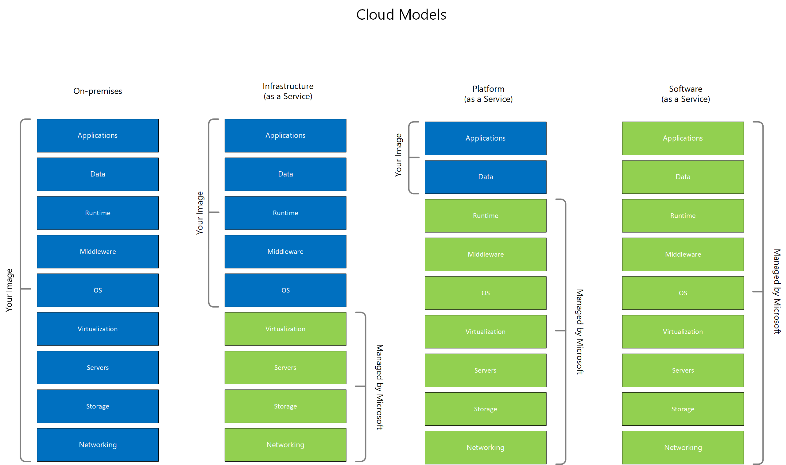

# Cloud monitoring guide: Monitoring strategy

## Formulate a monitoring strategy

### Early Considerations

Use the Strategy and Plan phases of the Cloud Adoption Framework to ease your journey to the cloud. Consider how monitoring influences and justifies the motivations, business outcomes and initiatives. Consider how the first adoption project establishes early operations management, in Azure. Investigate what the cloud operating model needs to look like, including the role monitoring will play. Monitoring is still best served with a service-based approach, perhaps as an operations function, where monitoring is an advisory service and is a provider of expertise to business and IT consumers.

Reducing complexity, lowering cost, while auto-scaling at cloud speed, are strong motivators for the following business case:

* Azure Monitor helps you achieve early operations because the service is fully integrated into the Azure Resource Manager control plane as Software-as-a-Service. Set up logs, metrics, and alerts; then standardize monitoring configurations that match the pace of production resources established in Azure.  Monitoring will be there from the Azure resource level up to the Azure management group.

* You can scale and standardize your monitoring solutions with Azure Policy for all resource types, such as cloud applications, virtual machines, and Kubernetes clusters. You want monitoring in the hands of Applications development teams to support their move to a continuous style DevOps model.

* Cost management is also built in, so that you pay only for what you need and optimize only on the logs and alerts you need.

What about on-premises services? You can consider Azure Monitor as single pane of glass. Use APIs, Insights, or other Azure services to collect monitoring data from each resource, increasing visibility into the operation of your computing enterprise. Consolidate tools, standardize automation expertise, and reduce support contracts.

At the heart of operations management, your IT enterprise demands centralized governance and strict delegation over approaches to build, operate, and manage IT services. In Azure, service assets are called resources. With Azure Active Directory and Azure Resource Manager, you get granular control over monitoring configurations, security baselines, and servicing policies. Azure Active Directory provides directory roles to establish your provider/consumer relationships; Azure role-based access control (RBAC) provides access management to resources in Azure, Azure Policy applies controls to enforce different rules and effects over your resources, and Azure Security Center ensures secure, compliant baselines.  

### High level requirements

As an architect or strategic planner, you may need to formulate an early strategy for operations management, in which monitoring plays a major role. Consider these four outcomes:

1. You need to be managing cloud production services when they go live into production, such as networking, applications, security and virtual infrastructure.

2. You need to apply limited resources to rationalize your existing monitoring tools, skills and expertise, and leverage cloud monitoring to reduce complexity.

3. You need make your monitoring solution processes more efficient, work faster and smoother, at scale and be able to change quickly too.

4. You need to account for how your organization will plan for and host monitoring based on cloud models, and reduce your requirements as the organization moves up stream from  IaaS to PaaS, and then to SaaS.  

### High level modeling

As the business determines what services will move, you will need to invest your resources carefully.  On-premises, you own all responsibilities for monitoring and are heavily invested.  The moves made toward SaaS services for example does not eliminate your responsibilities for monitoring.  You’ll be deciding who needs access, who gets alerts, and who needs access to analytics.  Azure Monitor and Azure Arc are SaaS services with the flexibility of addressing monitoring scenarios across all four cloud models, not just resources inside Azure.  
And you need to look beyond the cloud model below.  You’ll want to include Microsoft 365 in the equation, since you get significant monitoring for security and compliance on top of Azure Security Center including identities, endpoint management, and device monitoring outside the datacenter.

### Agile solution releases

Ultimately, you’ll deliver monitoring configurations or solutions into production. As an IT Operations Manager or Monitoring Team Lead, consider a standard, simple taxonomy to improve communication with consumers, managers, and IT operations. An agile, DevOps style of approach ensures monitoring is embedded with the teams who will be building and operating cloud services. While traditional project management will work, it may not be fast enough nor embed itself in your operations teams.

Include in your strategy and operating model how you communicate monitoring plans, objectives, and configurations (the solutions). For example, how you might leverage Azure DevOps Boards:

|Agile term|What to include|Examples|
|----------|---------------|--------|
|Epics|Broad monitoring Initiatives of the monitoring strategy|Consolidate Azure cloud monitoring  Hybrid cloud monitoring  Private cloud monitoring  Establish core monitoring service |
|Features|Individual monitoring  Plans and projects|Monitoring requirements  Monitoring consumers and providers  Objectives  Tools  Schedule|
|User stories and tasks |The end result is a  Monitoring configuration and/or solution|Network monitoring (e.g. Express Route)  Standardized IaaS VM monitoring (e.g. Azure Monitor for VMs, Application Insight, Azure Policy, settings, policies, reports, workspaces.)|

### Monitoring informs strategy 

Consider where early monitoring capability *informs strategy*. Many decisions depend on early monitoring data in order to build a capability roadmap that guides limited resources and adds confidence. Strategies also need real-world input from monitoring of service enablement.

Consider the role monitoring plays in strategies to incrementally protect and secure the digital estate:

* Activity logs and security monitoring are needed to measure directory usage and external sharing of sensitive content, to inform in an incremental approach to layer on protective features and achieve the right balance with privacy monitoring.

* Policies and baselines will inform the rationalization objective (migrate, lift and shift, re-architect) and improve confidence that data and information can be migrated from on-premises to cloud services.

Later in this guide, discover some common monitoring scenarios or use cases that will help accelerate adoption.

### Determine what you have

As a manageability expert, you may be working closely with a steering committee, the architect and strategic planners. You might be working to formulate monitoring strategy by assessing the current state of your systems management: the people, partnering, outsourcing, tooling, complexity, gaps and risks. An assessment will help you prioritize the set of found problems and select the key opportunities that improve the current situation. Determine, too, the services, systems, and data that are likely to remain on-premises as one important outcome. Ideally, management wants a roadmap of initiatives, but in direct proportion to the known planning horizon. Discussing unknowns, are just as important.

### Formulate a monitoring architecture
