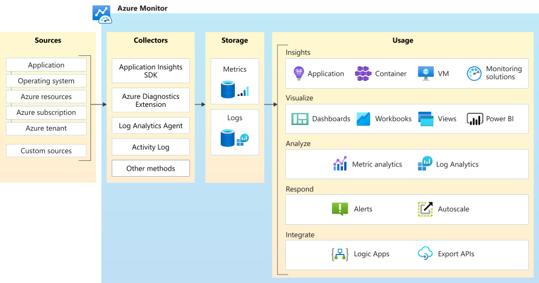
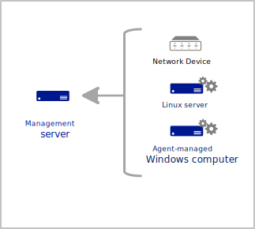

# Cloud monitoring guide: Monitoring platforms overview

Microsoft provides a range of monitoring capabilities from two products: [System Center Operations Manager](/system-center/scom/welcome) (SCOM), designed for on-premises and then extended to the cloud, and Azure Monitor, designed for the cloud but can also monitor on-premises systems. These two offerings deliver core monitoring services, such as alerting, service uptime tracking, application and infrastructure health monitoring, diagnostics, and analytics.

Many organizations are embracing the latest practices for DevOps agility and cloud innovations to manage their heterogeneous environments. Yet they're also concerned about their ability to make appropriate and responsible decisions about monitoring those workloads.

This article provides a high-level overview of our monitoring platforms to help you understand how each delivers core monitoring functionality.

## Infrastructure requirements

### Operations Manager

Operations Manager requires significant infrastructure and maintenance to support a management group, a basic unit of functionality. At a minimum, a management group consists of one or more management servers, a SQL Server instance, hosting the operational and reporting data warehouse database, and agents. The complexity of a management group design depends on multiple factors, such as the scope of workloads to monitor and the number of devices or computers supporting the workloads. If you require high availability and site resiliency, as is commonly the case with enterprise monitoring platforms, the infrastructure requirements and associated maintenance can increase dramatically.

[Azure Monitor SCOM Managed Instance (preview)](/system-center/scom/operations-manager-managed-instance-overview) (SCOM Managed Instance (preview)), on the other hand, requires minimal infrastructure and maintenance, as it's fully managed by Microsoft. You no longer have the responsibility of updates and security patching, and you preserve any investments in SCOM since it's compatible with all the existing SCOM management packs.

### Azure Monitor

Azure Monitor is a software as a service (SaaS) offering, so its supporting infrastructure runs in Azure and is managed by Microsoft. It performs monitoring, analytics, and diagnostics at scale. It's available in all national clouds. Core parts of the infrastructure (collectors, metrics and logs store, and analytics) that support Azure Monitor are maintained by Microsoft.

## Data collection

<!-- markdownlint-disable MD024 -->

### Operations Manager

#### Agents

The operations manager only collects data from agents installed on [Windows computers](/system-center/scom/plan-planning-agent-deployment#windows-agent). It can accept data from the Operations Manager SDK, but this approach is typically used for partners that extend the product with custom applications, not for collecting monitoring data. It can collect data from other sources, such as [Linux computers](/system-center/scom/plan-planning-agent-deployment#linuxunix-agent) and network devices, by using special modules that run on the Windows agent that remotely accesses these other devices.

The Operations Manager agent can collect data from the local computer, such as the event log, custom logs, and performance counters. It can also run scripts to collect data from the local computer or external sources. You can write custom scripts to collect data that can't be collected by other means or to collect data from various remote devices that can't otherwise be monitored.

#### Management packs

Operations Manager performs all monitoring with workflows (rules, monitors, and object discoveries). These workflows are packaged in a [management pack](/system-center/scom/manage-overview-management-pack) and deployed to agents. Management packs are available for various products and services, which include predefined rules and monitors. You can also author your own management pack for your applications and custom scenarios.

#### Monitoring configuration

Management packs can contain hundreds of rules, monitors, and object discovery rules. An agent runs all these monitoring settings from all the management packs that apply, which are determined by discovery rules. Each instance of each monitoring setting runs independently and acts immediately on the data it collects. This is how Operations Manager can achieve near-real-time alerting and the current health state of monitored resources.

For example, a monitor might sample a performance counter every few minutes. If that counter exceeds a threshold, it immediately sets the health state of its target object, which immediately triggers an alert in the management group. A scheduled rule might watch for a particular event to be created and immediately fire an alert when that event is created in the local event log.

Because these monitoring settings are isolated from each other and work from the individual data sources, Operations Manager has challenges correlating data between multiple sources. It's also difficult to react to data after it's been collected. You can run workflows that access the Operations Manager database, but this scenario is rare, and it's typically used for a limited number of special-purpose workflows.

### Azure Monitor

#### Data sources

Azure Monitor collects data from various sources, including Azure platform logs, Azure activity logs, resource logs, the Azure Monitor Agent (AMA) on the guest operating system of Azure and hybrid virtual machines, and diagnostics data from resources in Azure. Any REST client can write log data to Azure Monitor using an API, and you can define custom metrics for your web applications. Some metric data can be routed to different locations, depending on usage. For example, you might use the data for "as-fast-as-possible" alerting or long-term trend analysis searches with other log data.

#### Monitoring insights

Insights, such as Application Insights, Azure Container insights and Azure VM insights, use the logs and metrics platform of Azure Monitor to provide a customized monitoring experience for an application or service in the Azure portal. They might provide health monitoring and alerting conditions and customized analysis of collected data.

#### Monitoring configuration

Azure Monitor separates data collection from actions taken against that data, which supports distributed microservices in a cloud environment. It consolidates data from multiple sources into a common data platform and provides analysis, visualization, and alerting capabilities based on the collected data.

Data collected by Azure Monitor is stored as either logs or metrics, and different features of Azure Monitor rely on either. Metrics contain numerical values in time series that are well suited for near-real-time alerting and quick detection of issues. Logs contain text or numerical data and can be queried using a powerful language beneficial for performing complex analysis.

Because Azure Monitor separates data collection from actions against that data, it might be unable to provide near-real-time alerting in many cases. To alert on log data, queries are run on a recurring schedule defined in the alert. This behavior allows Azure Monitor to quickly correlate data from all monitored sources, and you can interactively analyze data in various ways. This is especially helpful for root cause analysis and identifying where an issue might occur.

## Health monitoring

### Operations Manager

Management packs in Operations Manager include a service model that describes the components of the application being monitored and their relationship. Monitors identify the current health state of each component based on data and scripts on the agent. Health states roll up so you can quickly view the summarized health state of monitored computers and applications.

### Azure Monitor

Azure Monitor doesn't provide a user-definable method of implementing a service model or monitors that indicate the current health state of any service components. The following features of Azure Monitor can be helpful:

- **[Application Insights](/azure/azure-monitor/app/app-insights-overview):** Builds a composite map of your web application and provides a health state for each application component or dependency. This includes alerts status and drill-down to more detailed diagnostics of your application.

- **[Azure VM insights](/azure/azure-monitor/vm/vminsights-overview):** Monitors performance and health of your virtual machines and virtual machine scale sets. Monitor running processes and dependencies on other resources with Azure VM Insights, and deliver predictable performance and availability trends. You can also monitor changes to resources through [Application Change Analysis](/azure/azure-monitor/change/change-analysis) to understand if any change to a virtual machine affected its performance.

- **[Azure Container insights](/azure/azure-monitor/containers/container-insights-overview):** Monitors the performance and health of Azure Kubernetes Service or Azure Container Instances. It collects memory and processor metrics from controllers, nodes, and containers available in Kubernetes through the metrics API. It also collects container logs and inventory data about containers and their images. Predefined health criteria that are based on the collected performance data help you identify whether a resource bottleneck or capacity issue exists. You can also understand the overall performance or the performance from a specific Kubernetes object type (pod, node, controller, or container).

## Analyze data

### Operations Manager

Operations Manager provides four basic ways to analyze data after it has been collected:

- **Health Explorer:** Helps you discover which monitors are identifying a health state issue and review knowledge about the monitor and possible causes for actions related to it.

- **[Azure Workbooks](/azure/azure-monitor/visualize/workbooks-overview):** Provides a flexible way to analyze and visualize data. By using log queries, metric data, and parameters, you can build comprehensive insights unified into an interactive experience. By using Azure Workbooks, you can use the rich set of built-in capabilities to [visualize](/azure/azure-monitor/visualize/workbooks-visualizations) data.

- **Reports:** Allow you to summarize historical data that's stored in the Operations Manager data warehouse. You can customize the data that views and reports are based on. However, no feature allows for complex or interactive analysis of collected data.

- **Operations Manager command shell:** Extends Windows PowerShell with another set of cmdlets and can query and visualize collected data. This includes graphs and other visualizations natively with PowerShell or the Operations Manager HTML-based web console.

### Azure Monitor

With the powerful Azure Monitor analytics engine, you can interactively work with log data and combine them with other monitoring data for trending and other data analysis. Views and dashboards allow you to visualize query data in various ways from the Azure portal, and import it into Power BI. Insights such as Application Insights, Azure VM insights, and Azure Container insights include customized visualizations to support interactive monitoring scenarios.

## Alerting

### Operations Manager

Operations Manager creates alerts in response to predefined events, when a performance threshold is met, and when the health state of a monitored component changes. It includes the complete management of alerts, allowing you to set their resolution and assign them to various operators or system engineers. You can set notification rules that specify which alerts will send proactive notifications.

Management packs include various predefined alerting rules for different critical conditions in the application being monitored. You can tune these rules or create custom rules to the particular requirements of your environment.

### Azure Monitor

With Azure Monitor, you can create alerts based on a metric crossing a threshold or based on a scheduled query result. Log query alerts in Azure Monitor let you analyze data across all data stored in multiple workspaces. These alerts also include data from a specific Application Insights application using a cross-workspace query.

Both [stateless and stateful](/azure/azure-monitor/alerts/alerts-overview#alerts-and-state) alerts are supported by Azure Monitor:

- Stateless alerts fire every time the condition is met, even if it was fired previously.
- Stateful alerts fire when the condition is met and then don't fire again or trigger until the conditions are resolved.

## Workflows

### Operations Manager

Management packs in Operations Manager contain hundreds of individual workflows, and they determine what data to collect and what action to perform with that data. For example, a rule might sample a performance counter every few minutes, storing its results for analysis. A monitor might sample the same performance counter and compare its value to a threshold to determine the health state of a monitored object. Another rule might run a script to collect and analyze some data on an agent computer and then fire an alert if it returns a particular value.

Workflows in Operations Manager are independent of each other, which makes analysis across multiple monitored objects difficult. These monitoring scenarios must be based on data after it's collected, which is possible but can be difficult and rare.

### Azure Monitor

Azure Monitor separates data collection from actions and analysis taken from that data. Agents and other data sources write log data to a Log Analytics workspace and write metric data to the metric database without any analysis of that data or knowledge of how it might be used. Monitor performs alerting and other actions from the stored data, allowing you to analyze data from all sources.

## Extend the base platform

### Operations Manager

Operations Manager implements all monitoring logic in a management pack, which you create yourself or obtain from a partner or us. When you install a management pack, it automatically discovers components of the application or service on different agents and deploys appropriate rules and monitors. The management pack contains health definitions, alert rules, performance and event collection rules, and views, to provide complete monitoring that supports the infrastructure service or application.

The Operations Manager SDK enables Operations Manager to integrate with third-party monitoring platforms or IT service management (ITSM) software. The SDK is also used by some partner management packs to support monitoring network devices and deliver custom presentation experiences, such as the Squared Up HTML5 dashboard or integration with Microsoft Office Visio.

### Azure Monitor

Azure Monitor collects metrics and logs from Azure resources with little to no configuration. Insights, such as Application Insights and Azure VM insights, use the Azure Monitor platform for data collecting and processing. They also provide other tools to visualize and analyze the data. You can combine data collected by insights with other data using core Azure Monitor features such as log queries and alerts.

Monitor supports several methods to collect monitoring or management data from Azure or external resources. You can then extract and forward data from the metric or log stores to your ITSM or monitoring tools. Or you can perform administrative tasks by using the Azure Monitor REST API.

## Next steps

> [!div class="nextstepaction"]
> [Monitoring the cloud deployment models](./cloud-models-monitor-overview.md)
