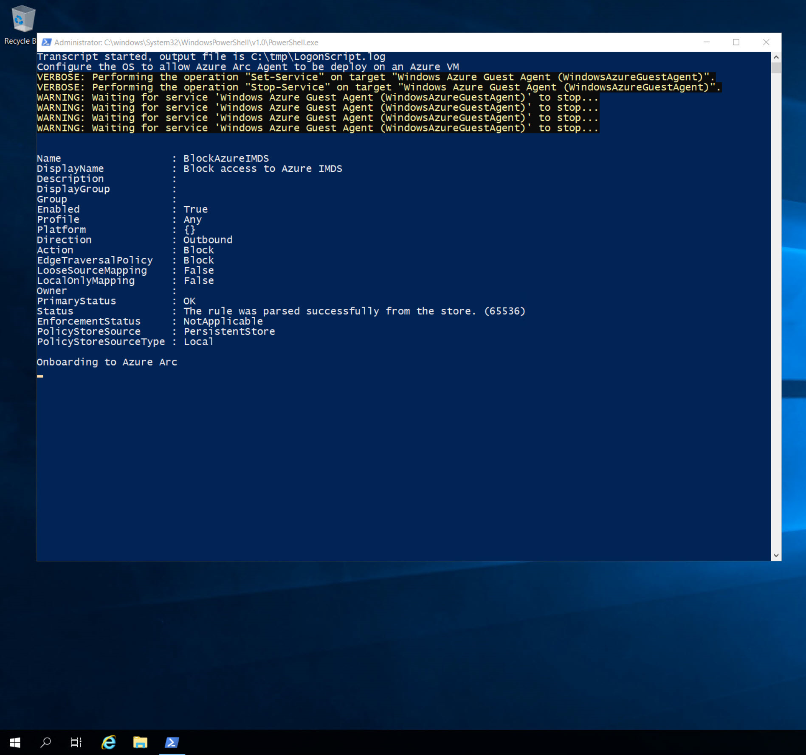
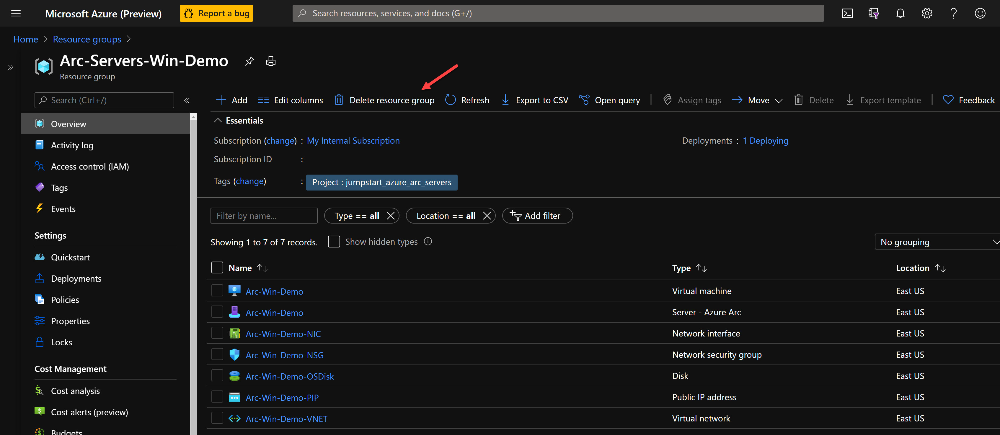

# Use an Azure Resource Manager template to deploy and connect an Azure Virtual Machine to Azure Arc

The following README will guide you on how to use an [Azure Resource Manager template (ARM template)](https://docs.microsoft.com/azure/azure-resource-manager/templates/overview) to automatically onboard an Azure Windows Virtual Machine (Azure VM) to Azure Arc. The provided ARM template is responsible of creating the Azure resources as well as executing the Azure Arc onboard script on the VM.

Azure VMs are leveraging the [Azure Instance Metadata Service (IMDS)](https://docs.microsoft.com/azure/virtual-machines/windows/instance-metadata-service) by default. By projecting an Azure VM as an Azure-Arc-enabled server, a "conflict" is created which will not allow for the Azure Arc server resources to be represented as one when the IMDS is being used and instead, the Azure Arc server will still "act" as a native Azure VM.

However, **for demo purposes only**, the below guide will allow you to use and onboard Azure VMs to Azure Arc and by doing so, you will be able to simulate a server which is deployed outside of Azure (i.e "on-premises" or in other cloud platforms)

> **Note: It is not expected for an Azure VM to be projected as an Azure-Arc-enabled server. The below scenario is unsupported and should ONLY be used for demo and testing purposes.**

## Prerequisites

* Clone the Azure Arc Jumpstart repository

    ```console
    git clone https://github.com/microsoft/azure-arc.git
    ```

* [Install or update Azure CLI to version 2.7 and above](https://docs.microsoft.com/cli/azure/install-azure-cli?view=azure-cli-latest). Use the below command to check your current installed version.

  ```console
  az --version
  ```

* In case you don't already have one, you can [Create a free Azure account](https://azure.microsoft.com/free/).

* Create Azure service principal (SP)

    In order for you to deploy the Azure resources using the ARM template, Azure service principal assigned with the "contributor" role is required. To create it, login to your Azure account run the below command (this can also be done in [Azure Cloud Shell](https://shell.azure.com/)).

    ```console
    az login
    az ad sp create-for-rbac -n "<Unique SP Name>" --role contributor
    ```

    For example:

    ```console
    az ad sp create-for-rbac -n "http://AzureArcServers" --role contributor
    ```

    Output should look like this:

    ```json
    {
    "appId": "XXXXXXXXXXXXXXXXXXXXXXXXXXXX",
    "displayName": "AzureArcServers",
    "name": "http://AzureArcServers",
    "password": "XXXXXXXXXXXXXXXXXXXXXXXXXXXX",
    "tenant": "XXXXXXXXXXXXXXXXXXXXXXXXXXXX"
    }
    ```

    > **Note: It is optional, but highly recommended, to scope the SP to a specific [Azure subscription and resource group](https://docs.microsoft.com/cli/azure/ad/sp?view=azure-cli-latest).**

## Automation Flow

For you to get familiar with the automation and deployment flow, below is an explanation.

1. User is editing the ARM template parameters file (one time edit). These parameters values are being used throughout the deployment.

2. The ARM template incl. an Azure VM custom script extension which will deploy the the [*install-arc-agent.ps1*](https://github.com/microsoft/azure-arc/blob/main/azure-arc-servers-jumpstart/azure/windows/arm-template/scripts/install-arc-agent.ps1) PowerShell script.

3. In order to allow the Azure VM to successfully be projected as an Azure-Arc-enabled server, the script will:

    1. Set local OS environment variables.

    2. Generate a local OS logon script named *LogonScript.ps1*. This script will:

        * Create the *LogonScript.log* file.

        * Stop and disable the "Windows Azure Guest Agent" service.

        * Create a new Windows Firewall rule to block Azure IMDS outbound traffic to the *169.254.169.254* remote address.

        * Unregister the logon script Windows schedule task so it will not run after first login.

    3. Disable and prevent Windows Server Manager from running on startup.

4. User RDP to Windows VM which will start the *LogonScript* script execution and will onboard the VM to Azure Arc.

## Deployment

As mentioned, this deployment will leverage ARM templates. You will deploy a single template, responsible for creating all the Azure resources in a single resource group as well onboarding the created VM to Azure Arc.

* Before deploying the ARM template, login to Azure using Azure CLI with the ```az login``` command.

* The deployment is using the ARM template parameters file. Before initiating the deployment, edit the [*azuredeploy.parameters.json*](https://github.com/microsoft/azure-arc/blob/main/azure-arc-servers-jumpstart/azure/windows/arm-template/azuredeploy.parameters.json) file located in your local cloned repository folder. An example parameters file is located [here](https://github.com/microsoft/azure-arc/blob/main/azure-arc-servers-jumpstart/azure/windows/arm-template/azuredeploy.parameters.example.json).

* To deploy the ARM template, navigate to the local cloned [deployment folder](https://github.com/microsoft/azure-arc/tree/main/azure-arc-servers-jumpstart/azure/windows/arm-template) and run the below command:

    ```console
    az group create --name <Name of the Azure resource group> --location <Azure Region> --tags "Project=jumpstart-azure-arc-servers"
    az deployment group create \
    --resource-group <Name of the Azure resource group> \
    --name <The name of this deployment> \
    --template-uri https://raw.githubusercontent.com/microsoft/azure-arc/main/azure-arc-servers-jumpstart/azure/windows/arm-template/azuredeploy.json \
    --parameters <The *azuredeploy.parameters.json* parameters file location>
    ```

    > **Note: Make sure that you are using the same Azure resource group name as the one you've just used in the *azuredeploy.parameters.json* file**

    For example:

    ```console
    az group create --name Arc-Servers-Win-Demo --location "East US" --tags "Project=jumpstart-azure-arc-servers"
    az deployment group create \
    --resource-group Arc-Servers-Win-Demo \
    --name arcwinsrvdemo \
    --template-uri https://raw.githubusercontent.com/microsoft/azure-arc/main/azure-arc-servers-jumpstart/azure/windows/arm-template/azuredeploy.json \
    --parameters azuredeploy.parameters.json
    ```

* Once Azure resources has been provisioned, you will be able to see it in Azure portal.

    

    

## Windows Login & Post Deployment

* Now that the Windows Server VM is created, it is time to login to it. Using its public IP, RDP to the VM.

    

* At first login, as mentioned in the "Automation Flow" section, a logon script will get executed. This script was created as part of the automated deployment process.

* Let the script to run its course and **do not close** the Powershell session, this will be done for you once completed.

    > **Note: The script run time is ~1-2min long.**

    

    

    

    

* Upon successful run, a new Azure-Arc-enabled server will be added to the resource group.


## Cleanup

To delete the entire deployment, simply delete the resource group from the Azure portal.


