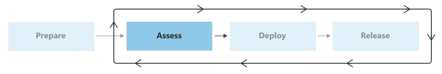

# Migration assessment checklist

Many of your existing workloads are ideal candidates for cloud migration. But not every asset is compatible with cloud platforms and not all workloads can benefit from hosting in the cloud. You can use [digital estate planning](/azure/cloud-adoption-framework/digital-estate/) to generate an overall migration backlog of potential workloads to migrate. However, this planning effort is high level. It relies on assumptions that the cloud strategy team makes and doesn't dig deeply into technical considerations.

Therefore, before you migrate a workload to the cloud, it's critical to assess the individual assets that are associated with that workload to determine whether they're suitable for migration.

In the assess phase, you evaluate the readiness of your workload and plan for the migrated state. After you complete this phase, you can deploy the workload for migration.

Your cloud adoption team should evaluate technical compatibility, the required architecture, performance and sizing expectations, and dependencies. Use this information to ensure that you can deploy the migrated workload to the cloud effectively.

If you don't complete these steps, migration activities during deployment might fail. You might deploy your workload in an insecure and unmanaged fashion, or your workload might not operate as intended due to missing services. You could also accrue unplanned costs. Therefore, it's vital to complete these activities before you begin to deploy resources to Azure.

## Checklist

The following table provides an overview of the activities in the assess phase and the roles that are responsible for each activity.

|Activity|Description|Responsible roles|
|---|---|---|
|[Classify workloads](./classify.md)|Instructions for classifying data sensitivity and mission criticality, and for identifying your organization's specific classifications|<li>Migration Architect <li>Cloud Operations Manager|
|[Evaluate workload readiness](./evaluate.md)|Instructions for assessment, common blockers, and common evaluation activities|<li>Migration Architect|
|[Architect workloads](./architect.md)|Guidance for designing the architecture of the migrated workloads, supporting services, and building and refining initial cloud estimates|<li>Migration Architect <li>Workload Architect <li>Landing Zone Architect <li>Cloud Operations Manager|

## Next step

> [!div class="nextstepaction"]
> [Classify workloads](./classify.md)
