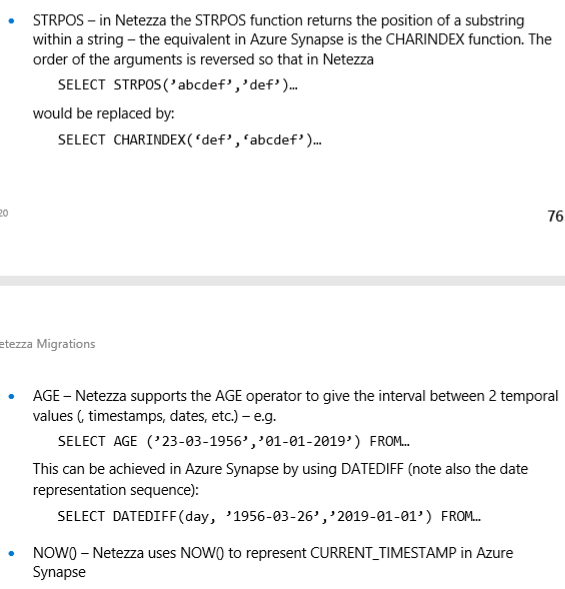

<!-- cSpell:ignore Netezza Informatica Talend InMon zonemap CBTs Attunity Wherescape nzlua CBT NZPLSQL DELIM TABLENAME ORC Parquet nzsql nzunload mpp -->

# Analytics solutions for Netezza

Given the end of support from IBM, many existing users of Netezza data warehouse systems are now looking to take advantage of the innovations provided by newer environments (such as cloud, IaaS, or PaaS) and to delegate tasks such as infrastructure maintenance and platform development to the cloud provider.

While there are similarities between Netezza and Azure Synapse Analytics in that both are SQL databases designed to use massively parallel processing (MPP) techniques to achieve high query performance on very large data volumes, there are also some basic differences in approach:

- Legacy Netezza systems are installed on-premises, using proprietary hardware whereas Azure Synapse Analytics is cloud-based using Azure Storage and compute resources.
- Upgrading a Netezza configuration is a major task that involves additional physical hardware and a potentially lengthy database reconfiguration or dump and reload. Because storage and compute resources are separate in the Azure environment, these resources can easily be scaled up or down independently by using the elastic scalability capability of Azure.
- Azure Synapse Analytics can be paused or resized as required to reduce resource utilization and therefore cost. Microsoft Azure is a globally available, highly secure, scalable cloud environment that includes Azure Synapse within an ecosystem of supporting tools and capabilities.

Below looks at schema migration with a view to obtain equivalent or better performance of your migrated Netezza data warehouse and data marts on Azure Synapse. The topics included in this paper apply specifically to migrations from an existing Netezza environment.

## Migration scope

### Prepare to migrate

When you migrate from a Netezza environment, you must consider some specific topics, in addition to the more general subjects described in the Netezza documentation about design and performance.

#### Choose the workload for the initial migration

Legacy Netezza environments typically evolve over time to encompass multiple subject areas and mixed workloads. When you decide where to start on an initial migration project, it makes sense to choose an area that:

- Proves the viability of migrating to Azure Synapse by quickly delivering the benefits of the new environment.
- Allows in-house technical staff to gain experience with new processes and tools so that they can use them to migrate other areas.
- Creates a template based on the current tools and processes to use in additional migration from the source Netezza environment.

A good candidate for an initial migration from a Netezza environment that would support these objectives typically is one that implements a Power BI/analytics workload rather than an OLTP workload. The workload should have a data model that can be migrated with minimal modifications, normally a star or snowflake schema.

For size, it's important that the data volume you migrate in the initial exercise is large enough to demonstrate the capabilities and benefits of the Azure Synapse environment while keeping the time to demonstrate value short. The size that typically meets the requirements is in the range of 1 TB to 10 TB.

An approach for the initial migration project that minimizes risk and implementation time is to confine the scope of the migration to data marts. This approach is a good starting point because it clearly limits the scope of the migration and typically can be achieved on a short timescale. An initial migration of data marts only doesn't address broader topics like how to migrate ETL and historical data. These topics must be addressed in later phases as the migrated data mart layer is backfilled with the data and processes that are required to build them.

#### Lift-and-shift approach vs. phased approach

Regardless of the drivers and scope that you choose for your migration, there are generally two types of migration:

- **Lift-and-shift approach**: In this case, the existing data model, like a star schema, is migrated unchanged to the new Azure Synapse platform. In this scenario, the emphasis is on minimizing risk and the time taken to migrate by reducing the work that has to be done to achieve the benefits of moving to the Azure cloud environment.

  This approach is a good fit for existing Netezza environments in which a single data mart is to be migrated, if the data is already in a well-designed star or snowflake schema, or if you have time and cost pressures to move to a more modern cloud environment.

- **Phased approach that incorporates modifications**: When a legacy warehouse has evolved over time, you might need to reengineer the data warehouse to maintain the required performance or support new data sources like IoT streams. Migrating to Azure Synapse for the well-known benefits of a scalable cloud environment might be considered part of the re-engineering process. This process might include changing the underlying data model, such as moving from an Inmon model to Azure Data Vault.

  The recommended approach is to initially move the existing data model as-is to Azure. Then, take advantage of the performance and flexibility of Azure services to apply the re-engineering changes without affecting the existing source system.

#### Implement a metadata-driven migration by using Azure Data Factory 

It makes sense to automate and orchestrate the migration process by using the capabilities of the Azure environment. This approach also minimizes the effect on the existing Netezza environment, which might already be running close to full capacity.

Azure Data Factory is a cloud-based data integration service. You can use Data Factory to create data-driven workflows in the cloud for orchestrating and automating data movement and data transformation. Data Factory pipelines can ingest data from disparate datastores, and then process and transform the data by using compute services like Azure HDInsight Hadoop, Spark, Azure Data Lake Analytics, and Azure Machine Learning. You start by creating metadata to list the data tables you want to migrate, and their locations, and then use Data Factory capabilities to manage the migration process.

## Design considerations

### Design differences between Netezza and Azure Synapse

As you plan your migration from a legacy Netezza environment to Azure Synapse, it's important to consider the design differences between the two platforms.

#### Multiple databases vs. single database and schemas

In a Netezza environment, you might have multiple, separate databases for parts of the overall environment. For instance, you might have a separate database for data ingestion and staging tables, a database for the core warehouse tables, and another database for data marts (sometimes called a *semantic layer*). Processing separate databases as ETL/ELT pipelines might implement cross-database joins and move data between these separate databases.

The Azure Synapse environment has a single database, and schemas are used to separate the tables into logically separate groups. We recommend that you use a series of schemas in the target Azure Synapse to mimic any separate databases that you migrate from the Netezza environment. If schemas are used in the Netezza environment, you might need to use a new naming convention to move the existing Netezza tables and views to the new environment. An example is concatenating the existing Netezza schema and table names into the new Azure Synapse table name and using schema names in the new environment to maintain the original separate database names. Another option is to use SQL views over the underlying tables to maintain the logical structures, but there are some potential downsides to this approach:

- Views in Azure Synapse are read-only, so any updates to the data must take place on the underlying base tables.
- If layers of views already exist, adding another layer of views might affect performance.

#### Table considerations

When you migrate tables between different technologies, you physically move only raw data and the metadata that describes it between the two environments. Other database elements from the source system like indexes aren't migrated because they might not be needed or they might be implemented differently in the new target environment.

However, understanding where performance optimizations like indexes have been used in the source environment can give you a helpful indication of where performance optimization might be added in the new target environment. For example, if zone maps are frequently used by queries in the source Netezza environment, you might conclude that a non-clustered index should be created in the migrated Azure Synapse, or that other native performance optimization techniques like table replication might be more applicable than straight like-for-like index creation.

<!-- docsTest:ignore "NZ Toolkit" -->

#### Unsupported Netezza database object types

Netezza implements some database objects that aren't directly supported in Azure Synapse. But, generally, there are methods you can use to achieve the same functionality within the new environment.

- **Zone maps**: In Netezza, zone maps are automatically created and maintained for some column types. Zone maps are used at query time on the following column types to restrict the amount of data to be scanned:

  - `INTEGER` columns of length 8 bytes or less
  - Temporal columns, including `DATE`, `TIME`, and `TIMESTAMP`
  - `CHAR` columns, if these are part of a materialized view and mentioned in the `ORDER BY` clause
  
  You can find out which columns have zone maps by using the nz_zonemap utility, which is part of the NZ Toolkit.

  Azure Synapse doesn't use zone maps, but you can achieve similar results can be achieved by using user-defined index types or partitioning.

- **Clustered base tables (CBT)**: In Netezza, CBTs are most commonly used for the fact table, which has billions of records. Scanning such a huge table requires a long processing time because a full table scan might be needed to get relevant records. By organizing records in restrictive CBTs, Netezza can group records in the same or nearby extents. The process also creates zone maps that improve performance by reducing the amount of data to be scanned.

  In Azure Synapse, you can achieve a similar result through partitioning or by using other indexes.

- **Materialized views**: Netezza supports materialized views. Netezza recommends that users create one or more materialized view over large tables that have many columns, and in which only a few of the columns are regularly used in queries. Materialized views are automatically maintained by the system when data in the base table is updates. In May 2019, Microsoft announced that Azure Synapse will support materialized views with the same functionality as Netezza. This feature is now available in preview.

- **Netezza data type mapping**: Most Netezza data types have a direct equivalent in Azure Synapse. The following table shows the data types and the recommended approaches for mapping the data types.

  Some third-party vendors offer tools and services to automate migration tasks, including data type mapping. Also, if a third-party ETL tool like Informatica or Talend is already used in the Netezza environment, you can use them to implement any required data transformations.

- **SQL DML syntax**: You should be aware of a few differences in SQL Data Manipulation Language (DML) syntax between Netezza SQL and Azure Synapse:

  <!-- TODO: This query should probably be a code snippet that the user can copy and use. -->

  

### Functions, stored procedures, and sequences

When you migrate a data warehouse from a mature legacy like Netezza, often, elements other than simple tables and views need to be migrated to the new target environment. Examples in Netezza are functions, stored procedures, and sequences. During the preparation phase of the migration, you should create an inventory of objects to migrate. In the project plan, you should define the method of handling the objects and allocate the appropriate resources.

You might find facilities in the Azure environment that replace the functionality implemented as functions or stored procedures in the Netezza environment. In this case, it's typically more efficient to use the built-in Azure facilities rather than recoding the Netezza functions.

Third-party vendors offer tools and services that can automate the migration of functions, stored procedures, and sequences from Netezza. Some examples include Attunity and Wherescape migration products.

Here's some additional information about migrating each of these elements:

- **Functions**: Like most database products, Netezza supports system functions and user-defined functions within the SQL implementation. When common system functions are migrated to another database platform like Azure Synapse, they generally are available in the new environment and can be migrated without change. If system functions have slightly different syntax between the two environments, the required changes usually can be automated.

  You might need to recode system functions that have no equivalent in the new environment and arbitrary user-defined functions by using the languages that are available in the target environment. Netezza user-defined functions are coded by using nzlua or C++. Azure Synapse uses the popular Transact-SQL language to implement user-defined functions.

- **Stored procedures**: Most modern database products allow procedures to be stored in the database. A stored procedure typically contains SQL statements and some procedural logic, and it might return data or a status.

  Netezza provides the NZPLSQL language for stored procedures. NZPLSQL is based on PostgreSQL PL/pgSQL. Azure Synapse supports stored procedures by using T-SQL. If you migrate stored procedures to Azure Synapse, you must recode them by using T-SQL.

- **Sequences**: In Netezza, a sequence is a named database object that's created via `CREATE SEQUENCE`. The objects can provide the unique value via the **next()** method. The values can be used to generate unique numbers as surrogate key values for primary key values.

  Azure Synapse doesn't support `CREATE SEQUENCE`. In Azure Synapse, sequences are handled by using identity columns or SQL code to create the next sequence number in a series.

### Extract metadata and data from a Netezza environment

Consider the following information when you plan how to extract metadata and data from the Netezza environment:

- **DDL generation**: It's possible to edit existing Netezza `CREATE TABLE` and `CREATE VIEW` scripts to create the equivalent definitions, with modified data types if necessary, as described earlier. This task usually involves removing or modifying any Netezza-specific clauses, like `ORGANIZE ON`.

  In Netezza, the information that specifies the current table and view definitions is maintained in system catalog tables. The system catalog tables are the best source of the information because the tables likely are up-to-date and complete. User-maintained documentation might not be in sync with current table definitions. 
  
  You can access system catalog tables in Netezza by using utilities like nz_ddl_table. You can use the tables to generate `CREATE TABLE` DDL statements, which can then be edited for the equivalent tables in Azure Synapse. Third-party migration and ETL tools also use the catalog information to achieve the same result.

- **Data extraction**: You can extract the raw data to be migrated from existing Netezza tables into flat delimited files by using standard Netezza utilities such as nzsql and nzunload, and by using external tables. You can compress the files by using gzip, and then upload them to Azure Blob storage by using AzCopy or by using an Azure data transport service like Azure Data Box.

  During a migration exercise, it's important to extract data as efficiently as possible. The recommended approach for Netezza is to use the external tables approach, which is also the fastest method. Multiple extracts can be performed in parallel to maximize the throughput for data extraction. 
  
  Here's a simple example of an external table extract:

  `CREATE EXTERNAL TABLE '/tmp/export_tab1.CSV' USING (DELIM ',') AS SELECT * from <TABLENAME>;`

If you have sufficient network bandwidth, you can extract data directly from an on-premises Netezza system into Azure Synapse tables or into Azure data storage by using Azure Data Factory processes or third-party data migration or ETL products.

Recommended data formats for the extracted data are delimited text files (also called comma-separated values or similar), optimized row columnar (ORC) files, or Parquet files.

For more detailed information about the process of migrating data and ETL from a Netezza environment, see the Netezza documentation about data migration ETL and load.

### Performance recommendations

- **Similarities in performance-tuning concepts**: When you move to Azure Synapse from a Netezza environment, many of the performance-tuning concepts you use will be familiar.

   For example, these concepts are the same for both environments:

   - You use data distribution to colocate data to be joined onto the same processing node.
   - Using the smallest data type for a specific column saves storage space and accelerates query processing.
   - Ensuring that data types of columns to be joined are identical optimizes join processing by reducing the need to transform data for matching.
   - Ensuring statistics are up to date helps the optimizer produce the best execution plan.

- **Differences in performance-tuning concepts**: This section highlights lower-level implementation differences between Netezza and Azure Synapse for performance-tuning.

   - **Data distribution options**: In both Netezza and Azure Synapse, you can use a `CREATE TABLE` statement to specify a distribution definition. Use `DISTRIBUTE ON` for Netezza and `DISTRIBUTION =` for Azure Synapse.

      Compared to Netezza, Azure Synapse provides another way to achieve local joins for small table/large table joins (usually dimension table/fact table in a start schema model). The approach in Azure Synapse is to replicate the smaller dimension table across all nodes, therefore ensuring that any value of the join key for the larger table will have a matching dimension row that's locally available. The overhead of replicating the dimension tables is relatively low if the tables are not large. In this case, using the hash distribution approach as described earlier is preferable.

   - **Data indexing**: Azure Synapse provides various user-definable indexing options, but the options are different in operation and usage than the system-managed zone maps in Netezza. To learn about the different indexing options, see [Index tables in a Synapse SQL pool](sql-data-warehouse-tables-index).

     Existing system-managed zone maps in the source Netezza environment can provide a useful indication of how the data is currently used and provide an indication of candidate columns for indexing in the Azure Synapse environment.

   - **Data partitioning**: In an enterprise data warehouse, fact tables might contain many billions of rows of data. Partitioning is a way to optimize maintenance and querying in these tables. Splitting the tables into separate parts reduces the amount of data processed at one time. The partitioning specification for a table is defined in the `CREATE TABLE` statement.

     Only one field per table can be used for partitioning. The field that's used for partitioning frequently is a date field because many queries are filtered by date or by a date range. You can change the partitioning of a table after initial load. To change the partitioning of a table, re-create the table with a new distribution that uses the `CREATE TABLE AS SELECT` statement. For a detailed discussion of partitioning in Azure Synapse, see [Partition tables in a Synapse SQL pool](sql-data-warehouse-tables-partition.md).

   - **PolyBase for data loading**: PolyBase is the most efficient method to load large amounts of data into the warehouse. You can use PolyBase to load data in parallel streams.

   - **Use resource classes for workload management**: Azure Synapse uses resource classes to manage workloads. In general, large resource classes provide better individual query performance. Smaller resource classes give you higher levels of concurrency. You can use dynamic management views to monitor utilization to help ensure that the appropriate resources are used efficiently.

## Next steps

For more information about implementing a Netezza migration, talk with your Microsoft account representative about on-premises migration offers.
