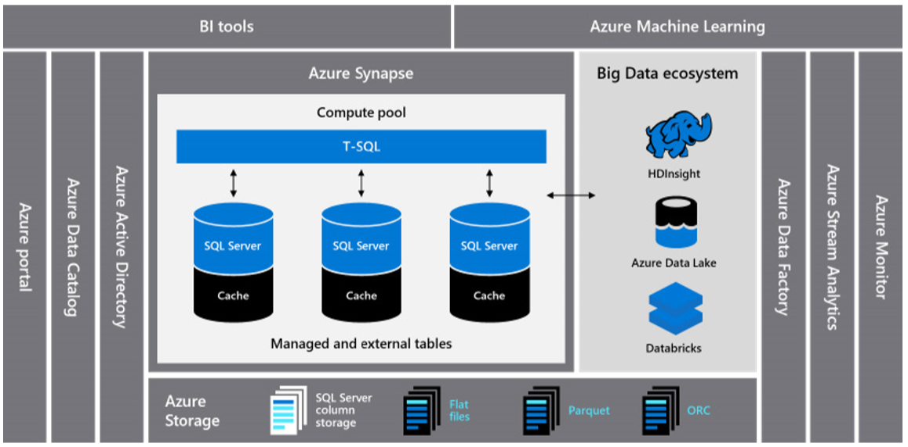

<!-- cSpell:ignore Giga -->

# Azure Synapse Analytics solutions

Current market offerings fall short in meeting an organization's growing needs. Legacy on-premises environments, including Teradata, Netezza, and Oracle Exadata, are expensive, slow to innovate, and inelastic. Organizations that use on-premises systems are now considering taking advantage of innovative cloud, infrastructure as a service, and platform as a service offerings in newer environments like Azure.

Many organizations are ready to take the step of shifting expensive tasks like infrastructure maintenance and platform development to a cloud provider. In Microsoft Azure, an organization has access to a globally available, highly secure, scalable cloud environment that includes Azure Synapse Analytics in an ecosystem of supporting tools and capabilities.

Azure Synapse Analytics provides best-of-class relational database performance through techniques like massively parallel processing and automatic in-memory caching. The results of this approach can be seen in independent benchmarks like the one run recently by [GigaOm](https://gigaom.com), which compares Azure Synapse to other popular cloud data warehouse offerings.

Organizations that have already migrated to Azure Synapse Analytics have seen many benefits, including:

- Improved performance and price for performance.
- Increased agility and shorter time to value.
- Faster server deployment and application development.
- Elastic scalability to ensure that you pay only for what you use.
- Improved security and compliance.
- Reduced storage and disaster recovery costs.
- Lower overall TCO and better cost control (operating expenses).

To maximize these benefits, it's necessary to migrate existing data and applications to the Azure Synapse platform. In many organizations, this approach includes migrating an existing data warehouse from a legacy on-premises platform like Teradata, Netezza, or Exadata. Organizations need to modernize their data estate with an analytics offering that is price-performant, rapidly innovative, scalable, and truly elastic. Learn more in the following sections for migration best practices on Teradata, Netezza, and Exadata.

## Next steps

- [Azure Synapse Analytics solutions for Teradata](./analytics-solutions-teradata.md)
- [Azure Synapse Analytics solutions for Netezza](./analytics-solutions-netezza.md)
- [Azure Synapse Analytics solutions for Exadata](./analytics-solutions-exadata.md)
