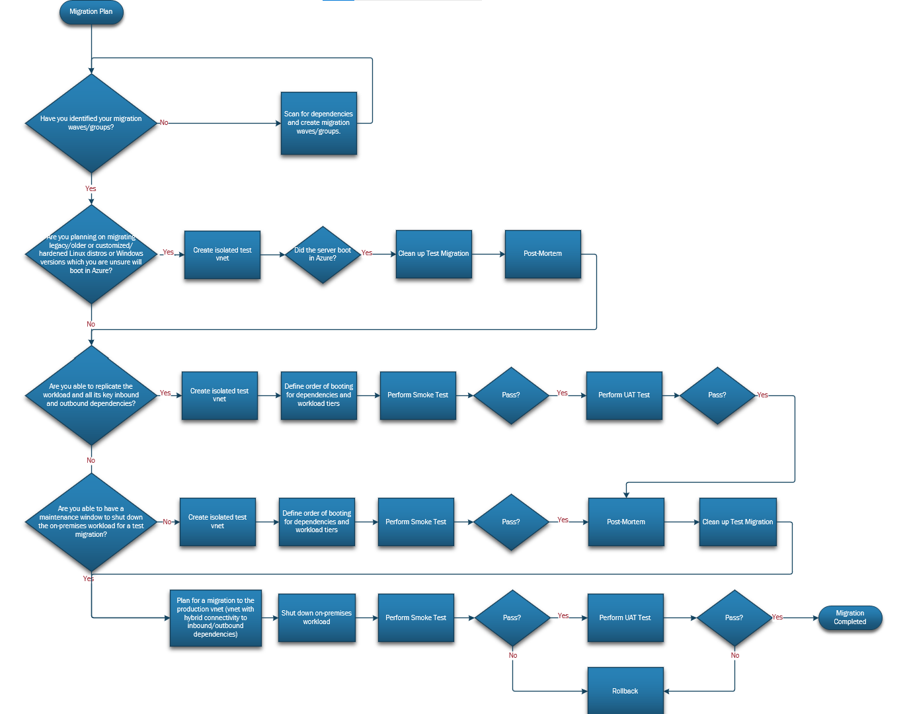

# Discover and assess your migratable estate with Azure Migrate

Migration of workloads to Azure can be a challenging project and good preparation for migration has big impact on success and complexity of migration.

This article shows how the fictional company Contoso uses Azure Migrate to plan for migration. Contoso performs discovery and assessment of existing environment that is targeted for migration to Azure.

When you use this example to help plan your own infrastructure migration efforts, keep in mind that the provided sample plan and deployment is specific to Contoso. Review your organization's business needs, structure, and technical requirements when making important infrastructure migration decisions.

Whether you need all the elements described in this article depends on your migration strategy and needs. For example, you might find it's better to discover workload dependencies using existing network monitoring tools or get recommended VM sizes using existing performance monitoring tools.

## Overview

In order for Contoso to plan migration to Azure, it's critical to plan for the migration toolset and activities. Deploying and running discovery enables Contoso to gather critical information on environment targeted for migration to Azure.

Gathered information will enable Contoso to:

- Identify server readiness for migration to Azure.
- Perform assessment to get recommended sizing for Azure VMs
- Get cost estimation for Azure VMs and their storage requirements
- Analyze server dependencies to better plan migration waves
- Assess migration options for existing SQL servers
- Assess application compatibility with Azure
- Assess application migration options to Azure App Services

For successful migration planning Contoso needs to think about following areas:
> [!div class="checklist"]
>
> - **Step 1: Set up tooling for discovery.** How many discovery appliances will you need? What are the best practices to run discovery of your environments? Do I need dependency and application discovery?
> - **Step 2: Perform Assessment.** How do I select parameters for assessment? How do I analyze dependencies?
> - **Step 3: Plan for migration waves.** Are my servers ready for migration to Azure? How do I group servers into migration waves?

## Before you start

Before diving deep in infrastructure migration discovery and assessment, consider reading some background information relevant to Azure Migrate discovery and assessment:

- Review Azure Migrate [Discovery and assessment tool overview](https://docs.microsoft.com/en-us/azure/migrate/migrate-services-overview#azure-migrate-discovery-and-assessment-tool).
- Review the deployment scenarios and requirements for lightweight Azure Migrate appliance that performs discovery [Azure Migrate appliance](https://docs.microsoft.com/en-us/azure/migrate/migrate-appliance#deployment-scenarios).
- Optionally, walkthrough MS Learn's [Migrate virtual machines and apps using Azure Migrate](https://docs.microsoft.com/en-us/learn/paths/m365-azure-migrate-virtual-machine/) Training.

## Step 1: Set up tooling for discovery

Contoso needs to figure out considerations on the number of appliances needed for discovery.

### Discovery Tooling Planning and Implementation

To start gathering data required for assessment, Contoso needs to prepare to deploy the appliances and/or agents needed for discovery of their on-premises server infrastructure.

Using the below workflow, Contoso is able to define the server discovery tools required to gather information on-premises servers and their dependencies.

*Figure 1: Discovery Appliances and Agents Workflow.*

Further details can be found in the reference links below from the Azure Migrate documentation:

- [Reference Link A](https://docs.microsoft.com/en-us/azure/migrate/tutorial-discover-vmware#set-up-the-appliance)
- [Reference Link B](https://docs.microsoft.com/en-us/azure/migrate/tutorial-discover-hyper-v#set-up-the-appliance)
- Reference Link C:
  - [Physical/Other hypervisors](https://docs.microsoft.com/en-us/azure/migrate/tutorial-discover-physical#set-up-the-appliance)
  - [AWS](https://docs.microsoft.com/en-us/azure/migrate/tutorial-discover-aws#set-up-the-appliance)
  - [GCP](https://docs.microsoft.com/en-us/azure/migrate/tutorial-discover-gcp#set-up-the-appliance)
- [Reference Link D](https://docs.microsoft.com/en-us/azure/migrate/how-to-create-group-machine-dependencies-agentless)
- [Reference Link E](https://docs.microsoft.com/en-us/azure/migrate/tutorial-discover-vmware#provide-server-credentials)
- [Reference Link F](https://docs.microsoft.com/en-us/azure/migrate/how-to-create-group-machine-dependencies)

Based on workflow above and following relevant Azure Migrate documentation, Contoso deploys required appliances and agents for discovery. During deployment Contoso will need to specify server credentials used to perform software inventory, agentless dependency analysis and discovery of SQL Server instances and databases if this data needs to be collected during discovery. Collaborate with server administration and SQL server administration teams to prepare required credentials for discovery. After deployment and configuration, Contoso regularly validates that data is being collected in Azure Migrate project.

As best practice Contoso gathers data over longer period of time, for example 5 weeks. This is to gather server performance data and dependencies over period which might have specific peaks only once per month.

## Step 2: Perform Assessment

After discovery is running for at least a day, Contoso can start performing assessments in Azure Migrate project through Azure Portal. Contoso can choose to run Azure VM assessment or Azure SQL assessment. Firstly, Contoso chooses Azure VM assessment and decides to execute Azure SQL assessment later. As discovery source, Contoso chooses Servers discovered from Azure Migrate Appliance.

> [!NOTE]
> In case Contoso would not be able to deploy Azure Migrate discovery appliance to collect data, they could provide CSV file with required data to Azure Migrate. [**Learn more**](https://docs.microsoft.com/en-us/azure/migrate/concepts-assessment-calculation#how-do-i-assess-with-imported-data) on how to import discovery data using CSV file.

Given the success in replication toolset deployment and planning for a subset of their migration waves, Contoso decides to start planning their testing needs and pre/post migration activities.

Contoso understands the migrations are an orchestration of both business and technical groups. Therefore, the below activities are defined as pre and post migration activities.

#### Business

In order to prepare the business and its stakeholders for the migration activities, Contoso defines the below items:

- A maintenance window for each of the applications to migrate.
- Communications on application downtime and impact to business.
- Points of Contacts (POCs) which can provide support for the below key areas during migration testing and cutover:
    - Network Administrators
    - Backup Administrators
    - Server Administrators
    - Identity Administrators
    - Application Owners (Frontend and Backend)
    - Microsoft Support
    - Partner (if available)
- Soak Period after the cutover. During the Soak Period after application cutover to Azure, if any issues arise the rollback plan must be executed. After the Soak Period has expired, rollback of the application cannot be committed.

#### Technical: Pre-Migration

In order to plan for best practice pre-migration activities, Contoso defines the below activities to be executed prior to a migration failover:

- A Rollback Plan.
- Latest backup of the servers.
- Opening of firewalls prefixes, ports and protocols for necessary traffic between on-premises to Azure and within Azure vnets and subnets.
- Attain local administrator credentials or keys for server login purposes.
- [Manual changes needed for Windows and Linux](https://docs.microsoft.com/en-us/azure/migrate/prepare-for-migration#verify-required-changes-before-migrating)
    - For more legacy Linux distributions, instructions to install Hyper-V drivers can be found within the [Hyper-V documentation](https://docs.microsoft.com/en-us/windows-server/virtualization/hyper-v/supported-linux-and-freebsd-virtual-machines-for-hyper-v-on-windows).
    - For legacy Windows versions (E.G. WS2003 or WS2008), instructions to install Hyper-V drivers can be found in the [Azure Migrate documentation](https://docs.microsoft.com/en-us/azure/migrate/prepare-windows-server-2003-migration).
- Prepare isolated virtual networks for test migrations.
    - Plan for secure management access (e.g. RDP, SSH) into this environment leveraging services like [Azure Bastion](https://docs.microsoft.com/en-us/azure/bastion/bastion-overview).
    - Plan for an isolated virtual network in each subscription containing migrated VMs. The Test Migration functionality in Azure Migrate must use a virtual network in the same subscription where the migrated VM will exist.

#### Technical: Post-Migration
 Further, Contoso defines the below activities to be executed after the migration failover:

- Review Azure Migrate's documented post-migration activities based on the source environments below:
    - [VMware Agentless](https://docs.microsoft.com/en-us/azure/migrate/tutorial-migrate-vmware#complete-the-migration)
    - [VMware Agent-based](https://docs.microsoft.com/en-us/azure/migrate/tutorial-migrate-vmware-agent#complete-the-migration)
    - [Hyper-V](https://docs.microsoft.com/en-us/azure/migrate/tutorial-migrate-hyper-v#complete-the-migration)
    - [Physical](https://docs.microsoft.com/en-us/azure/migrate/tutorial-migrate-physical-virtual-machines#complete-the-migration), [AWS](https://docs.microsoft.com/en-us/azure/migrate/tutorial-migrate-aws-virtual-machines#complete-the-migration), [GCP](https://docs.microsoft.com/en-us/azure/migrate/tutorial-migrate-gcp-virtual-machines#complete-the-migration)

- In addition, Contoso adds the below activities as best practice post-migration activities:

    - Validate login with local credentials/keys for RDP or SSH.
    - Validate DNS resolves and DNS servers are configured in network settings (E.G. TCP/IP settings) for the OS.
    - Validate IP address has been assigned to server in network settings via DHCP (E.G. TCP/IP settings) for the OS.
    - Validate access to OS licensing is activated and there is access to cloud-based licensing endpoints (E.G. Azure KMS endpoints).
    - Validate login with domain credentials.
    - Validate application has access to dependencies (E.G. accessing target URLs or connection strings).
    - Validate Install or Update necessary Azure agents:
        - Windows and/or WALinux VM agent.
        - Windows and/or Linux Log Analytics agent/extension.
        - Windows and/or Linux Dependency Map agent/extension.
        - Windows SQL Server IaaS Extension.
    - Validate VM monitoring via new or existing service.
    - Validate VM patching via new or existing service.
    - Validate VM backup via new or existing service.
    - Validate VM antivirus/endpoint protection via new or existing service.
    - Tag Azure resources.
    - Update any existing CMDB
    - Postmortem and Learnings.

#### Test Migration and Migration

Moving forward Contoso now looks to understand the need for a test migration, what test cases make sense, and which vnets to leverage as targets for the test migration and migration.

##### Define Smoke Test

As a first step, Contoso realizes there's a need to perform a smoke test to validate that servers identified to migrate will boot in Azure. It is recommended to perform this smoke test in an isolated vnet for all servers to be migrated. Contoso will follow this recommendation and is especially focused on the smoke test for servers which are legacy, highly customized or contain hardened operating systems. Additionally, Contoso is also keen to run a smoke test for servers which have been marked as "Conditionally Ready" by their Azure Migrate assessments.

Contoso defines a smoke test to be successful when basic server functionality and properties are validated. For example, Smoke testing may include:

- The server boots in Azure.
- The administrator is able to login to the server using local credentials.
- TCP/IP settings for DNS, IPv4 and default gateways assignment are updated to the values provided by the Azure vnet via DHCP.
- OS licensing is activated.

Typically this test is led by the server administrators or the migration partner.

##### Define User Acceptance Testing

As second step, Contoso now looks to perform UAT (User Acceptance Testing) to ensure that the applications are functional and accessible by expected users. Contoso is aware that UAT will help surface missed configuration changes necessary for a successful migration which may include hardcoded IP addresses.

Contoso defines UAT to be successful when application functionality and access to dependencies is validated. For example, UAT may include:

- Validate login with domain credentials.
- Validate application has access to dependencies (E.G. accessing target URLs or connection strings).
- Validate application functionality with test users.

Typically, this is usually led by application owners.

#### Identify Testing and Migration Workflow

Now that test cases have been defined, Contoso developes the below workflow to encompass the various scenarios they may encounter based on each applications and servers needs.

The majority of Contoso's scenarios require the second and fifth paths in the workflow below. Contoso has quite the amount of legacy servers and servers marked as "Ready with Conditions" which they are unsure will boot in Azure. Therefore, they will test each of those servers in an isolated vnet to ensure each pass the Smoke Test. For this, Contoso will perform a test migration in Azure Migrate which allows for the option for automated clean up of created resources such as VMs and NICs.

Further, Contoso's environment is tightly coupled which means there's a large amount of servers which are interdependent with one another, thus resulting in large migration waves. Contoso has decided to split their large migration waves and migrate servers together which have the most strict latency requirements. As a result, some application dependencies must remain on-premises for a given migration wave. Contoso finds it's best they migrate directly into the production vnet given that the production vnet already has connectivity back to their on-premises dependencies. In this path, Contoso will perform necessary smoke tests in an isolated vnet and perform UAT in the production vnet. If all is successful, Contoso will conclude the migration as a final cutover for the servers.

Nonetheless, Contoso does find value in considering the remainder paths only for scenarios where they find possible migrating all dependencies to an isolated vnet in order to perform UAT or where UAT is not enforced.

*Figure 2: Testing and Migration Workflow.*

## Step 3: Cutover and Post-Go-Live

As a final step, Contoso is now ready and confident to perform the production migrations. The envision that during Cutover all hands on deck will be required to ensure end-to-end support. Furthermore, after the soak period concludes, Contoso is looking forward to close-out and call for a successful migration to Azure.

### Cutover

With the migration activities and workflow defined, Contoso irons out the final plans for cutover by:

- Identifying more specific cutover window, which they have planned for a Friday evening or weekend. Each cutover window will last at a minimum for 4 hours.
- Announce to the business and those impacted by the migration of the maintenance window. The maintenance window should include a meeting invite that includes the migration plan and a conference bridge to discuss any open items during the migration.
- Reached out to the Network Admins, Backup Admins, Server Admins, Identity Admins, App Owners,   Microsoft support and resources and partner to ensure they are available during cutover.
- Ensure a backup of the server has been committed prior to cutover.
- Ensure rollback plan is defined and ready for execution if needed
- Ensure migration handover to operations team by settings expectations that day 2 operations must commence with regards to Azure server backup, patching, monitoring, etc.

### Post-Go Live

Once the cutover successfully concludes, Contoso prepares for decommission of the source servers. Contoso decides that server decommissioning will be executed after the soak period timeline is concluded.

After each migration wave, Contoso also has a brief retrospective to discuss what went well and what could be improved for future migration waves. Contoso understands these incremental learnings and improvements will ensure a smoother migration for all subsequent migration waves.

## Conclusion

In this article, Contoso sets up Azure Migrate Server Migration tools and plans for their infrastructure migration activities and workflow.

Not every step taken here is required for a server migration. In this case, Contoso planned for a migration workflow, test plans and pre/post migration activities which can be accomplished by  pro-active and reliable replication.