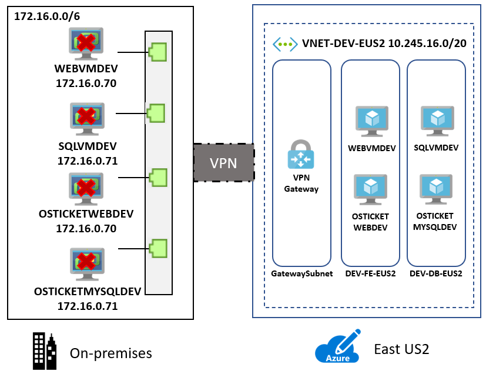
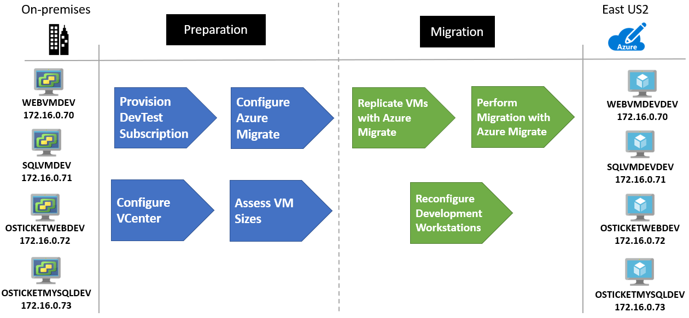
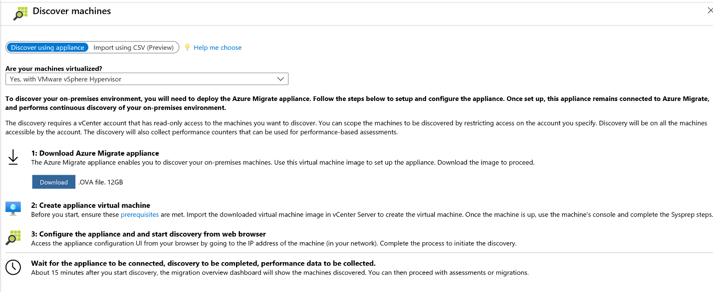
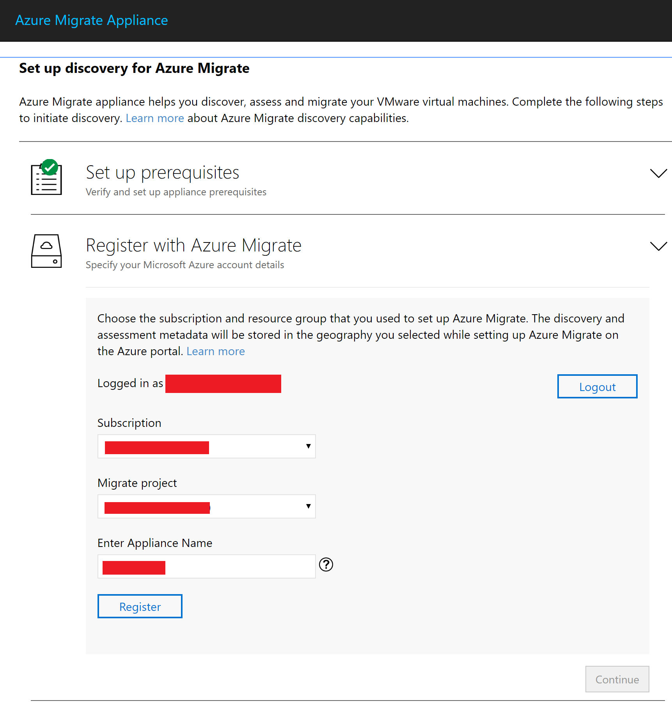
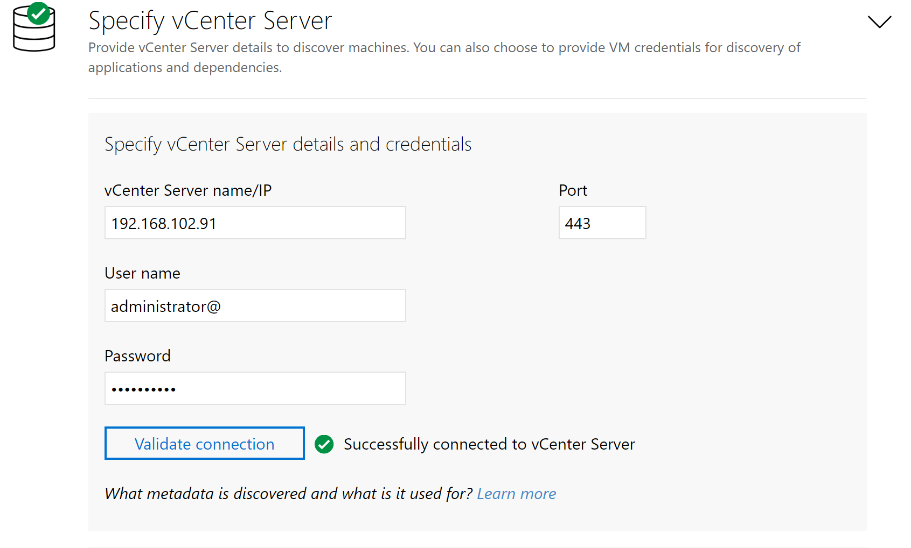
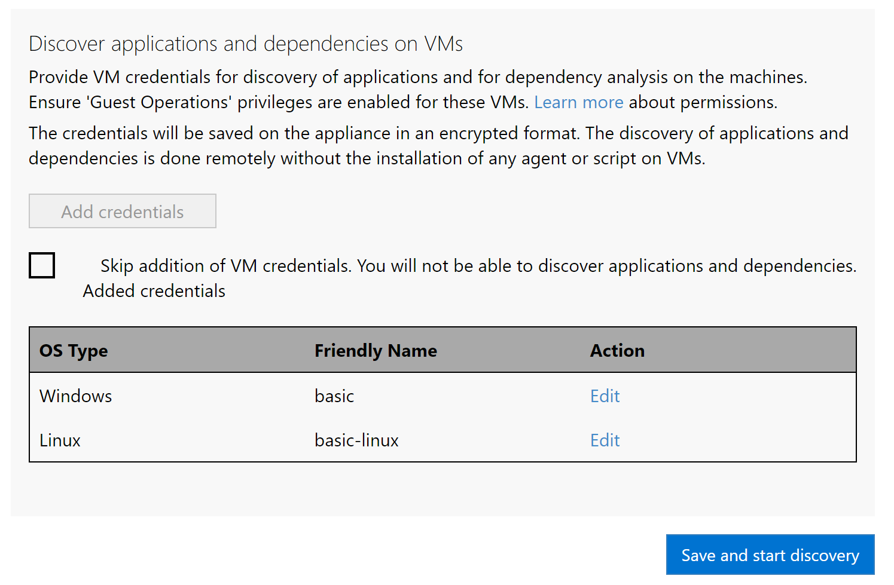

<!-- cSpell:ignore vcenter contosohost contosodc NSGs agentless WEBVMDEV SQLVMDEV OSTICKETWEBDEV OSTICKETMYSQLDEV -->

# Rehost an on-premises dev/test environment on Azure Virtual Machines via Azure Migrate

This article demonstrates how the fictional company Contoso rehosts its dev/test environment for two applications running on VMware virtual machines (VMs) by migrating to Azure Virtual Machines.

The [SmartHotel360](https://github.com/Microsoft/SmartHotel360) and [osTicket](https://github.com/osTicket/osTicket) applications used in this example are open source. You can download them for your own testing purposes.

## Migration options

Contoso has several options available for moving dev/test environments to Azure:

| Migration options | Outcome |
| --- | --- |
| [Azure Migrate](/azure/migrate/migrate-services-overview) | [Assess](/azure/migrate/tutorial-assess-vmware-azure-vm) and [migrate](/azure/migrate/tutorial-migrate-vmware) on-premises VMs.    Run dev/test servers by using Azure infrastructure as a service (IaaS).    Manage VMs with [Azure Resource Manager](/azure/azure-resource-manager/management/overview). |
| [Azure DevTest Labs](/azure/devtest-labs/devtest-lab-overview) | Quickly provision development and test environments.    Minimize waste with quotas and policies.    Set automated shutdowns to minimize costs.    Build Windows and Linux environments. |

> [!NOTE]
> Read how Contoso moved its [dev/test environment to Azure by using DevTest Labs](./contoso-migration-devtest-to-labs.md).

## Business drivers

The development leadership team has outlined what it wants to achieve with this migration. It aims to quickly move dev/test capabilities out of an on-premises datacenter and no longer purchase hardware to develop software. It also seeks to empower developers to create and run their environments without involvement from IT.

> [!NOTE]
> Contoso will use the [Pay-As-You-Go Dev/Test subscription offer](https://azure.microsoft.com/offers/ms-azr-0023p/) for its environments. Each active Visual Studio subscriber on the team can use the Microsoft software included with the subscription virtual machines for dev/test at no extra charge. Contoso will just pay the Linux rate for VMs that it runs. That includes VMs with SQL Server, SharePoint Server, or other software that's normally billed at a higher rate.

## Migration goals

The Contoso development team has pinned down goals for this migration. These goals are used to determine the best migration method:

- Contoso wants to quickly move out of its on-premises dev/test environments.
- After migration, Contoso's dev/test environment in Azure should have enhanced capabilities over the current system in VMware.
- The operations model will move from IT provisioned to DevOps with self-service provisioning.

## Solution design

After pinning down goals and requirements, Contoso designs and reviews a deployment solution and identifies the migration process. The process includes the Azure services that Contoso will use for the migration.

### Current application

- The dev/test VMs for the two applications are running on VMs (`WEBVMDEV`, `SQLVMDEV`, `OSTICKETWEBDEV`, `OSTICKETMYSQLDEV`). These VMs are used for development before code is promoted to the production VMs.
- The VMs are located on VMware ESXi host `contosohost1.contoso.com` (version 6.5).
- The VMware environment is managed by vCenter Server 6.5 (`vcenter.contoso.com`), running on a VM.
- Contoso has an on-premises datacenter (`contoso-datacenter`) with an on-premises domain controller (`contosodc1`).

### Proposed architecture

- Because the VMs are used for dev/test, they'll reside in the `ContosoDevRG` resource group in Azure.
- The VMs will be migrated to the primary Azure region (`East US 2`) and placed in the development virtual network (`VNET-DEV-EUS2`).
- The web front-end VMs will reside in the front-end subnet (`DEV-FE-EUS2`) in the development network.
- The database VM will reside in the database subnet (`DEV-DB-EUS2`) in the development network.
- The on-premises VMs in the Contoso datacenter will be decommissioned after the migration is done.

  
  *Figure 1: Proposed architecture.*

### Database considerations

To support ongoing development, Contoso has decided to continue using existing VMs and migrate them to Azure. In the future, Contoso will pursue the use of platform as a service (PaaS) services such as [Azure SQL Database](/azure/azure-sql/azure-sql-iaas-vs-paas-what-is-overview) and [Azure Database for MySQL](/azure/mysql/overview).

- Database VMs will be migrated as is without changes.
- With the use of the Azure Dev/Test subscription offer, the computers running Windows Server and SQL Server will not incur licensing fees. Avoiding fees will keep the compute costs to a minimum.
- In the future, Contoso will look to integrate its development with PaaS services.

### Solution review

Contoso evaluates the proposed design by putting together a list of pros and cons.

| Consideration | Details |
| --- | --- |
| **Pros** | All of the development VMs will be moved to Azure without changes, making the migration simple.    Because Contoso is using a lift-and-shift approach for both sets of VMs, special configuration or migration tools aren't needed for the application database.    Contoso can take advantage of its investment in the Azure Dev/Test subscription to save on licensing fees.    Contoso will retain full control of the application VMs in Azure.    Developers will be provided with rights to the subscription, which empowers them to create new resources without waiting for IT to respond to their requests. |
| **Cons** | The migration will only move the VMs, not yet moving to PaaS services for their development. This means that Contoso will need have to start supporting the operations of its VMs, including security patches. This was maintained by IT in the past, so Contoso will need to find a solution for this new operational task.    The cloud-based solution empowers the developers and doesn't have safeguards for overprovisioning systems. Developers will be able to instantly provision their systems, but they might create resources that cost money and aren't included in the budget. |

> [!NOTE]
> Contoso could address the cons in its list by using [DevTest Labs](/azure/devtest-labs/devtest-lab-overview).

### Migration process

Contoso will migrate its development front end and database to Azure VMs by using the agentless method in the Azure Migrate: Server Migration tool.

- Contoso prepares and sets up Azure components for Azure Migrate: Server Migration, and prepares the on-premises VMware infrastructure.
- The [Azure infrastructure](./contoso-migration-infrastructure.md) is in place, so Contoso just needs to configure the replication of the VMs through the Azure Migrate: Server Migration tool.
- With everything prepared, Contoso can start replicating the VMs.
- After replication is enabled and working, Contoso migrates the VMs by testing the migration and if successful, failing it over to Azure.
- After the development VMs are up and running in Azure, Contoso will reconfigure its development workstations to point at the VMs now running in Azure.

*Figure 2: An overview of the migration process.*

### Azure services

| Service | Description | Cost |
| --- | --- | --- |
| [Azure Migrate: Server Migration](/azure/migrate/) | The service orchestrates and manages migrating on-premises applications and workloads and AWS or GCP VM instances. | During replication to Azure, Azure Storage charges are incurred. Azure VMs are created and incur charges when the migration occurs and the VMs are running in Azure. Learn more about [charges and pricing](https://azure.microsoft.com/pricing/details/azure-migrate/). |

## Prerequisites

This is what Contoso needs to run this scenario:

| Requirements | Details |
| --- | --- |
| **Azure Dev/Test subscription** | Contoso creates an [Azure Dev/Test subscription](https://azure.microsoft.com/offers/ms-azr-0023p/) to take advantage of reducing costs up to 80 percent.    If you don't have an Azure subscription, create a [free account](https://azure.microsoft.com/free/).    If you create a free account, you're the admin of your subscription, and you can perform all actions.    If you use an existing subscription but you're not the admin, work with the admin to assign you Owner or Contributor permissions.    If you need more granular permissions, see [Manage Site Recovery access with Azure role-based access control (Azure RBAC)](/azure/site-recovery/site-recovery-role-based-linked-access-control). |
| **Azure infrastructure** | Learn how Contoso [set up an Azure infrastructure](./contoso-migration-infrastructure.md).    Learn more about specific [prerequisites](#prerequisites) for Azure Migrate: Server Migration. |
| **On-premises servers** | On-premises vCenter servers should be running version 5.5, 6.0, 6.5, or 6.7.    ESXi hosts should run version 5.5, 6.0, 6.5, or 6.7.    One or more VMware VMs should be running on the ESXi host. |

## Scenario steps

Here's how Contoso admins will run the migration:

> [!div class="checklist"]
>
> - **Step 1: Prepare Azure for Azure Migrate: Server Migration.** They add the server migration tool to their Azure Migrate project.
> - **Step 2: Prepare on-premises VMware for Azure Migrate: Server Migration.** They prepare accounts for VM discovery and prepare to connect to Azure VMs after migration.
> - **Step 3: Replicate VMs.** They set up replication and start replicating VMs to Azure Storage.
> - **Step 4: Migrate the VMs with Azure Migrate: Server Migration.** They run a test migration to make sure everything's working and then run a full migration to move the VMs to Azure.

## Step 1: Prepare Azure for the Azure Migrate: Server Migration tool

Contoso needs to migrate the VMs to a virtual network where the Azure VMs will reside when they're created, provisioned, and configured through the Azure Migrate: Server Migration tool.

1. Set up a network: Contoso already set up a network that can be for Azure Migrate: Server Migration when it [deployed the Azure infrastructure](./contoso-migration-infrastructure.md).

    - The VMs to be migrated are used for development. They will migrate to the Azure development virtual network (`VNET-DEV-EUS2`) in the primary `East US 2` region.
    - Both VMs will be placed in the `ContosoDevRG` resource group, which is used for development resources.
    - The application front-end VMs (`WEBVMDEV` and `OSTICKETWEBDEV`) will migrate to the front-end subnet (`DEV-FE-EUS2`), in the development virtual network.
    - The application database VM (`SQLVMDEV` and `OSTICKETMYSQLDEV`) will migrate to the database subnet (`DEV-DB-EUS2`), in the development virtual network.

2. Provision the Azure Migrate: Server Migration tool.

    1. From Azure Migrate, download the .OVA image and import it into VMware.

       
       *Figure 3: Download the .OVA file.*

    1. Start the imported image and configure the tool, including the following steps:

       - Set up the prerequisites.

         
         *Figure 4: Setting up the prerequisites.*

       - Point the tool to the Azure subscription.

         
         *Figure 5: The Azure subscription.*

       - Set the VMware vCenter credentials.

         
         *Figure 6: Setting the VMware vCenter credentials.*

       - Add any Windows-based credentials for discovery.

         
         *Figure 7: Adding Windows-based credentials for discovery.*

3. When you complete the configuration, the tool will take some time to enumerate all the VMs. You'll see them populate the Azure Migrate tool in Azure when this process finishes.

**Need more help?**

Learn how to [set up the Azure Migrate: Server Migration tool](/azure/migrate/).

### Prepare on-premises VMs

After migration, Contoso wants to connect to the Azure VMs and allow Azure to manage the VMs. To do this, Contoso admins do the following before migration:

1. For access over the internet, they:

    - Enable RDP or SSH on the on-premises VM before migration.
    - Ensure that TCP and UDP rules are added for the `Public` profile.
    - Check that RDP or SSH is allowed in the operating system firewall.
    - Install SSH via the following command: `sudo apt-get ssh install -y`.

2. For access over Site-to-Site VPN, they:

    - Enable RDP or SSH on the on-premises VM before migration.
    - Check that RDP or SSH is allowed in the operating system firewall.
    - For Windows, set the operating system's SAN policy on the on-premises VM to `OnlineAll`.

3. Install the [Azure Windows agent](/azure/virtual-machines/extensions/agent-windows) and the [Azure Linux agent](/azure/virtual-machines/extensions/agent-linux).

For Windows, there shouldn't be Windows updates pending on the VM when you're triggering a migration. If there are, the admins won't be able to sign in to the VM until the updates finish. After migration, the admins can check **Boot diagnostics** to view a screenshot of the VM. If this doesn't work, they should verify that the VM is running and review [troubleshooting tips](https://social.technet.microsoft.com/wiki/contents/articles/31666.troubleshooting-remote-desktop-connection-after-failover-using-asr.aspx).

**Need more help?**

Learn how to [prepare VMs for migration](/azure/migrate/prepare-for-migration).

## Step 3: Replicate the on-premises VMs

Before Contoso admins can run a migration to Azure, they need to set up and enable replication. With discovery completed, they can begin replicating VMware VMs to Azure.

1. In the Azure Migrate project, go to **Servers** > **Azure Migrate: Server Migration**. Then select **Replicate**.

    
    *Figure 8: Replicating VMs.*

2. In **Replicate** > **Source settings** > **Are your machines virtualized?**, select **Yes, with VMware vSphere**.

3. In **On-premises appliance**, select the name of the Azure Migrate appliance that you set up, and then select **OK**.

    
    *Figure 9: The source settings.*

4. In **Virtual machines**, select the machines that you want to replicate.
    - If you've run an assessment for the VMs, you can apply VM sizing and disk type (premium or standard) recommendations from the assessment results. To do this, in **Import migration settings from an Azure Migrate assessment?**, select the **Yes** option.
    - If you didn't run an assessment or you don't want to use the assessment settings, select the **No** option.
    - If you selected to use the assessment, select the VM group and assessment name.

      
      *Figure 10: How to set up the prerequisites.*

5. In **Virtual machines**, search for VMs as needed and check each VM you want to migrate. Then select **Next: Target settings**.

6. In **Target settings**, select the subscription and target region to which you'll migrate. Then specify the resource group in which the Azure VMs will reside after migration. In **Virtual Network**, select the virtual network or subnet to which the Azure VMs will be joined after migration.

7. In **Azure Hybrid Benefit**, select **No** if you don't want to apply Azure Hybrid Benefit. Then select **Next**. Select **Yes** if you have Windows Server machines that are covered with active Software Assurance or Windows Server subscriptions and you want to apply the benefit to the machines you're migrating. Then select **Next**.

      > [!NOTE]
      > In the case of Contoso, the admins will select **No** to Azure Hybrid Benefit because this is an Azure Dev/Test subscription. This means they'll pay for the compute only. [Azure Hybrid Benefit](https://azure.microsoft.com/pricing/hybrid-benefit/) should be used only for production systems that have Software Assurance benefits.

8. In **Compute**, review the VM name, size, OS disk type, and availability set. VMs must conform with [Azure requirements](/azure/migrate/migrate-support-matrix-vmware#vmware-requirements).

    - **VM size:** If you're using assessment recommendations, this drop-down list contains the recommended size. Otherwise, Azure Migrate selects a size based on the closest match in the Azure subscription. You can choose a manual size instead in **Azure VM size**.
    - **OS disk:** Specify the OS (boot) disk for the VM. The OS disk has the operating system bootloader and installer.
    - **Availability set:** If the VM should be in an Azure availability set after migration, then specify the set. The set must be in the target resource group that you specify for the migration.

9. In **Disks**, specify whether the VM disks should be replicated to Azure and select the disk type (standard SSD/HDD or premium managed disks) in Azure. Then select **Next**. You can exclude disks from replication. If you do, they won't be present on the Azure VM after migration.

10. In **Review and start replication**, review the settings and select **Replicate** to start the initial replication for the servers.

> [!NOTE]
> You can update replication settings at any time before replication starts in **Manage** > **Replicating machines**. Settings can't be changed after replication starts.

## Step 4: Migrate the VMs

Contoso admins run a quick test migration and then a full migration to migrate the VMs.

### Run a test migration

1. In **Migration goals** > **Servers** > **Azure Migrate: Server Migration**, select **Test migrated servers**.

    
    *Figure 11: Testing migrated servers.*

2. Select and hold (or right-click) the VM to test, and then select **Test migrate**.

    
    *Figure 12: Testing the migration.*

3. In **Test Migration**, select the virtual network in which the Azure VM will be located after the migration. We recommend that you use a nonproduction virtual network.
4. The **Test migration** job starts. Monitor the job in the portal notifications.
5. After the migration finishes, view the migrated Azure VM in **Virtual Machines** in the Azure portal. The machine name has a **-Test** suffix.
6. After the test is done, select and hold (or right-click) the Azure VM in **Replicating machines**, and then select **Clean up test migration**.

    
    *Figure 13: Cleaning up the test migration.*

### Migrate the VMs

Now Contoso admins run a full migration.

1. In the Azure Migrate project, select **Servers** > **Azure Migrate: Server Migration** > **Replicating servers**.

    
    *Figure 14: Replicating servers.*

2. In **Replicating machines**, select and hold (or right-click) the VM, and then select **Migrate**.
3. In **Migrate** > **Shut down virtual machines and perform a planned migration with no data loss**, select **Yes** > **OK**. By default, Azure Migrate shuts down the on-premises VM and runs an on-demand replication to synchronize any VM changes that occurred since the last replication occurred. This ensures no data loss. If you don't want to shut down the VM, select **No**.
4. A migration job starts for the VM. Track the job in Azure notifications.
5. After the job finishes, you can view and manage the VM from the **Virtual Machines** page.

**Need more help?**

Learn how to [run a test migration](/azure/migrate/tutorial-migrate-vmware#run-a-test-migration) and how to [migrate VMs to Azure](/azure/migrate/tutorial-migrate-vmware#migrate-vms).

## Clean up after migration

The development VMs for both the SmartHotel360 and osTicket applications start running on Azure VMs when the migration is complete.

Now, Contoso needs to complete these cleanup steps:

- After the migration is complete, stop replication.
- Remove the `WEBVMDEV`, `SQLVMDEV`, `OSTICKETWEBDEV`, and `OSTICKETMYSQLDEV` VMs from the vCenter inventory.
- Remove all the VMs from local backup jobs.
- Update internal documentation to show the new location and IP addresses for the VMs.
- Review any resources that interact with the VMs, and update any relevant settings or documentation to reflect the new configuration.

## Review the deployment

With the application now running, Contoso now needs to fully operationalize and secure it in Azure.

### Security

The Contoso security team reviews the Azure VMs to determine any security issues. To control access, the team reviews the network security groups (NSGs) for the VMs. NSGs are used to ensure that only traffic allowed to the application can reach it. The team also considers securing the data on the disk by using Azure Disk Encryption and Azure Key Vault.

For more information, see [Security best practices for IaaS workloads in Azure](/azure/security/fundamentals/iaas).

## Business continuity and disaster recovery

For business continuity and disaster recovery, Contoso takes the following action: keep data safe. Contoso backs up the data on the VMs by using the Azure Backup service. For more information, see [An overview of Azure VM backup](/azure/backup/backup-azure-vms-introduction).

### Licensing and cost optimization

Contoso will ensure that all development Azure resources are created through an Azure Dev/Test subscription to save 80 percent. The admins will enable [Azure Cost Management + Billing](/azure/cost-management-billing/cost-management-billing-overview) to help monitor and manage the Azure resources.

## Conclusion

In this article, Contoso rehosted the development VMs used for its SmartHotel360 and osTicket applications in Azure. The admins migrated the application VMs to Azure VMs by using the Azure Migrate: Server Migration tool.
