# Migrate a dev/test environment to Azure DevTest Labs

This article demonstrates how the fictional company, Contoso, migrates its dev/test environment to Azure DevTest Labs.

## Migration options

Contoso has several options available to move its dev/test environment to Azure.

| Migration options | Outcome |
| --- | --- |
| [Azure Migrate](/azure/migrate/migrate-services-overview) | [Assess](/azure/migrate/tutorial-assess-vmware-azure-vm) and [migrate](/azure/migrate/tutorial-migrate-vmware) on-premises virtual machines (VMs).    Run dev/test servers by using Azure infrastructure as a service (IaaS).    Manage VMs with [Azure Resource Manager](https://azure.microsoft.com/features/resource-manager/). |
| [DevTest Labs](/azure/devtest-labs/devtest-lab-overview) | Quickly prepare development and test environments.    Minimize waste with quotas and policies.    Set automated shutdowns to minimize costs.    Build Windows and Linux environments. |

> [!NOTE]
> This article describes how to use DevTest Labs to move an on-premises dev/test environment to Azure. Read how [Contoso moved dev/test to Azure IaaS by using Azure Migrate](./contoso-migration-devtest-to-iaas.md).

## Business drivers

With this migration, the development leadership team wants to:

- Empower developers with access to DevOps tools and self-service environments.
- Give access to DevOps tools for continuous integration/continuous delivery (CI/CD) pipelines and cloud-native tools for dev/test, such as AI, machine learning, and serverless.
- Ensure governance and compliance in dev/test environments.
- Save costs by moving all dev/test environments out of the datacenter and no longer purchasing hardware to develop software.

> [!NOTE]
> Contoso uses the [Pay-As-You-Go Dev/Test subscription offer](https://azure.microsoft.com/offers/ms-azr-0023p/) for its environments. Each active Visual Studio subscriber on the team can use the Microsoft software included with the subscription on Azure Virtual Machines for dev/test at no extra charge. Contoso just pays the Linux rate for VMs that it runs. That includes VMs with SQL Server, SharePoint Server, or other software that's usually billed at a higher rate.

<!-- -->

> [!NOTE]
> Azure customers with an Enterprise Agreement can also benefit from the [Azure Dev/Test subscription offer](https://azure.microsoft.com/offers/ms-azr-0148p/). To learn more, review the video for [enabling and creating Enterprise Dev/Test subscriptions through the EA portal](/shows/ea-azure-com/enabling-creating-ea-devtest-subscriptions-through-ea-portal).

## Migration goals

The Contoso development team pinned down goals for this migration. These goals are used to determine the best migration method:

- Quickly prepare development and test environments. It should take minutes, not months, to build the infrastructure that a developer needs to write or test software.
- After the migration, Contoso's dev/test environment in Azure should have enhanced capabilities over the current on-premises system.
- The operations model moves from IT-provisioned VMs to DevOps with self-service provisioning.
- Contoso wants to quickly move out of its on-premises dev/test environments.
- Developers can securely connect to dev/test environments remotely.

## Solution design

After Contoso pins down goals and requirements, they design and review a deployment solution. The solution includes the Azure services that it uses for dev/test.

### Current architecture

- The dev/test VMs for Contoso's applications are running on VMware in the on-premises datacenter.
- These VMs are used for development and testing before code is promoted to the production VMs.
- Developers maintain their own workstations, but they need new solutions to connect remotely from home offices.

### Proposed architecture

- Contoso uses an [Azure Dev/Test subscription](https://azure.microsoft.com/offers/ms-azr-0023p/) to reduce costs for Azure resources. This subscription offers significant savings, including VMs that don't incur licensing fees for Microsoft software.
- Contoso uses DevTest Labs to manage the environments. New VMs are created in DevTest Labs to support the move to new tools for development and testing in the cloud.
- The on-premises dev/test VMs in the Contoso datacenter are decommissioned after the migration is done.
- Developers and testers have access to Azure Virtual Desktop for their workstations.

[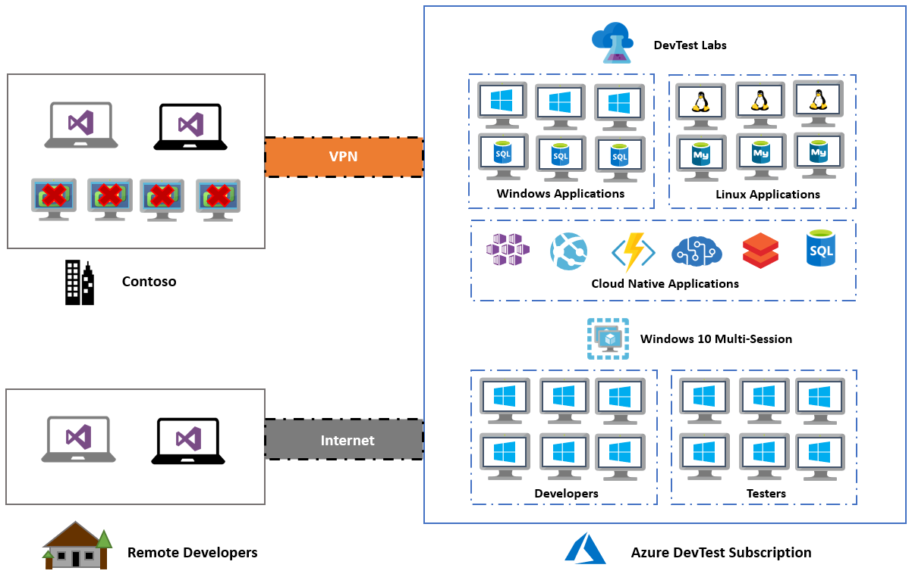](./media/contoso-migration-devtest-to-labs/architecture.png#lightbox)
*Figure 1: Scenario architecture.*

### Database considerations

To support ongoing development, Contoso decides to continue using databases that run on VMs. The current VMs are replaced with new ones running in DevTest Labs. In the future, Contoso pursues the use of platform as a service (PaaS) services, such as [Azure SQL Database](/azure/azure-sql/database/sql-database-paas-overview) and [Azure Database for MySQL](/azure/mysql/overview).

Current VMware database VMs are decommissioned and replaced with Azure VMs in DevTest Labs. The existing databases are migrated with simple backups and restores. The Azure Dev/Test subscription offer doesn't incur licensing fees for the Windows Server and SQL Server instances, which minimizes compute costs.

### Solution review

Contoso evaluates the proposed design by putting together a list of pros and cons.

| Consideration | Details |
| --- | --- |
| **Pros** | All of the current development VMs, application and database, are replaced with new VMs that run in DevTest Labs. Contoso can take advantage of the features of a purpose-built cloud development environment.    Contoso can take advantage of its investment in the Azure Dev/Test subscription to save on licensing fees.    Contoso retains full control of the application VMs in Azure.    Developers are provided with rights to the subscription, which empowers them to create new resources without waiting for IT to respond to their requests. |
| **Cons** | The migration only moves development to the cloud. Developers don't use PaaS services in their development because they're still using VMs. Contoso needs to start supporting the operations of its VMs, including security patches. IT maintained VMs in the past, and Contoso needs to find a solution for this new operational task.    Contoso has to build new application and database VMs to automate the process. Contoso can take advantage of building VMs in the cloud and tools provided by DevTest Labs. Although this process is a con, it has a positive outcome. |

### Migration process

Contoso migrates its development application and database VMs to new Azure VMs by using DevTest Labs.

- Contoso already has the [Azure infrastructure](../azure-migration-guide/ready-alz.md) in place, including the development virtual network.
- With everything prepared, Contoso provisions and configures DevTest Labs.
- Contoso configures the development virtual network, assigns a resource group, and sets policies.
- Contoso creates Azure Virtual Desktop instances for developers to use at remote locations.
- Contoso creates VMs within DevTest Labs for development and migrate databases.

[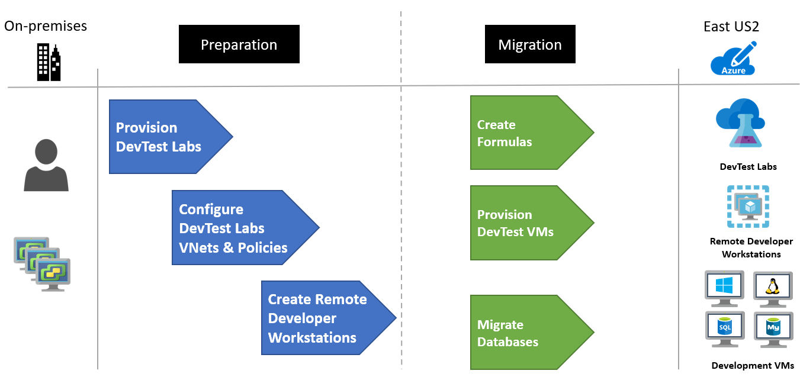](./media/contoso-migration-devtest-to-labs/migration-process-devtest-labs.png#lightbox)
*Figure 2: The migration process.*

## Prerequisites

For Contoso to run this scenario, they need these prerequisites.

| Requirements | Details |
| --- | --- |
| **Azure Dev/Test subscription** | Contoso creates an [Azure Dev/Test subscription](https://azure.microsoft.com/offers/ms-azr-0023p/) to reduce costs up to 80 percent.    If you don't have an Azure subscription, create a [free account](https://azure.microsoft.com/free/).    If you create a free account, you're the admin of your subscription, and you can perform all actions.    If you use an existing subscription and you're not the admin, work with the admin to assign you owner or contributor permissions.    If you need more granular permissions, see [Manage Site Recovery access with Azure role-based access control](/azure/site-recovery/site-recovery-role-based-linked-access-control). |
| **Azure infrastructure** | Learn how Contoso [set up an Azure infrastructure](../azure-migration-guide/ready-alz.md). |

## Scenario steps

Contoso admins run the migration by following this process:

> [!div class="checklist"]
>
> - Step 1: Provision a new Azure Dev/Test subscription and create a DevTest Labs instance.
> - Step 2: Configure the development virtual network, assign a resource group, and set policies.
> - Step 3: Create Windows 10 Enterprise multi-session virtual desktops for developers to use from remote locations.
> - Step 4: Create formulas and VMs within DevTest Labs for development and migrate databases.

## Step 1: Provision a new Azure Dev/Test subscription and create a DevTest Labs instance

Contoso admins first need to provision a new subscription by using the Azure Dev/Test offer, and then create a DevTest Labs instance.

 1. The admins follow the link to the [Azure Dev/Test subscription offer](https://azure.microsoft.com/offers/ms-azr-0023p/) and provision a new subscription, which saves them up to 80 percent on their systems. This offer allows them to run Windows 10 images on Azure for dev/test. The admins gain access to [Azure Virtual Desktop](/azure/virtual-desktop/overview) to simplify the management experience of the remote developers.

      
    *Figure 3: An Azure Dev/Test subscription offer.*

 1. With their new subscription provisioned, Contoso admins use the Azure portal to create a new DevTest Labs instance. The new lab is created in the `ContosoDevRG` resource group.

    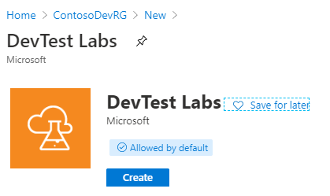  
    *Figure 4: Creating a new DevTest Labs instance.*

## Step 2: Configure the development virtual network, assign a resource group, and set policies

With the DevTest Labs instance created, Contoso performs the following configurations:

### Configure the virtual network

 1. In the portal, Contoso opens the DevTest Labs instance and selects **Configuration and policies**.

    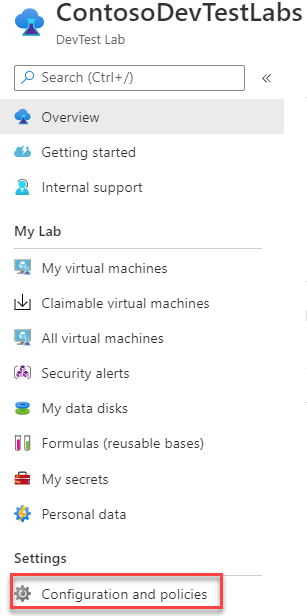  
    *Figure 5: DevTest Labs instance: configuration and policies.*

 1. Contoso selects **Virtual Networks** > **+ Add**, chooses `vnet-dev-eus2`, and then selects **Save**. The development virtual network can be used for VM deployments. A virtual network was also created during the deployment of the DevTest Labs instance.

    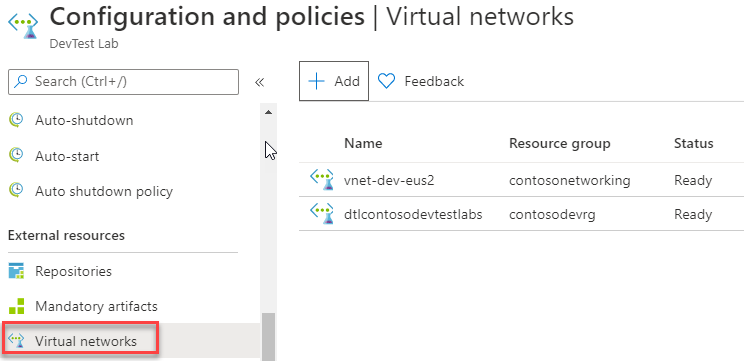  
    *Figure 6: Virtual networks.*

### Assign a resource group

To ensure that resources are deployed to the `ContosoDevRG` resource group, Contoso configures this allocation in the lab settings. It also assigns its developers the **Contributor** role.

  
*Figure 7: Assigning a resource group.*

   > [!NOTE]
   > The contributor role is an administrator-level role with all rights except the ability to provide access to other users. For more information, see [Azure role-based access control](/azure/role-based-access-control/overview).

### Set lab policies

Contoso needs to ensure that its developers are using DevTest Labs within team policies. Contoso configures DevTest Labs with these policies.

 1. Contoso enables auto-shutdown with a local time of 7:00:00 PM and the correct time zone.

    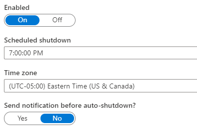  
    *Figure 8: Auto-shutdown.*

 1. Contoso enables auto-start to have the VMs running when the developers come online to work. They're configured to the local time zone and for the days of the week when the developers work.

      
    *Figure 9: Auto-start.*

 1. Contoso configures the allowed VM sizes, ensuring that large and expensive VMs can't be started.

    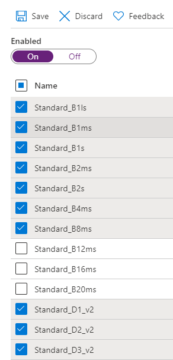  
    *Figure 10: Allowed VM sizes.*

 1. Contoso configures the support message.

    [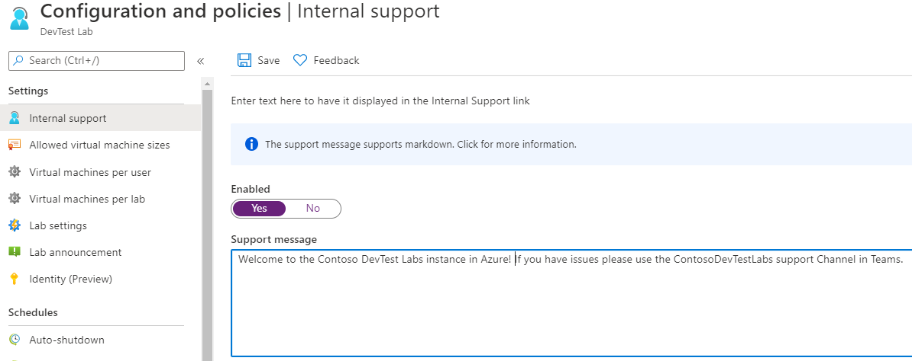](./media/contoso-migration-devtest-to-labs/support.png#lightbox)  
    *Figure 11: A support message.*

## Step 3: Create Windows 10 Enterprise multi-session virtual desktops for developers to use from remote locations

Contoso needs to create an Azure Virtual Desktop base for remote developers.

 1. Contoso selects **All virtual machines** > **+ Add** and chooses a Windows 10 Enterprise multi-session base for a VM.

    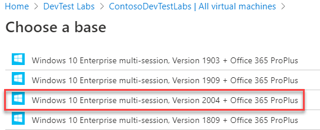  
    *Figure 12: A Windows 10 Enterprise multi-session base.*

 1. Contoso configures the size of the VM along with the artifacts to be installed. In this case, the developers have access to common development tools, such as Visual Studio Code, Git, and Chocolatey.

    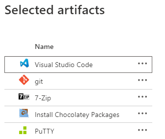  
    *Figure 13: Artifacts.*

 1. Contoso reviews the VM configuration for accuracy.

    [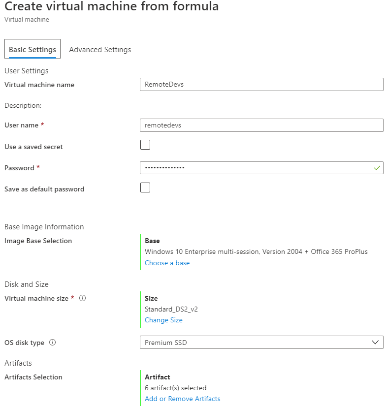](./media/contoso-migration-devtest-to-labs/vm-from-base.png#lightbox)  
    *Figure 14: Create a virtual machine from a base.*

 1. After the VM is created, Contoso's remote developers can connect to and use this development workstation for their work. The selected artifacts are installed, which saves developers time when configuring their workstation.

    [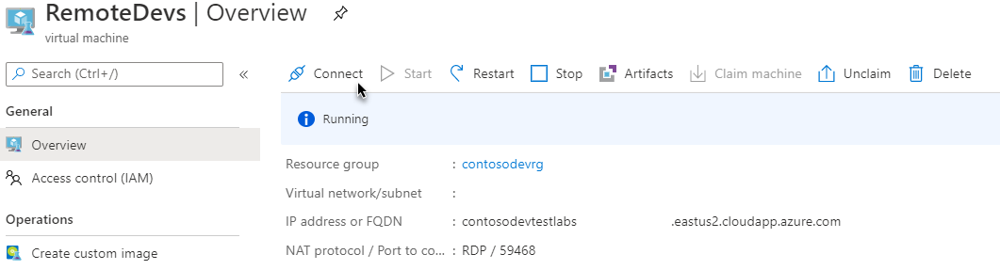](./media/contoso-migration-devtest-to-labs/remote-vm.png#lightbox)  
    *Figure 15: A remote developer VM.*

## Step 4: Create formulas and VMs within DevTest Labs for development and migrate databases

With DevTest Labs configured and the remote developers' workstation up and running, Contoso focuses on building its VMs for development.

Contoso creates formulas (reusable bases) for application and database VMs, and it provisions application and database VMs by using the formulas.

 1. Contoso selects **Formulas** > **+ Add**, and then selects a **Windows Server 2012 R2 Datacenter** base.

      
    *Figure 16: A Windows 2012 R2 base.*

 1. Contoso configures the size of the VM, along with the artifacts to be installed. In this case, the developers have access to common development tools, such as Visual Studio Code, Git, and Chocolatey.

    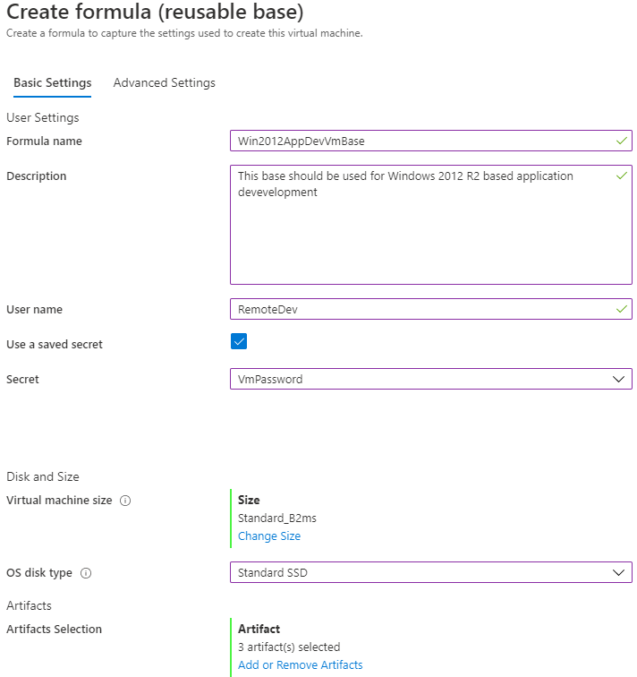  
    *Figure 17: A Windows 2012 R2 base configuration.*

 1. To create the database VM formula, Contoso follows the same basic steps. This time, it selects a SQL Server 2012 image for the base.

    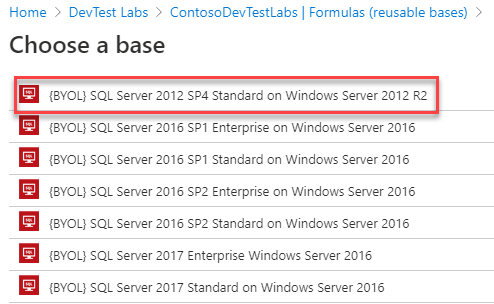  
    *Figure 18: A SQL Server 2012 image.*

 1. Contoso configures the formula with the size and artifacts. The artifacts include SQL Server Management Studio, which is required for this database development VM formula.

    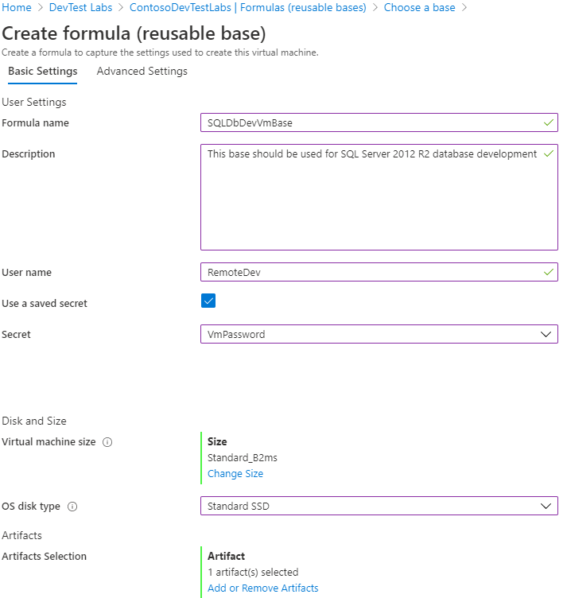  
    *Figure 19: An SQL 2020 R2 base configuration.*

    Learn more about [using formulas with Azure DevTest Labs](/azure/devtest-labs/devtest-lab-manage-formulas).

 1. Contoso has now created the Windows base formulas for its developers to use for applications and databases.

      
    *Figure 20: Windows base formulas.*

**The next steps provision application and database VMs through the formulas:**

 1. With the formulas created, Contoso selects **All virtual machines** and then the `Windows2012AppDevVmBase` formula to match the configuration of its current application development VMs.

      
    *Figure 21: An application development VM.*

 1. Contoso configures the VM with the size and artifacts that are required for this application VM.

      
    *Figure 22: Size and artifact configurations for a VM.*

 1. Contoso provisions the database VM by using the `SQLDbDevVmBase` formula to match the configuration of its current database development VMs.

    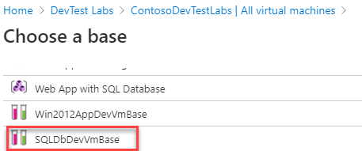  
    *Figure 23: A database VM.*

 1. Contoso configures the VM with the size and artifacts that are required.

    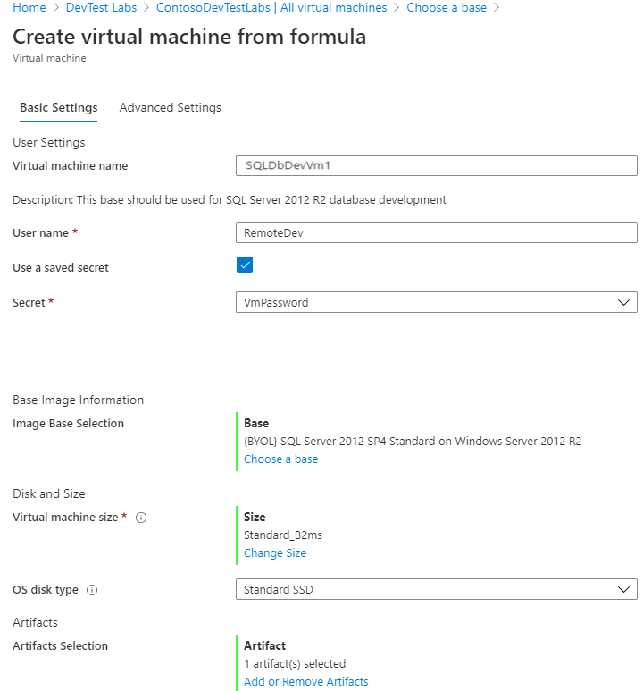  
    *Figure 24: Database configurations for a VM.*

 1. With the first VMs created along with the remote developers' workstation, Contoso's developers are ready to start writing code in Azure.

    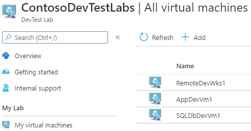  
    *Figure 25: Contoso VMs.*

 1. Contoso can now restore its development databases from backups or by using a code generation process to build the schema on the VMs. With SQL Server Management Studio already installed through the artifacts, these tasks are simple and don't require installing any tools.

## Clean up after migration

Contoso continues to use these steps to migrate its VMs to Azure by using DevTest Labs. With each migration complete, all development VMs now run in DevTest Labs.

Now, Contoso needs to complete these cleanup steps:

- Remove the VMs from the vCenter inventory.
- Remove all the VMs from local backup jobs.
- Update internal documentation to show the new location and IP addresses for the VMs.
- Review any resources that interact with the VMs, and update any relevant settings or documentation to reflect the new configuration.

### Security

The Contoso security team reviews the Azure VMs to determine any security issues. To control access, the team reviews the network security groups (NSGs) for the VMs. NSGs ensure that only traffic allowed to the application can reach it. The team also considers securing the data on the disk by using Azure Disk Encryption and Azure Key Vault. For more information, see [Security best practices for IaaS workloads in Azure](/azure/security/fundamentals/iaas).

### Licensing and cost optimization

- Contoso ensures that all development Azure resources are created through an Azure Dev/Test subscription to take advantage of the 80 percent savings.
- Budgets are reviewed for all DevTest Labs instances and policies for the VMs to ensure that costs are contained and overprovisioning doesn't occur.
- Contoso enables [Azure Cost Management + Billing](/azure/cost-management-billing/cost-management-billing-overview) to help monitor and manage the Azure resources.

## Conclusion

In this article, Contoso moved its development environments to DevTest Labs. It also implemented Azure Virtual Desktop as a platform for remote and contract developers.

## Next steps

[Create a lab in the Azure portal](/azure/devtest-labs/devtest-lab-create-lab)  
[Azure DevTest Labs scenarios](/azure/devtest-labs/devtest-lab-developer-lab)
