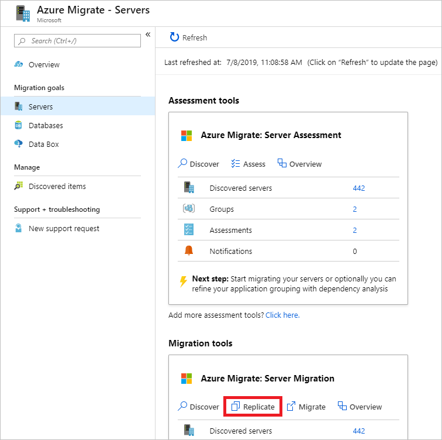
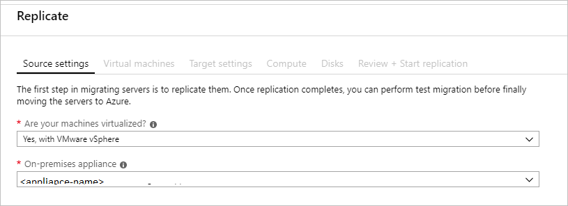
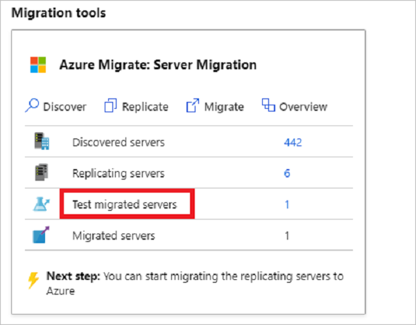

# Rehost on-premises DevTest environment on Azure VMs

This article demonstrates how the fictional company Contoso rehosts their DevTest environment for two applications running on VMware VMs, by migrating to Azure VMs.

The [SmartHotel360](https://github.com/Microsoft/SmartHotel360) and [OSTICKET](https://github.com/osTicket/osTicket) apps used in this example are open source.  You can download them from your own testing purposes.

## Migration Options
Contoso has several options available when moving DevTest to Azure.

**Migration Options** | **Outcome**
--- | ---
[**Azure Migrate**](https://azure.microsoft.com/services/azure-migrate/) | [Assess](https://docs.microsoft.com/azure/migrate/tutorial-assess-vmware) and [migrate](https://docs.microsoft.com/azure/migrate/tutorial-migrate-vmware) on-premises VMs  Run DevTest Servers using Azure IaaS.    Manage VMs with [Azure Resource Manager](https://azure.microsoft.com/features/resource-manager/)
[**Azure DevTest Labs**](https://azure.microsoft.com/services/devtest-lab/) | Quickly provision development and test environments   Minimize waste with quotas and policies   Set automated shutdowns to minimize costs   Build Windows and Linux environments

> [NOTE]:
> Read how Contoso moved [DevTest to Azure using DevTest Labs](./contoso-migration-dt-to-labs.md).

## Business drivers

The Development Leadership team has outlined what they want to achieve with this migration:

- Quickly move DevTest out of on-premises data center, and no longer purchase hardware to develop software.
- Empower Developers to create and run their environments without involvement from IT.

> ![NOTE]
> Contoso will leverage the Pay-As-You-Go [Dev/Test subscription offer](https://azure.microsoft.com/offers/ms-azr-0023p/) for their environments. Each active Visual Studio subscriber on their team can use the Microsoft software included with their subscription on Azure Virtual Machines for DevTest at no extra charge. Contoso will just pay the Linux rate for VMs they run, even VMs with SQL Server, SharePoint Server, or other software that is normally billed at a higher rate. 

## Migration goals

The Contoso development team has pinned down goals for this migration. These goals are used to determine the best migration method:

- Contoso wants to quickly move out of their on-premises DevTest environments.
- After migration, Contoso's DevTest environment in Azure should have enhanced capabilities over the current system in VMware.
- The operations model will move from IT provisioned to DevOps and with self-service provisioning.

## Solution design

After pinning down goals and requirements, Contoso designs and reviews a deployment solution, and identifies the migration process, including the Azure services that Contoso will use for the migration.

### Current app

- The DevTest VMs for the two applications are running on VMs (**WEBVMDEV**,  **SQLVMDEV**, **OSTICKETWEBDEV**, **OSTICKETMYSQLDEV**). These VMs are used for development prior to code being promoted to the production VMs.
- The VMs are located on VMware ESXi host **contosohost1.contoso.com** (version 6.5).
- The VMware environment is managed by vCenter Server 6.5 (**vcenter.contoso.com**), running on a VM.
- Contoso has an on-premises data center (contoso-datacenter), with an on-premises domain controller (**contosodc1**).

### Proposed architecture

- Since the VMs are used for DevTest, in Azure they will reside in the development resource group ContosoDevRG.
- The VMs will be migrated to the primary Azure region (East US 2) and placed in the development virtual network (VNET-DEV-EUS2).
- The web front-end VMs will reside in the front-end subnet (DEV-FE-EUS2) in the development network.
- The database VM will reside in the database subnet (DEV-DB-EUS2) in the development network.
- The on-premises VMs in the Contoso data-center will be decommissioned after the migration is done.

### Database considerations

To support ongoing development Contoso has decided to continue use of the existing VMs, migrated to Azure.  In the future, Contoso will pursue the use of PaaS services such as [Azure SQL Database](https://azure.microsoft.com/services/sql-database/) and [Azure Database for MySQL](https://azure.microsoft.com/services/mysql/).

- Database VMs will be migrated as is without changes.
- With the use of the Azure Dev/Test subscription offer, the Windows and SQL Servers will not incur licensing fees which will keep the compute costs to a minimum.
- In the future, Contoso will look to integrate their development with PaaS Services.

### Solution review

Contoso evaluates the proposed design by putting together a pros and cons list.

**Consideration** | **Details**
--- | ---
**Pros** | All of the development VMs will be moved to Azure without changes, making the migration simple.   Since Contoso is using a lift and shift approach for both sets of VMs, no special configuration or migration tools are needed for the app database.   Contoso can take advantage of their investment in the Dev/Test subscription to save on licensing fees.   Contoso will retain full control of the app VMs in Azure.  Developers will be provided with rights to the subscription which empowers them to create new resources without waiting for IT to respond to their requests
**Cons** | The migration will only move their VMs, not yet making a move to using PaaS Services in their development. This means that Contoso will need have to start supporting the operations of their VMs including security patches. This was maintained by IT in the past, so they will need to find a solution to this new operational task.   The cloud based solution, which empowers the developers, doesn't have safe guards for over provision of systems. Developers will be able to instantly provision their systems, but they could create resources which cost money but are not included in the budget.

> [!NOTE]
> Contoso could address the Cons in their list by using [Azure DevTest Labs](https://azure.microsoft.com/services/devtest-lab/).

### Migration process

Contoso will migrate their development front-end and database to Azure VMs using the Azure Migrate Server Migration tool agentless method.

- As a first step, Contoso prepares and sets up Azure components for Azure Migrate Server Migration, and prepares the on-premises VMware infrastructure.
- They already have the [Azure infrastructure](./contoso-migration-infrastructure.md) in place, so Contoso just needs to configure the replication of the VMs through the Azure Migrate Server Migration tool.
- With everything prepared, Contoso can start replicating the VMs.
- After replication is enabled and working, Contoso will migrate the VMs by testing the migration and if successful, failing it over to Azure.
- Once the development VMs are up and running in Azure, they will reconfigure their development workstations to point at the VMs now running in Azure.

### Azure services

**Service** | **Description** | **Cost**
--- | --- | ---
[Azure Migrate Server Migration](https://docs.microsoft.com/azure/migrate) | The service orchestrates and manages migration of your on-premises apps and workloads, and AWS/GCP VM instances. | During replication to Azure, Azure Storage charges are incurred. Azure VMs are created, and incur charges, when the migration occurs and the VMs are running in Azure. [Learn more](https://azure.microsoft.com/pricing/details/azure-migrate) about charges and pricing.

## Prerequisites

Here's what Contoso needs to run this scenario.

<!-- markdownlint-disable MD033 -->

**Requirements** | **Details**
--- | ---
**Azure Dev/Test subscription** | Contoso creates a [DevTest subscription](https://azure.microsoft.com/offers/ms-azr-0023p/) to take advantage of up to 80% reduction in costs.   If you don't have an Azure subscription, create a [free account](https://azure.microsoft.com/pricing/free-trial).   If you create a free account, you're the administrator of your subscription and can perform all actions.   If you use an existing subscription and you're not the administrator, you need to work with the admin to assign you Owner or Contributor permissions.   If you need more granular permissions, review [this article](https://docs.microsoft.com/azure/site-recovery/site-recovery-role-based-linked-access-control).
**Azure infrastructure** | [Learn how](./contoso-migration-infrastructure.md) Contoso set up an Azure infrastructure.   Learn more about specific [prerequisites](https://docs.microsoft.com/azure/migrate/dt-to-iaas#prerequisites) requirements for Azure Migrate Server Migration.
**On-premises servers** | On-premises vCenter Servers should be running version 5.5, 6.0, 6.5 or 6.7   ESXi hosts should run version 5.5, 6.0, 6.5 or 6.7   One or more VMware VMs should be running on the ESXi host.

## Scenario steps

Here's how Contoso admins will run the migration:

> [!div class="checklist"]
>
> - **Step 1: Prepare Azure for Azure Migrate Server Migration.** They add the Server Migration tool to their Azure Migrate project.
> - **Step 2: Prepare on-premises VMware for Azure Migrate Server Migration.** They prepare accounts for VM discovery, and prepare to connect to Azure VMs after migration.
> - **Step 3: Replicate VMs.** They set up replication, and start replicating VMs to Azure storage.
> - **Step 4: Migrate the VMs with Azure Migrate Server Migration.** They run a test migration to make sure everything's working, and then run a full migration to move the VMs to Azure.

## Step 1: Prepare Azure for the Azure Migrate Server Migration tool

Here are the Azure components Contoso needs to migrate the VMs to Azure:

- A VNet in which Azure VMs will be located when they're created during migration.
- The Azure Migrate Server Migration tool (OVA) provisioned and configured.

They set these up as follows:

1. Set up a network-Contoso already set up a network that can be for Azure Migrate Server Migration when they [deployed the Azure infrastructure](./contoso-migration-infrastructure.md)

    - The VMs to be migrated are used for development, thus the VMs will be migrated to the Azure development virtual network (VNET-DEV-EUS2), in the primary East US 2 region.
    - Both VMs will be placed in the ContosoDevRG resource group, which is used for development resources.
    - The app front-end VMs (WEBVMDEV and OSTICKETWEBDEV) will migrate to the front-end subnet (DEV-FE-EUS2), in the development virtual network.
    - The app database VM (SQLVMDEV and OSITCKETMYSQLDEV) will migrate to the database subnet (DEV-DB-EUS2), in the development virtual network.

2. Provision the Azure Migrate Server Migration tool.

    - From Azure Migrate, download the OVA image and import it into VMWare.

        

    - Start the imported image and configure the tool, including the following steps:

      - Set up the prerequisites.

        

      - Point the tool to the Azure subscription.

        

      - Set the VMWare vCenter credentials.

        

      - Add any Windows-based credentials for discovery.

        

3. Once configured, it will take some time for the tool to enumerate all the virtual machines. Once complete, you will see them populate in the Azure Migrate tool in Azure.

**Need more help?**

[Learn about](https://docs.microsoft.com/azure/migrate) setting up Azure Migrate Server Migration tool.

### Prepare on-premises VMs

After migration, Contoso wants to connect to the Azure VMs and allow Azure to manage the VMs. To do this, Contoso admins do the following before migration:

1. For access over the internet, they:

    - Enable RDP or SSH on the on-premises VM before migration.
    - Ensure that TCP and UDP rules are added for the **Public** profile.
    - Check that RDP or SSH is allowed in the operating system firewall.
    - For install SSH by using the following command: **Sudo apt-get ssh install -y**.

2. For access over site-to-site VPN, they:

    - Enable RDP or SSH on the on-premises VM before migration.
    - Check that RDP or SSH is allowed in the operating system firewall.
    - For windows, Set the operating system's SAN policy on the on-premises VM to **OnlineAll**.

3. Install the Azure agents.

    - [Azure Windows Agent](https://docs.microsoft.com/azure/virtual-machines/extensions/agent-windows)
    - [Azure Linux Agent](https://docs.microsoft.com/azure/virtual-machines/extensions/agent-linux)

4. Miscellaneous

   - For Windows, there should be no Windows updates pending on the VM when triggering a migration. If there are, they won't be able to log into the VM until the update completes.
   - After migration, they can check **Boot diagnostics** to view a screenshot of the VM. If this doesn't work, they should verify that the VM is running, and review these [troubleshooting tips](https://social.technet.microsoft.com/wiki/contents/articles/31666.troubleshooting-remote-desktop-connection-after-failover-using-asr.aspx).

5. Need more help?

   - [Learn about](https://docs.microsoft.com/azure/migrate/dt-to-iaas#prepare-vms-for-migration) preparing VMs for migration.

## Step 3: Replicate the on-premises VMs

Before Contoso admins can run a migration to Azure, they need to set up and enable replication.

With discovery completed, you can begin replication of VMware VMs to Azure.

1. In the Azure Migrate project > **Servers**, **Azure Migrate: Server Migration**, select **Replicate**.

    

2. In **Replicate**, > **Source settings** > **Are your machines virtualized?**, select **Yes, with VMware vSphere**.

3. In **On-premises appliance**, select the name of the Azure Migrate appliance that you set up > **OK**.

    

4. In **Virtual machines**, select the machines you want to replicate.
    - If you've run an assessment for the VMs, you can apply VM sizing and disk type (premium/standard) recommendations from the assessment results. To do this, in **Import migration settings from an Azure Migrate assessment?**, select the **Yes** option.
    - If you didn't run an assessment, or you don't want to use the assessment settings, select the **No** options.
    - If you selected to use the assessment, select the VM group, and assessment name.

    

5. In **Virtual machines**, search for VMs as needed, and check each VM you want to migrate. Then select **Next: Target settings**.

6. In **Target settings**, select the subscription, and target region to which you'll migrate, and specify the resource group in which the Azure VMs will reside after migration. In **Virtual Network**, select the Azure VNet/subnet to which the Azure VMs will be joined after migration.

7. In **Azure Hybrid Benefit**, select the following:

    - Select **No** if you don't want to apply Azure Hybrid Benefit. Then select **Next**.
    - Select **Yes** if you have Windows Server machines that are covered with active Software Assurance or Windows Server subscriptions, and you want to apply the benefit to the machines you're migrating. Then select **Next**.

> ![NOTE]
> In the case of Contoso, they will select **No** to Azure Hybrid Benefit, since this is subscription is a Dev/Test type. This means they will pay only for the compute. [Hybrid Use Benefit](https://azure.microsoft.com/pricing/hybrid-benefit/) should only be used for production systems that have Software Assurance benefits.

8. In **Compute**, review the VM name, size, OS disk type, and availability set. VMs must conform with [Azure requirements](https://docs.microsoft.com/azure/migrate/migrate-support-matrix-vmware#vmware-requirements).

    - **VM size:** If you're using assessment recommendations, the VM size dropdown will contain the recommended size. Otherwise Azure Migrate picks a size based on the closest match in the Azure subscription. Alternatively, pick a manual size in **Azure VM size**.
    - **OS disk:** Specify the OS (boot) disk for the VM. The OS disk is the disk that has the operating system bootloader and installer.
    - **Availability set:** If the VM should be in an Azure availability set after migration, specify the set. The set must be in the target resource group you specify for the migration.

9. In **Disks**, specify whether the VM disks should be replicated to Azure, and select the disk type (standard SSD/HDD or premium-managed disks) in Azure. Then select **Next**.
    - You can exclude disks from replication.
    - If you exclude disks, won't be present on the Azure VM after migration.

10. In **Review and start replication**, review the settings, then select **Replicate** to start the initial replication for the servers.

> [!NOTE]
> You can update replication settings any time before replication starts, in **Manage** > **Replicating machines**. Settings can't be changed after replication starts.

## Step 4: Migrate the VMs

Contoso admins run a quick test migration, and then a full migration to migrate the VMs.

### Run a test migration

1. In **Migration goals** > **Servers** > **Azure Migrate: Server Migration**, select **Test migrated servers**.

     

2. Right-click the VM to test, then select **Test migrate**.

    

3. In **Test Migration**, select the Azure VNet in which the Azure VM will be located after the migration. We recommend you use a nonproduction VNet.
4. The **Test migration** job starts. Monitor the job in the portal notifications.
5. After the migration finishes, view the migrated Azure VM in **Virtual Machines** in the Azure portal. The machine name has a suffix **-Test**.
6. After the test is done, right-click the Azure VM in **Replicating machines**, then select **Clean up test migration**.

    

### Migrate the VMs

Now Contoso admins run a full migration.

1. In the Azure Migrate project > **Servers** > **Azure Migrate: Server Migration**, then select **Replicating servers**.

    

2. In **Replicating machines**, right-click the VM > **Migrate**.
3. In **Migrate** > **Shut down virtual machines and perform a planned migration with no data loss**, select **Yes** > **OK**.
    - By default Azure Migrate shuts down the on-premises VM, and runs an on-demand replication to synchronize any VM changes that occurred since the last replication occurred. This ensures no data loss.
    - If you don't want to shut down the VM, select **No**.
4. A migration job starts for the VM. Track the job in Azure notifications.
5. After the job finishes, you can view and manage the VM from the **Virtual Machines** page.

**Need more help?**

- [Learn about](https://docs.microsoft.com/azure/migrate/tutorial-migrate-vmware#run-a-test-migration) running a test migration.
- [Learn about](https://docs.microsoft.com/azure/migrate/tutorial-migrate-vmware#migrate-vms) migrating VMs to Azure.

## Clean up after migration

With migration complete, the development VMs for both the SmartHotel360 and OSTICKET appss are now running on Azure VMs.

Now, Contoso needs to complete these cleanup steps:

- After the migration is complete, stop replication.
- Remove the WEBVMDEV, SQLVMDEV, OSTICKETWEBDEV, and OSTICKETMYSQLDEV VMs from the vCenter inventory.
- Remove all the VMs from from local backup jobs.
- Update internal documentation to show the new location, and IP addresses for the VMs.
- Review any resources that interact with the VMs, and update any relevant settings or documentation to reflect the new configuration.

## Review the deployment

With the app now running, Contoso now needs to fully operationalize and secure it in Azure.

### Security

The Contoso security team reviews the Azure VMs, to determine any security issues.

- To control access, the team reviews the network security groups (NSGs) for the VMs. NSGs are used to ensure that only traffic allowed to the app can reach it.
- The team also consider securing the data on the disk using Azure Disk Encryption and Key Vault.

For more information, see [Security best practices for IaaS workloads in Azure](https://docs.microsoft.com/azure/security/fundamentals/iaas).

## Business continuity and disaster recovery

For business continuity and disaster recovery (BCDR), Contoso takes the following actions:

- Keep data safe: Contoso backs up the data on the VMs using the Azure Backup service. [Learn more](https://docs.microsoft.com/azure/backup/backup-overview).

### Licensing and cost optimization

- Contoso will ensure that all development Azure resources are created using this DevTest subscription to take advantage of the 80% savings.
- Contoso will enable [Azure Cost Management](https://docs.microsoft.com/azure/cost-management-billing/cost-management-billing-overview) to help monitor and manage the Azure resources.

## Conclusion

In this article, Contoso rehosted the development VMs used for their SmartHotel360 and OSTICKET apps in Azure by migrating the app VMs to Azure VMs using the Azure Migrate Server Migration tool.
