<!-- cSpell:ignore vcenter -->

# Migrate a dev/test environment to Azure DevTest Labs

This article demonstrates how the fictional company Contoso migrates their dev/test environment to Azure DevTest Labs.

## Migration options

Contoso has several options available when moving their dev/test environment to Azure.

| Migration options | Outcome |
| --- | --- |
| [Azure Migrate](https://docs.microsoft.com/azure/migrate/migrate-services-overview) | [Assess](https://docs.microsoft.com/azure/migrate/tutorial-assess-vmware) and [migrate](https://docs.microsoft.com/azure/migrate/tutorial-migrate-vmware) on-premises VMs    Run dev/test servers using Azure IaaS    Manage VMs with [Azure Resource Manager](https://azure.microsoft.com/features/resource-manager/) |
| [DevTest Labs](https://docs.microsoft.com/azure/devtest-labs/devtest-lab-overview) | Quickly provision development and test environments    minimize waste with quotas and policies    Set automated shutdowns to minimize costs    Build Windows and Linux environments |

> [!NOTE]
> This article focuses on using DevTest Labs to move an on-premises dev/test environment to Azure. Read how Contoso moved [dev/test to Azure IaaS](./contoso-migration-dt-to-iaas.md) via Azure Migrate.

## Business drivers

The development leadership team has outlined what they want to achieve with this migration:

- Empower developers with access to DevOps tools and self service environments.
- Access to DevOps tools for CI/CD pipelines and cloud-native tools for dev/test such as AI, machine learning and serverless.
- Ensure governance and compliance in dev/test environments.
- Save costs by moving all dev/test environments out of their datacenter, and no longer purchase hardware to develop software.

> [!NOTE]
> Contoso will use the [Pay-As-You-Go Dev/Test subscription offer](https://azure.microsoft.com/offers/ms-azr-0023p) for their environments. Each active Visual Studio subscriber on their team can use the Microsoft software included with their subscription on Azure Virtual Machines for dev/test at no extra charge. Contoso will just pay the Linux rate for VMs they run, even VMs with SQL Server, SharePoint Server, or other software that is normally billed at a higher rate.

<!-- -->

> [!NOTE]
> Azure customers with an Enterprise Agreement can also benefit from the [Azure Dev/Test subscription offer](https://azure.microsoft.com/offers/ms-azr-0148p). To learn more, review this [video](https://channel9.msdn.com/blogs/ea.azure.com/enabling-and-creating-ea-devtest-subscriptions-through-the-ea-portal) on creating an Azure Dev/Test subscription using the Enterprise Agreement portal.

## Migration goals

The Contoso development team has pinned down goals for this migration. These goals are used to determine the best migration method:

- Quickly provision development and test environments. It should take minutes not months to build the infrastructure a developer needs to write or test software.
- After migration, Contoso's dev/test environment in Azure should have enhanced capabilities over the current system on-premises.
- The operations model will move from IT provisioned VMs to DevOps with self-service provisioning.
- Contoso wants to quickly move out of their on-premises dev/test environments.
- All developers to connect to dev/test environments remotely, but in a secure manner.

## Solution design

After pinning down goals and requirements, Contoso designs and reviews a deployment solution, including the Azure services they will use for dev/test.

### Current architecture

- The dev/test VMs for Contoso's applications are running on VMware in their on-premises datacenter.
- These VMs are used for development and testing prior to code being promoted to the production VMs.
- Developers maintain their own workstations, but need new solutions for connecting remotely since many of them are working from home.

### Proposed architecture

- Contoso will use an [Azure Dev/Test subscription](https://azure.microsoft.com/offers/ms-azr-0023p) to reduce costs for Azure resources. This subscription offers significant savings including VMs that don't incur licensing fees for Microsoft software.
- DevTest Labs will be used for managing the environments. New VMs will be created in DevTest Labs to support their move to new tools for development and test in the cloud.
- The on-premises dev/test VMs in the Contoso datacenter will be decommissioned after the migration is done.
- Developers and testers will have access to Windows Virtual Desktop for their workstations.

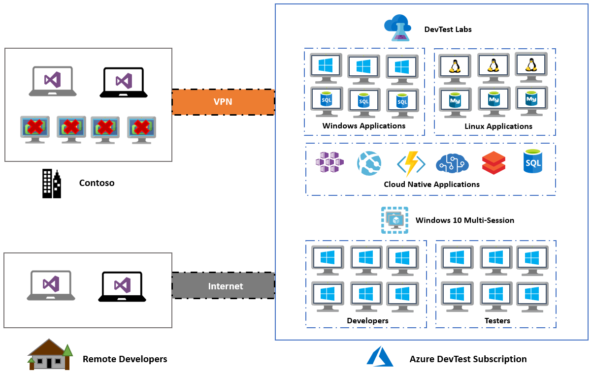
_Figure 1: Scenario architecture._

### Database considerations

To support ongoing development, Contoso has decided to continue use databases running on VMs, but the current VMs will be replaced with new ones running in DevTest Labs. In the future, Contoso will pursue the use of PaaS services such as [Azure SQL Database](https://docs.microsoft.com/azure/azure-sql/database/sql-database-paas-overview) and [Azure Database for MySQL](https://docs.microsoft.com/azure/mysql/overview).

- Current VMware database VMs will be decommissioned and replaced with Azure VMs in DevTest Labs. The existing databases will be migrated with simple backups and restores.
- By using the Azure Dev/Test subscription offer, the Windows Server and SQL Server instances will not incur licensing fees, minimizing compute costs.

### Solution review

Contoso evaluates the proposed design by putting together a pros and cons list.

| Consideration | Details |
| --- | --- |
| **Pros** | All of the current development VMs (app and database), will be replaced by new VMs running in DevTest Labs. This means they can take advantage of the features of a purpose-built cloud development environment.    Contoso can take advantage of their investment in the Azure Dev/Test subscription to save on licensing fees.    Contoso will retain full control of the app VMs in Azure.    Developers will be provided with rights to the subscription which empowers them to create new resources without waiting for IT to respond to their requests. |
| **Cons** | The migration will only move development to the cloud, but since they're still using VMs they won't be using using PaaS services in their development. This means that Contoso will need have to start supporting the operations of their VMs including security patches. This was maintained by IT in the past, so they will need to find a solution to this new operational task.    Contoso will have to build new app and database VMs, but in doing so they will be automating the process. This means they can take advantage of building VMs in the cloud and tools provided by DevTest Labs, so this is a positive outcome even with a con on their list. |

### Migration process

Contoso will migrate their development app and databases VMs to new Azure VMs using DevTest Labs.

- They already have the [Azure infrastructure](./contoso-migration-infrastructure.md) in place, including their development virtual network.
- With everything prepared, Contoso provisions and configures DevTest Labs.
- They will configure the development virtual network, assign a resource group and set policies.
- Contoso will create Windows virtual desktops for developers to use remote locations.
- Create VMs within DevTest Labs for development and migrate databases.

_Figure 2: The migration process._

## Prerequisites

Here's what Contoso needs to run this scenario.

| Requirements | Details |
| --- | --- |
| **Azure Dev/Test subscription** | Contoso creates an [Azure Dev/Test subscription](https://azure.microsoft.com/offers/ms-azr-0023p) to take advantage of up to 80% reduction in costs.    If you don't have an Azure subscription, create a [free account](https://azure.microsoft.com/pricing/free-trial).    If you create a free account, you're the administrator (admin) of your subscription and can perform all actions.    If you use an existing subscription and you're not the admin, you need to work with the admin to assign you owner or contributor permissions.    If you need more granular permissions, review [this article](https://docs.microsoft.com/azure/site-recovery/site-recovery-role-based-linked-access-control). |
| **Azure infrastructure** | [Learn how](./contoso-migration-infrastructure.md) Contoso set up an Azure infrastructure. |

## Scenario steps

Here's how Contoso admins will run the migration:

> [!div class="checklist"]
>
> - **Step 1: Provision a new Azure Dev/Test subscription and create a DevTest Labs instance.**
> - **Step 2: Configure the development virtual network, assign a resource group and set policies.**
> - **Step 3: Create Windows 10 multi-session virtual desktops for developers to use from remote locations.**
> - **Step 4: Create formulas and VMs within DevTest Labs for development and migrate databases.**

## Step 1: Provision a new Azure Dev/Test subscription and create a DevTest Labs instance

Contoso first needs to provision a new subscription using the Azure Dev/Test offer, and then create a DevTest Labs instance.

They set these up as follows:

Contoso follows the link to the [Azure Dev/Test subscription offer](https://azure.microsoft.com/offers/ms-azr-0023p) and provisions a new subscription, saving them up to 80 percent on their systems. This offer allows Contoso to run Windows 10 images on Azure for dev/test. They will gain access to [Windows Virtual Desktop](https://docs.microsoft.com/azure/virtual-desktop/overview) to simplify the management experience of the remote developers.

    
    _Figure 3: An Azure Dev/Test subscription offer._

With their new subscription provisioned, Contoso uses the Azure portal to create a new DevTest Labs instance. The new lab is created in the `ContosoDevRG` resource group.

    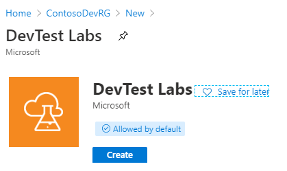
    _Figure 4: Creating a new DevTest labs instance._

## Step 2: Configure the development virtual network, assign a resource group, and set policies

With the DevTest Labs created Contoso will complete configurations on the following items:

- Configure the virtual network
- Assign a resource group
- Set lab policies

They set these up as follows:

1. Configure the virtual network:

    - In the portal, Contoso opens the DevTest Labs instance and selects **Configuration and policies:**

      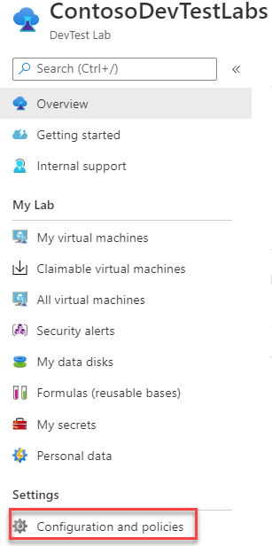
      _Figure 5: DevTest Labs instance: Configuration and policies._

    - Contoso selects **Virtual Networks** > **+ Add**, and then selects `vnet-dev-eus2`, and then **Save**. This allows the development VNet to be used for VM deployments. There is also a virtual network that was created during the deployment of the DevTest Labs instance.

      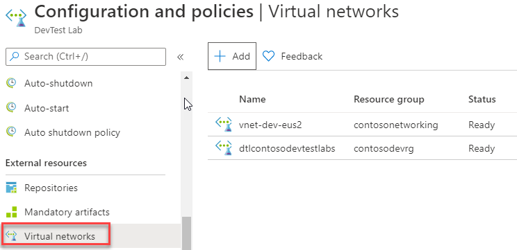
      _Figure 6: Virtual networks._

2. Assign a resource group:

    - To ensure that resources are deployed to the `ContosoDevRG` resource group, Contoso configures this in the lab settings. They also assign their developers the `Contributor` role.

      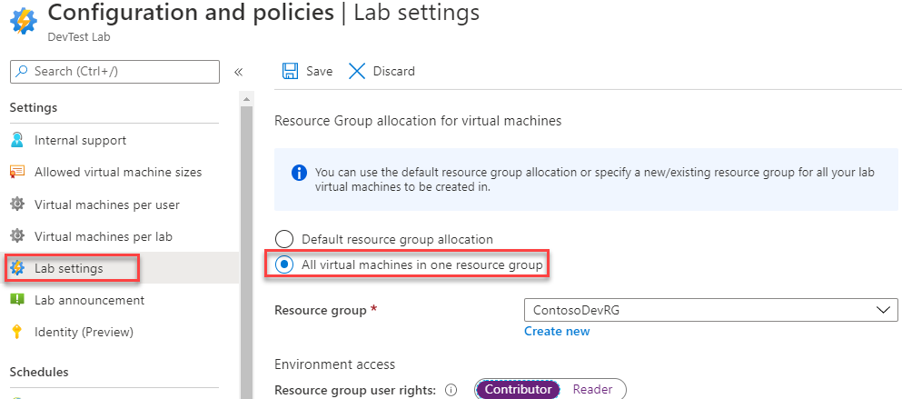
      _Figure 7: Assigning a resource group._

    > [!NOTE]
    > The contributor role is an administrator level role with all rights with the exception of having the ability to provide access to to other users. Read more about [Azure RBAC controls](https://docs.microsoft.com/azure/role-based-access-control/overview).

3. Set lab policies:

    - Contoso needs to ensure that their developers are using DevTest Labs within the policies of their team. They configure the DevTest Labs with these policies.

    - Auto-shutdown is enabled with a local time of 7:00:00 pm and the correct timezone.

      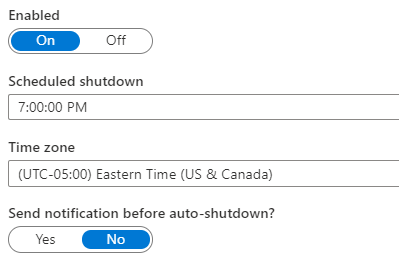
      _Figure 8: Auto-shutdown._

    - Auto-start is enabled to have their VMs up and running when the developers come online to work. They're configured to the local timezone and for the days of the week when they work.

      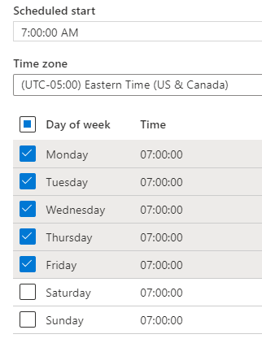
      _Figure 9: Auto-start._

    - The allowed VM sizes are configured, insuring that large and expensive VMs are not allowed to be started.

      
      _Figure 10: Allowed VM sizes._

    - The support message is configured.

      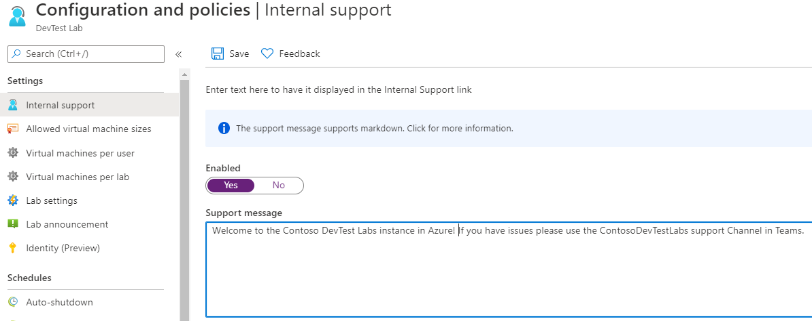
      _Figure 11: A support message._

## Step 3: Create Windows 10 multi-session virtual desktops for developers to use from remote locations

Contoso needs to create a Windows Virtual Desktop for remote developers.

Contoso creates a Windows 10 multi-session VM from a base:

- Contoso opens **All virtual machines**> **+ Add** and then selects a `Windows 10 enterprise multi-session` base.

  
  _Figure 12: A Windows 10 Enterprise multi-session base._

- Next, the size of the VM is configured along with the artifacts to be installed. In this case, the developers have access to common development tools such as Visual Studio Code, Git, and Chocolatey.

  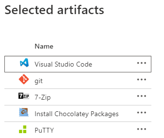
  _Figure 13: Artifacts._

- The VM configuration is reviewed for accuracy.

  
  _Figure 14: Create a virtual machine from base._

- Once the VM is created, Contoso's remote developers can then connect and use this development workstation for their work. The artifacts selected are installed saving developers time configuring their workstation.

  
  _Figure 15: A remote developer VM._

## Step 4: Create formulas and VMs within DevTest Labs for development and migrate databases

With DevTest Labs configured and the remote developers workstation up and running, Contoso focuses on building their VMs for development. To get started, Contoso completes the following steps:

Create formulas (reusable bases) for app and database VMs and provision app and database VMs using the formulas.

Create formulas for app and database VMs:

- Contoso selects **Formulas** > **+ Add**, and then selects a `Windows 2012 R2 Datacenter` base.
  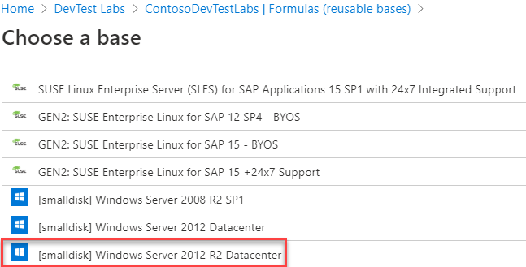
  _Figure 16: A Windows 2012 R2 base._

- Next, the size of the VM is configured along with the artifacts to be installed. In this case, the developers will have access to common development tools such as Visual Studio Code, Git, and Chocolatey.

  
  _Figure 17: A Windows 2012 R2 base configuration._

- To create the database VM formula, Contoso follows the same basic steps this time selecting a SQL Server 2012 image for the base.

  
  _Figure 18: An SQL Server 2012 image._

- The formula is configured with the size and artifacts, including SQL Server Management Studio, which is required for this database development VM formula.

  
  _Figure 19: An SQL 2020 R2 base configuration._

Learn more about using [formulas](https://docs.microsoft.com/azure/lab-services/devtest-lab-manage-formulas) with DevTest Labs.

- Contoso has now created the Windows base formulas for their developers to use for their apps and databases.

  
  _Figure 20: Windows base formulas._

Provision app and database VMs using the formulas:

- With the formulas created, Contoso next selects **All virtual machines** and then the `Windows2012AppDevVmBase` formula to match the configuration of their current app development VMs.

  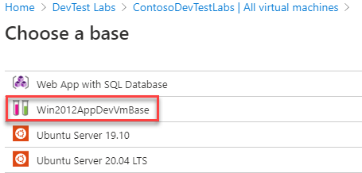
  _Figure 21: An app development VM._

- The VM is configured with the size and artifacts that are required for this app VM.

  
  _Figure 22: Size and artifact configurations for a VM._

- Next, the database VM is provisioned using the **SQLDbDevVmBase** formula to match the configuration of their current database development VMs.

  
  _Figure 23: A database VM._

- The VM is configured with the size and artifacts that are required.

  
  _Figure 24: Database configurations for a VM._

- With their first VMs created along with their remote developer's workstation, Contoso's developers are ready to start writing code in Azure.

  
  _Figure 25: Contoso VMs._

- Contoso can now restore their development databases either from backups or using some type of code generation process to build the schema on the VMs. With the SQL Server Management Studio already installed using the artifacts, these are simple tasks that don't require installing any tools.

## Clean up after migration

Contoso will continue using these steps to migrate their VMs to Azure using DevTest Labs. With each migration complete, all development VMs are now running in DevTest Labs.

Now, Contoso needs to complete these cleanup steps:

- Remove the VMs from the vCenter inventory.
- Remove all the VMs from from local backup jobs.
- Update internal documentation to show the new location, and IP addresses for the VMs.
- Review any resources that interact with the VMs, and update any relevant settings or documentation to reflect the new configuration.

### Security

The Contoso security team reviews the Azure VMs, to determine any security issues. To control access, the team reviews the network security groups (NSGs) for the VMs. NSGs are used to ensure that only traffic allowed to the app can reach it. The team also considers securing the data on the disk using Azure Disk Encryption and Azure Key Vault. For more information, see [Security best practices for IaaS workloads in Azure](https://docs.microsoft.com/azure/security/fundamentals/iaas).

### Licensing and cost optimization

- Contoso will ensure that all development Azure resources are created using this dev/test subscription to take advantage of the 80 percent savings.
- Budgets will be reviewed for all DevTest Labs and policies for the type of VMs will be put in place to ensure costs are contained and overprovisioning doesn't happen mistakenly.
- Contoso will enable [Azure Cost Management and Billing](https://docs.microsoft.com/azure/cost-management-billing/cost-management-billing-overview) to help monitor and manage the Azure resources.

## Conclusion

In this article, Contoso moved their development environments to DevTest Labs. They also implemented Windows Virtual Desktop as a platform for remote and contract developers.

**Need more help?**

[Create a DevTest Labs instance](https://docs.microsoft.com/azure/lab-services/devtest-lab-create-lab) in your subscription now and learn how to use [DevTest Labs for developers](https://docs.microsoft.com/azure/lab-services/devtest-lab-developer-lab).
