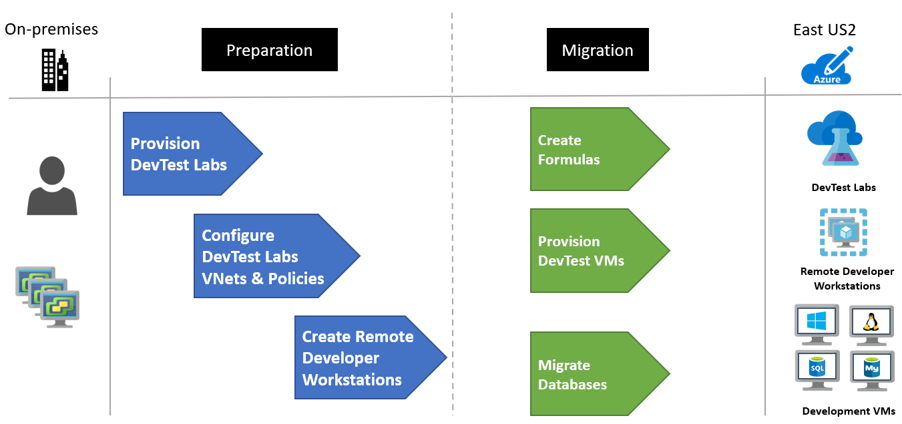

<!-- cSpell:ignore deltadan VMware contoso contoso's host vcenter -->

# Moving DevTest to Azure using DevTest Labs (Scenario)
This article demonstrates how the fictional company Contoso moves their DevTest environment to Azure using DevTest Labs.

## Migration Options

Contoso has several options available when moving DevTest to Azure.

**Migration Options** | **Outcome**
--- | ---
[**Azure Migrate**](https://azure.microsoft.com/services/azure-migrate/) | [Assess](https://docs.microsoft.com/azure/migrate/tutorial-assess-vmware) and [migrate](https://docs.microsoft.com/azure/migrate/tutorial-migrate-vmware) on-premises VMs  Run DevTest Servers using Azure IaaS   Manage VMs with [Azure Resource Manager](https://azure.microsoft.com/features/resource-manager/)
[**Azure DevTest Labs**](https://azure.microsoft.com/services/devtest-lab/) | Quickly provision development and test environments   Minimize waste with quotas and policies   Set automated shutdowns to minimize costs   Build Windows and Linux environments

> [NOTE]:
> This article focuses on using the Azure DevTest Labs service, to move an on-premises DevTest environment to Azure. Read how Contoso moved [DevTest to Azure using IaaS](./contoso-migration-dt-to-iaas.md) with Azure Migrate.

## Business drivers

The Development Leadership team has outlined what they want to achieve with this migration:

- Empower developers with access to DevOps tools and self service environments.
- Access to DevOps tools for CI/CD pipelines and cloud native tools for DevTest such as AI, Machine Learning and Serverless. 
- Ensure governance and compliance in DevTest environments.
- Save costs by moving all DevTest environments out of their data center, and no longer purchase hardware to develop software.

> ![NOTE]
> Contoso will leverage the Pay-As-You-Go [Dev/Test subscription offer](https://azure.microsoft.com/offers/ms-azr-0023p/) for their environments. Each active Visual Studio subscriber on their team can use the Microsoft software included with their subscription on Azure Virtual Machines for DevTest at no extra charge. Contoso will just pay the Linux rate for VMs they run, even VMs with SQL Server, SharePoint Server, or other software that is normally billed at a higher rate. 

> ![NOTE]
>Azure customers with a Enterprise Agreements can also benefit from the [DevTest subscription offer](https://azure.microsoft.com/offers/ms-azr-0148p/). To learn more, review this [video](https://channel9.msdn.com/blogs/EA.Azure.com/Enabling-and-Creating-EA-DevTest-Subscriptions-through-the-EA-Portal) on creating a DevTest subscription using the Enterprise Agreement portal.

## Migration goals

The Contoso development team has pinned down goals for this migration. These goals are used to determine the best migration method:

- Quickly provision development and test environments. It should take minutes not months to build the infrastructure a developer needs to write or test software.
- After migration, Contoso's DevTest environment in Azure should have enhanced capabilities over the current system on-premises.
- The operations model will move from IT provisioned VMs to DevOps with self-service provisioning.
- Contoso wants to quickly move out of their on-premises DevTest environments.
- All Developers to connect to DevTest environments remotely, but in a secure manor.

## Solution design

After pinning down goals and requirements, Contoso designs and reviews a deployment solution, including the Azure services they will use for DevTest.

### Current architecture

- The DevTest VMs for Contoso's applications are running on VMware in their on-premises data center.
- These VMs are used for development and testing prior to code being promoted to the production VMs.
- Developers maintain their own workstations, but need new solutions for connecting remotely since many of them are working from home.

### Proposed architecture

- Contoso will use a [DevTest subscription](https://azure.microsoft.com/offers/ms-azr-0023p/) to save costs on Azure resources. This subscription offers significant savings including VMs that don't incur licensing fees for Microsoft software.
- Azure DevTest Labs will be used for managing the environments. New VMs will be created in DevTest Labs in support of their move to new tools for Development and Test in the cloud.
- The on-premises DevTest VMs in the Contoso data center will be decommissioned after the migration is done.
- Developers and Testers will have access to Windows Virtual Desktop for their workstations.

### Database considerations

To support ongoing development Contoso has decided to continue use databases running on VMs, but the current VMs will be replaced with new ones running in Azure DevTest Labs. In the future, Contoso will pursue the use of PaaS services such as [Azure SQL Database](https://azure.microsoft.com/services/sql-database/) and [Azure Database for MySQL](https://azure.microsoft.com/services/mysql/).

- Current VMware database VMs will be decommissioned and replaced with Azure VMs in DevTest Labs.  The existing databases will be migrated with simple backups and restores.
- With the use of the Azure Dev/Test subscription offer, the Windows and SQL Servers will not incur licensing fees which will keep the compute costs to a minimum.

### Solution review

Contoso evaluates the proposed design by putting together a pros and cons list.

<!-- markdownlint-disable MD033 -->

**Consideration** | **Details**
--- | ---
**Pros** | All of the current development VMs (application and database), will be replaced by new VMs running in Azure DevTest Labs. This means they can take advantage of the features of a purpose built cloud development environment.   Contoso can take advantage of their investment in the Dev/Test subscription to save on licensing fees.   Contoso will retain full control of the app VMs in Azure.  Developers will be provided with rights to the subscription which empowers them to create new resources without waiting for IT to respond to their requests
**Cons** | The migration will only move development to the cloud, but since they are still using VMs they won't be using using PaaS Services in their development. This means that Contoso will need have to start supporting the operations of their VMs including security patches. This was maintained by IT in the past, so they will need to find a solution to this new operational task.   Contoso will have to build new application and database VMs, but in doing so they will be automating the process. This means they can take advantage of building VMs in the cloud and tools provided by DevTest Labs, so this is a positive outcome even with a con on their list.

<!-- markdownlint-enable MD033 -->

### Migration process

Contoso will migrate their development application and databases VMs to new Azure VMs using Azure DevTest Labs.

- They already have the [Azure infrastructure](./contoso-migration-infrastructure.md) in place, including their Development virtual network.
- With everything prepared, Contoso provisions and configures DevTest Labs.
- They will configure the development virtual network, assign a resource group and set polices.
- Contoso will create Windows Virtual Desktops for developers to use remote locations.
- Create VMs within DevTest Labs for development and migrate databases.

## Prerequisites

Here's what Contoso needs to run this scenario.

<!-- markdownlint-disable MD033 -->

**Requirements** | **Details**
--- | ---
**Azure Dev/Test subscription** | Contoso creates a [DevTest subscription](https://azure.microsoft.com/offers/ms-azr-0023p/) to take advantage of up to 80% reduction in costs.   If you don't have an Azure subscription, create a [free account](https://azure.microsoft.com/pricing/free-trial).   If you create a free account, you're the administrator of your subscription and can perform all actions.   If you use an existing subscription and you're not the administrator, you need to work with the admin to assign you Owner or Contributor permissions.   If you need more granular permissions, review [this article](https://docs.microsoft.com/azure/site-recovery/site-recovery-role-based-linked-access-control).
**Azure infrastructure** | [Learn how](./contoso-migration-infrastructure.md) Contoso set up an Azure infrastructure.

<!-- markdownlint-enable MD033 -->

## Scenario steps

Here's how Contoso admins will run the migration:

> [!div class="checklist"]
>
> - **Step 1: Provision new DevTest subscription and create a DevTest Labs**
> - **Step 2: Configure the Development virtual network, assign a resource group and set polices**
> - **Step 3: Create Windows 10 Multi-Session Virtual Desktops for developers to use from remote locations**
> - **Step 4: Create Formulas and VMs within DevTest Labs for development & migrate databases**

## Step 1: Provision new DevTest subscription and create a DevTest Labs

Contoso first needs a provision a new Azure Subscription using the DevTest offer and then create a DevTest Labs.

They set these up as follows:

1. Contoso follows the link to the [DevTest subscription](https://azure.microsoft.com/offers/ms-azr-0023p/) offer and provisions a new subscription saving them up to 80% on their systems. This offer allows Contoso to run Windows 10 images on Azure for dev/test. They will gain access the [Windows Virtual Desktop service](https://azure.microsoft.com/services/virtual-desktop/) to simplify the management experience of the remote developers.

2. With their new subscription provisioned, Contoso uses the Azure portal to create a new DevTest Labs instance.

- The new lab is created in the ***ContosoDevRG*** resource group.

 

 ## Step 2: Configure the Development virtual network, assign a resource group and set polices

With the DevTest Labs created Contoso will complete configurations on the following items:

- Configure virtual network
- Assign resource group
- Set lab policies

They set these up as follows:

1. Configure virtual network
 - In the portal, Contoso opens the DevTest Lab and selects ***Configuration and polices***
 
 
 
 - Contoso selects Virtual Networks, clicking +Add and then selects the ***vnet-dev-eus2*** and then Save. This allows the Development VNet to be used for VM deployments. There is also a virtual network that was created during the deployment of the DevTest Labs instance.

 

2. Assign resource group
 - To ensure that resources are deployed to ***ContosoDevRG*** resource group, Contoso configures this in the Lab settings. They also configure their developers as Contributor.
 

> [NOTE]:
> The contributor role is an administrator level role with all rights with the exception of having the ability to provide access to to other users. Read more about [Azure RBAC controls](https://docs.microsoft.com/azure/role-based-access-control/overview).

 3. Set lab policies
 - Contoso needs to ensure that their developers are using DevTest Labs within the polices of their team.  They configure the DevTest Labs with these polices.
 
 - Auto-shutdown is enabled with a local time of 7:00:00 PM and the correct timezone.

    

 - Auto-start is enabled to have their VMs up and running when the developers come online to work. They are configured to the local timezone and for the days of the week when they work.

     

- The allowed VM sizes are configured, insuring that large and expensive VMs are not allowed to be started.

    

- The Support message is configured.

    

 ## Step 3: Create Windows 10 Multi-Session Virtual Desktops for developers to use from remote locations

Contoso needs to create a Windows Virtual Desktop for remote developers.

1. Contoso creates a Windows 10 Muilt-Session VM using a base.

 - Contoso opens the All virtual machines, clicks +Add, and selects a ***Windows 10 Enterprise multi-session*** base.

    

 - Next the size of the VM is configured along with the Artifacts to be installed. In this case, the developers will have access to common development tools such as Visual Studio Code, Git, and Chocolatey.

    

 - The VM configuration is reviewed for accuracy.

    
    
 - Once the VM is created Contoso's Remote Developers can then connect and use this development workstation for their work. The artifacts selected are installed saving Developers time configuring their workstation.

    

 ## Step 4: Create Formulas and VMs within DevTest Labs for development & migrate databases

With Azure DevTest Labs configured and the Remote Developers workstation up and running, now Contoso focuses on building their VMs for development. To get started, Contoso completes the following steps:

- Create Formulas (reusable bases), for application and database VMs
- Provision application and database VMs using the Formulas

1. Create Formulas (reusable bases), for application and database VMs

 - Contoso opens the the Formulas, clicks +Add, and selects a ***Windows 2012 R2 Datacenter*** base.

    

 - Next the size of the VM is configured along with the Artifacts to be installed. In this case, the developers will have access to common development tools such as Visual Studio Code, Git, and Chocolatey.

    

 - To create the database vm Formula, Contoso follows the same basic steps this time selecting a SQL Server 2012 image for the base.

     

- The Formula is configured, with the size and Artifacts, including SQL Server Management Studio, which is required for this database development VM formula.

    

 Learn more about using [Formulas](https://docs.microsoft.com/en-us/azure/lab-services/devtest-lab-manage-formulas) with Azure DevTest Labs.

 - Contoso has now created the Windows based Formulas for their developers to use for their applications an databases.

    

2. Provision application and database VMs using the Formulas

- With the Formulas created, Contoso next selects All virtual machines and then the ***Windows2012AppDevVmBase*** Formula to match the configuration of their current application development VMs.

    

 - The VM is configured, with the size and Artifacts that are required for this application VM.

    

- Next, the database VM is provisioned using the ***SQLDbDevVmBase*** Formula to match the configuration of their current database development VMs. 

    

- The VM is configured, with the size and Artifacts that are required.

    

- With their first VMs created along with their Remote Developer's workstation Contoso's Developers are ready to start writing code in Azure.  

- Contoso can now restore their development databases from either backups or using some type of code generation process to build the schema on the VMs. With the SQL Management Studio already installed using the artifacts these are simple tasks that don't require installing any tools.
 
## Clean up after migration

Contoso will continue using these steps to migrate their VMs to Azure using DevTest Labs.  With each migration complete, all development VMs are now running in Azure DevTest Labs.

Now, Contoso needs to complete these cleanup steps:

- Remove the VMs from the vCenter inventory.
- Remove all the VMs from from local backup jobs.
- Update internal documentation to show the new location, and IP addresses for the VMs.
- Review any resources that interact with the VMs, and update any relevant settings or documentation to reflect the new configuration.

### Security

The Contoso security team reviews the Azure VMs, to determine any security issues.

- To control access, the team reviews the network security groups (NSGs) for the VMs. NSGs are used to ensure that only traffic allowed to the app can reach it.
- The team also consider securing the data on the disk using Azure Disk Encryption and Key Vault.

For more information, see [Security best practices for IaaS workloads in Azure](https://docs.microsoft.com/azure/security/fundamentals/iaas).

### Licensing and cost optimization

- Contoso will ensure that all development Azure resources are created using this DevTest subscription to take advantage of the 80% savings.
- Budgets will be reviewed for all DevTest Labs and policies for the type of VMs will be put in place to ensure costs are contained and over provisioning doesn't happen mistakenly.
- Contoso will enable [Azure Cost Management](https://docs.microsoft.com/azure/cost-management-billing/cost-management-billing-overview) to help monitor and manage the Azure resources.

## Conclusion

In this article, Contoso moved their development environments to Azure DevTest Labs. They also implemented Windows Virtual Desktop as a platform for remote and contract developers.

**Need more help?**

- [Create](https://docs.microsoft.com/en-us/azure/lab-services/devtest-lab-create-lab) an Azure DevTest Labs in your subscription now.
- [Learn about](https://docs.microsoft.com/en-us/azure/lab-services/devtest-lab-developer-lab) Using Azure DevTest Labs for Developers.