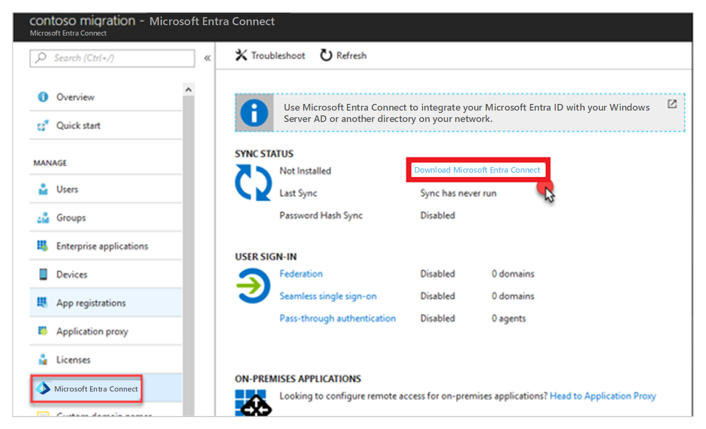
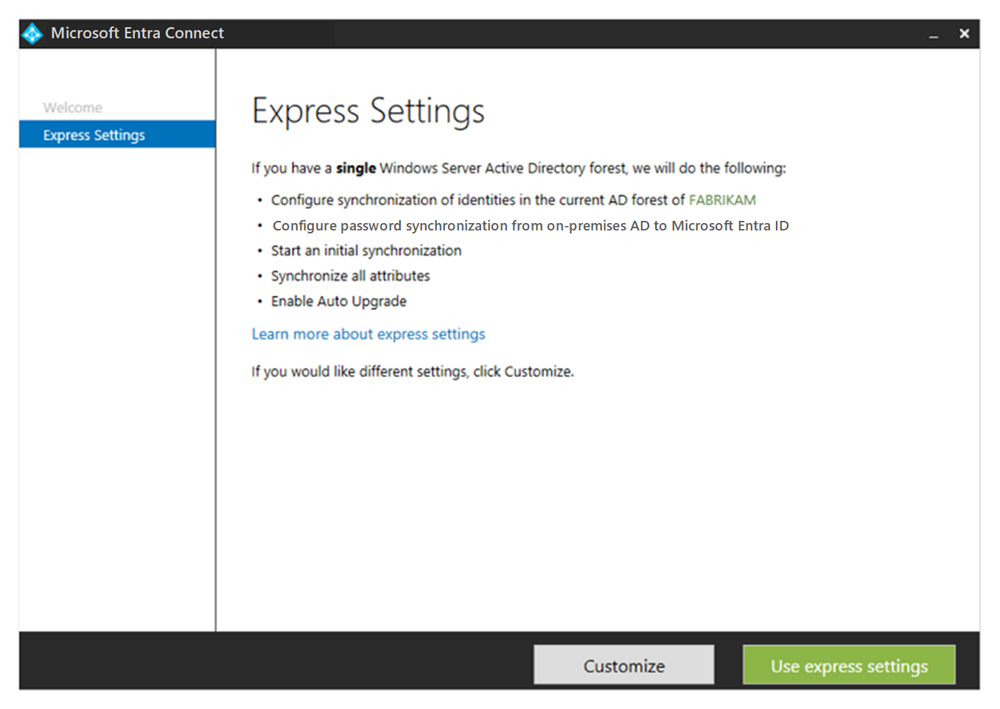

<!-- cSpell:ignore untrust CIDR RRAS CONTOSODC SYSVOL ITIL NSGs ASGs -->

# Deploy a migration infrastructure

This article shows how the fictional company Contoso prepares its on-premises infrastructure for migration, sets up an Azure infrastructure in preparation for migration, and runs the business in a hybrid environment.

When you use this example to help plan your own infrastructure migration efforts, keep in mind that the provided sample architecture is specific to Contoso. Review your organization's business needs, structure, and technical requirements when making important infrastructure decisions about subscription design or network architecture.

Whether you need all the elements described in this article depends on your migration strategy. For example, you might need a less complex network structure if you're building only cloud-native applications in Azure.

## Overview

Before Contoso can migrate to Azure, it's critical to prepare an Azure infrastructure. Generally, Contoso needs to think about six areas:

> [!div class="checklist"]
>
> - **Step 1: Azure subscriptions.** How will IT purchase Azure and interact with the Azure platform and services?
> - **Step 2: Hybrid identity.** How will IT manage and control access to on-premises and Azure resources after migration? How does IT extend or move identity management to the cloud?
> - **Step 3: Disaster recovery and resilience.** How will IT ensure that its applications and infrastructure are resilient if outages and disasters occur?
> - **Step 4: Network.** How should IT design a network infrastructure and establish connectivity between its on-premises datacenter and Azure?
> - **Step 5: Security.** How will IT secure the hybrid deployment?
> - **Step 6: Governance.** How will IT keep the deployment aligned with security and governance requirements?

## Before you start

Before we start reviewing the infrastructure, consider reading some background information about relevant Azure capabilities:

- Several options are available for purchasing Azure access, including pay-as-you-go subscriptions, a Microsoft Enterprise Agreement (EA), Open Licensing from Microsoft resellers, or purchasing from Microsoft partners in the Cloud Solution Provider (CSP) program. Learn about [purchase options](https://azure.microsoft.com/pricing/purchase-options/), and read about how [Azure subscriptions are organized](https://azure.microsoft.com/blog/organizing-subscriptions-and-resource-groups-within-the-enterprise/).
- Get an overview of Azure [identity and access management (IAM)](https://www.microsoft.com/security/business/identity). Learn about [Azure Active Directory (Azure AD) and extending on-premises Active Directory to the cloud](/azure/active-directory/fundamentals/active-directory-whatis).
- Azure provides a robust network infrastructure with options for hybrid connectivity. Get an overview of [networking and network access control](/azure/security/fundamentals/network-overview).
- Read the [introduction to Azure security](/azure/security/fundamentals/overview) and learn how to create a plan for [Azure governance](/azure/governance/).

## On-premises architecture

Here's a diagram that shows the current Contoso on-premises infrastructure.

*Figure 1: Contoso on-premises architecture.*

- Contoso has one main datacenter located in New York City in the eastern United States.
- There are three additional local branches across the United States.
- The main datacenter is connected to the internet with a fiber-optic Metro Ethernet connection (500 Mbps).
- Each branch is connected locally to the internet through business-class connections, with IPsec VPN tunnels back to the main datacenter. This approach allows the entire network to be permanently connected and optimizes internet connectivity.
- The main datacenter is fully virtualized with VMware. Contoso has two ESXi 6.5 virtualization hosts managed by vCenter Server 6.5.
- Contoso uses Active Directory for identity management and Domain Name System (DNS) servers on the internal network.
- The domain controllers in the datacenter run on VMware virtual machines (VMs). The domain controllers at local branches run on physical servers.

## Step 1: Buy and subscribe to Azure

Contoso needs to figure out how to buy Azure, how to manage subscriptions, and how to license services and resources.

### Buy Azure

Contoso is enrolling in an [Enterprise Agreement](https://azure.microsoft.com/overview/sales-number/). This agreement entails an upfront monetary commitment to Azure, which entitles Contoso to earn benefits like flexible billing options and optimized pricing.

Here are the details:

- Contoso estimated what its yearly Azure spend will be. When Contoso signed the agreement, it paid for the first year in full.
- Contoso needs to use all commitments before the year is over or lose the value for those dollars.
- If for some reason Contoso exceeds its commitment and spends more, Microsoft will invoice for the difference.
- Any cost incurred above the commitment will be at the same rates as those in the Contoso contract. There are no penalties for going over.

### Manage subscriptions

After paying for Azure, Contoso needs to figure out how to manage Azure subscriptions. Because Contoso has an EA, there's no limit on the number of Azure subscriptions it can create. An Azure Enterprise Agreement enrollment defines how a company shapes and uses Azure services, and defines a core governance structure.

As a first step, Contoso has defined a structure known as an *enterprise scaffold* for its enrollment. Contoso used the [Azure enterprise scaffold guidance](../../reference/azure-scaffold.md) to help understand and design a scaffold.

For now, Contoso has decided to use a functional approach to manage subscriptions:

- Inside the enterprise, it will use a single IT department that controls the Azure budget. This will be the only group with subscriptions.
- Contoso will extend this model in the future, so that other corporate groups can join as departments in the enrollment hierarchy.
- Inside the IT department, Contoso has structured two subscriptions, `Production` and `Development`.
- If Contoso needs more subscriptions in the future, it will also need to manage access, policies, and compliance for those subscriptions. Contoso will do that by introducing [Azure management groups](/azure/governance/management-groups/overview) as an additional layer above subscriptions.

*Figure 2: Enterprise hierarchy.*

### Examine licensing

With subscriptions configured, Contoso can look at Microsoft licensing. The licensing strategy will depend on the resources that Contoso wants to migrate to Azure and how VMs and services are selected and deployed in Azure.

#### Azure Hybrid Benefit

For deploying VMs in Azure, standard images include a license that will charge Contoso by the minute for the software being used. However, Contoso has been a long-term Microsoft customer and has maintained EAs and open licenses with Software Assurance.

Azure Hybrid Benefit provides a cost-effective method for migration. It allows Contoso to save on Azure VMs and SQL Server workloads by converting or reusing Windows Server Datacenter and Standard edition licenses covered with Software Assurance. This allows Contoso to pay a lower base compute rate for VMs and SQL Server. For more information, see [Azure Hybrid Benefit](https://azure.microsoft.com/pricing/hybrid-benefit/).

#### License Mobility

License Mobility through Software Assurance gives Microsoft Volume Licensing customers like Contoso the flexibility to deploy eligible server applications with active Software Assurance on Azure. This eliminates the need to purchase new licenses. With no associated mobility fees, existing licenses can easily be deployed in Azure. For more information, see [License Mobility through Software Assurance on Azure](https://azure.microsoft.com/pricing/license-mobility/).

#### Reserved instances for predictable workloads

Predictable workloads always need to be available with VMs running, such as line-of-business applications like an SAP ERP system. Unpredictable workloads are variable, like VMs that are on during high demand and off when demand is low.

*Figure 3: Azure Reserved Virtual Machine Instances.*

In exchange for using reserved instances for specific VM instances that must be maintained for long durations, Contoso can get both a discount and prioritized capacity. Using [Azure Reserved Virtual Machine Instances](https://azure.microsoft.com/pricing/reserved-vm-instances/) together with Azure Hybrid Benefit can save Contoso up to 82 percent off regular pay-as-you-go pricing (as of April 2018).

## Step 2: Manage hybrid identity

Giving and controlling user access to Azure resources with identity and access management is an important step in pulling together an Azure infrastructure.

Contoso decides to extend its on-premises Active Directory into the cloud, rather than build a new separate system in Azure. Because Contoso isn't using Microsoft 365 yet, it needs to provision an Azure AD instance. If Contoso were using Microsoft 365, it would already have an existing Azure AD tenant and directory, which it could use as its primary Azure AD instance.

Learn more about [Microsoft 365 identity models and Azure Active Directory](/microsoft-365/enterprise/about-microsoft-365-identity). You can also learn how to [associate or add an Azure subscription to your Azure Active Directory tenant](/azure/active-directory/fundamentals/active-directory-how-subscriptions-associated-directory).

### Create an Azure AD directory

Contoso is using the Azure AD Free edition that's included with an Azure subscription. Contoso admins create an Azure AD directory:

1. In the [Azure portal](https://portal.azure.com), they go to **Create a resource** > **Identity** > **Azure Active Directory**.

1. In **Create directory**, they specify a name for the directory, an initial domain name, and the region where the directory should be created.

   

   *Figure 4: Create an Azure AD directory.*

> [!NOTE]
> The directory that's created has an initial domain name in the form `domain-name.onmicrosoft.com`. The name can't be changed or deleted. Instead, the admins need to add its registered domain name to Azure AD.

### Add the domain name

To use the standard domain name, Contoso admins need to add it as a custom domain name to Azure AD. This option allows them to assign familiar user names. For example, a user can sign in with the email address `billg@contoso.com` instead of `billg@contosomigration.onmicrosoft.com`.

To set up a custom domain name, the admins add it to the directory, add a DNS entry, and then verify the name in Azure AD.

1. In **Custom domain names** > **Add custom domain**, they add the domain.
2. To use a DNS entry in Azure, they need to register it with their domain registrar:

    - In the **Custom domain names** list, they note the DNS information for the name. It's using an MX record.
    - They need access to the name server. They sign in to the `contoso.com` domain and create a new MX record for the DNS entry provided by Azure AD, by using the details noted.

3. After the DNS records propagate, they select **Verify** to check the custom domain name in the details for the domain.

    

    *Figure 5: Checking the domain name.*

### Set up on-premises and Azure groups and users

Now that the Azure AD directory is established, Contoso admins need to add employees to on-premises Active Directory groups that will synchronize to Azure AD. They should use on-premises group names that match the names of resource groups in Azure. This makes it easier to identify matches for synchronization purposes.

#### Create resource groups in Azure

Azure resource groups gather Azure resources together. Using a resource group ID allows Azure to perform operations on the resources within the group.

An Azure subscription can have multiple resource groups. A resource group exists in a single subscription. In addition, a single resource group can have multiple resources. A resource belongs to a single resource group.

Contoso admins set up Azure resource groups as shown in the following table.

| Resource group | Details |
| --- | --- |
| `ContosoCobRG` | This group contains all resources related to continuity of business. It includes vaults that Contoso will use for the Azure Site Recovery service and the Azure Backup service.    It also includes resources used for migration, including Azure Migrate and Azure Database Migration Service. |
| `ContosoDevRG` | This group contains dev/test resources. |
| `ContosoFailoverRG` | This group serves as a landing zone for failed-over resources. |
| `ContosoNetworkingRG` | This group contains all network resources. |
| `ContosoRG` | This group contains resources related to production applications and databases. |

They create resource groups as follows:

1. In the Azure portal > **Resource groups**, they add a group.
2. For each group, they specify a name, the subscription to which the group belongs, and the region.
3. Resource groups appear in the **Resource groups** list.

   

   *Figure 6: Resource groups.*

##### Scale resource groups

In future, Contoso will add other resource groups based on needs. For example, it might define a resource group for each application or service so that each can be managed and secured independently.

#### Create matching security groups on-premises

In the on-premises Active Directory instance, Contoso admins set up security groups with names that match the names of the Azure resource groups.

*Figure 7: On-premises Active Directory security groups.*

For management purposes, they create an additional group that will be added to all of the other groups. This group will have rights to all resource groups in Azure. A limited number of global admins will be added to this group.

### Synchronize Active Directory

Contoso wants to provide a common identity for accessing resources on-premises and in the cloud. To do this, it will integrate the on-premises Active Directory instance with Azure AD. With this model, users and organizations can take advantage of a single identity to access on-premises applications and cloud services, such as Microsoft 365, or thousands of other sites on the internet. Admins can use the groups in Active Directory to implement [Azure role-based access control (Azure RBAC)](/azure/role-based-access-control/role-assignments-portal).

To facilitate integration, Contoso uses the [Azure AD Connect tool](/azure/active-directory/hybrid/whatis-hybrid-identity). When you install and configure the tool on a domain controller, it synchronizes the on-premises Active Directory identities to Azure AD.

### Download the tool

1. In the Azure portal, Contoso admins go to **Azure Active Directory** > **Azure AD Connect** and download the latest version of the tool to the server they're using for synchronization.

    

    *Figure 8: Downloading Azure AD Connect.*

2. They start the `AzureADConnect.msi` installation by using **Express Settings**. This is the most common installation, and it can be used for a single-forest topology with password-hash synchronization for authentication.

    

    *Figure 9: Azure AD Connect Wizard.*

3. In **Connect to Azure AD**, they specify the credentials for connecting to Azure AD (in the form `admin@contoso.com` or `admin@contoso.onmicrosoft.com`).

    

    *Figure 10: Azure AD Connect Wizard: Connect to Azure AD.*

4. In **Connect to AD DS**, they specify credentials for the on-premises directory (in the form `CONTOSO\admin` or `contoso.com\admin`).

    

    *Figure 11: Azure AD Connect Wizard: Connect to AD DS.*

5. In **Ready to configure**, they select **Start the synchronization process when configuration completes** to start the sync immediately. Then they install.

    Note the following:

    - Contoso has a direct connection to Azure. If your on-premises Active Directory instance is behind a proxy, review [troubleshoot Azure AD connectivity](/azure/active-directory/hybrid/tshoot-connect-connectivity).

    - After the first synchronization, on-premises Active Directory objects are visible in the Azure AD directory.

      

      *Figure 12: On-premises Active Directory objects visible in Azure AD.*

    - The Contoso IT team is represented in each group and is based on its role.

      

      *Figure 13: Group membership.*

### Set up Azure RBAC

[Azure RBAC](/azure/role-based-access-control/role-assignments-portal) enables fine-grained access management for Azure. By using Azure RBAC, you can grant only the amount of access that users need to perform tasks. You assign the appropriate Azure role to users, groups, and applications at a scope level. The scope of a role assignment can be a subscription, a resource group, or a single resource.

Contoso admins then assign roles to the Active Directory groups that they synchronized from on-premises.

1. In the `ControlCobRG` resource group, they select **Access control (IAM)** > **Add role assignment**.
2. In **Add role assignment** > **Role** > **Contributor**, they select the `ContosoCobRG` security group from the list. The group then appears in the **Selected members** list.
3. They repeat this with the same permissions for the other resource groups (except for `ContosoAzureAdmins`) by adding **Contributor** permissions to the security group that matches the resource group.
4. For the `ContosoAzureAdmins` security group, they assign the **Owner** role.

    

    *Figure 14: Assigning roles to security groups.*

## Step 3: Design for resiliency

### Set up regions

Azure resources are deployed within regions. Regions are organized into geographies. Data residency, sovereignty, compliance, and resiliency requirements are honored within geographical boundaries.

A region consists of a set of datacenters. These datacenters are deployed within a latency-defined perimeter, and connected through a dedicated regional low-latency network.

Each Azure region is paired with a different region for resiliency. Read about [Azure regions](https://azure.microsoft.com/global-infrastructure/geographies/), and understand [how regions are paired](/azure/best-practices-availability-paired-regions).

Contoso has decided to use `East US 2` (located in Virginia) as the primary region and `Central US` (located in Iowa) as the secondary region, for these reasons:

- The Contoso datacenter is located in New York, and Contoso considered latency to the closest datacenter.
- `East US 2` has all the services and products that Contoso needs. Not all Azure regions have the same products and services available. For more information, see [Azure products by region](https://azure.microsoft.com/global-infrastructure/services/).
- `Central US` is the Azure paired region for `East US 2`.

As it thinks about the hybrid environment, Contoso needs to consider how to build resilience and a disaster recovery strategy into the region design. The simplest strategy is a single-region deployment, which relies on Azure platform features such as fault domains and regional pairing for resilience. The most complex is a full active-active model in which cloud services and database are deployed and servicing users from two regions.

Contoso has decided to take a middle road. It will deploy applications and resources in a primary region and keep a full copy of the infrastructure in the secondary region. With that strategy, the copy is ready to act as a full backup if a complete application disaster or regional failure occurs.

### Set up availability

#### Availability sets

Availability sets help protect applications and data from a local hardware and network outage within a datacenter. Availability sets distribute Azure VMs across physical hardware within a datacenter.

Fault domains represent underlying hardware with a common power source and network switch within the datacenter. VMs in an availability set are distributed across fault domains to minimize outages caused by a single hardware or network failure.

Update domains represent underlying hardware that can undergo maintenance or be rebooted at the same time. Availability sets also distribute VMs across multiple update domains to ensure that at least one instance will be running at all times.

Contoso will implement availability sets whenever VM workloads require high availability. For more information, see [Manage the availability of Windows VMs in Azure](/azure/virtual-machines/manage-availability).

#### Availability Zones

Availability Zones help protect applications and data from failures that affect an entire datacenter within a region.

Each Availability Zone represents a unique physical location within an Azure region. Each zone consists of one or more datacenters equipped with independent power, cooling, and networking.

There's a minimum of three separate zones in all enabled regions. The physical separation of zones within a region protects applications and data from datacenter failures.

Contoso will use Availability Zones whenever applications need greater scalability, availability, and resilience. For more information, see [Regions and Availability Zones in Azure](/azure/availability-zones/az-overview).

### Configure backup

#### Azure Backup

You can use Azure Backup to back up and restore Azure VM disks.

Azure Backup allows automated backups of VM disk images stored in Azure Storage. Backups are application consistent to ensure that backed-up data is transactionally consistent and that applications will start post-restore.

Azure Backup supports locally redundant storage (LRS) to replicate multiple copies of backup data within a datacenter if a local hardware failure occurs. If a regional outage occurs, Azure Backup also supports geo-redundant storage (GRS), which replicates backup data to a secondary paired region.

Azure Backup encrypts data in transit by using AES-256. Backed-up data at rest is encrypted through [Azure Storage encryption](/azure/storage/common/storage-service-encryption).

Contoso will use Azure Backup with GRS on all production VMs to ensure that workload data is backed up and can be quickly restored if a disruption occurs. For more information, see [An overview of Azure VM backup](/azure/backup/backup-azure-vms-introduction).

### Set up disaster recovery

#### Azure Site Recovery

Azure Site Recovery helps ensure business continuity by keeping business applications and workloads running during regional outages.

Azure Site Recovery continuously replicates Azure VMs from a primary to a secondary region, ensuring functional copies in both locations. In the event of an outage in the primary region, the application or service fails over to using the VM instances replicated in the secondary region. This failover minimizes potential disruption. When operations return to normal, the applications or services can fail back to VMs in the primary region.

Contoso will implement [Azure Site Recovery](/azure/site-recovery/site-recovery-overview) for all production VMs used in mission-critical workloads, ensuring minimal disruption during an outage in the primary region.

## Step 4: Design a network infrastructure

With the regional design in place, Contoso is ready to consider a network strategy. It needs to think about how the on-premises datacenter and Azure connect and communicate with each other, and how to design the network infrastructure in Azure. Specifically, Contoso needs to:

- **Plan hybrid network connectivity.** Figure out how it's going to connect networks across on-premises and Azure.
- **Design an Azure network infrastructure.** Decide how it will deploy networks over regions. How will networks communicate within the same region and across regions?
- **Design and set up Azure networks.** Set up Azure networks and subnets, and decide what will reside in them.

### Plan hybrid network connectivity

Contoso considered [several architectures for hybrid networking](/azure/architecture/reference-architectures/hybrid-networking/) between Azure and the on-premises datacenter. For more information, see [Choose a solution for connecting an on-premises network to Azure](/azure/architecture/reference-architectures/hybrid-networking/).

As a reminder, the Contoso on-premises network infrastructure currently consists of the datacenter in New York, and local branches in the eastern half of the United States. All locations have a business-class connection to the internet. Each of the branches is then connected to the datacenter via an IPsec VPN tunnel over the internet.

*Figure 15: The Contoso network.*

Here's how Contoso decided to implement hybrid connectivity:

1. Set up a new Site-to-Site VPN connection between the Contoso datacenter in New York and the two Azure regions, `East US 2` and `Central US`.
2. Branch office traffic bound for virtual networks in Azure will route through the main Contoso datacenter.
3. As Contoso scales up Azure deployment, it will establish an Azure ExpressRoute connection between the datacenter and the Azure regions. When this happens, Contoso will retain the VPN Site-to-Site connection for failover purposes only.
    - Learn more about [choosing between a VPN and ExpressRoute hybrid solution](/azure/architecture/reference-architectures/hybrid-networking/).
    - Verify [ExpressRoute locations and support](/azure/expressroute/expressroute-locations-providers).

**VPN only:**

*Figure 16: The Contoso VPN.*

**VPN and ExpressRoute:**

*Figure 17: Contoso VPN and ExpressRoute.*

### Design the Azure network infrastructure

Contoso's network configuration must make the hybrid deployment secure and scalable. Contoso is taking a long-term approach to this, designing virtual networks to be resilient and enterprise ready. For more information, see [Plan virtual networks](/azure/virtual-network/virtual-network-vnet-plan-design-arm).

To connect the two regions, Contoso will implement a hub-to-hub network model. Within each region, Contoso will use a hub-and-spoke model. To connect networks and hubs, Contoso will use Azure network peering.

#### Network peering

[Virtual network peering](/azure/virtual-network/virtual-network-peering-overview) in Azure connects virtual networks and hubs. Global peering allows connections between virtual network or hubs in different regions. Local peering connects virtual networks in the same region.

Virtual network peering provides several advantages:

- Network traffic between peered virtual networks is private.
- Traffic between the virtual networks is kept on the Microsoft backbone network. No public internet, gateways, or encryption is required in the communication between the virtual networks.
- Peering provides a default, low-latency, high-bandwidth connection between resources in different virtual networks.

#### Hub-to-hub model across regions

Contoso will deploy a hub in each region. A hub is a virtual network in Azure that acts as a central point of connectivity to your on-premises network. The hub virtual networks will connect to each other via global virtual network peering, which connects virtual networks across Azure regions. The hub in each region is peered to its partner hub in the other region. The hub is peered to every network in its region, and it can connect to all network resources.

*Figure 18: Global peering.*

#### Hub-and-spoke model within a region

Within each region, Contoso will deploy virtual networks for different purposes as spoke networks from the region hub. Virtual networks within a region use peering to connect to their hub and to each other.

#### Design the hub network

Within the hub-and-spoke model, Contoso needed to think about how traffic from the on-premises datacenter and from the internet would be routed. Here's how Contoso decided to handle routing for both the `East US 2` and `Central US` hubs:

- Contoso is designing a network that allows traffic from the internet and from the corporate network by using a VPN to Azure.
- The network architecture has two boundaries, an untrusted front-end perimeter zone and a back-end trusted zone.
- A firewall will have a network adapter in each zone, controlling access to trusted zones.
- From the internet:
  - Internet traffic will hit a load-balanced public IP address on the perimeter network.
  - This traffic is routed through the firewall and subject to firewall rules.
  - After network access controls are implemented, traffic will be forwarded to the appropriate location in the trusted zone.
  - Outbound traffic from the virtual network will be routed to the internet through user-defined routes. The traffic is forced through the firewall and inspected in line with Contoso policies.
- From the Contoso datacenter:
  - Incoming traffic over Site-to-Site VPN or ExpressRoute hits the public IP address of the Azure VPN gateway.
  - Traffic is routed through the firewall and subject to firewall rules.
  - After the application of firewall rules, traffic is forwarded to an internal load balancer (Standard SKU) on the trusted internal zone subnet.
  - Outbound traffic from the trusted subnet to the on-premises datacenter over the VPN is routed through the firewall. Rules are applied before traffic goes over the Site-to-Site VPN connection.

### Design and set up Azure networks

With a network and routing topology in place, Contoso is ready to set up Azure networks and subnets:

<!-- docutune:casing "class-A" "class-B" -->

- Contoso will implement a class-A private network in Azure (`10.0.0.0/8`). This works because of on-premises; it currently has a class-B private address space (`172.160.0.0/16`). Contoso can be sure there won't be any overlap between address ranges.
- Contoso will deploy virtual networks in both the primary and secondary regions.
- Contoso will use a naming convention that includes the prefix `VNET` and the region abbreviation `EUS2` or `CUS`. Using this standard, the hub networks will be named `VNET-HUB-EUS2` in the `East US 2` region and `VNET-HUB-CUS` in the `Central US` region.

#### Virtual networks in `East US 2`

`East US 2` is the primary region that Contoso will use to deploy resources and services. Here's how Contoso will design networks in that region:

- **Hub:** The hub virtual network in `East US 2` is considered Contoso's primary connectivity to the on-premises datacenter.

- **Virtual networks:** The spoke virtual networks in `East US 2` can be used to isolate workloads if necessary. In addition to the hub virtual network, Contoso will have two spoke virtual networks in `East US 2`:

  - `VNET-DEV-EUS2`. This virtual network will provide the dev/test team with a fully functional network for dev projects. It will act as a production pilot area, and will rely on the production infrastructure to function.

  - `VNET-PROD-EUS2`. Azure IaaS production components will be located in this network.

  Each virtual network will have its own unique address space without overlap. Contoso intends to configure routing without requiring network address translation (NAT).

- **Subnets:** There will be a subnet in each network for each application tier. Each subnet in the production network will have a matching subnet in the development virtual network. The production network has a subnet for domain controllers.

The following table summarizes virtual networks in `East US 2`.

| Virtual network | Range | Peer |
| --- | --- | --- |
| `VNET-HUB-EUS2` | `10.240.0.0/20` | `VNET-HUB-CUS2`, `VNET-DEV-EUS2`, `VNET-PROD-EUS2` |
| `VNET-DEV-EUS2` | `10.245.16.0/20` | `VNET-HUB-EUS2` |
| `VNET-PROD-EUS2` | `10.245.32.0/20` | `VNET-HUB-EUS2`, `VNET-PROD-CUS` |

*Figure 19: A hub-and-spoke model.*

#### Subnets in the `East US 2 Hub` network (`VNET-HUB-EUS2`)

| Subnet/zone | CIDR | Usable IP addresses |
| --- | --- | --- |
| `IB-UntrustZone` | `10.240.0.0/24`  | 251 |
| `IB-TrustZone`   | `10.240.1.0/24`  | 251 |
| `OB-UntrustZone` | `10.240.2.0/24`  | 251 |
| `OB-TrustZone`   | `10.240.3.0/24`  | 251 |
| `GatewaySubnet`  | `10.240.10.0/24` | 251 |

#### Subnets in the `East US 2` development network (`VNET-DEV-EUS2`)

The development team uses the development virtual network as a production pilot area. It has three subnets.

| Subnet | CIDR | Addresses | In subnet |
| --- | --- | --- | --- |
| `DEV-FE-EUS2` | `10.245.16.0/22` | 1019 | Front ends/web-tier VMs |
| `DEV-APP-EUS2` | `10.245.20.0/22` | 1019 | Application-tier VMs |
| `DEV-DB-EUS2` | `10.245.24.0/23` | 507 | Database VMs |

#### Subnets in the `East US 2` production network (`VNET-PROD-EUS2`)

Azure IaaS components are located in the production network. Each application tier has its own subnet. Subnets match those in the development network, with the addition of a subnet for domain controllers.

| Subnet | CIDR | Addresses | In subnet |
| --- | --- | --- | --- |
| `PROD-FE-EUS2` | `10.245.32.0/22` | 1019 | Front ends/web-tier VMs |
| `PROD-APP-EUS2` | `10.245.36.0/22` | 1019 | Application-tier VMs |
| `PROD-DB-EUS2` | `10.245.40.0/23` | 507 | Database VMs |
| `PROD-DC-EUS2` | `10.245.42.0/24` | 251 | Domain controller VMs |

*Figure 20: Hub network architecture.*

#### Virtual networks in `Central US` (secondary region)

`Central US` is Contoso's secondary region. Here's how Contoso will architect networks within it:

- **Hub:** The hub virtual network in `Central US` is considered the secondary point of connectivity to the on-premises datacenter. The spoke virtual networks in `Central US` can be used to isolate workloads if necessary, managed separately from other spokes.

- **Virtual networks:** Contoso will have two virtual networks in `Central US`:
  - `VNET-PROD-CUS`: This is a production network and can be thought of as a secondary hub.
  - `VNET-ASR-CUS`: This virtual network will act as a location in which VMs are created after failover from on-premises or as a location for Azure VMs failed over from the primary to the secondary region. This network is similar to the production networks but without any domain controllers on it.

  Each virtual network in the region will have its own address space without overlap. Contoso will configure routing without NAT.

- **Subnets:** The subnets will be designed in a similar way to those in `East US 2`.

The following table summarizes virtual networks in `Central US`.

| Virtual network | Range | Peer |
| --- | --- | --- |
| `VNET-HUB-CUS` | `10.250.0.0/20` | `VNET-HUB-EUS2`, `VNET-ASR-CUS`, `VNET-PROD-CUS` |
| `VNET-ASR-CUS` | `10.255.16.0/20` | `VNET-HUB-CUS`, `VNET-PROD-CUS` |
| `VNET-PROD-CUS` | `10.255.32.0/20` | `VNET-HUB-CUS`, `VNET-ASR-CUS`, `VNET-PROD-EUS2` |

*Figure 21: A hub-and-spoke model in a paired region.*

#### Subnets in the `Central US` hub network (`VNET-HUB-CUS`)

| Subnet | CIDR | Usable IP addresses |
| --- | --- | --- |
| `IB-UntrustZone` | `10.250.0.0/24` | 251 |
| `IB-TrustZone` | `10.250.1.0/24` | 251 |
| `OB-UntrustZone` | `10.250.2.0/24` | 251 |
| `OB-TrustZone` | `10.250.3.0/24` | 251 |
| `GatewaySubnet` | `10.250.10.0/24` | 251 |

#### Subnets in the `Central US` production network (`VNET-PROD-CUS`)

In parallel with the production network in the primary region (`East US 2`), there's a production network in the secondary region (`Central US`).

| Subnet | CIDR | Addresses | In subnet |
| --- | --- | --- | --- |
| `PROD-FE-CUS` | `10.255.32.0/22` | 1019 | Front ends/web-tier VMs |
| `PROD-APP-CUS` | `10.255.36.0/22` | 1019 | Application-tier VMs |
| `PROD-DB-CUS` | `10.255.40.0/23` | 507 | Database VMs |
| `PROD-DC-CUS` | `10.255.42.0/24` | 251 | Domain controller VMs |

#### Subnets in the `Central US` failover/recovery network (`VNET-ASR-CUS`)

The `VNET-ASR-CUS` network is used for failover between regions. Site Recovery will be used to replicate and fail over Azure VMs between the regions. It also functions as a Contoso datacenter to the Azure network for protected workloads that remain on-premises but fail over to Azure for disaster recovery.

`VNET-ASR-CUS` is the same basic subnet as the production virtual network in `East US 2` but without the need for a domain controller subnet.

| Subnet | CIDR | Addresses | In subnet |
| --- | --- | --- | --- |
| `ASR-FE-CUS` | `10.255.16.0/22` | 1019 | Front ends/web-tier VMs |
| `ASR-APP-CUS` | `10.255.20.0/22` | 1019 | Application-tier VMs |
| `ASR-DB-CUS` | `10.255.24.0/23` | 507 | Database VMs |

*Figure 22: Hub network architecture.*

#### Configure peered connections

The hub in each region will be peered to the hub in the other region and to all virtual networks within the hub region. This configuration allows for hubs to communicate and to view all virtual networks within a region. Note that peering creates a two-sided connection. One is from the initiating peer on the first virtual network, and the other is on the second virtual network.

In a hybrid deployment, traffic that passes between peers needs to be visible from the VPN connection between the on-premises datacenter and Azure. To enable this, Contoso must use specific settings on peered connections. For any connections from spoke virtual networks through the hub to the on-premises datacenter, Contoso needs to allow traffic to be forwarded and to cross the VPN gateways.

##### Domain controller

For the domain controllers in the `VNET-PROD-EUS2` network, Contoso wants traffic to flow both between the `EUS2` hub/production network and over the VPN connection to on-premises. To do this, Contoso admins must allow the following:

1. **Allow forwarded traffic** and **Allow gateway transit configurations** on the peered connection. In our example, this would be the connection from `VNET-HUB-EUS2` to `VNET-PROD-EUS2`.

    

    *Figure 23: A peered connection.*

2. **Allow forwarded traffic** and **Use remote gateways** on the other side of the peering, on the connection from `VNET-PROD-EUS2` to `VNET-HUB-EUS2`.

    

    *Figure 24: A peered connection.*

3. On-premises, they set up a static route that directs the local traffic to route across the VPN tunnel to the virtual network. The configuration is completed on the gateway that provides the VPN tunnel from Contoso to Azure. They use routing and remote access service (RRAS) for the static route.

    

    *Figure 25: A peered connection.*

##### Production networks

A spoked peer network can't see a spoked peer network in another region via a hub. For Contoso's production networks in both regions to see each other, Contoso admins need to create a direct peered connection for `VNET-PROD-EUS2` and `VENT-PROD-CUS`.

*Figure 26: Creating a direct peered connection.*

### Set up DNS

When you deploy resources in virtual networks, you have a couple of choices for domain name resolution. You can use name resolution provided by Azure or provide DNS servers for resolution. The type of name resolution that you use depends on how your resources need to communicate with each other. Get [more information](/azure/virtual-network/virtual-networks-name-resolution-for-vms-and-role-instances#azure-provided-name-resolution) about the Azure DNS service.

Contoso admins have decided that the Azure DNS service isn't a good choice in the hybrid environment. Instead, they'll use the on-premises DNS servers. Here are the details:

- Because this is a hybrid network, all VMs on-premises and in Azure need to be able to resolve names to function properly. This means that custom DNS settings must be applied to all the virtual networks.
- Contoso currently has domain controllers (DCs) deployed in the Contoso datacenter and at the branch offices. The primary DNS servers are `contosodc1` (`172.16.0.10`) and `contosodc2` (`172.16.0.1`).
- After the virtual networks are deployed, the on-premises domain controllers are configured as DNS servers in the networks.
- If an optional custom DNS is specified for the virtual network, the virtual IP address `168.63.129.16` for the recursive resolvers in Azure must be added to the list. To do this, Contoso configures DNS server settings on each virtual network. For example, the custom DNS settings for the `VNET-HUB-EUS2` network would be as follows:

    

    *Figure 27: A custom DNS.*

In addition to the on-premises domain controllers, Contoso will implement four domain controllers to support the Azure networks (two for each region):

| Region | DC | Virtual network | Subnet | IP address |
| --- | --- | --- | --- | --- |
| `East US 2` | `contosodc3` | `VNET-PROD-EUS2` | `PROD-DC-EUS2` | `10.245.42.4` |
| `East US 2` | `contosodc4` | `VNET-PROD-EUS2` | `PROD-DC-EUS2` | `10.245.42.5` |
| `Central US` | `contosodc5` | `VNET-PROD-CUS` | `PROD-DC-CUS` | `10.255.42.4` |
| `Central US` | `contosodc6` | `VNET-PROD-CUS` | `PROD-DC-CUS` | `10.255.42.4` |

After deploying the on-premises domain controllers, Contoso needs to update the DNS settings on networks on either region to include the new domain controllers in the DNS server list.

#### Set up domain controllers in Azure

After updating network settings, Contoso admins are ready to build out the domain controllers in Azure.

1. In the Azure portal, they deploy a new Windows Server VM to the appropriate virtual network.
2. They [create availability sets](/azure/virtual-machines/windows/tutorial-availability-sets) in each location for the VM. Availability sets ensure that the Azure fabric separates the VMs into different infrastructures in the Azure region. Availability sets also allow Contoso to be eligible for the 99.95 percent service-level agreement (SLA) for VMs in Azure.

    

    *Figure 28: An availability set.*

3. After the VM is deployed, they open the network interface for the VM. They set the private IP address to static and specify a valid address.

    

    *Figure 29: A VM NIC.*

4. They attach a new data disk to the VM. This disk contains the Active Directory database and the sysvol share.

   The size of the disk will determine the number of IOPS that it supports. Over time, the disk size might need to increase as the environment grows.

   > [!NOTE]
   > The disk shouldn't be set to read/write for host caching. Active Directory databases don't support this.

   

   *Figure 30: An Active Directory disk.*

5. After the disk is added, they connect to the VM over Remote Desktop Services and open Server Manager.

6. In **File and Storage Services**, they run the New Volume Wizard. They ensure that the drive is assigned the letter F or above on the local VM.

    

    *Figure 31: New Volume Wizard.*

7. In Server Manager, they add the **Active Directory Domain Services** role. Then, they configure the VM as a domain controller.

    

    *Figure 32: Adding the server role.*

8. After the VM is configured as a DC and restarted, they open DNS manager and configure the Azure DNS resolver as a forwarder. This allows the DC to forward DNS queries it can't resolve in the Azure DNS.

    

    *Figure 33: Configuring the Azure DNS resolver.*

9. They update the custom DNS settings for each virtual network with the appropriate domain controller for the virtual network region. They include on-premises DCs in the list.

### Set up Active Directory

Active Directory is a critical service for a network and must be configured correctly. Contoso admins will build Active Directory sites for the Contoso datacenter and for the `East US 2` and `Central US` regions.

1. They create two new sites (`AZURE-EUS2` and `AZURE-CUS`) along with the datacenter site (`contoso-datacenter`).
2. After creating the sites, they create subnets in the sites, to match the virtual networks and datacenter.

    

    *Figure 34: Datacenter subnets.*

3. They create two site links to connect everything. The domain controllers should then be moved to their location.

    

    *Figure 35: Datacenter links.*

4. They confirm that the Active Directory replication topology is in place.

    

    *Figure 36: Datacenter replication.*

With everything complete, a list of the domain controllers and sites is shown in the on-premises Active Directory Administrative Center.

*Figure 37: The Active Directory Administrative Center.*

## Step 5: Plan for governance

Azure provides a range of governance controls across services and the Azure platform. For more information, see the [Azure governance options](/azure/governance/).

As it configures identity and access control, Contoso has already begun to put some aspects of governance and security in place. Broadly, it needs to consider three areas:

- **Policy:** Azure Policy applies and enforces rules and effects over your resources, so the resources comply with corporate requirements and SLAs.
- **Locks:** Azure allows you to lock subscriptions, resource groups, and other resources so that they can be modified only by those with permissions.
- **Tags:** Resources can be controlled, audited, and managed with tags. Tags attach metadata to resources, providing information about resources or owners.

### Set up policies

The Azure Policy service evaluates your resources by scanning for those not compliant with policy definitions. For example, you might have a policy that only allows certain types of VMs or requires resources to have a specific tag.

Policies specify a policy definition, and a policy assignment specifies the scope in which a policy should be applied. The scope can range from a management group to a resource group. Learn how to [create and manage policies](/azure/governance/policy/tutorials/create-and-manage).

Contoso wants to begin two policies. It wants a policy to ensure that resources can be deployed in the `East US 2` and `Central US` regions only. It also wants a policy to limit VM SKUs to approved SKUs only. The intention is to ensure that expensive VM SKUs aren't used.

#### Limit resources to regions

Contoso uses the built-in policy definition **Allowed locations** to limit resource regions.

1. In the Azure portal, select **All services**, and search for **Policy**.
2. Select **Assignments** > **Assign policy**.
3. In the policy list, select **Allowed locations**.
4. Set **Scope** to the name of the Azure subscription, and select the two regions in the allowlist.

    

    *Figure 38: Allowed locations defined via policy.*

5. By default, the policy is set with **Deny**. This setting means that if someone starts a deployment in the subscription that isn't in either the `East US 2` or `Central US` region, the deployment will fail. Here's what happens if someone in the Contoso subscription tries to set up a deployment in `West US`.

    

    *Figure 39: A failed policy.*

#### Allow specific VM SKUs

Contoso will use the built-in policy definition `Allow virtual machine SKUs` to limit the types of VMs that can be created in the subscription.

*Figure 40: A policy SKU.*

#### Check policy compliance

Policies go into effect immediately, and Contoso can check resources for compliance. In the Azure portal, select the **Compliance** link. The compliance dashboard appears. You can drill down for more details.

*Figure 41: Policy compliance.*

### Set up locks

Contoso has long been using the ITIL framework for the management of its systems. One of the most important aspects of the framework is change control, and Contoso wants to make sure that change control is implemented in the Azure deployment.

Contoso will [lock resources](/azure/azure-resource-manager/management/lock-resources). Any production or failover component must be in a resource group that has a read-only lock. This means that to modify or delete production items, authorized users must remove the lock. Nonproduction resource groups will have `CanNotDelete` locks. This means that authorized users can read or modify a resource but can't delete it.

### Set up tagging

To track resources as they're added, it will be increasingly important for Contoso to associate resources with an appropriate department, customer, and environment. In addition to providing information about resources and owners, tags will enable Contoso to aggregate and group resources and to use that data for chargeback purposes.

Contoso needs to visualize its Azure assets in a way that makes sense for the business, such as by role or department. Note that resources don't need to reside in the same resource group to share a tag. Contoso will create a tag taxonomy so that everyone uses the same tags.

| Tag name | Value |
| --- | --- |
| `CostCenter` | 12345: It must be a valid cost center from SAP. |
| `BusinessUnit` | Name of the business unit (from SAP). Matches `CostCenter`. |
| `ApplicationTeam` | Email alias of the team that owns support for the application. |
| `CatalogName` | Name of the application or `SharedServices`, according to the service catalog that the resource supports. |
| `ServiceManager` | Email alias of the ITIL Service Manager for the resource. |
| `COBPriority` | Priority set by the business for BCDR. Values of 1-5. |
| `ENV` | `DEV`, `STG`, and `PROD` are the allowed values, representing development, staging, and production. |

For example:

*Figure 42: Azure tags.*

After creating the tag, Contoso will go back and create new policy definitions and assignments to enforce the use of the required tags across the organization.

## Step 6: Consider security

Security is crucial in the cloud, and Azure provides a wide array of security tools and capabilities. These help you to create secure solutions on the secure Azure platform. See [Trust your cloud](https://azure.microsoft.com/overview/trusted-cloud/) to learn more about Azure security.

There are a few aspects for Contoso to consider:

- [Azure Security Center](/azure/security-center/security-center-introduction) provides unified security management and Microsoft Defender for Identity across hybrid cloud workloads. Use it to apply security policies across your workloads, limit your exposure to threats, and detect and respond to attacks.
- A [network security group (NSG)](/azure/virtual-network/network-security-groups-overview) filters network traffic based on a list of security rules that allow or deny network traffic to resources connected to virtual networks in Azure.
- [Azure Disk Encryption](/azure/security/fundamentals/encryption-atrest) is a capability that helps you encrypt your Windows and Linux IaaS VM disks.

### Work with the Azure Security Center

Contoso is looking for a quick view into the security posture of its new hybrid cloud, and specifically, its Azure workloads. As a result, Contoso has decided to implement Azure Security Center starting with the following features:

- Centralized policy management
- Continuous assessment
- Actionable recommendations

#### Centralize policy management

With centralized policy management, Contoso will ensure compliance with security requirements by centrally managing security policies across the entire environment. It can simply and quickly implement a policy that applies to all of its Azure resources.

*Figure 43: A security policy.*

#### Assess security

Contoso will take advantage of the continuous security assessment that monitors the security of machines, networks, storage, data, and applications to discover potential security issues.

Security Center analyzes the security state of the Contoso compute, infrastructure, and data resources. It also analyzes the security state of Azure apps and services. Continuous assessment helps the Contoso operations team to discover potential security issues, such as systems with missing security updates or exposed network ports.

Contoso wants to make sure all of the VMs are protected. Security Center helps with this. It verifies VM health, and it makes prioritized and actionable recommendations to remediate security vulnerabilities before they're exploited.

*Figure 44: Monitoring.*

### Work with NSGs

Contoso can limit network traffic to resources in a virtual network by using network security groups.

A network security group contains a list of security rules that allow or deny inbound or outbound network traffic based on source or destination IP address, port, and protocol. When applied to a subnet, rules are applied to all resources in the subnet. In addition to network interfaces, this includes instances of Azure services deployed in the subnet.

Application security groups (ASGs) enable you to configure network security as a natural extension of an application structure. You can then group VMs and define network security policies based on those groups.

Contoso can use ASGs to reuse the security policy at scale without manual maintenance of explicit IP addresses. The platform handles the complexity of explicit IP addresses and multiple rule sets, so the organization can focus on business logic. Contoso can specify an ASG as the source and destination in a security rule. After a security policy is defined, Contoso can create VMs and assign the VM NICs to a group.

Contoso will implement a mix of NSGs and ASGs. Contoso is concerned about NSG management. It's also worried about the overuse of NSGs and the added complexity for operations staff. Here's what Contoso will do:

- All traffic into and out of all subnets (north/south) will be subject to an NSG rule, except for the gateway subnets in the hub networks.
- Any firewalls or domain controllers will be protected by both subnet NSGs and NIC NSGs.
- All production applications will have ASGs applied.

Contoso has built a model of how this security configuration will look for its applications.

*Figure 45: Security model.*

The NSGs associated with the ASGs will be configured with least privilege to ensure that only allowed packets can flow from one part of the network to its destination.

| Action | Name | Source | Target | Port |
| --- | --- | --- | --- | --- |
| `Allow` | `AllowInternetToFE` | `VNET-HUB-EUS1`/`IB-TrustZone` | `APP1-FE` | 80, 443 |
| `Allow` | `AllowWebToApp` | `APP1-FE` | `APP1-APP` | 80, 443 |
| `Allow` | `AllowAppToDB` | `APP1-APP` | `APP1-DB` | 1433 |
| `Deny`  | `DenyAllInbound` | Any | Any | Any |

### Encrypt data

Azure Disk Encryption integrates with Azure Key Vault to help control and manage the disk-encryption keys and secrets for a subscription. It ensures that all data on VM disks is encrypted at rest in Azure Storage.

Contoso has determined that specific VMs require encryption. Contoso will apply encryption to VMs with customer, confidential, or personal data.

## Conclusion

In this article, Contoso set up an Azure infrastructure and policy for Azure subscription, hybrid identify, disaster recovery, network, governance, and security.

Not every step taken here is required for a cloud migration. In this case, Contoso planned a network infrastructure that can handle all types of migrations while being secure, resilient, and scalable.

## Next steps

After setting up its Azure infrastructure, Contoso is ready to begin migrating workloads to the cloud. See the [migration patterns and examples overview](./contoso-migration-overview.md#windows-server-workloads) for a selection of scenarios that use this sample infrastructure as a migration target.
