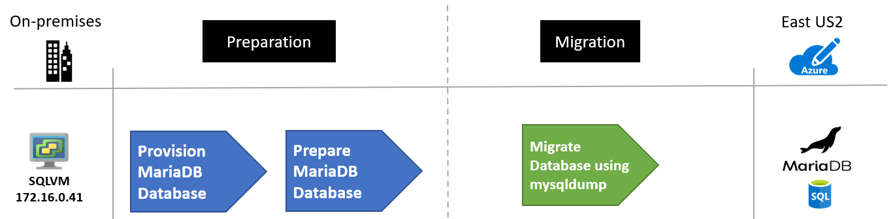

<!-- TODO: Verify GraphDBMS term -->
<!-- cSpell:ignore ColumnStore GraphDBMS mysqldump Navicat phpMyAdmin -->

# Migrate MariaDB databases to Azure

This article demonstrates how the fictional company Contoso planned and migrated their on-premises MariaDB open source database platform to Azure.

Contoso is using MariaDB over MySQL due to its myriad of storage engines, cache and index performance, open source support with features and extensions, and its analytics ColumnStore support. Their goal in migrating is to continue to use MariaDB, but not worry about managing the environment needed to support it.

## Business drivers

The IT leadership team has worked closely with business partners to understand what they want to achieve with this migration:

- **Increase availability.** Contoso has had availability issues with their MariaDB on-premises environment, the business requires the applications that use this data store to be more reliable.

- **Increase efficiency.** Contoso needs to remove unnecessary procedures, and streamline processes for developers and users. The business needs IT to be fast and not waste time or money, thus delivering faster on customer requirements.

- **Increase agility.**  Contoso IT needs to be more responsive to the needs of the business. It must be able to react faster than the changes in the marketplace, to enable the success in a global economy. It mustn't get in the way, or become a business blocker.

- **Scale.** As the business grows successfully, Contoso IT must provide systems that are able to grow at the same pace.

## Migration goals

The Contoso cloud team has pinned down goals for this migration and will use them to determine the best migration method.

| Requirements | Details |
| --- | --- |
| **Availability** | Currently internal staff are having a hard time with the hosting environment for the MariaDB instance. Contoso would like to have as close to 99.99 percent availability for the database layer. |
| **Scalability** | The on-premises database host is quickly running out of capacity, Contoso needs a way to scale their instances past their current limitations or scale it down if the business environment changes to save on costs. |
| **Performance** | The Contoso human resources (HR) department have several reports they run on a daily, weekly and monthly basis. When they run these reports, they notice considerable performance issues with the LAMP app. They need to be able to run the reports without affecting the employee-facing app. |
| **Security** | Contoso needs to know that the database will only be accessible to their internal apps and not visible or accessible via the internet. |
| **Monitoring** | Contoso currently uses tools to monitor the metrics of the MariaDB and provide notifications when CPU, memory, or storage are having issues. They would like to have this same capability in Azure. |
| **Business continuity** | The HR data store is an important part of Contoso's daily operations, and if it were to become corrupted or need to be restored they would like to minimize downtime. |
| **Azure** | Contoso wants to move the app to Azure, but doesn't want to run it on VMs. Contoso requirements state to use Azure PaaS services for the data tier. |

## Solution design

After pinning down goals and requirements, Contoso designs and review a deployment solution, and identifies the migration process, including the tools and services that they will use for migration.

### Current app

- The MariaDB hosts employee data that is used for all aspects of the companies human resources (HR) department. A LAMP (Linux, Apache, MySQL/MariaDB, PHP/Perl/Python) app is used as the front end to handle employee HR requests.
- Contoso has 100,000 employees worldwide, so uptime is very important for their databases.

### Proposed solution

- Evaluate the environments for migration compatibility.
- Use common open source tools to migrate databases to the Azure Database for MariaDB instance.
- Modify all apps and processes to use the new Azure Database for MariaDB instance.

### Database considerations

As part of the solution design process, Contoso reviewed the features in Azure for hosting their MariaDB databases. The following considerations helped them decide to use Azure.

- Similar to Azure SQL, Azure Database for MariaDB allows for [firewall rules](https://docs.microsoft.com/azure/mariadb/concepts-firewall-rules).
- Azure Database for MariaDB can be used with [Azure Virtual Network](https://docs.microsoft.com/azure/mariadb/concepts-data-access-security-vnet) to prevent the instance from being publicly accessible
- Azure Database for MariaDB has the required compliance and privacy certifications that Contoso must meet for their auditors.
- Report and app processing performance will be enhanced by using read replicas.
- Ability to expose the service to internal network traffic only (no-public access) using [Private Link](https://docs.microsoft.com/azure/mariadb/concepts-data-access-security-private-link).
- They chose not to move to Azure Database for MySQL as they're looking at potentially using the MariaDB ColumnStore and GraphDBMS database model in the future.
- The [bandwidth and latency](https://docs.microsoft.com/azure/vpn-gateway/vpn-gateway-about-vpngateways) from the app to the database will be sufficient enough based on the chosen gateway (either ExpressRoute or Site-to-Site VPN).

### Solution review

Contoso evaluates their proposed design by putting together a pros and cons list.

| Consideration | Details |
| --- | --- |
| **Pros** | Azure Database for MariaDB offers a 99.99% financially backed service-level agreement (SLA) for [high availability](https://docs.microsoft.com/azure/mariadb/concepts-high-availability). <br><br> Azure offers the ability to scale up or down during peak load times each quarter. Contoso can save even more buy purchasing [reserved capacity](https://docs.microsoft.com/azure/mariadb/concept-reserved-pricing). <br><br> Azure provides point-in-time restore and geo-restore capabilities for Azure Database for MariaDB. <br><br> |
| **Cons** | Contoso is limited to the MariaDB release versions that are supported in Azure which are currently 10.2 and 10.3. <br><br> Azure Database for MariaDB does have some [limitations](https://docs.microsoft.com/azure/mariadb/concepts-limits) such as scaling down storage. |

## Proposed architecture


_Figure 1: Scenario architecture._

### Migration process

#### Preparation

Before you can migrate your MariaDB databases, you will need to ensure that those instances meet all the Azure prerequisites for a successful migration.

Supported versions:

- MariaDB uses the x.y.z naming scheme. X is the major version, y is the minor version, and z is the patch version.

- Azure currently supports 10.2.25 and 10.3.16.

- Azure automatically manages upgrades for patch updates. For example, 10.2.21 to 10.2.23. Minor and major version upgrades aren't supported. For example, upgrading from MariaDB 10.2 to MariaDB 10.3 isn't supported. If you'd like to upgrade from 10.2 to 10.3, take a database dump and restore it to a server created with the target engine version.

The network:

- Contoso will need to set up a virtual network gateway connection from their on-premises environment to the virtual network where their MariaDB database is located. This will allow the on-premises app to access the database over the gateway when the connection strings are updated.

  
  _Figure 2: The migration process._

#### Migration

Since MariaDB is very similar to MySQL, they can use the same common utilities and tools such as MySQL Workbench, mysqldump, Toad or Navicat to connect to and migrate data to Azure Database for MariaDB.

Contoso used the following steps to migrate their databases.

- Determine the on-premises MariaDB version by running the following commands and observing the output. In most cases, your version should not matter much in terms of the schema and data dump. If you're using features at the app level, you should ensure those apps are compatible with the target version in Azure.

  ```cmd
    mysql -h localhost -u root -P
  ```

  
  _Figure 4: Determining the on-premises MariaDB version._

- Create a new MariaDB instance in Azure:

  - Open the [Azure portal](https://portal.azure.com).
  - Select **Add a resource**.
  - Search for `MariaDB`.

    
    _Figure 4: A new MariaDB instance in Azure._

  - Select **Create**.
  - Select your subscription and resource group.
  - Select a server name and location.
  - Select your target version (10.2 or 10.3).
  - Select your compute and storage.
  - Enter an administrator username and password.
  - Select **Review + create**.

    
    _Figure 5: Review and create._

  - Select **Create**.
  - Record the server hostname, username, and password.
  - Select **Connection Security**.
  - Select **Add Client IP** (the IP from which you will be restoring the database from).
  - Select **Save**.

- Run the following commands to export the database called `Employees`. Repeat for each database:

    ```cmd
    mysqldump -h localhost -u root -p -–skip-triggers -–single-transaction –-extended-insert -–order-by-primary -–disable-keys Employees > Employees.sql
    ```

- Restore the database. Replace with the endpoint for your Azure Database for MariaDB instance and the username

  ```cmd
  mysql -h {name}.mariadb.database.azure.com -u user@{name} -p –ssl
  create database employees;
  use database employees;
  source employees.sql;
  ```

- Using phpMyAdmin or a similar tool (MySQL Workbench, Toad, Navicat), verify the restore by checking record counts in each table.

- Update all app connection strings to point to the migrated database.

- Test all apps for proper operation

## Clean up after migration

After a verified successful migration, Contoso needs to complete these cleanup steps:

- Backup and store the on-premises database backup files for retention purposes.
- Retire the on-premises MariaDB server.

## Review the deployment

With the migrated resources in Azure, Contoso needs to fully operationalize and secure their new infrastructure.

### Security

- Contoso needs to ensure that their new Azure Database for MariaDB instance and databases are secure. [Learn more](https://docs.microsoft.com/azure/mariadb/concepts-security).
- In particular, Contoso should review the [firewall rules](https://docs.microsoft.com/azure/mariadb/concepts-firewall-rules) and virtual network configurations to verify that connections are limited to only the apps that require it.
- Configure any outbound IP requirements to allow connections to the MariaDB [gateway IP addresses](https://docs.microsoft.com/azure/mariadb/concepts-connectivity-architecture).
- Update all apps to [require SSL](https://docs.microsoft.com/azure/mariadb/concepts-ssl-connection-security) connections to the databases.
- Set up [Private Link](https://docs.microsoft.com/azure/mariadb/concepts-data-access-security-private-link) so that all database traffic is kept inside Azure and the on-premises network.
- Enable [Azure Advanced Threat Protection (ATP)](https://docs.microsoft.com/azure/mariadb/concepts-data-access-and-security-threat-protection).
- Configure Log Analytics to monitor and alert on security and logs entries of interest.

### Backups

- Ensure that the Azure Database for MariaDB databases are backed up using geo-restore. This allows backups to be used in a paired region in case of a regional outage.
- **Important:** Ensure that the Azure Database for MariaDB resource has a [resource lock](https://docs.microsoft.com/azure/azure-resource-manager/management/lock-resources) to prevent it from being deleted. Deleted servers cannot be restored.

### Licensing and cost optimization

- Azure Database for MariaDB can be scaled up or down, therefore performance monitoring of the server and databases is important to ensure you're meeting your needs but also keeping costs at a minimum.
- Both CPU and storage have costs associated. There are several pricing tiers to select from. Be sure the appropriate pricing plan is selected for the data workloads.
- Each read replica is billed based on the compute and storage selected.
- Use reserved capacity to save on costs.

## Conclusion

In this article, Contoso migrated their MariaDB databases to an Azure Database for MariaDB instance.
