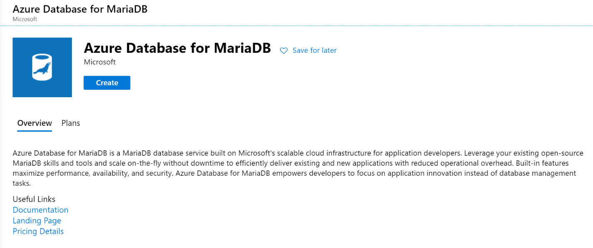

<!-- cSpell:ignore mysqldump -->

# Migrate MariaDB databases to Azure

This article demonstrates how the fictional company Contoso planned and migrated its on-premises MariaDB open-source database platform to Azure.

Contoso is using MariaDB instead of MySQL because of its:

- Numerous storage engine options.
- Cache and index performance.
- Open-source support with features and extensions.
- ColumnStore storage engine for analytical workloads.

The company's migration goal is to continue to use MariaDB but not worry about managing the environment needed to support it.

## Business drivers

The IT leadership team has worked closely with business partners to understand what they want to achieve with this migration. They want to:

- **Increase availability.** Contoso has had availability issues with its MariaDB on-premises environment. The business requires the applications that use this data store to be more reliable.
- **Increase efficiency.** Contoso needs to remove unnecessary procedures and streamline processes for developers and users. The business needs IT to be fast and not waste time or money to deliver faster on customer requirements.
- **Increase agility.** Contoso IT needs to be more responsive to the needs of the business. It must react faster than the changes in the marketplace to enable success in a global economy. It mustn't get in the way or become a business blocker.
- **Scale.** As the business grows successfully, Contoso IT must provide systems that grow at the same pace.

## Migration goals

The Contoso cloud team has pinned down goals for this migration. These goals were used to determine the best migration method.

| Requirements | Details |
| --- | --- |
| **Availability** | Currently internal staff are having a hard time with the hosting environment for the MariaDB instance. Contoso wants to have close to 99.99 percent availability for the database layer. |
| **Scalability** | The on-premises database host is quickly running out of capacity. Contoso needs a way to scale its instances past current limitations or scale down if the business environment changes to save on costs. |
| **Performance** | The Contoso human resources (HR) department has several reports it runs on a daily, weekly, and monthly basis. When it runs these reports, it notices considerable performance issues with the employee-facing application. It needs to run the reports without affecting application performance. |
| **Security** | Contoso needs to know that the database is accessible only to its internal applications and isn't visible or accessible via the internet. |
| **Monitoring** | Contoso currently uses tools to monitor the metrics of the MariaDB database and provide notifications when CPU, memory, or storage have issues. The company wants to have this same capability in Azure. |
| **Business continuity** | The HR data store is an important part of Contoso's daily operations. If it became corrupted or needed to be restored, the company wants to minimize downtime. |
| **Azure** | Contoso wants to move the application to Azure without running it on VMs. Contoso requirements state to use Azure platform as a service (PaaS) services for the data tier. |

## Solution design

After pinning down goals and requirements, Contoso designs and reviews a deployment solution and identifies the migration process. The tools and services that it will use for migration are also identified.

### Current application

The MariaDB database hosts employee data that's used for all aspects of the company's HR department. A [LAMP-based](https://wikipedia.org/wiki/LAMP_software_bundle) application is used as the front end to handle employee HR requests. Contoso has 100,000 employees worldwide, so uptime is important for its databases.

### Proposed solution

- Evaluate the environments for migration compatibility.
- Use common open-source tools to migrate databases to the Azure Database for MariaDB instance.
- Modify all applications and processes to use the new Azure Database for MariaDB instance.

### Database considerations

As part of the solution design process, Contoso reviewed the features in Azure for hosting its MariaDB databases. The following considerations helped the company decide to use Azure:

- Similar to Azure SQL Database, Azure Database for MariaDB allows for [firewall rules](/azure/mariadb/concepts-firewall-rules).
- Azure Database for MariaDB can be used with [Azure Virtual Network](/azure/mariadb/concepts-data-access-security-vnet) to prevent the instance from being publicly accessible.
- Azure Database for MariaDB has the required compliance and privacy certifications that Contoso must meet for its auditors.
- Report and application processing performance will be enhanced by using read replicas.
- Ability to expose the service to internal network traffic only (no-public access) by using [Azure Private Link](/azure/mariadb/concepts-data-access-security-private-link).
- Contoso chose not to move to Azure Database for MySQL because it's looking at potentially using the MariaDB ColumnStore and graph database model in the future.
- The [bandwidth and latency](/azure/vpn-gateway/vpn-gateway-about-vpngateways) from the application to the database will be sufficient enough based on the chosen gateway (either Azure ExpressRoute or Site-to-Site VPN).

### Solution review

Contoso evaluates the proposed design by putting together a pros and cons list.

| Consideration | Details |
| --- | --- |
| **Pros** | Azure Database for MariaDB offers a 99.99 percent financially backed service-level agreement (SLA) for [high availability](/azure/mariadb/concepts-high-availability). <br><br> Azure offers the ability to scale up or down during peak load times each quarter. Contoso can save even more by purchasing [reserved capacity](/azure/mariadb/concept-reserved-pricing). <br><br> Azure provides point-in-time restore and geo-restore capabilities for Azure Database for MariaDB. <br><br> |
| **Cons** | Contoso is limited to the MariaDB release versions that are supported in Azure, which are currently 10.2 and 10.3. <br><br> Azure Database for MariaDB has some [limitations](/azure/mariadb/concepts-limits), such as scaling down storage. |

## Proposed architecture


*Figure 1: Scenario architecture.*

### Migration process

#### Preparation

Before you can migrate your MariaDB databases, you need to ensure that those instances meet all the Azure prerequisites for a successful migration.

Supported versions:

- MariaDB uses the x.y.z naming scheme. For example, x is the major version, y is the minor version, and z is the patch version.
- Azure currently supports 10.2.25 and 10.3.16.
- Azure automatically manages upgrades for patch updates. Examples are 10.2.21 to 10.2.23. Minor and major version upgrades aren't supported. For example, upgrading from MariaDB 10.2 to MariaDB 10.3 isn't supported. If you want to upgrade from 10.2 to 10.3, take a database dump and restore it to a server created with the target engine version.

The network:

Contoso needs to set up a virtual network gateway connection from its on-premises environment to the virtual network where its MariaDB database is located. This connection allows the on-premises application to access the database over the gateway when the connection strings are updated.

  
  *Figure 2: The migration process.*

#### Migration

Because MariaDB is similar to MySQL, Contoso can use the same common utilities and tools such as MySQL Workbench, mysqldump, Toad, or Navicat to connect to and migrate data to Azure Database for MariaDB.

Contoso used the following steps to migrate its databases.

- Determine the on-premises MariaDB version by running the following commands and observing the output. In most cases, your version shouldn't matter much for the schema and data dump. If you're using features at the application level, ensure those applications are compatible with the target version in Azure.

  ```cmd
    mysql -h localhost -u root -P
  ```

  
  *Figure 3: Determining the on-premises MariaDB version.*

- Create a new MariaDB instance in Azure:

  - Open the [Azure portal](https://portal.azure.com).
  - Select **Add a resource**.
  - Search for `MariaDB`.

    
    *Figure 4: A new MariaDB instance in Azure.*

  - Select **Create**.
  - Select your subscription and resource group.
  - Select a server name and location.
  - Select your target version, which is 10.2 or 10.3.
  - Select your compute and storage.
  - Enter an admin username and password.
  - Select **Review + create**.

    
    *Figure 5: Review and create.*

  - Select **Create**.
  - Record the server hostname, username, and password.
  - Select **Connection Security**.
  - Select **Add Client IP** (the IP that you'll be restoring the database from).
  - Select **Save**.

- Run the following commands to export the database called `Employees`. Repeat for each database:

    ```cmd
    mysqldump -h localhost -u root -p --skip-triggers --single-transaction --extended-insert --order-by-primary --disable-keys Employees > Employees.sql
    ```

- Restore the database. Replace with the endpoint for your Azure Database for MariaDB instance and the username:

  ```cmd
  mysql -h {name}.mariadb.database.azure.com -u user@{name} -p -ssl
  create database employees;
  use database employees;
  source employees.sql;
  ```

- Use phpMyAdmin or a similar tool, such as MySQL Workbench, Toad, and Navicat, to verify the restore by checking record counts in each table.
- Update all application connection strings to point to the migrated database.
- Test all applications for proper operation.

## Clean up after migration

After a verified successful migration, Contoso needs to back up and store the on-premises database backup files for retention purposes. Retire the on-premises MariaDB server.

## Review the deployment

With the migrated resources in Azure, Contoso needs to fully operationalize and secure its new infrastructure.

### Security

Contoso needs to:

- Ensure that its new Azure Database for MariaDB instance and databases are secure. For more information, see [Security in Azure Database for MariaDB](/azure/mariadb/concepts-security).
- Review the [firewall rules](/azure/mariadb/concepts-firewall-rules) and virtual network configurations to verify that connections are limited to only the applications that require it.
- Configure any outbound IP requirements to allow connections to the MariaDB [gateway IP addresses](/azure/mariadb/concepts-connectivity-architecture).
- Update all applications to [require SSL](/azure/mariadb/concepts-ssl-connection-security) connections to the databases.
- Set up [Private Link](/azure/mariadb/concepts-data-access-security-private-link) so that all database traffic is kept inside Azure and the on-premises network.
- Enable [Microsoft Defender for Identity](/azure/mariadb/concepts-data-access-and-security-threat-protection).
- Configure Log Analytics to monitor and send alerts on security and logs entries of interest.

### Backups

Ensure that the Azure Database for MariaDB instances are backed up by using geo-restore. In this way, backups can be used in a paired region if a regional outage occurs.

> [!IMPORTANT]
> Make sure that the Azure Database for MariaDB instance has a [resource lock](/azure/azure-resource-manager/management/lock-resources) to prevent it from being deleted. Deleted servers can't be restored.

### Licensing and cost optimization

- Azure Database for MariaDB can be scaled up or down. Performance monitoring of the server and databases is important to ensure you meet your needs but also keep costs at a minimum.
- Both CPU and storage have costs associated. There are several pricing tiers to select from. Be sure the appropriate pricing plan is selected for the data workloads.
- Each read replica is billed based on the compute and storage selected.
- Use reserved capacity to save on costs.

## Conclusion

In this article, Contoso migrated its MariaDB databases to an Azure Database for MariaDB instance.
