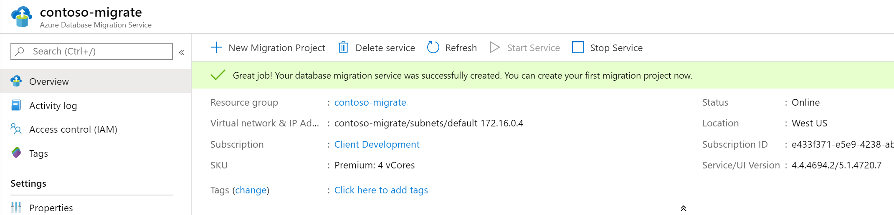

<!-- cSpell:ignore mysqldump InnoDB binlog Navicat -->

# Migrate MySQL databases to Azure

This article demonstrates how the fictional company Contoso planned and migrated their on-premises MySQL open source database platform to Azure.

## Business drivers

The IT leadership team has worked closely with business partners to understand what they want to achieve with this migration:

- **Increase availability.** Contoso has had availability issues with their MySQL on-premises environment. The business requires the applications that use this data store to be more reliable.
- **Increase efficiency.** Contoso needs to remove unnecessary procedures and streamline processes for developers and users. The business needs IT to be fast and not waste time or money to deliver faster on customer requirements.
- **Increase agility.**  Contoso IT needs to be more responsive to the needs of the business. It must be able to react faster than the changes in the marketplace to enable the success in a global economy. It mustn't become a business blocker.
- **Scale.** As the business grows successfully, Contoso IT must provide systems that are able to grow at the same pace.

## Migration goals

The Contoso cloud team has pinned down goals for this migration. These goals were used to determine the best migration method.

| Requirements | Details |
| --- | --- |
| **Availability** | Currently internal staff are having a hard time with the hosting environment for the MySQL instance. Contoso would like to have as close to 99.99 percent availability for the database layer. |
| **Scalability** | The on-premises database host is quickly running out of capacity, Contoso needs a way to scale their instances past their current limitations or scale it down if the business environment changes to save on costs. |
| **Performance** | The Contoso human resources (HR) department runs various reports daily, weekly, and monthly. When they run these reports, they experience significant performance issues with the employee-facing application. They need to run the reports without affecting application performance. |
| **Security** | Contoso needs to know that the database will only be accessible to their internal applications and not visible or accessible via the internet. |
| **Monitoring** | Contoso currently uses tools to monitor the metrics of the MySQL database server and provide notifications when CPU, memory, or storage are having issues. They would like to have this same capability in Azure. |
| **Business continuity** | The HR data store is an important part of Contoso's daily operations and if it were to become corrupted or need to be restored they would like to minimize downtime as much as possible. |
| **Azure** | Contoso wants to move the application to Azure without running it on VMs. Contoso wants to use Azure PaaS services for the data tier. |

## Solution design

After pinning down goals and requirements, Contoso designs and reviews a deployment solution and identifies the migration process, including the tools and services that will be used for migration.

### Current application

The MySQL database stores employee data that is used for all aspects of the company's HR department. A [LAMP-based](https://wikipedia.org/wiki/LAMP_(software_bundle)) application is used as the front end to handle employee HR requests. Contoso has 100,000 employees worldwide, so uptime is very important.

### Proposed solution

Use Azure Database Migration Service to migrate the database to Azure Database for MySQL instance and modify all applications and processes to use the new Azure Database for MySQL instance.

### Database considerations

<!-- TODO: Verify GraphDBMS term -->
<!-- docsTest:ignore ColumnStore GraphDBMS -->

As part of the solution design process, Contoso did a review of the features in Azure for hosting their MySQL data. The following considerations helped them decide to use Azure.

- Similar to Azure SQL Database, Azure Database for MySQL allows for [firewall rules](https://docs.microsoft.com/azure/mysql/concepts-firewall-rules).
- Azure Database for MySQL can be used with [Azure Virtual Network](https://docs.microsoft.com/azure/mysql/concepts-data-access-and-security-vnet) to prevent the instance from being publicly accessible.
- Azure Database for MySQL has the required compliance and privacy certifications that Contoso must meet for their auditors.
- Report and application processing performance can be enhanced by using read replicas.
- Ability to expose the service to internal network traffic only (no public access) using [Private Link](https://docs.microsoft.com/azure/mysql/concepts-data-access-security-private-link).
- They chose not to move to Azure Database for MySQL as they're looking at potentially using the MariaDB ColumnStore and GraphDBMS database model in the future.
- Aside from MySQL features, Contoso is a big proponent of true open source projects and choose not to use MySQL.
- The [bandwidth and latency](https://docs.microsoft.com/azure/vpn-gateway/vpn-gateway-about-vpngateways) from the application to the database will be sufficient enough based on the chosen gateway (either ExpressRoute or Site-to-Site VPN).

### Solution review

Contoso evaluates their proposed design by putting together a pros and cons list.

| Consideration | Details |
| --- | --- |
| **Pros** | Azure Database for MySQL offers a 99.99 percent financially backed service-level agreement (SLA) for [high availability](https://docs.microsoft.com/azure/mysql/concepts-high-availability).    Azure offers the ability to scale up or down during peak load times each quarter. Contoso can save even more buy purchasing [reserved capacity](https://docs.microsoft.com/azure/mysql/concept-reserved-pricing).    Azure provides point-in-time restore and geo-restore capabilities for Azure Database for MySQL.    |
| **Cons** | Contoso will be limited to the MySQL release versions that are supported in Azure which are currently 10.2 and 10.3.    Azure Database for MySQL does have some [limitations](https://docs.microsoft.com/azure/mysql/concepts-limits) such as scaling down storage. |

## Proposed architecture

_Figure 1: Scenario architecture._

### Migration process

#### Preparation

Before you can migrate your MySQL databases, you will need to ensure that those instances meet all the Azure prerequisites for a successful migration.

#### Supported versions

MySQL uses the `X.Y.Z` versioning scheme. `X` is the major version, `Y` is the minor version, and `Z` is the patch version.

Azure currently supports 10.2.25 and 10.3.16.

Azure automatically manages upgrades for patch updates. For example, 10.2.21 to 10.2.23. Minor and major version upgrades aren't supported. For example, upgrading from MySQL 10.2 to MySQL 10.3 isn't supported. If you'd like to upgrade from 10.2 to 10.3, take a dump and restore it to a server that was created with the new engine version.

#### Network

Contoso will need to set up a virtual network gateway connection from their on-premises environment to the virtual network where their MySQL database is located. This will allow the on-premises application to be able to access the database over the gateway when the connection strings are updated.

_Figure 2: The migration process._

#### Migration

Contoso admins migrate the database using Azure Database Migration Service using the [step-by-step migration tutorial](https://docs.microsoft.com/azure/dms/tutorial-mysql-azure-mysql-online). They can perform online, offline, and hybrid (preview) migrations using MySQL 5.6 or 5.7.

> [!NOTE]
> MySQL 8.0 is supported in Azure Database for MySQL, but the Database Migration Service tool doesn't yet support that version.

As a summary, they must perform the following:

- Ensure all migration prerequisites are met:

  - The MySQL database server source must match the version that Azure Database for MySQL supports. Azure Database for MySQL supports MySQL Community Edition, the InnoDB storage engine, and migration across source and target with same versions.
  - Enable binary logging in `my.ini` (Windows) or `my.cnf` (Unix). Failure to do this will cause the following error in the Migration Wizard: `Error in binary logging. Variable binlog_row_image has value 'minimal'. Please change it to 'full'. For more information, see https://go.microsoft.com/fwlink/?linkid=873009`.
  - User must have `ReplicationAdmin` role.
  - Migrate the database schemas without foreign keys and triggers.

- Create a virtual network that connects via ExpressRoute or VPN to your on-premises network.

- Create an Azure Database Migration Service instance with a `Premium` SKU that is connected to the VNet.

- Ensure that the instance can access the MySQL database via the virtual network. This would entail ensuring that all incoming ports are allowed from Azure to MySQL at the virtual network level, the network VPN, and the machine that hosts MySQL.

- Create a new Database Migration Service project:

  
  _Figure 3: An Azure database migration project._

#### Migration using native tools

As an alternative to using Azure Database Migration Service, Contoso can use common utilities and tools such as MySQL Workbench, mysqldump, Toad, or Navicat to connect to and migrate data to Azure Database for MySQL.

- Dump and restore with mysqldump:
  - Use the exclude-triggers option in mysqldump; this will prevent triggers from executing during import and improve performance.
  - Use the single-transaction option to set the translation isolation mode to `REPEATABLE READ` and send a `START TRANSACTION` SQL statement before dumping data.
  - Use the disable-keys option in mysqldump to disable foreign key constraints before load. Removing this will provide performance gains.
  - Use Azure Blob storage to store the backup files and perform the restore from there for faster restore.
  - Update application connection strings.
  - Once the database has been migrated Contoso must update the connection strings to point to the new Azure Database for MySQL.

## Cleanup after migration

After migration, Contoso needs to backup the on-premises database for retention purposes and retire the on-premises MySQL database server.

## Review the deployment

With the migrated resources in Azure, Contoso needs to fully operationalize and secure their new infrastructure.

### Security

- Contoso needs to ensure that their new Azure Database for MySQL instance and databases are secure. For more information, see [Security in Azure Database for MySQL](https://docs.microsoft.com/azure/mysql/concepts-security).
- In particular, Contoso should review the firewall and virtual network configurations.
- Set up Private Link so that all database traffic is kept inside Azure and the on-premises network.
- Enable Azure Advanced Threat Protection.

### Backups

Ensure that the Azure Database for MySQL instances are backed up using geo-restore. This allows backups to be used in a paired region in case of a regional outage.

> [!IMPORTANT]
> Ensure that the Azure Database for MySQL resource has a resource lock to prevent it from being deleted. Deleted servers cannot be restored.

### Licensing and cost optimization

- Azure Database for MySQL can be scaled up or down, so monitoring the performance of the server and databases is important to ensure your requirements are met while minimizing costs.
- Both CPU and storage have costs associated. There are several pricing tiers available. Be sure the appropriate pricing plan is selected for each data workload.
- Each read replica is billed based on the compute and storage selected.
- Use reserved capacity to save on costs.

## Conclusion

In this article, Contoso migrated their MySQL databases to an Azure Database for MySQL instance.
