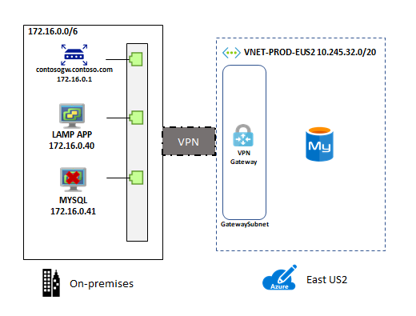
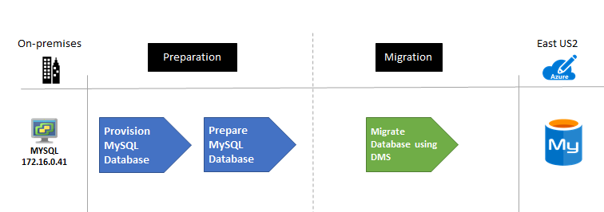

<!-- cSpell:ignore deltadan VMware contoso contoso's host vcenter -->

# Migrating MySQL to Azure (Scenario)

This article demonstrates how a fictional company Contoso planned and migrated their on-premises MySQL open source database platform to Azure.

## Business drivers

The IT leadership team has worked closely with business partners to understand what they want to achieve with this migration:

- **Increase Availability.** Contoso has had availability issues with their MySQL on-premises environment, the business requires the applications that utilize this data store to be more reliable.
- **Increase efficiency.** Contoso needs to remove unnecessary procedures, and streamline processes for developers and users. The business needs IT to be fast and not waste time or money, thus delivering faster on customer requirements.
- **Increase agility.**  Contoso IT needs to be more responsive to the needs of the business. It must be able to react faster than the changes in the marketplace, to enable the success in a global economy. It mustn't get in the way, or become a business blocker.
- **Scale.** As the business grows successfully, Contoso IT must provide systems that are able to grow at the same pace.

## Migration goals

The Contoso cloud team has pinned down goals for this migration. These goals were used to determine the best migration method.

<!-- markdownlint-disable MD033 -->

**Requirements** | **Details**
--- | ---
**Availability** | Currently internal staff are having a hard time with the hosting environment for the MySQL instance. Contoso would like to have as close to 99.99% availability for the database layer.
**Scalability** | The on-premises database host is quickly running out of capacity, Contoso needs a way to scale their instances past their current limitations or scale it down if the business environment changes to save on costs.
**Performance** | Contoso HR have several reports they run on a daily, weekly and monthly basis.  When they run these reports, they notice considerable performance issues with the LAMP app.  They need to be able to run the reports without affecting the employee facing application.
**Security** | Contoso needs to know that the database will only be accessible to their internal applications and not visible or accessible via the internet.
**Monitoring** | Contoso currently uses tools to monitor the metrics of the MySQL and provide notifications when CPU, Memory or storage are having issues.  They would like to have this same capability in Azure.
**Business Continuity** | The HR application data store is an important part of Contoso's daily operations and if it were to become corrupted or need to be restored they would like as minimum of downtime as possible.
**Azure** | Contoso wants to move the app to Azure, but doesn't want to run it on VMs. Contoso wants to use Azure PaaS services for the data tier.

<!-- markdownlint-enable MD033 -->

## Solution design

After pinning down goals and requirements, Contoso designs and review a deployment solution, and identifies the migration process, including the tools and services that will be used for migration.

### Current app

- The MySQL hosts employee data that is used for all aspects of the companies Human Resources (HR) department. A LAMP (Linux, Apache, MySQL/MySQL, PHP/Perl/Python) application is used as the front end to handle employee HR requests.
- Contoso has 100K employees located all over the world so uptime is very important

### Proposed solution

- Use the Azure Data Migration Service (DMS) to migrate the database to MySQL for Azure instance
- Modify all applications and processes to utilize the new MySQL for Azure instance

### Database considerations

As part of the solution design process Contoso did a review of the features in Azure for hosting their MySQL data.  The following considerations helped them decide to utilize Azure.

- Similar to Azure SQL, Azure MySQL allows for [firewall rules](https://docs.microsoft.com//azure/MySQL/concepts-firewall-rules).
- Azure MySQL can be utilize with [Virtual Networks](https://docs.microsoft.com//azure/MySQL/concepts-data-access-security-vnet) to prevent the instance from being publicly accessible
- Azure MySQL has the required compliance and privacy certifications that Contoso must meet
- Report and application processing performance can be enhanced by utilizing read replicas
- Ability to expose the service to internal network traffic only (no-public access) using [Private Link](https://docs.microsoft.com//azure/MySQL/concepts-data-access-security-private-link).
- They chose not to move to Azure Database for MySQL as they are looking at potentially using the MariDB ColumnStore and GraphDBMS database model in the future.
- Aside from MySQL features, Contoso is a big proponent of true open source projects and choose not to utilize MySQL.
- The [bandwidth and latency](https://docs.microsoft.com//azure/vpn-gateway/vpn-gateway-about-vpngateways) from the application to the database will be sufficient enough based on the chosen gateway (either ExpressRoute or Site-To-Site VPN)

### Solution review

Contoso evaluates their proposed design by putting together a pros and cons list.

<!-- markdownlint-disable MD033 -->

**Consideration** | **Details**
--- | ---
**Pros** | Azure Database for MySQL offers a 99.99% financially backed service level agreement (SLA) for [high availability](https://docs.microsoft.com//azure/MySQL/concepts-high-availability).  Azure offers the ability to scale up or down during peak load times each quarter.  Contoso can save even more buy purchasing [reserved capacity](https://docs.microsoft.com//azure/MySQL/concept-reserved-pricing).  Azure provides Point-in-time restore and Geo-restore capabilities for Azure Database for MySQL.  
**Cons** | Contoso will be limited to the MySQL release versions that are supported in Azure which are currently 10.2 and 10.3.  Azure Database for MySQL does have some [limitations](https://docs.microsoft.com//azure/MySQL/concepts-limits) such as scaling down storage.

<!-- markdownlint-enable MD033 -->

## Proposed architecture

### Migration process

#### Preparation

Before you can migrate your MySQL databases, you will need to ensure that those instances meet all the Azure pre-requisites for a successful migration.

#### Supported Versions

MySQL uses the X.Y.Z naming scheme. X is the major version, Y is the minor version, and Z is the patch version.

Azure currently supports 10.2.25 and 10.3.16.

Azure automatically manages upgrades for patch updates. For example, 10.2.21 to 10.2.23. Minor and major version upgrades aren't supported. For example, upgrading from MySQL 10.2 to MySQL 10.3 isn't supported. If you'd like to upgrade from 10.2 to 10.3, take a dump and restore it to a server that was created with the new engine version.

#### Network

Contoso will need to setup a Virtual Network Gateway connection from their on-premises environment to the Virtual Network where their MySQL database is located.  This will allow the on-premises application to be able to access the database over the gateway when the connection strings are updated.

#### Migration

Since MySQL is very similar to MySQL, you can use the same common utilities and tools such as MySQL Workbench, mysqldump, Toad or Navicat to connect to and migrate data to Azure Database for MySQL.

- Dump and Restore with `mysqldump`
  - Use the exclude-triggers option in mysqldump, this will prevent triggers from executing during import and improve performance.
  - Use the single-transaction option to set the translation isolation mode to REPEATABLE READ and send a START TRANSACTION SQL statement before dumping data
  - Use the disable-keys option in mysqldump to disable foreign key constraints before load.  Removing this will provide performance gains.
  - Utilize Azure blob store to store the backup files and perform the restore from there for faster restore.
- Update Application connection strings
  - Once the database has been migrated Contoso must update the connection strings to point to the new Azure Database for MySQL.

## Clean up after migration

After migration, Contoso needs to complete these cleanup steps:

- Backup the on-premises database for retention purposes
- Retire the on-premises MySQL server

## Review the deployment

With the migrated resources in Azure, Contoso needs to fully operationalize and secure their new infrastructure.

### Security

- Contoso needs to ensure that their new Azure MySQL instance and databases are secure. [Learn more](https://docs.microsoft.com//azure/MySQL/concepts-security).
- In particular, Contoso should review the Firewall and virtual network configurations.
- Setup Private Link so that all database traffic is kept inside Azure and the on-premises network
- Enable Advanced Thread Protection (ATP)

### Backups

- Ensure that the Azure MySQL databases are backed up using geo-restore.  This allows backups to be used in a paired region in case of a regional outage.
- **Important** Ensure that the Azure MySQL server resource has a resource lock to prevent it from being deleted.  Deleted servers cannot be restored.

### Licensing and cost optimization

- Azure MySQL can be scaled up or down, therefore performance monitoring of the server and databases is important to ensure you are meeting your needs but also keeping costs at a minimum.
- Both CPU and Storage have costs associated. There are several pricing tiers to select from.  Be sure the appropriate pricing plan is selected for the data workloads.
- Each read replicas will be billed based on the compute and storage selected
- Utilize reserved capacity to save on costs

## Conclusion

In this article, Contoso migrated their MySQL databases to an Azure MySQL managed instance.
