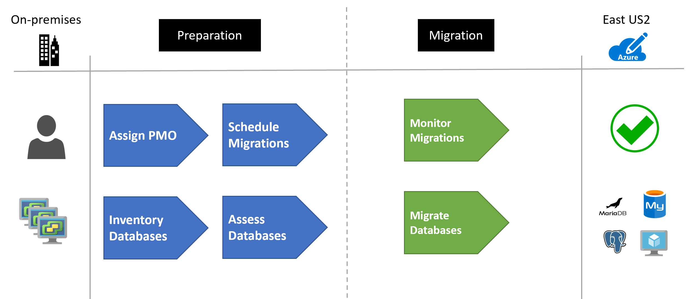

# Migrate open-source databases to Azure

This article demonstrates how the fictional company Contoso assessed, planned, and migrated its various on-premises open-source databases to Azure.
For step-by-step guidance, you can also watch the [Migrate and Modernize Linux VMs and Databases into Azure](https://www.youtube.com/watch?v=1iskhkEtFNk&list=PLXtHYVsvn_b_lwPbu342oreT454QjrOLE) video. 

As Contoso considers migrating to Azure, the company needs a technical and financial assessment to determine whether its on-premises workloads are good candidates for cloud migration. In particular, the Contoso team wants to assess machine and database compatibility for migration. Additionally, it wants to estimate capacity and costs for running Contoso's resources in Azure.

## Business drivers

Contoso is having various issues with maintaining the wide array of versions of open-source database workloads that exist on its network. After the latest investor's meeting, the CFO and CTO decided to move all these workloads to Azure. This move will shift them from a structured capital expense model to a fluid operating expense model.

The IT leadership team has worked closely with business partners to understand the business and technical requirements. They want to:

- **Increase security.** Contoso needs to be able to monitor and protect all data resources in a more timely and efficient manner. The company also wants to get a more centralized reporting system set up on database access patterns.
- **Optimize compute resources.** Contoso has deployed a large on-premises server infrastructure. The company has several SQL Server instances that consume but don't really use the underlying CPU, memory, and disk allocated in efficient ways.
- **Increase efficiency.** Contoso needs to remove unnecessary procedures and streamline processes for developers and users. The business needs IT to be fast and not waste time or money to deliver faster on customer requirements. Database administration should be reduced or minimized after the migration.
- **Increase agility.** Contoso IT needs to be more responsive to the needs of the business. It must react faster than the changes in the marketplace to enable success in a global economy. It mustn't get in the way or become a business blocker.
- **Scale.** As the business grows successfully, Contoso IT must provide systems that grow at the same pace.
- **Understand costs.** Business and application owners want to know they won't be stuck with high cloud costs when running the applications on-premises.

## Migration goals

The Contoso cloud team has pinned down goals for the various migrations. These goals were used to determine the best migration methods.

| Requirements | Details |
| --- | --- |
| **Performance** | After migration, applications in Azure should have the same performance capabilities that applications have today in Contoso's on-premises environment. Moving to the cloud doesn't mean that application performance is less critical. |
| **Compatibility** | Contoso needs to understand the compatibility of its applications and databases with Azure. Contoso also needs to understand its Azure hosting options. |
| **Data sources** | All databases will be moved to Azure with no exceptions. Based on the database and application analysis of the SQL features being used, they'll move to platform as a service (PaaS) or infrastructure as a service (IaaS). All databases must move. |
| **Application** | Applications must be moved to the cloud wherever possible. If they can't move, they'll connect to the migrated database over the Azure network through private connections only. |
| **Costs** | Contoso wants to understand not only its migration options but also the costs associated with the infrastructure after it moves to the cloud. |
| **Management** | Resource management groups need to be created for the various departments along with resource groups to manage all databases that are migrated. All resources need to be tagged with department information for chargeback requirements. |
| **Limitations** | Initially, not all branch offices that run applications will have a direct Azure ExpressRoute link to Azure. These offices will need to connect through virtual network gateways. |

## Solution design

Contoso has already performed a [migration assessment](../../plan/contoso-migration-assessment.md) of its digital estate by using [Azure Migrate](/azure/migrate/migrate-services-overview).

*Figure 1: The migration process.*

### Solution review

Contoso evaluates the proposed design by putting together a pros and cons list.

| Consideration | Details |
| --- | --- |
| **Pros** | Azure will provide a single pane of glass into the database workloads.    Costs will be monitored via Azure Cost Management + Billing.    Business chargeback billing will be easy to perform with the Azure Billing APIs.    Server and software maintenance will be reduced to only the IaaS-based environments. |
| **Cons** | Because of the requirement of IaaS-based VMs, there will still be a need to manage the software on those machines. |

### Budget and management

Before the migration can occur, the necessary Azure structure is required to be in place to support the administration and billing aspects of the solution.

For the management requirements, several [management groups](/azure/governance/management-groups/overview) were created to support the organizational structure.

For the billing requirements, each of the Azure resources are then [tagged](/azure/azure-resource-manager/management/tag-resources) with the appropriate billing tags.

### Migration process

Data migrations follow a standard and repeatable pattern. This process involves the following steps based on [Microsoft best practices](/data-migration/):

- Pre-migration:
  - **Discovery:** Inventory database assets and application stack.
  - **Assess:** Assess workloads and fix recommendations.
  - **Convert:** Convert source schema to work in the target.
- Migration:
  - **Migrate:** Migrate the source schema, source data, and objects to target.
  - **Sync data:** Sync data (for minimal downtime).
  - **Cutover:** Cut over the source to target.
- Post-migration:
  - **Remediate applications:** Iteratively make any necessary changes to applications.
  - **Perform tests:** Iteratively run functional and performance tests.
  - **Optimize:** Based on tests, address performance issues and then retest to confirm performance improvements.
  - **Retire assets:** Old VMs and hosting environments are backed up and retired.

#### Step 1: Discovery

Contoso used Azure Migrate to surface the dependencies across the Contoso environment. Azure Migrate automatically discovered application components on Windows and Linux systems and mapped the communication between services. Azure Migrate also surfaced the connections between Contoso servers, processes, inbound and outbound connection latency, and ports across the TCP-connected architecture. Contoso was only required to install the [Microsoft Monitoring Agent](/azure/azure-monitor/agents/agent-windows) and the [Microsoft Dependency Agent](/azure/azure-monitor/vm/vminsights-enable-hybrid#install-the-dependency-agent-on-windows).

Contoso has identified over 300 database instances that must be migrated. Of these instances, roughly 40 percent can be moved to PaaS-based services. Of the remaining 60 percent, they must be moved to an IaaS-based approach with a VM running the respective database software.

#### Step 2: Application assessment

The results from the assessment showed Contoso that it uses primarily Java, PHP, and Node.js applications. The company has identified the following applications:

- 100 Java applications
- About 50 Node.js applications
- About 25 PHP applications

#### Step 3: Database assessment

As the databases were inventoried, each type of database was reviewed to determine the method to migrate it to Azure. The following guidelines were followed on the database migrations.

| Database type | Details | Target | Migration guide |
| --- | --- | --- | --- |
| **MySQL** | All supported versions upgrade to a supported version before migration | Azure Database for MySQL (PaaS) | [Guide](/azure/dms/tutorial-mysql-azure-mysql-online)
| **PostgreSQL** | All supported versions upgrade to a supported version before migration | Azure Database for PostgreSQL (PaaS) | [Guide](/azure/dms/tutorial-postgresql-azure-postgresql-online) |
| **MariaDB** | All supported versions upgrade to a supported version before migration | Azure Database for MariaDB (PaaS) | [Guide](/azure/mariadb/howto-migrate-dump-restore) |

#### Step 4: Migration planning

Because of the large number of databases, Contoso set up a project management office to keep track of every database migration instance. [Accountability and responsibilities](../migration-considerations/assess/index.md) were assigned to each business and application team.

Contoso also performed a [workload readiness review](../migration-considerations/assess/evaluate.md). This review examined the infrastructure, database, and network components.

#### Step 5: Test migrations

The first part of the migration preparation involved a test migration of each of the databases to the pre-setup environments. To save time, Contoso scripted all of the operations for the migrations and recorded the timings for each. To speed up the migration, the company identified the migration operations that could run concurrently.

Any rollback procedures were identified for each of the database workloads in case of some unexpected failures.

For the IaaS-based workloads, the company set up all the required third-party software beforehand.

After the test migration, Contoso used the various Azure [cost-estimation tools](../migration-considerations/assess/estimate.md) to get a more accurate picture of the future operational costs of the migration.

#### Step 6: Migration

For the production migration, Contoso identified the time frames for all database migrations and what could be sufficiently executed in a weekend window (midnight Friday through midnight Sunday) with minimal downtime to the business.

### Clean up after migration

Contoso identified the archival window for all database workloads. As the window expires, the resources will be deallocated from the on-premises infrastructure. This process includes removing the production data from on-premises servers and retiring the hosting server when the last workload window expires.

### Review the deployment

With the migrated resources in Azure, Contoso needs to fully operationalize and secure its new infrastructure.

#### Security

Contoso needs to:

- Ensure that its new Azure database workloads are secure. For more information, see [Azure SQL Database and SQL Managed Instance security capabilities](/azure/azure-sql/database/security-overview).
- Review the firewall and virtual network configurations.
- Set up Azure Private Link so that all database traffic is kept inside Azure and the on-premises network.
- Enable Microsoft Defender for Identity.

#### Backups

Ensure that the Azure databases are backed up by using geo-restore. In this way, backups can be used in a paired region if a regional outage occurs.

> [!IMPORTANT]
> Make sure that the Azure resource has a [resource lock](/azure/azure-resource-manager/management/lock-resources) to prevent it from being deleted. Deleted servers can't be restored.

#### Licensing and cost optimization

- Many Azure database workloads can be scaled up or down. Monitoring server and database performance is important to ensure that you're meeting your needs and keeping costs at a minimum.
- Both CPU and storage have costs associated. There are several pricing tiers to select from. Make sure that the appropriate pricing plan is selected for the data workloads.
- Each read replica is billed based on the compute and storage selected.
- Use reserved capacity to reduce costs.

## Conclusion

In this article, Contoso assessed, planned, and migrated its open-source databases to Azure PaaS and IaaS solutions.
