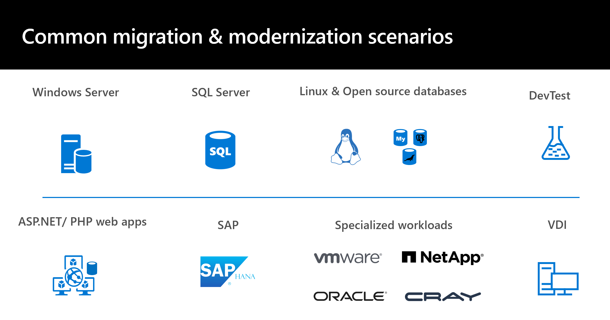

# Overview of application migration examples for Azure

This section of the Cloud Adoption Framework for Azure provides examples of several common migration scenarios and demonstrates how you can migrate on-premises infrastructure to [Microsoft Azure](https://azure.microsoft.com/overview/what-is-azure/).

## Introduction

Azure provides access to a comprehensive set of cloud services. As developers and IT professionals, you can use these services to build, deploy, and manage applications on a range of tools and frameworks through a global network of datacenters. As your business faces challenges associated with the digital shift, the Azure platform helps you to figure out how to:

- Optimize resources and operations.
- Engage with your customers and employees.
- Transform your products.

The cloud provides advantages for speed and flexibility, minimized costs, performance, and reliability. But many organizations will need to continue to run on-premises datacenters. In response to cloud adoption barriers, Azure provides a hybrid cloud strategy that builds bridges between your on-premises datacenters and the Azure public cloud. An example is using Azure cloud resources like Azure Backup to protect on-premises resources or Azure analytics to gain insights into on-premises workloads.

As part of the hybrid cloud strategy, Azure provides growing solutions for migrating on-premises applications and workloads to the cloud. With simple steps, you can comprehensively assess your on-premises resources to figure out how they'll run in the Azure platform. Then, with a deep assessment in hand, you can confidently migrate resources to Azure. When resources are up and running in Azure, you can optimize them to retain and improve access, flexibility, security, and reliability.

## Migration patterns

Strategies for migration to the cloud fall into four broad patterns: rehost, refactor, rearchitect, or rebuild. The strategy you adopt depends on your business drivers and migration goals. You might adopt multiple patterns. For example, you could choose to rehost noncritical applications while rearchitecting applications that are more complex and business-critical. Let's look at these patterns.

| Pattern | Definition | When to use |
| --- | --- | --- |
| **Rehost** | Often referred to as a lift-and-shift migration, this option doesn't require code changes. You can use it to migrate your existing applications to Azure quickly. Each application is migrated as is to reap the benefits of the cloud without the risk and cost associated with code changes. | When you need to move applications quickly to the cloud.    When you want to move an application without modifying it.    When your applications are designed so that they can take advantage of [Azure infrastructure as a service (IaaS)](https://azure.microsoft.com/overview/what-is-iaas/) scalability after migration.    When applications are important to your business, but you don't need to immediately change application capabilities. |
| **Refactor** | Often referred to as "repackaging," refactoring requires minimal changes to applications so that they can connect to [Azure platform as a service (PaaS)](https://azure.microsoft.com/overview/what-is-paas/) and use cloud offerings.    For example, you could migrate existing applications to Azure App Service or Azure Kubernetes Service (AKS).    Or, you could refactor relational and nonrelational databases into options such as Azure SQL Managed Instance, Azure Database for MySQL, Azure Database for PostgreSQL, and Azure Cosmos DB. | If your application can easily be repackaged to work in Azure.    If you want to apply innovative DevOps practices provided by Azure, or if you're thinking about DevOps using a container strategy for workloads.    For refactoring, you need to think about the portability of your existing code base and available development skills. |
| **Rearchitect** | Rearchitecting for migration focuses on modifying and extending application functionality and the code base to optimize the application architecture for cloud scalability.    For example, you could break down a monolithic application into a group of microservices that work together and scale easily.    You could also rearchitect relational and nonrelational databases to a fully managed database solution, such as SQL Managed Instance, Azure Database for MySQL, Azure Database for PostgreSQL, and Azure Cosmos DB. | When your applications need major revisions to incorporate new capabilities or to work effectively on a cloud platform.    When you want to use existing application investments, meet scalability requirements, apply innovative DevOps practices, and minimize use of virtual machines. |
| **Rebuild** | Rebuild takes things a step further by rebuilding an application from scratch using Azure cloud technologies.    For example, you could build greenfield applications with [cloud-native](https://azure.microsoft.com/overview/cloudnative/) technologies like Azure Functions, AI, SQL Managed Instance, and Azure Cosmos DB. | When you want rapid development, and existing applications have limited functionality and lifespan.    When you're ready to expedite business innovation (including DevOps practices provided by Azure), build new applications using cloud-native technologies, and take advantage of advancements in AI, blockchain, and IoT. |

## Migration example articles

This section provides examples of several common migration scenarios. Each example includes background information and detailed deployment scenarios that illustrate how to set up a migration infrastructure and assess the suitability of on-premises resources for migration. More articles will be added to this section over time.

*Figure 1: Common migration and modernization project categories.*

This series focuses on each migration scenario, driven by slightly different business goals that determine the migration strategy. For each deployment scenario, we provide information about:

- Business drivers and goals.
- A proposed architecture.
- Steps to perform the migration.
- Recommendations for cleanup and next steps after migration is finished.

### Assessment

| Article | Details |
| --- | --- |
| [Assess on-premises resources for migration to Azure](../../plan/contoso-migration-assessment.md) | This best practice article in the Plan methodology discusses how to run an assessment of an on-premises application running on VMware. In the article, an example organization assesses application VMs by using Azure Migrate and the application SQL Server database by using Data Migration Assistant. |

### Infrastructure

| Article | Details |
| --- | --- |
| [Deploy Azure infrastructure](./contoso-migration-infrastructure.md) | This article shows how an organization can prepare its on-premises infrastructure and its Azure infrastructure for migration. The infrastructure example established in this article is referenced in the other samples provided in this section. |

### Windows Server workloads

| Article | Details |
| --- | --- |
| [Rehost an application on Azure VMs](./contoso-migration-rehost-vm.md) | This article provides an example of migrating on-premises application VMs to Azure VMs using Azure Migrate. |

### SQL Server workloads

| Article | Details |
| --- | --- |
| [Migrate SQL Server databases to Azure](./contoso-migration-sql-server-db-to-azure.md) | This article demonstrates how the fictional company Contoso assessed, planned, and migrated its various on-premises SQL Server databases to Azure. |
| [Rehost an application on an Azure VM and SQL Managed Instance](./contoso-migration-rehost-vm-sql-managed-instance.md) | This article provides an example of a lift-and-shift migration to Azure for an on-premises application. This process involves migrating the application front-end VM by using Azure Migrate and the application database to SQL Managed Instance by using [Azure Database Migration Service](/azure/dms/dms-overview). |
| [Rehost an application on Azure VMs using SQL Server Always On availability groups](./contoso-migration-rehost-vm-sql-ag.md) | This example shows how to migrate an application and data by using Azure-hosted SQL Server VMs. It uses Azure Migrate to migrate the application VMs and Database Migration Service to migrate the application database to a SQL Server cluster that's protected by an Always On availability group. |

### Linux and open-source databases

| Article | Details |
| --- | --- |
| [Migrate open-source databases to Azure](./contoso-migration-oss-db-to-azure.md) | This article demonstrates how the fictional company Contoso assessed, planned, and migrated its various on-premises open-source databases to Azure. |
| [Migrate MySQL to Azure](./contoso-migration-mysql-to-azure.md) | This article demonstrates how the fictional company Contoso planned and migrated its on-premises MySQL open-source database platform to Azure. |
| [Migrate PostgreSQL to Azure](./contoso-migration-postgresql-to-azure.md) | This article demonstrates how the fictional company Contoso planned and migrated its on-premises PostgreSQL open-source database platform to Azure. |
| [Migrate MariaDB to Azure](./contoso-migration-mariadb-to-azure.md) | This article demonstrates how the fictional company Contoso planned and migrated its on-premises MariaDB open-source database platform to Azure. |
| [Rehost a Linux application on Azure VMs and Azure Database for MySQL](./contoso-migration-rehost-linux-vm-mysql.md) | This article provides an example of migrating a Linux-hosted application to Azure VMs by using Azure Migrate. The application database is migrated to Azure Database for MySQL by using [Database Migration Service](/azure/dms/dms-overview). |
| [Rehost a Linux application on Azure VMs](./contoso-migration-rehost-linux-vm.md) | This example shows how to complete a lift-and-shift migration of a Linux-based application to Azure VMs by using Azure Migrate. |

### Dev/test workloads

| Article | Details |
| --- | --- |
| [Migrate dev/test environments to Azure IaaS](./contoso-migration-devtest-to-iaas.md) | This article demonstrates how Contoso rehosts its dev/test environment for two applications running on VMware VMs by migrating to Azure VMs. |
| [Migrate to Azure DevTest Labs](./contoso-migration-devtest-to-labs.md) | This article discusses how Contoso moves its dev/test workloads to Azure by using DevTest Labs. |

### ASP.NET and PHP web apps

| Article | Details |
| --- | --- |
| [Refactor a Windows application using App Service and SQL Database](./contoso-migration-refactor-web-app-sql.md) | This example shows how to migrate an on-premises Windows-based application to an Azure web app and migrate the application database to an Azure SQL Database server instance by using [Database Migration Service](/azure/dms/dms-overview). |
| [Refactor a Windows application using App Service and SQL Managed Instance](./contoso-migration-refactor-web-app-sql-managed-instance.md) | This example shows how to migrate an on-premises Windows-based application to an Azure web app and migrate the application database to SQL Managed Instance by using [Database Migration Service](/azure/dms/dms-overview). |
| [Refactor a Linux application to multiple regions using App Service, Azure Traffic Manager, and Azure Database for MySQL](./contoso-migration-refactor-linux-app-service-mysql.md) | This example shows how to migrate an on-premises Linux-based application to an Azure web app on multiple Azure regions by using Traffic Manager to integrate with GitHub for continuous delivery. The application database is migrated to an Azure Database for MySQL instance. |
| [Rebuild an application in Azure](./contoso-migration-rebuild.md) | This article provides an example of rebuilding an on-premises application by using a range of Azure capabilities and managed services. These capabilities and services include App Service, AKS, Azure Functions, Azure Cognitive Services, and Azure Cosmos DB. |
| [Refactor Team Foundation Server to Azure DevOps Services](./contoso-migration-tfs-vsts.md) | This article shows an example migration of an on-premises Team Foundation Server deployment to Azure DevOps Services in Azure. |

### SAP

| Article | Details |
| --- | --- |
| [SAP migration guide](https://azure.microsoft.com/resources/sap-on-azure-implementation-guide/) | Get practical guidance to move your on-premises SAP workloads to the cloud. |
| [Migrate SAP applications to Azure](https://azure.microsoft.com/resources/migrating-sap-applications-to-azure/) | White paper and roadmap for your SAP journey to the cloud. |
| [Migration methodologies for SAP on Azure](https://azure.microsoft.com/resources/migration-methodologies-for-sap-on-azure/) | Overview of various migration options to move SAP applications to Azure. |

### Specialized workloads

| Article | Details |
| --- | --- |
| [Move on-premises VMware infrastructure to Azure](./contoso-migration-vmware-to-azure.md) | This article provides an example of moving on-premises VMware VMs to Azure by using Azure VMware Solution. |
| [Azure NetApp Files](https://azure.microsoft.com/services/netapp/) | Enterprise file storage powered by NetApp. Run Linux and Windows file workloads in Azure. |
| [Oracle on Azure](https://azure.microsoft.com/solutions/oracle/) | Run your Oracle databases and enterprise applications in Azure and Oracle Cloud Infrastructure. |
| [Cray in Azure](https://azure.microsoft.com/solutions/high-performance-computing/cray/) | High-performance computing with Cray in Azure. A dedicated supercomputer on your virtual network. |

### VDI

| Article | Details |
| --- | --- |
| [Move on-premises Remote Desktop Services to Azure Virtual Desktop](./contoso-migration-rds-to-wvd.md) | This article shows how to migrate on-premises Remote Desktop Services to Azure Virtual Desktop. |

### Migration scaling

| Article | Details |
| --- | --- |
| [Scale a migration to Azure](./contoso-migration-scale.md) | This article shows how an example organization prepares to scale to a full migration to Azure. |

### Demo applications

The example articles provided in this section use two demo applications: SmartHotel360 and osTicket.

**SmartHotel360**: This test application was developed by Microsoft to use when you work with Azure. It's provided under an open-source license, and you can download it from [GitHub](https://github.com/Microsoft/SmartHotel360). It's an ASP.NET application connected to a SQL Server database. In the scenarios discussed in these articles, the current version of this application is deployed to two VMware VMs running Windows Server 2008 R2 and SQL Server 2008 R2. These application VMs are hosted on-premises and managed by vCenter Server.

**osTicket**: This open-source service desk ticketing application runs on Linux. You can download it from [GitHub](https://github.com/osTicket/osTicket). In the scenarios discussed in these articles, the current version of this application is deployed on-premises to two VMware VMs running Ubuntu 16.04 LTS using Apache 2, PHP 7.0, and MySQL 5.7.
