<!-- cSpell:ignore BYOK postgres psql dvdrental vpngateways -->

# Migrate PostgreSQL databases to Azure

This article demonstrates how the fictional company Contoso planned and migrated its on-premises PostgreSQL open-source database platform to Azure.

## Business drivers

The IT leadership team has worked closely with business partners to understand what they want to achieve with this migration. They want to:

- **Automate big data.** Contoso uses PostgreSQL for several of its big data and AI initiatives. The company wants to build scalable repeatable pipelines to automate many of these analytical workloads.
- **Increase efficiency.** Contoso needs to remove unnecessary procedures and streamline processes for developers and users. The business needs IT to be fast and not waste time or money to deliver quicker on customer requirements.
- **Increase agility.** Contoso IT needs to be more responsive to the needs of the business. It must react faster than the changes in the marketplace to enable success in a global economy and to not become a business blocker.
- **Scale.** As the business grows successfully, Contoso IT must provide systems that can grow at the same pace.
- **Increase security.** Contoso realizes that regulatory issues will cause the company to adjust its on-premises strategy based on auditing, logging, and compliance requirements.

## Migration goals

The Contoso cloud team has pinned down goals for this migration and will use them to determine the best migration method.

| Requirements | Details |
| --- | --- |
| **Upgrades** | Contoso wants to ensure that it has the latest patches installed when they're available, but the company doesn't want to manage these updates. |
| **Integrations** | Contoso wants to integrate the data in the database with data and AI pipelines for machine learning. |
| **Backup and restore** | Contoso is looking for the ability to do point-in-time restores when and if data updates fail or are corrupted for any reason. |
| **Azure** | Contoso wants to monitor system and fire alerts based on performance and security. |
| **Performance** | In some cases, Contoso will have parallel data processing pipelines in different geographic regions and must read data from those regions. |

## Solution design

After pinning down goals and requirements, Contoso designs and reviews a deployment solution and identifies the migration process. The tools and services it will use for migration are also identified.

### Current environment

PostgreSQL 9.6.7 is running on a physical Linux machine (`sql-pg-01.contoso.com`) in the Contoso datacenter. Contoso already has an Azure subscription with a Site-to-Site VPN gateway to an on-premises datacenter network.

### Proposed solution

- Use Azure Database Migration Service to migrate the database to an Azure Database for PostgreSQL instance.
- Modify all applications and processes to use the new Azure Database for PostgreSQL instance.
- Build a new data processing pipeline using Azure Data Factory that connects to the Azure Database for PostgreSQL instance.

### Database considerations

As part of the solution design process, Contoso reviewed the features in Azure for hosting its PostgreSQL data. The following considerations helped the company decide to use Azure:

- Similar to Azure SQL Database, Azure Database for PostgreSQL supports firewall rules.
- Azure Database for PostgreSQL can be used with virtual networks to prevent the instance from being publicly accessible.
- Azure Database for PostgreSQL has the required compliance certifications that Contoso must meet.
- Integration with DevOps and Azure Data Factory will allow for automated data processing pipelines to be built.
- Processing performance can be enhanced by using read replicas.
- Support for bring your own key (BYOK) for data encryption.
- Ability to expose the service to internal network traffic only (no-public access) by using Azure Private Link.
- The [bandwidth and latency](/azure/vpn-gateway/vpn-gateway-about-vpngateways) from the application to the database will be sufficient enough based on the chosen gateway (either Azure ExpressRoute or Site-to-Site VPN).

### Solution review

Contoso evaluates its proposed design by putting together a list of pros and cons.

| Consideration | Details |
|--- | --- |
| **Pros** | All currently required and in-use features are available in Azure Database for PostgreSQL. <br><br> |
| **Cons** | Contoso will still need to do manual migration from a major version of PostgreSQL. |

## Proposed architecture

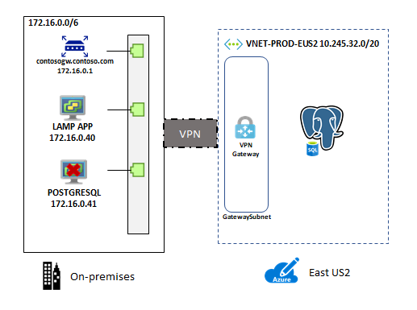
*Figure 1: Scenario architecture.*

### Migration process

#### Preparation

Before Contoso can migrate its PostgreSQL databases, it ensures that Contoso's instances meet all the Azure prerequisites for a successful migration.

#### Supported versions

Only migrations to the same or a higher version are supported. Migrating PostgreSQL 9.5 to Azure Database for PostgreSQL 9.6 or 10 is supported, but migrating from PostgreSQL 11 to PostgreSQL 9.6 isn't supported.

Microsoft aims to support *n-2* versions of the PostgreSQL engine in Azure Database for PostgreSQL - Single Server. The versions would be the current major version on Azure (*n*) and the two prior major versions (*-2*).

For the latest updates on supported versions, see [Supported PostgreSQL major versions](/azure/postgresql/concepts-supported-versions).

> [!NOTE]
> Automatic major version upgrade isn't supported. For example, there isn't an automatic upgrade from PostgreSQL 9.5 to PostgreSQL 9.6. To upgrade to the next major version, dump the database and restore it to a server created with the target engine version.

#### Network

Contoso will need to set up a virtual network gateway connection from its on-premises environment to the virtual network where its Azure Database for PostgreSQL database is located. This connection allows the on-premises application to access the database but not be migrated to the cloud.

#### Assessment

Contoso will need to assess the current database for replication issues. These issues include:

- The source database version is compatible for migration to the target database version.
- Primary keys must exist on all tables to be replicated.
- Database names can't include a semicolon (`;`).
- Migration of multiple tables with the same name, but a different case might cause unpredictable behavior.

  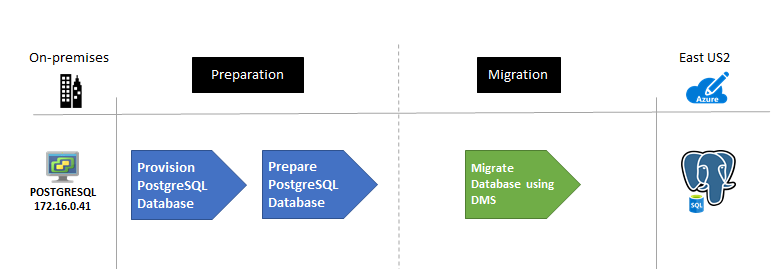
  *Figure 2: The migration process.*

**Migration:**

Contoso can perform the migration in several ways:

- [Dump and restore](/azure/postgresql/howto-migrate-using-dump-and-restore)
- [Azure Database Migration Service](/azure/dms/tutorial-postgresql-azure-postgresql-online)
- [Import/export](/azure/postgresql/howto-migrate-using-export-and-import)

Contoso has selected Azure Database Migration Service to allow the company to reuse the migration project whenever it needs to perform major-to-major upgrades. Because a single Database Migration Service activity only accommodates up to four databases, Contoso sets up several jobs by using the following steps.

To prepare, set up a virtual network to access the database. Create a virtual network connection by using [VPN gateways](/azure/vpn-gateway/vpn-gateway-about-vpngateways) in various ways.

<!-- docutune:ignore "Azure Database Migration Services" -->

### Create an Azure Database Migration Service instance

1. In the [Azure portal](https://portal.azure.com), select **Add a resource**.
1. Search for **Azure Database Migration Service**, and select it.
1. Select **+ Add**.
1. Select the subscription and resource group for the service.
1. Enter a name for the instance.
1. Select the closest location to the Contoso datacenter or VPN gateway.
1. Select **Azure** for the service mode.
1. Select a pricing tier.
1. Select **Review + create**.

    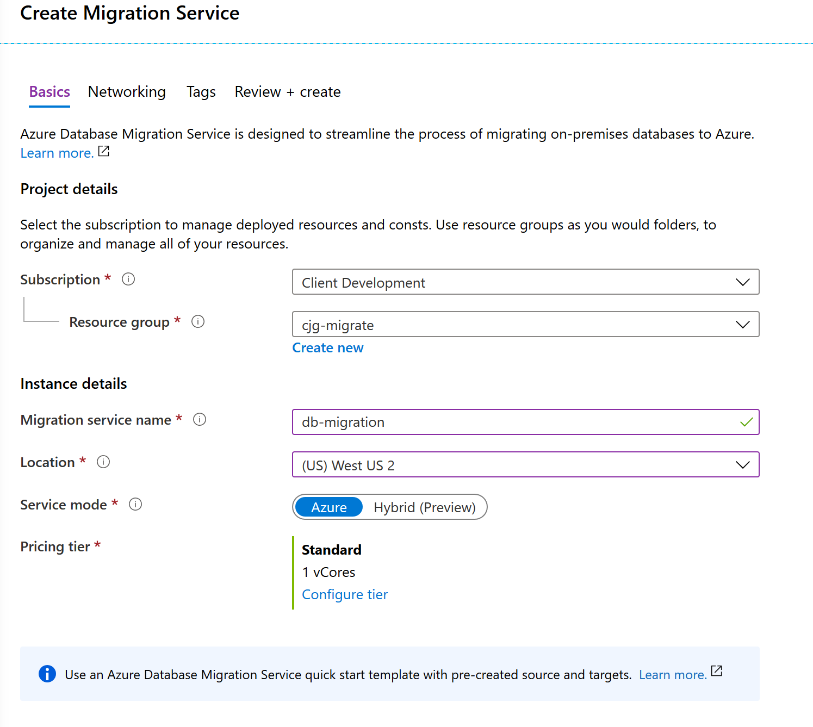
    *Figure 3: Review and create.*

1. Select **Create**.

### Create an Azure Database for PostgreSQL instance

1. On the on-premises server, configure the `postgresql.conf` file.

1. Set the server to listen on the proper IP address that Azure Database Migration Service will use to access the server and databases.
    - Set the `listen_addresses` variable.
1. Enable SSL.
    1. Set the `ssl=on` variable.
    1. Verify that Contoso is using a publicly signed SSL certificate for the server that supports TLS 1.2. Otherwise, the Database Migration Service tool will raise an error.
1. Update the `pg_hba.conf` file.
    - Add entries that are specific to the Database Migration Service instance.
1. Logical replication must be enabled on the source server by modifying the values in the `postgresql.conf` file for each server.
    1. `wal_level` = `logical`
    1. `max_replication_slots` = [at least the maximum number of databases for migration]
        - For example, if Contoso wants to migrate four databases, it sets the value to 4.
    1. `max_wal_senders` = [number of databases running concurrently]
        - The recommended value is 10.

1. Migration `User` must have the `REPLICATION` role on the source database.

1. Add the Database Migration Service instance IP address to the `PostgreSQLpg_hba.conf` file.

1. To export the database schemas, run the following commands:

    ```cmd
    pg_dump -U postgres -s dvdrental > dvdrental_schema.sql
    ```

1. Copy the file, name the copy `dvdrental_schema_foreign.sql`, and remove all non-foreign key and trigger-related items.
1. Remove all foreign key and trigger-related items from the `dvdrental_schema.sql` file.

1. Import the database schema (step 1):

      ```cmd
        psql -h {host}.postgres.database.azure.com -d dvdrental -U username -f dvdrental_schema.sql
      ```

**Migration:**

1. In the Azure portal, Contoso goes to its Database Migration Service resource.
1. If the service isn't started, select **Start Service**.
1. Select **New Migration Project**.

    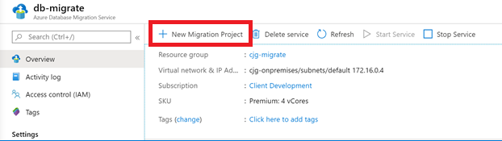
    *Figure 4: Starting a new migration.*

1. Select **New Activity** > **Online data migration**.
1. Enter a name.
1. Select **PostgreSQL** as the source.
1. For the target, select **Azure Database for PostgreSQL** and then select **Save**.

    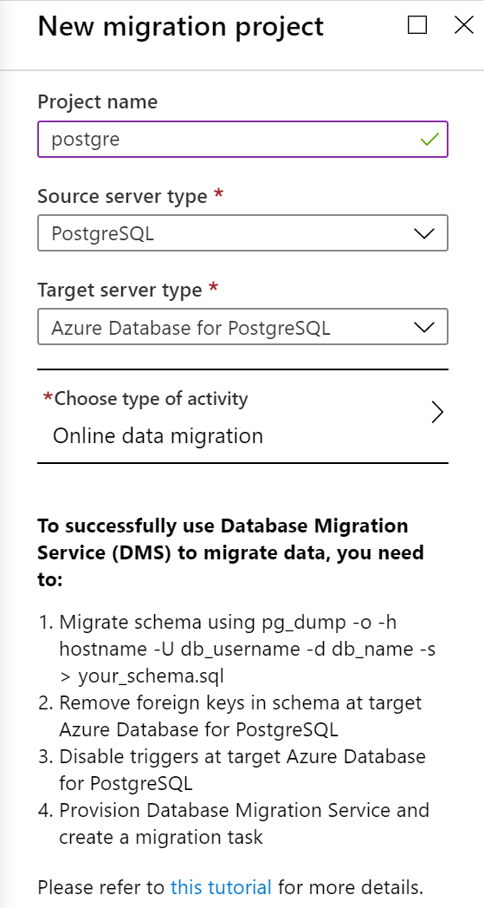
    *Figure 5: A new migration project is highlighted.*

1. Enter the source information, and select **Save**.

    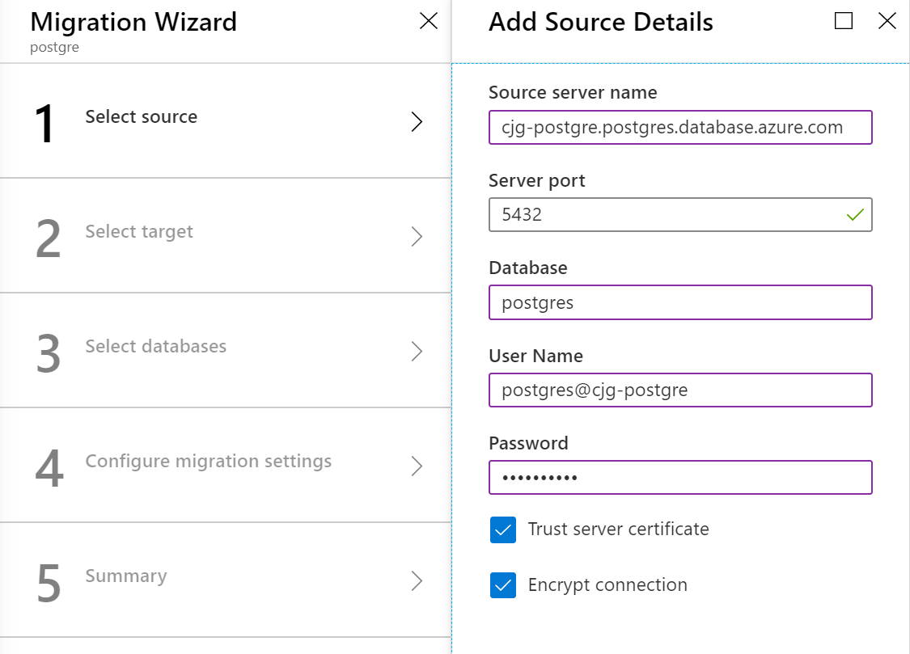
    *Figure 6: Entering source information.*

1. Enter the target information, and select **Save**.

    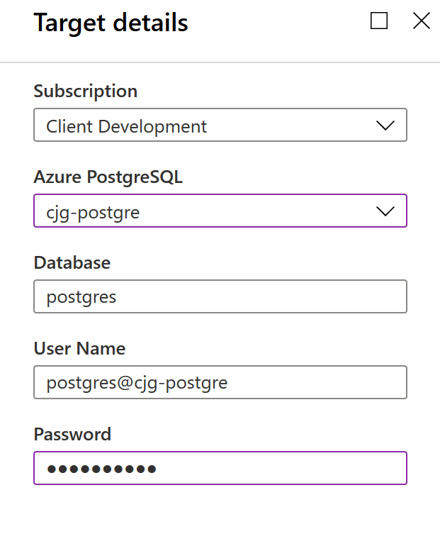
    *Figure 7: Selecting target information.*

1. Select the databases to migrate. The schema for each database should have been migrated previously. Then select **Save**.

    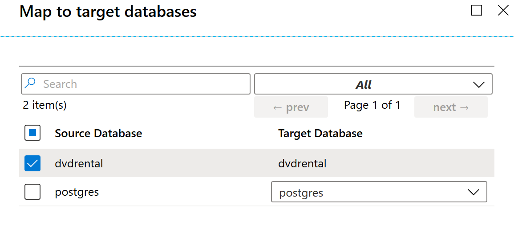
    *Figure 8: Selecting databases.*

1. Configure the advanced settings, and select **Save**.

    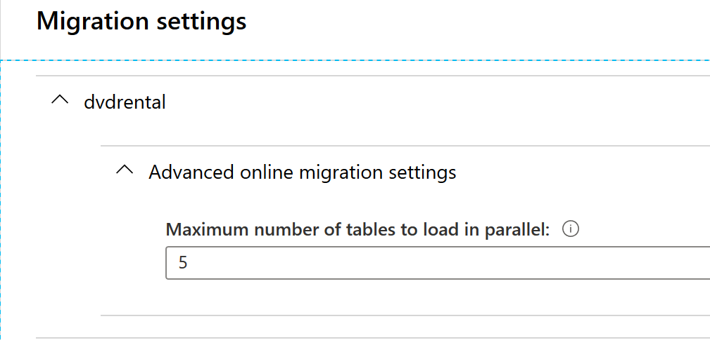
    *Figure 9: Configuring advanced settings.*

1. Give the activity a name, and select **Run**.

    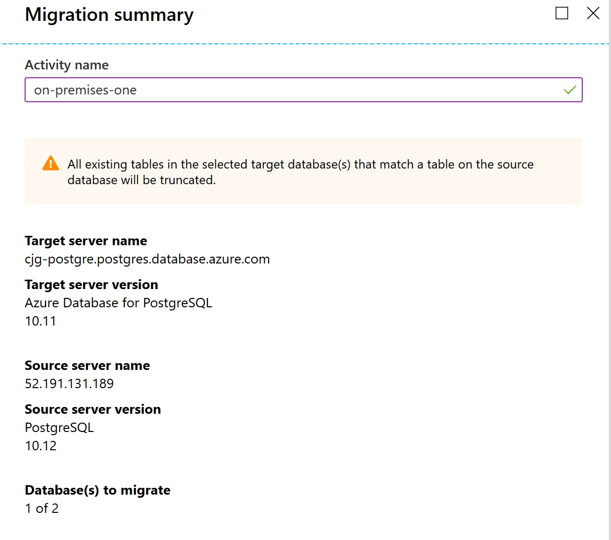
    *Figure 10: Naming and running the activity.*

1. Monitor the migration. Retry it if anything fails. An example is if foreign key references were missing.
1. After `Full load completed` matches the table count, select **Start Cutover**.

    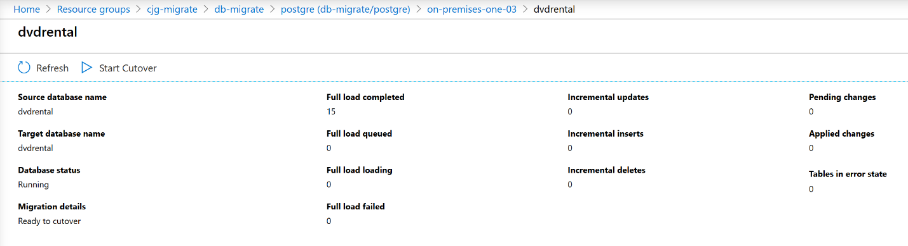
    *Figure 11: Monitoring the migration to start the cutover.*

1. Stop all transactions from the source server.
1. Select the **Confirm** check box, and then select **Apply**.

    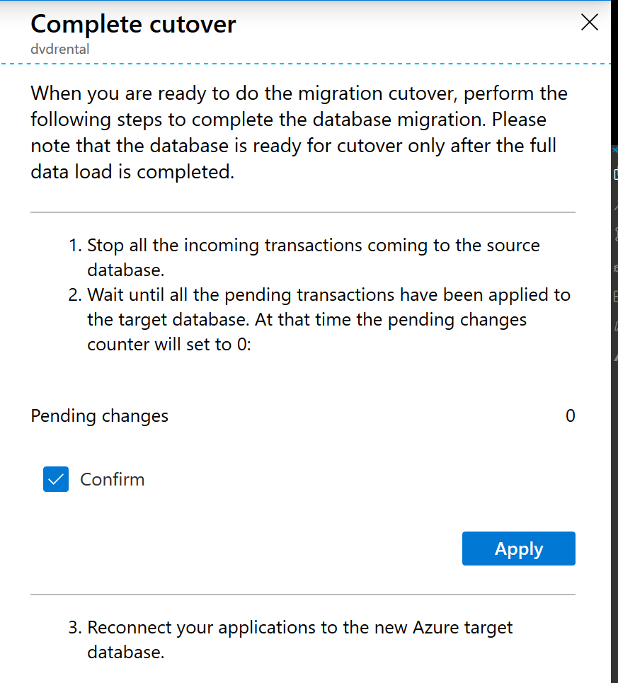
    *Figure 12: Running the cutover.*

1. Wait for the cutover to complete.

    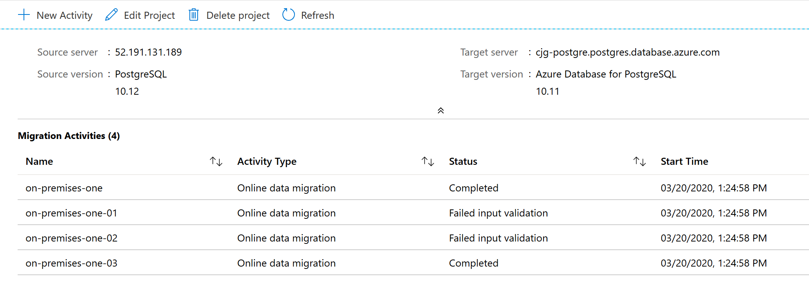
    *Figure 13: Completing the cutover.*

      > [!NOTE]
      > The previous Database Migration Service steps can also be performed via the [Azure CLI](/azure/dms/tutorial-postgresql-azure-postgresql-online).

1. Import the database schema (step 2):

      ```cmd
        psql -h {host}.postgres.database.azure.com -d dvdrental -U username -f dvdrental_schema_foreign.sql
      ```

1. Reconfigure any applications or processes that use the on-premises database to point to the new Azure Database for PostgreSQL database instance.

1. For post-migration, Contoso will ensure that it also set up cross-region read replicas, if necessary, after the migration is finished.

## Clean up after migration

After migration, Contoso needs to back up the on-premises database for retention purposes and retire the old PostgreSQL server as part of the cleanup process.

## Review the deployment

With the migrated resources in Azure, Contoso needs to fully operationalize and secure its new infrastructure.

### Security

Contoso needs to:

- Ensure that the new Azure Database for PostgreSQL instance and databases are secure. For more information, see [Security in Azure Database for PostgreSQL: Single server](/azure/postgresql/concepts-security).
- Review the [firewall rules](/azure/postgresql/concepts-firewall-rules) and virtual network configurations to verify that connections are limited to only the applications that require it.
- Implement [BYOK](/azure/postgresql/concepts-data-encryption-postgresql) for data encryption.
- Update all applications to [require SSL](/azure/postgresql/concepts-ssl-connection-security) connections to the databases.
- Set up [Private Link](/azure/postgresql/concepts-data-access-and-security-private-link) so that all database traffic is kept inside Azure and the on-premises network.
- Enable [Microsoft Defender for Identity](/azure/security-center/defender-for-databases-introduction).
- Configure Log Analytics to monitor and alert on security and logs entries of interest.

### Backups

Ensure that the Azure Database for PostgreSQL databases is backed up by using geo-restore. In this way, backups can be used in a paired region if a regional outage occurs.

> [!IMPORTANT]
> Make sure that the Azure Database for PostgreSQL resource has a resource lock to prevent it from being deleted. Deleted servers can't be restored.

### Licensing and cost optimization

- Azure Database for PostgreSQL can be scaled up or down. Performance monitoring of the server and databases is important to ensure that needs are met while keeping costs at a minimum.
- Both CPU and storage have costs associated. There are several pricing tiers to select from. Be sure the appropriate pricing plan is selected for the data workloads.
- Each read replica is billed based on the compute and storage selected.

## Conclusion

In this article, Contoso migrated its PostgreSQL databases to an Azure Database for PostgreSQL instance.
