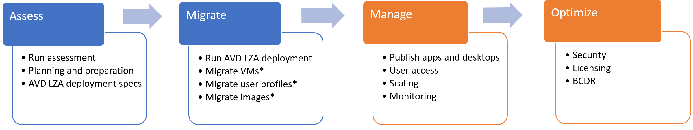
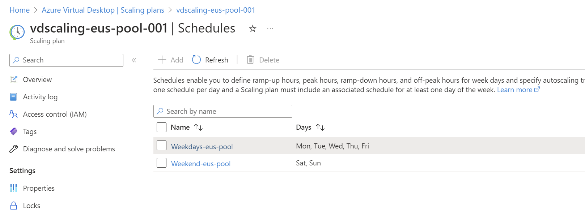

# Move on-premises Remote Desktop Services to Azure Virtual Desktop (AVD) scenario

[Azure Virtual Desktop](/azure/virtual-desktop/overview) (AVD) is a desktop and app virtualization service that runs on the cloud. It's the only desktop and application virtualization infrastructure that delivers simplified management, Windows 10 or Windows 11 Enterprise multi-session (Windows server also available) and optimizations for Microsoft 365 Apps for the enterprise. Deploy and scale Windows desktops and applications on Azure in minutes, and get built-in security and compliance features.

> [!NOTE]
> This guidance will not apply for migrating from Citrix or VMware Horizon.

| Migration options | Outcome |
|--- | --- |
| [Azure Migrate](/azure/migrate/migrate-services-overview) | Assess and migrate on-premises RDS environments.    Run workloads in an AVD environment.

## Business drivers

Working closely with business partners, the Contoso IT team defines the business drivers for a VDI migration to Azure. These drivers might include:

- **Current environment end-of-life:** A datacenter is out of capacity when it reaches the end of a lease or is closing down. Migrating to the cloud provides virtually unlimited capacity. Current software might also be reaching its end of life where it's become necessary to upgrade the software running Contoso's current desktops and application virtualization solution.
- **Reduce cost:** Reduce costs with pooled, multi-session resources. With the new Windows 11 and Windows 10 Enterprise multi-session capability, exclusive to AVD and the Remote Desktop Session Host (RDSH) role on Windows Server, you can greatly reduce the number of virtual machines and operating system overhead while still providing the same resources to your users.
- **Optimize for Microsoft 365 Apps for enterprise:** Deliver the best Microsoft 365 Apps for enterprise experience, with multi-session virtual desktop scenarios providing the most productive virtualized experience for Contoso's users.
- **Deploy and scale in minutes:** Quickly virtualize and deploy modern and legacy desktop applications to the cloud in minutes with unified management in the Azure portal.
- **Secure and productive on Azure and Microsoft 365:** Deploy a complete, intelligent solution that enhances creativity and collaboration for everyone. Shift to Microsoft 365 and get Office 365, Windows 11 or Windows 10, and Enterprise Mobility + Security.

## RDS on-premises to AVD goals

With the business drivers in mind, Contoso defines the goals for this migration:

- Modernize the desktop and application virtualization environment for the cloud.
- Take advantage of existing [Microsoft 365 licenses](/azure/virtual-desktop/prerequisites#operating-systems-and-licenses) with AVD.
- Improve security of corporate data while providing service to remote and hybrid users.
- Optimize the new environment for cost and enterprise scale growth.

These goals support the decision to use AVD and validate it as the best migration method for Contoso.

## Benefits of running AVD

Using AVD, Contoso can now seamlessly run, manage, and scale its desktop and application virtualization solution quickly and easily. The company can also provide an optimized multi-session solution on Windows 10 or Windows 11 environments to its users.

Contoso capitalizes on existing Microsoft 365 licenses while using the scale, performance, security, and innovation of Azure.

Additional benefits might include:

- Access to AVD from anywhere.
- Optimized Microsoft 365 Apps for enterprise environment.
- AVD for dev/test environments.
- Removing the need for RDS CAL licenses, when replacing Windows server multi-session hosts with Windows 10 or Windows 11 multi-session.

## Current architecture

RDS personal and pooled resources are deployed to an on-premises datacenter. Microsoft 365 is licensed and in use by the organization.

## Solutions design

After assessing current RDS deployments, defining goals and requirements, Contoso designs and reviews a deployment solution and identifies the migration process.

## Proposed architecture

The following diagram outlines the architecture that will be built to migrate RDS on-premises deployment to AVD, the activities will include:

- Sync Active Directory to Azure Active Directory.
- Deploy [AVD Landing Zone Accelerator (LZA)](https://github.com/Azure/avdaccelerator#avd-accelerator-baseline).
- Migrate other roaming profile solutions to FSLogix (Optional).
- Migrate user profile data from FSLogix on-premises to AVD FSLogix storage (Optional).
- Migrate on-premises VMs that most persist (Optional).

   
   *Figure 1: Proposed architecture: AVD LZA will deploy the resources contained under the AVD LZ Subscription*.

   [Download the Visio file.](https://raw.githubusercontent.com/Azure/avdaccelerator/main/workload/docs/diagrams/avd-accelerator-baseline-architecture.vsdx)

## Migration process

Contoso will go through the following flow to migrate from on-premises RDS to AVD:

- Run the assessment and define AVD deployment.
- Create AVD LZA deployment and migrate objects that must persist (VMs, profiles, images).
- Manage AVD published items, assignments, monitoring and scaling.
- Optimize Azure state.

  
  *Figure 2: The migration process.*

## Migration steps

1. Prerequisites.
1. Assess the current RDS on-premises environment.
1. Deploy [AVD Landing Zone Accelerator (LZA)](https://github.com/Azure/avdaccelerator#avd-accelerator-baseline).
1. Other roaming profile solutions migration to FSLogix (Optional).
1. Migrate FSLogix on-premise data to Azure (Optional).
1. Migrate VMs that must persist to Azure (Optional).
1. Manage the AVD.
1. Optimize the AVD.

### Step 1: Prerequisites

1. An Azure subscription is required ([Subscription requirements](https://github.com/Azure/avdaccelerator/blob/main/workload/docs/getting-started-baseline.md#subscription-requirements)).

1. Make sure that domain services, either Active Directory or Azure AD DS, are synchronized with Azure Active Directory (Azure AD). Ensure the domain service is accessible from the Azure subscription and virtual network where you deploy AVD session hosts. AVD requires hybrid user identities for majority of your AVD deployments and desired features. The AVD service requires users UPN or SID to match between on-prem AD and Azure AD.

   > [!NOTE]
   > Review **[AVD identities and authentication](/azure/virtual-desktop/authentication)** for a comprehensive list of requirements and supported features based on your identity strategy and configuration.
   > [!NOTE]
   > Learn more about the options to sync Active Directory on-premises with **[Azure AD Connect](/azure/active-directory/hybrid/how-to-connect-install-express)** or  **[Azure AD Connect Cloud Sync](/active-directory/cloud-sync/concept-how-it-works)**.
   > [!NOTE]
   > Learn more about provisioning **[Azure AD DS](/azure/active-directory-domain-services/tutorial-create-instance)** and synchronizing Azure AD to it.

1. Prior to the deployment of the AVD LZA, ensure the the [AVD LZA Prerequisites](https://github.com/Azure/avdaccelerator/blob/main/workload/docs/getting-started-baseline.md#prerequisites) are met.

### Step 2: Assess the current RDS on-premises environment

1. In Azure Migrate, select **Discover, assess and migrate**.

   :::image type="content" source="./media/contoso-migration-rds-to-wvd/azure-migrate-get-started.png" alt-text="Screenshot that shows the overview page and Get Started tab for Azure Migrate.":::
   *Figure 3: Getting started.*

1. Select **Create project**.

   :::image type="content" source="./media/contoso-migration-rds-to-wvd/azure-migrate-create-project.png" alt-text="Screenshot that shows the Create Project button.":::
   *Figure 4: Creating a new Azure Migrate project.*

1. Set the subscription, resource group, project name, and geography for the migrate job data, and then select **Create**.

   :::image type="content" source="./media/contoso-migration-rds-to-wvd/azure-migrate-add-job-data.png" alt-text="Screenshot of adding job data to the Azure Migrate project.":::
   *Figure 5: Adding job data to the migration.*

   > [!IMPORTANT]
   > This location isn't where the new AVD environment will be deployed. Only the data related to the Azure Migrate project will be stored here.

1. Select **VDI**, and then select **Click here** under **Assessment tools**.

   :::image type="content" source="./media/contoso-migration-rds-to-wvd/azure-migrate-vdi-add-tool.png" alt-text="Screenshot that shows adding an assessment tool on the VDI page.":::
   *Figure 6: Adding an assessment tool*

   > [!NOTE]
   > The migration tool **Azure Migrate: Server Migration** is automatically added during the project creation.

1. Select **Lakeside: SysTrack** as the assessment tool, and then select **Add**.

   :::image type="content" source="./media/contoso-migration-rds-to-wvd/azure-migrate-select-lakeside-systrack.png" alt-text="Screenshot that shows adding the Lakeside:SysTrack tool to the project.":::
   *Figure 7: Adding tools to the migration.*

1. Start the assessment of the current environment by selecting **Register with Azure Migrate** in the Lakeside tool.

   :::image type="content" source="./media/contoso-migration-rds-to-wvd/azure-migrate-register-lakeside.png" alt-text="Screenshot that shows Lakeside registration with Azure Migrate.":::
   *Figure 8: Register with Azure Migrate.*

1. Contoso connects Azure Migrate and Lakeside, and accepts any requested permissions.

   
   *Figure 9: Connecting Azure to Lakeside.*

1. Contoso continues with the Lakeside tool to create a new tenant and start assessing the current on-premises RDS environment. From the dashboard, Contoso can access the deployment guide, download the assessment client to deploy to the current environment, and review the data collected from these agents.

   
   *Figure 10: The Lakeside dashboard.*
1. After an adequate amount of data is captured, Contoso reviews the assessment data to determine the best migration path. This assessment data includes the raw assessment data from the desktops data and the data broken into different user personas. This information includes the:

    - Number of users in each persona.
    - Applications in use by users.
    - Resource consumption by user.
    - Resource utilization averages by user persona.
    - VDI server performance data.
    - Concurrent user reports.
    - Top software packages in use.

   
   *Figure 11: Lakeside dashboard reports.*

    The data is analyzed by Contoso to determine the most cost-effective use of both pooled AVD resources and personal AVD resources.

> [!IMPORTANT]
> Reviewing the assessment data, Contoso defines two RDS scenarios:
> 1. **Multi-session (non-persistent):** RDS hosts running Windows server and allowing multiple users connections to the same host.
> 1. **Single-session (persistent):** RDS hosts running Windows 11.
> [!NOTE]
> To reduce improve performance of AVD users flows, Contoso will also need to migrate application servers and data sources that will be consumed by the AVD environment. This same methodology should be applied to platform shared services (Domain Controllers, DNS, network devices, among others) that AVD will rely on. Best practice is to host these services in the same Azure Region as the AVD session hosts.

**Next steps:**

- Execute AVD LZA deployments with the defined scenario steps.

### Step 3: Deploy AVD Landing Zone Accelerator (LZA)

The AVD LZA is Microsoft's enterprise-ready solution that can be used to deploy an end-to-end AVD enterprise ready environment, to deploy the accelerator follow the [AVD LZA Deployment Walk Through](https://github.com/Azure/avdaccelerator/blob/main/workload/docs/deploy-baseline.md) guide.

> [!IMPORTANT]
> Based on the outcome of the assessment phase, two AVD LZA deployments will be required to address Contoso scenarios:
> 1. **Multi-session (Pooled host pool):** AVD management plane (workspace, host pool, application group, scaling plan) deployment with Windows 10 or Windows 11 multi-session session hosts and FSLogix to manage users profile data.
> 1. **Single-session (Personal host pool):** AVD management plane (workspace, host pool, application group, scaling plan) deployment without de deployment of new session hosts (personal VMs will be migrated from RDS).

| Deployment Type | Link |
|:--|:--|
| Azure portal UI |
| Command line (Bicep/ARM) |  |
| Terraform |  |

> [!NOTE]
> To improve performance of AVD users flows, Contoso will also need to migrate application servers and data sources that will be consumed by the AVD environment. This same methodology should be applied to platform shared services (Domain Controllers, DNS, network devices, among others) that AVD will rely on. Best practice is to host these services in the same Azure Region as the AVD session hosts.

**Next steps:**

- Migrate user profile data that must persist (FSLogix).
- Migrate VMs that must persist.
- Configure user assignments to AVD published items.

### Step 4: Other roaming profile solutions migration to FSLogix (Optional)

> [!IMPORTANT]
> FSLogix doesn't provide a direct migration path from other roaming profile solutions. Implementing OneDrive with known folder move or similar cloud or network storage solutions provides users with a location to save their data outside of their profile. For smaller use cases, our **[frx command-line utility](https://learn.microsoft.com/fslogix/utilities/frx/frx)** can help copy local profiles into a new VHD(x).
> [!NOTE]
> Learn more about **[Onedrive known folder move](https://learn.microsoft.com/sharepoint/redirect-known-folders)**.

**Next steps:**

- Migrate user profile data that must persist (FSLogix).
- Migrate VMs that must persist.
- Deploy the necessary applications to the users.

### Step 5: Migrate FSLogix data to Azure (Optional)

> [!IMPORTANT]
> Microsoft doesn't support roaming of FSLogix profiles between OS versions (eg. Windows 7 to Windows 10 or Windows Server 2012 to Windows 11 Multi-Session). Therefore FSLogix data migration to Azure is only recommended when AVD session hosts are using the same OS version as the on-premises RDS host (eg. Windows 10 to Windows 10). For scenarios on which the OS versions doesn't match, the recommendation is to implementing OneDrive with known folder move or similar cloud or network storage solutions provides users with a location to save their data outside of their profile.
> [!NOTE]
> Learn more about **[Onedrive known folder move](https://learn.microsoft.com/sharepoint/redirect-known-folders)**.

**Next steps:**

- Migrate VMs that must persist.
- Deploy the necessary applications to the users.

### Step 6: Migrate VMs that must persist to Azure (Optional)

> [!IMPORTANT]
> Instead of migrating RDS hosts, Microsoft generally recommends to redeploy VMs using Azure market place images or custom images built from the marketplace ones, these will ensure compatibility and remove any possible bloat from the existing on-premises images.
>
>For scenarios on which VMs must persist, the steps on this guide provide details on migrating on-premises RDS hosts to AVD.

The next step in the migration process for Contoso is to migrate its persistent VMs to AVD. To do this, Contoso goes back to the Azure Migrate: Server Migration job it created on step 1.

1. Contoso starts by selecting **Discover** in the Azure Migrate: Server Migration tools.

   
   *Figure 16: Discovering a server migration.*

1. Contoso converts an appliance in its environment that's going to manage the replication of the machines to AVD. Ensure that the target region is set to **East US 2**, where the AVD environment was created. For full Azure Migrate OS Support matrix, see [Support Matrix for Hyper-V](/azure/migrate/migrate-support-matrix-hyper-v-migration) and [Support Matrix for VMware vSphere](/azure/migrate/migrate-support-matrix-vmware-migration).

   :::image type="content" source="./media/contoso-migration-rds-to-wvd/azure-migrate-discover-resources.png" alt-text="Screenshot that shows creating an appliance for managing the replication.":::
   *Figure 17: Converting an appliance.*

1. Contoso downloads, installs, and registers the replication provider to the Azure Migrate project to start the replication to Azure.

   :::image type="content" source="./media/contoso-migration-rds-to-wvd/azure-migrate-discover-prepare-replication.png" alt-text="Screenshot that shows downloading and configuring replication.":::
   *Figure 18: Prerequisites for replicating to Azure.*

1. The replication of the hosts into Azure Blob Storage starts. Contoso can continue to let the replication occur until it's ready to test the VMs and then migrate them into production.

1. As migrated VMs start running in Azure, Contoso will need to install and configure AVD agents on each migrated:
   - Get host pool registration token, following guidance outline in this doc: [Generate a registration key](/azure/virtual-desktop/add-session-hosts-host-pool?tabs=powershell%2Cgui#generate-a-registration-key).

   - Install AVD agents and register VMs on the host pool following the guidance outline in this doc: [Register session hosts to a host pool](/azure/virtual-desktop/add-session-hosts-host-pool?tabs=powershell%2Cgui#register-session-hosts-to-a-host-pool).

> [!IMPORTANT]
> Microsoft generally recommends to rebuild an image in Azure to ensure compatibility and remove any possible bloat from the existing on-premises images. For scenarios on which an image must be migrated, the following article provides guidance **[Prepare a Windows VHD or VHDX to upload to Azure](/azure/virtual-machines/windows/prepare-for-upload-vhd-image)**.
> [!NOTE]
> Contoso can also automate this process by using `msiexec` commands and passing in the registration token or by using VM custom script extension to deploy the agents (**[AVD LZA Automation](https://github.com/Azure/avdaccelerator)**).
> [!NOTE]
> It's important to note that if VMs are being migrated through replication, the image will migrate with them, so you will not need to upload it separately. However, if you are creating new VMs in Azure, or if you want to use the same image across multiple VMs, then you will need to follow the steps outlined in the guide to prepare and upload the image to Azure.

After host pools are assigned to users, Contoso finalizes the migration of those machines and continues to gradually migrate the rest of the on-premises RDS hosts to AVD.

**Next steps:**

- Manage AVD.

### Step 7: Manage AVD

1. Publish applications and desktops
   - AVD LZA deployment creates by default one application group for desktops and has the option to also deploy a remote apps application group. Post deployment there is no need to manage desktops as they are published by default, remote apps can be managed by following the guidance on the docs:
      - [Manage application groups with the Azure portal](/azure/virtual-desktop/manage-app-groups).
      - [Manage application groups using PowerShell or the Azure CLI](/azure/virtual-desktop/manage-app-groups-powershell?tabs=azure-powershell).
      - [Publish built-in apps in Azure Virtual Desktop](/azure/virtual-desktop/publish-apps).

1. User access
   - As the last step before the final migration, Contoso selects the **Users** item in the AVD settings to map the servers to their respective users and groups.

       :::image type="content" source="./media/contoso-migration-rds-to-wvd/azure-virtual-desktop-users-map-servers.png" alt-text="[Screenshot that shows assigning AVD resources to users and groups.":::
       *Figure 19: The last step prior to the final migration.*

      Additional user assignment information can be found at the doc [Manage application groups with the Azure portal](/azure/virtual-desktop/manage-app-groups)

1. Scaling
   - AVD LZA deployment has the option to create an AVD scaling plan (Enabled by default) that is assigned and enabled on the host pool (Pooled host pools), the scaling plan is pre configured with to schedules (weekdays and weekend) in the same time zone as the session hosts and default scaling rules.

      

      Scaling rules should be modified to meet the specific needs of the workloads the AVD environment is hosting. Information on configuring scaling plans can be found at the doc [Autoscale scaling plans and example scenarios in Azure Virtual Desktop](/azure/virtual-desktop/autoscale-scenarios).

1. Monitoring
   - AVD LZA deployment has the option to deploy all diagnostics settings (Enabled by default) required by the AVD insights workbook, including the creation of a new log analytics workspace (option to use existing is available) to gather AVD logs, metrics and events.

      

      More information on AVD monitoring can be found at the doc [Use Azure Virtual Desktop Insights to monitor your deployment](/azure/virtual-desktop/insights).

**Next steps:**

- Optimize AVD.

### Step 8: Optimize AVD

1. Security
   - The Contoso security team reviews the Azure VMs to determine any security issues. To control access, the team reviews the network security groups (NSGs) for the VMs. NSGs are used to ensure that only traffic allowed to the application can reach it. The team also considers securing the data on the disk by using Azure Disk Encryption and Azure Key Vault. Session Hosts should also be protected using Defender for Endpoint or the product of choosing, ensure your vendor supports their product in Azure VDI environments. Also opt to protect AVD landing zone subscriptions with Defender for Cloud for increased visibility and compliance controls.

   > [!NOTE]
   > Learn more about AVD security with **[AVD security best practices](/azure/virtual-desktop/security-guide)**.

1. Licensing
   - [Microsoft 365 licenses](https://azure.microsoft.com/pricing/details/virtual-desktop/) are used for the desktop deployments. If Windows Server session hosts are still required, Contoso will need to bring their RDS user CAL licenses. Thanks to AVD licensing entitlement, there is no OS cost for any operating system, including Windows Server.

1. Cost optimization
   - [Microsoft 365 licenses](https://azure.microsoft.com/pricing/details/virtual-desktop/) are used for the desktop deployments. If Windows Server session hosts are still required, Contoso will need to bring their RDS user CAL licenses. Thanks to AVD licensing entitlement, there is no OS cost for any operating system, including Windows Server.
   - Contoso will enable [Azure Cost Management + Billing](/azure/cost-management-billing/cost-management-billing-overview) to help monitor and manage the Azure resources.
   - Contoso will use [AVD Tagging](/azure/virtual-desktop/tag-virtual-desktop-resources) to track costs and group it based on related resources to the host pool.
   - Contoso will monitor utilization across their entire AVD deployments using [AVD Insights](/azure/virtual-desktop/insights) and assess the cost savings opportunities of Reserved Instances, Savings Plans or Reserved Capacity.

1. Configure Business continuity and disaster recovery (Optional)

   - AVD uses a combination of Microsoft managed components that come with a non-financially backed SLA targeting 99.9% uptime for our AVD Gateways, Brokers, Web Access, and diagnostics. These services meta-data and service-data are backed up and replicated behind the scenes to recover to alternate regions in the event of an outage. Contoso is responsible for the customer managed components, that includes Virtual Machines, Storage, Images, Applications, and the network components for their DR requirements.

   > [!NOTE]
   > Learn more about BCDR options with **[Business continuity and disaster recovery considerations for AVD](/azure/cloud-adoption-framework/scenarios/wvd/eslz-business-continuity-and-disaster-recovery)**.

   
   *Figure 20: Sample of an AVD multi-region architecture.*

   [Download the Visio file.](https://raw.githubusercontent.com/Azure/avdaccelerator/main/workload/docs/diagrams/avd-accelerator-baseline-architecture-multi-region-stage-2.vsdx)

## Review the deployment

With the virtual desktops and application servers now running in Azure, Contoso now needs to fully operationalize and secure the deployment.

## Conclusion

In this article, Contoso moved its RDS deployment to AVD.
