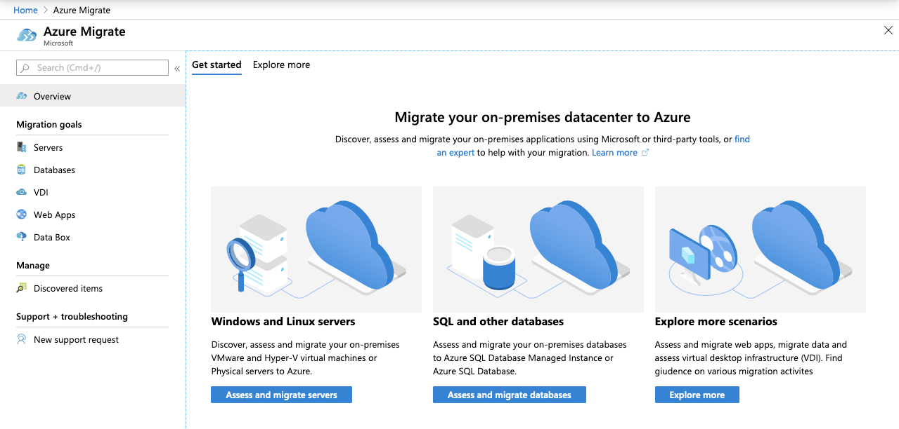
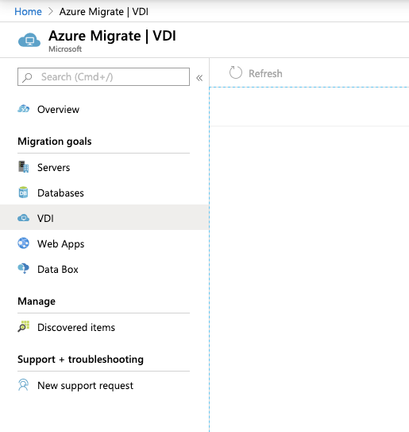
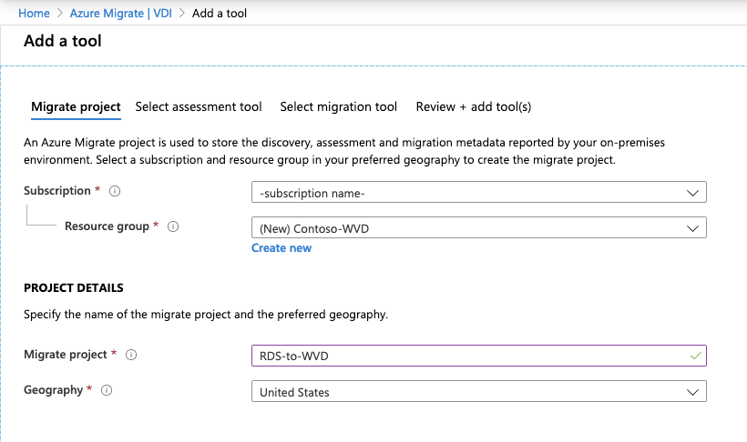
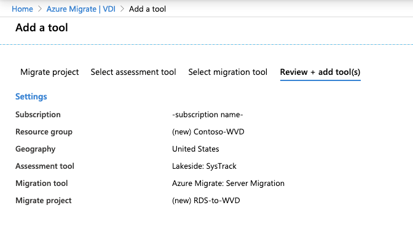
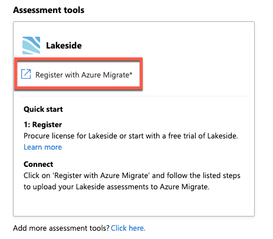
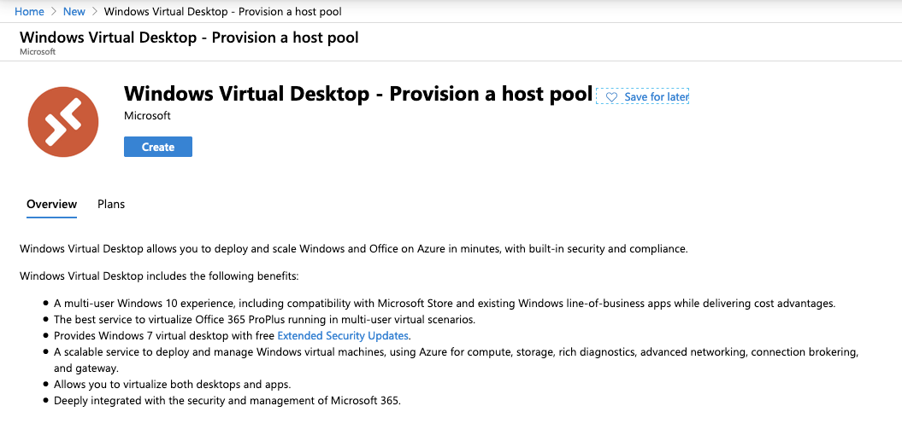
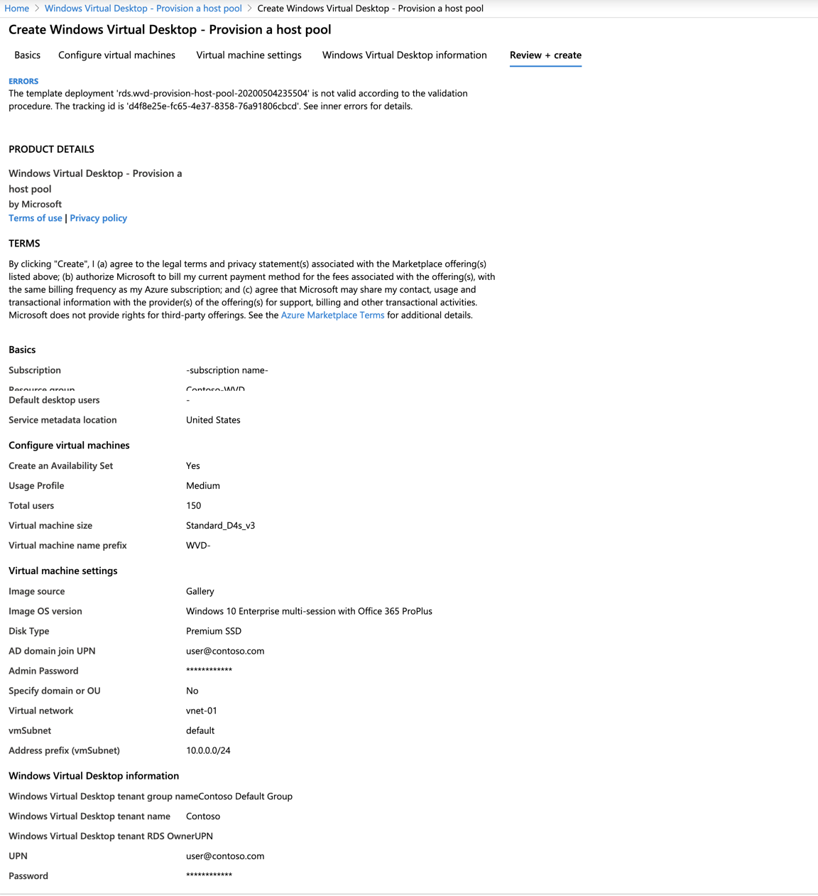
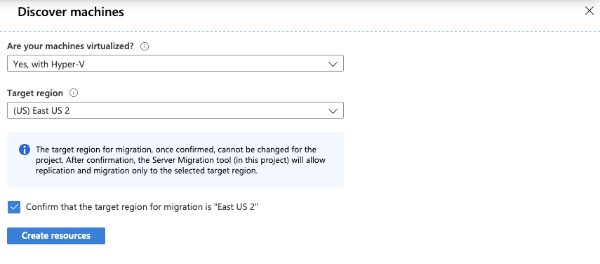
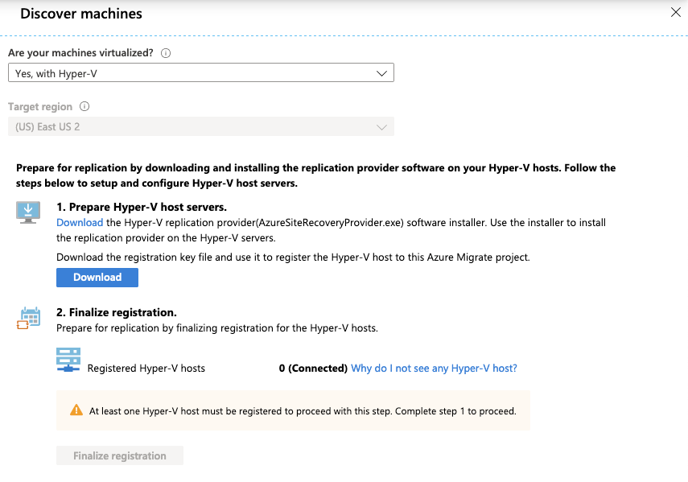
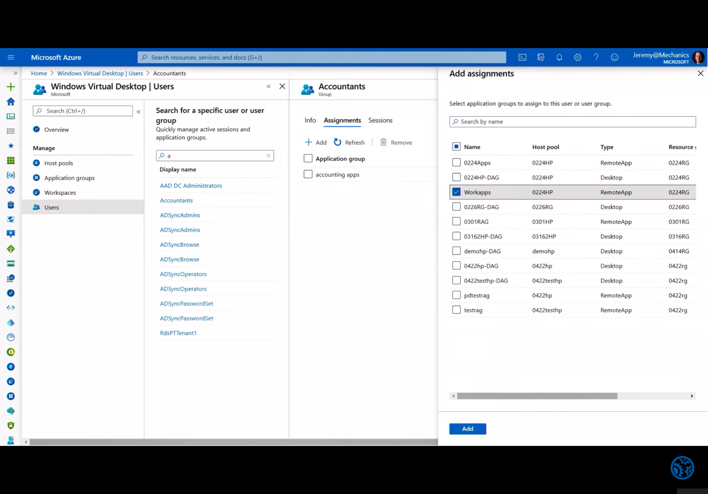

<!-- cSpell:ignore benstegink Logix -->

# Moving on-premises Remote Desktop Services to Azure Windows Virtual Desktop (scenario)

<!-- markdownlint-disable MD033 -->

| Migration options | Outcome |
|--- | --- |
| [Azure Migrate](https://docs.microsoft.com/azure/migrate/migrate-services-overview) | Assess and migrate on-premises RDS environment. <br><br> Run workloads using Azure WVD. <br><br> Manage WVD with [WVD management ux](https://github.com/Azure/RDS-Templates/tree/master/wvd-templates/wvd-management-ux). |

Windows Virtual Desktop (WVD), is a comprehensive desktop and app virtualization service running in the cloud. It's the only virtual desktop infrastructure (VDI) that delivers simplified management, multi-session Windows 10, optimizations for Microsoft 365 Apps for enterprise, and support for Remote Desktop Services (RDS) environments. Deploy and scale Windows desktops and apps on Azure in minutes, and get built-in security and compliance features.

> [!NOTE]
> This article focuses on using Azure Windows Virtual Desktop (WVD) service, to move an on-premises RDS environment to Azure.

## Business drivers

Working closely with business partners, the Contoso IT team will define the business drivers for a VDI migration to Azure. These drivers may include:

- **Current environment end-of-life:** Datacenter is out of capacity, reaching the end of a lease, or datacenter closing down. Migrating to the cloud provides unlimited capacity. Current software may also be reaching it's end of life where it has become necessary to upgrade the software running Contoso's current virtual desktop interface (VDI) solution.
- **Multi-session Windows 10 VDI:** Provide Contoso users with the only multi-session Windows 10 desktop virtualized in the cloud that's highly scalable, always up to date, and available on any device.
- **Optimize for Microsoft 365 Apps for enterprise:** Deliver the best Microsoft 365 Apps for enterprise experience, with multi-session virtual desktop scenarios to provide the most productive virtualized experience for Contoso's users.
- **Deploy and scale in minutes:** Quickly virtualize and deploy modern and legacy desktop apps to the cloud in minutes with unified management in the Azure portal.
- **Secure and productive on Azure and Microsoft 365:** Deploy a complete, intelligent solution that enhances creativity and collaboration for everyone. Shift to Microsoft 365 and get Office 365, Windows 10, and enterprise mobility + security.

## RDS on-premises to WVD in the cloud goals

With the business drivers in mind, Contoso has pinned down goals for this migration:

- Modernize the virtual desktop environment for the cloud
- Take advantage of existing Microsoft 365 licenses
- Improve security of corporate data when working remotely
- Optimize the new environment for cost and growth

These goals support the decision to use WVD and validate it as the best migration method for Contoso.

## Benefits of running Windows Virtual Desktop in Azure

Using Windows Virtual Desktop (WVD) in Azure, Contoso can now seamlessly run, manage, and scale their VDI solution quickly and easily as well as provide an optimized multi-session Windows 10 environment to their users.

Contoso will capitalize on existing Microsoft 365 licenses, while using the scale, performance, security, and innovation of Azure.

Additional benefits may include:

- Access to WVD from anywhere
- Optimized Microsoft 365 Apps for enterprise environment
- WVD for development/test environments

## Solutions design

After pinning down goals and requirements, Contoso designs and reviews a deployment solution, and identifies the migration process.

### Current architecture

- Remote desktop service (RDS) is deployed to an on-premises datacenter
- Microsoft 365 is licensed and in use by the organization

### Proposed architecture

- Sync Active Directory or Azure Active Directory Domain Services (Azure AD DS) with Azure Active Directory (Azure AD)
- Deploy Windows Virtual Desktop (WVD) to Azure
- Migrate on-premises RDS server to Azure
- Convert user profile disks (UPD) to FSLogix profile containers


## Solution review

Contoso evaluates the proposed design by putting together a pros and cons list.

<!-- markdownlint-disable MD033 -->

| Consideration | Details |
| --- | --- |
| **Pros** | Windows 10 multi-session environment <br><br> Cloud-based allowing access from anywhere <br><br> Take advantage of other Azure services like Azure Files within the WVD environment <br><br> Optimized for the Microsoft modern desktop. |
| Cons | To fully optimize for Azure Contoso will have to rebuild Windows 10 images optimized for multiuser sessions <br><br> Windows Virtual Desktop doesn't support user profile disks, so these will need to be migrated to FSLogix profile containers |

## Migration process

Contoso will move VMs to WVD in Azure using the lakeside assessment tool and Azure Migrate.

- As a first step, Contoso runs the assessment tool against their on-premises RDS infrastructure to establish the scale of the WVD deploy in Azure.
- Migrate to WVD: Windows 10 multi-session or persistent virtual machines.
- Optimize the WVD multi-session scaling up and down as needed to manage costs.
- Virtualize applications and assign users as needed to continue to secure and manage the WVD environment.

    

## Scenarios steps

1. Assess the current RDS environment.
2. Create the WVD infrastructure and new images in Azure and migrate and persistent VMs to Azure.
3. Convert user profile disks (UPDs) to FSLogix profile containers.
4. Replicate any persistent VMs to Azure.

## Step 1: Assess the current on-premises environment

Contoso will provision the WVD service in the `East US 2` Azure region. The WVD service allows them to provision virtual machines, host pools, and create application groups. The WVD service also configures an availability set for all the servers in the WVD solution. The WVD services allows Contoso to create both a high available VDI environment as well as scale up and down quickly as needed.

> [!NOTE]
> There are two scenarios that Contoso is reviewing during the assessment: multi-session (shared) instances of RDS, and persistent (or user-dedicated) virtual machines.

- First, ensure domain services (Active Directory or Azure AD DS), is synchronized with Azure AD and that the domain service is accessible from the Azure subscription and virtual network to be connected where the WVD will be deployed.

> [!NOTE]
> Learn more about [Azure AD Connect](https://docs.microsoft.com/azure/active-directory/hybrid/how-to-connect-install-express) for synchronizing active director on-premises with Azure AD.
> [!NOTE]
> Learn about provisioning [Azure Active Directory Domain Services](https://docs.microsoft.com/azure/active-directory-domain-services/tutorial-create-instance) and synchronizing Azure AD to it.

- Create a new Azure Migrate project



- Choose the option to assess and migrate servers, select VDI, and add a tool.



- Set the subscription, resource group, migrate project name, and geography for the migrate job data.



> [!IMPORTANT]
> This isn't where the new WVD environment will be deployed as only the the data related to the Azure Migrate project will be stored here.

- Choose lakeside: systrack as the assessment tool

- Select Azure Migrate: Server Migration for the migration tool

- Add the tools to the migration project



- Start the assessment of the current environment by clicking to register with Azure Migrate in the lakeside tool



- Contoso connects Azure Migrate and lakeside, and accepts any requested permissions.


- Contoso continues with the lakeside tool to create a new tenant and start assessing their current on-premises RDS environment. From the dashboard Contoso can access the deployment guide, download the assessment client to deploy to their current environment as well as review the data collected from these agents.


- Once Contoso has captured an adequate amount of data, they review the assessment data to determine the best migration path. In this assessment data Contoso has the raw assessment data from the desktops data as well as the data broken into different user personas. The includes information such as:
  - Number of users in each persona
  - Applications in use by users
  - Resource consumption by user
  - Resource utilization averages by user persona
  - VDI server performance data
  - Concurrent user reports
  - Top software packages in use

 This data is analyzed by Contoso to determine the most cost effect use of both pooled WVD resources and personal WVD resources.

> [!NOTE]
> Contoso will also need to migrate their application servers to Azure in order to get them closer to the WVD environment and reduce network latency for their users.

## Step 2: Create the Windows Virtual Desktop environment for pooled desktops

Using the Azure portal, Contoso will create a Windows Virtual Desktop (WVD) environment to user for pooled resources. Later they will go through the migration steps to attach personal desktops to the same environment.

- Contoso selects the correct subscription and creates a new Windows Virtual Desktop host pool



- They specify the subscription, resource group, and region. Next choose they name for the host pool, desktop type, and default desktop users. Desktop type is set pooled since Contoso is starting with a new shared environment for some of their users. Default desktop users can be left blank. The move on to configuring the virtual machines.


- As this point in time, Contoso configures the VM, starting with choosing a custom size by clicking change size, or they choose to take the default.
- WVD is chosen as the VM name prefix for these pooled desktops.
- For the virtual machine settings, since Contoso is creating the pooled servers in order to use the new Windows 10 multi-session functionality. They leave image source set to gallery, enabling them to select the Windows 10 Enterprise multi-session image for the VMs.
- Based on the personas of the users from the lakeside assessment, Contoso sets the total users to 150.
- Other settings include the disk type, the ad domain join upn, an admin password, an option OU path to add the machines to, the virtual network and subnet to add the servers to.


> [!NOTE]
> Contoso can't create a new virtual network at this step. Before reaching this step they should have already created a virtual network that has access to Active Directory.
> [!NOTE]
> Contoso cannot use a user account that requires multi-factor authentication in this step. If they do plan to use multi-factor authentication for their users, they will need to create a service principal for this purpose.

- Contoso performs one more validation of their WVD settings and creates the new environment of pooled WVD virtual machines.



## Step 3: Convert the UPDs to FSLogix profile containers

Since WVD doesn't support user profile disks (UPDs), Contoso needs to convert all the UPDs to FSLogix. This process is done using the FSLogix migration PowerShell module that can be download from [https://aka.ms/fslogixmigrationpreviewmodule](https://aka.ms/FSLogixMigrationPreviewModule).

<!-- docsTest:ignore FSLogixMigration -->

Once Contoso has imported the FSLogixMigration module, they run the following PowerShell cmdlets to migrate from UPDs to FSLogix.

> [!IMPORTANT]
> The PowerShell modules for Hyper-V, activedirectory, and pester are prerequisites to running the cmdlets to convert UPDs to FSLogix.

- UDP conversion

```powershell
Convert-RoamingProfile -ParentPath "C:\Users\" -Target "\\Server\FSLogixProfiles$" -MaxVHDSize 20 -VHDLogicalSectorSize 512
```

- Roaming profile conversion

```powershell
Convert-RoamingProfile -ProfilePath "C:\Users\User1" -Target "\\Server\FSLogixProfiles$" -MaxVHDSize 20 -VHDLogicalSectorSize 512 -VHD -IncludeRobocopyDetails -LogPath C:\temp\Log.txt
```

At this point in time, the migration work for user to be able to used pooled resources with Windows 10 multi-session has been completed. Contoso can beginning deploying the necessary applications to their users that will be using Windows 10 multi-session.

But now Contoso must migrate the persistent virtual machines to Azure.

## Step 4: Replicate and persistent VMs to Windows Virtual Desktop

The next step in the migration process for Contoso is to migrate their persistent virtual machines to Windows Virtual Desktop. To do this, they navigate back to the Azure Migrate: Server Migration job they created at the beginning of the process.

- Contoso starts by selecting discover in the Azure Migrate: Server Migration tools


- Next they convert an appliance in their environment that's going to manage the replication of the machines to WVD. Insuring that the target region is set to East US 2 where their WVD environment as been created.



- The replication provider is downloaded, installed and registered to the Azure Migrate project in order to start the replication to Azure.



- The replication of the hosts into Azure blog storage is now started and Contoso can continue to let the replication occur until they're ready to test the VMs and then migrate them into production.
- As machines start running in Azure, Contoso makes sure to install the WVD agent on each machine.

> [!NOTE]
> The WVD agent can be downloaded from [https://aka.ms/wvdvmagent](https://aka.ms/WVDVMAgent)

- As a part of the installation they enter the registration token for the WVD environment in order to associate the server with the correct WVD environment.

The registration token can be obtained using:

```powershell
Export-RDSRegistrationInfo -TenantName "Contoso" -HostPoolName "ContosoWVD" | Select-Object -ExpandProperty Token > .\registrationtoken.txt
```

> [!NOTE]
> Contoso can also automate this process by using msiexec commands and passing in the registration token as a variable.

- As the last step before the final migration, Contoso maps the servers to their respective users and groups using the users item in the Azure WVD settings.



- One host pools are assigned to users. Contoso finalizes the migration of those machines and continues to gradually migrate the rest of their on-premises VDI hosts to Azure.

## Review the deployment

With the virtual desktops and application servers now running in Azure, Contoso now needs to fully operationalize and secure the deployment.

### Security

The Contoso security team reviews the Azure VMs, to determine any security issues.

- To control access, the team reviews the network security groups (NSGs) for the VMs. NSGs are used to ensure that only traffic allowed to the app can reach it.
- The team also consider securing the data on the disk using Azure Disk Encryption and Key Vault.

For more information, see [Security best practices for IaaS workloads in Azure](https://docs.microsoft.com/azure/security/fundamentals/iaas).

## Business continuity and disaster recovery

For business continuity and disaster recovery (BCDR), Contoso takes the following actions:

- Keep data safe: Contoso backs up the data on the VMs using the Azure Backup service. [Learn more](https://docs.microsoft.com/azure/backup/backup-overview).

### Licensing and cost optimization

- [Microsoft 365 licenses](https://azure.microsoft.compricing/details/virtual-desktop/) will be used for the desktop deployments.
- Contoso will enable [Azure Cost Management and Billing](https://docs.microsoft.com/azure/cost-management-billing/cost-management-billing-overview) to help monitor and manage the Azure resources.
- Contoso has existing licensing for their VMs, and will take advantage of the Azure Hybrid Benefit for application servers. Contoso will convert the existing Azure VMs, to take advantage of this pricing.

## Conclusion

In this article, Contoso moved their RDS deployment to Windows Virtual Desktop hosted in Azure.
