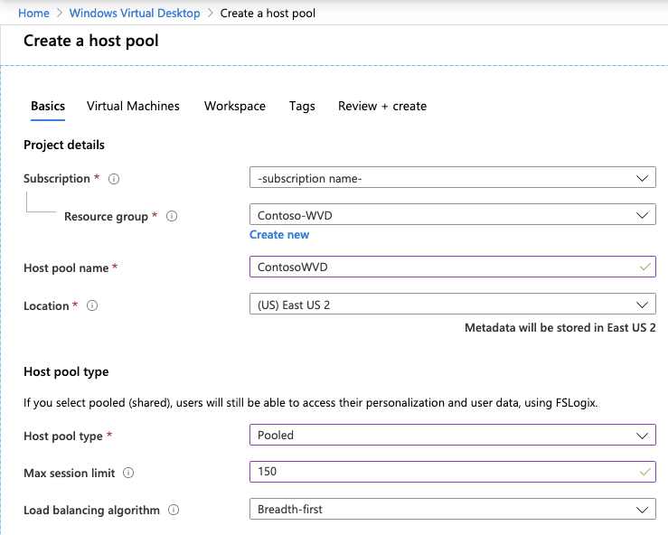
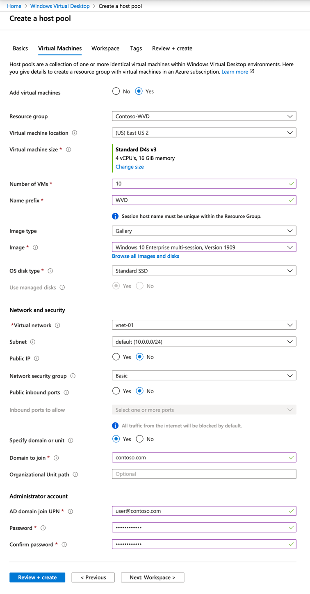

# Moving on-premises Remote Desktop Services to Azure Windows Virtual Desktop (Scenario)

**Migration Options** | **Outcome**
--- | ---
[**Azure Migrate**](https://azure.microsoft.com/services/azure-migrate/) | Assess and migrate on-premises RDS environment.<br/><br/>Run workloads using Azure WVD. <br/><br/> Manage WVD with [WVD Management UX](https://github.com/Azure/RDS-Templates/tree/master/wvd-templates/wvd-management-ux).|

Windows Virtual Desktop (WVD) is a comprehensive desktop and app virtualization service running in the cloud. It’s the only virtual desktop infrastructure (VDI) that delivers simplified management, multi-session Windows 10, optimizations for Microsoft 365 Apps for enterprise, and support for Remote Desktop Services (RDS) environments. Deploy and scale your Windows desktops and apps on Azure in minutes, and get built-in security and compliance features.

> ![NOTE]
> This article focuses on using Azure Windows Virtual Desktop (WVD) service, to move on-premises RDS environment to Azure.

## Business drivers

Working closely with business partners, the Contoso IT team will define the business drivers for a VDI migration to Azure.  These drivers may include:

- **Current environment End of Life (EOL)**: Data center is out of capacity, reaching the end of a lease, or data center closing down. All of these could be reasons you need to leave your current data center. Migrating to the cloud gives you unlimited capacity in a data center you can be assured will be around for years to come. Your software may also be reaching it's end of life where it has become necessary to upgrade the software running your current virtual desktop interface (VDI) solution.
- **Multi-session Windows 10 VDI**: Provide your users with the only multi-session Windows 10 desktop virtualized in the cloud that’s highly scalable, always up to date, and available on any device.
- **Optimize for Microsoft 365 Apps for Enterprise**: Deliver the best Microsoft 365 Apps for enterprise experience, with multi-session virtual desktop scenarios to provide the most productive virtualized experience for your users.
- **Deploy and scale in minutes**: Quickly virtualize and deploy modern and legacy desktop apps to the cloud in minutes with unified management in the Azure portal.
- **Secure and productive on Azure and Microsoft 365**: Deploy a complete, intelligent solution that enhances creativity and collaboration for everyone. Shift to Microsoft 365 and get Office 365, Windows 10, and Enterprise Mobility + Security.

## RDS on-premises to WVD in the cloud goals

With the Business drivers in mind, Contoso has pinned down goals for this migration:

- Modernize the virtual desktop environment for the cloud
- Take advantage of existing Microsoft 365 licenses 
- Improve security of corporate data when working remotely 
- Optimize the new environment for cost and growth 

These goals support the decision to leverage WVD and validate it as the best migration method for Contoso.

## Benefits of Running Windows Virtual Desktop in Azure

Using Windows Virtual Desktop (WVD) in Azure, Contoso can now seamlessly run, manage, and scale their VDI solution quickly and easily as well as provide an optimized multi-session Windows 10 environment to their users.

Contoso will capitalize on existing Microsoft 365 licenses, while leveraging the scale, performance, security, and innovation of Azure.

Additional benefits may include:

- Access to WVD from anywhere
- Optimized Microsoft 365 Apps for enterprise environment
- WVD for development/test environments

# Solutions design

After pinning down goals and requirements, Contoso designs and reviews a deployment solution, and identifies the migration process.

### Current architecture

- Remote Desktop Service (RDS) is deployed to an on-premises data center ...
- Microsoft 365 is licensed and in use by the organization

### Proposed architecture

- Sync Active Directory (AD) or Azure Active Directory Domain Services (Azure AD DS) with Azure Active Directory (Azure AD)
- Deploy Windows Virtual Desktop (WVD) to Azure
- Migrate On-premises RDS server to Azure
- Convert User Profile Disks (UPD) to FSLogix Profile Containers


## Solution Review

Contoso evaluates the proposed design by putting together a pros and cons list.

**Consideration** | **Details**
--- | ---
Pros | Windows 10 multi-session environment<br/><br/>Cloud based allowing access from anywhere<br/><br/>Take advantage of other Azure services like Azure Files with your WVD environment.<br/><br/>Optimized for the Microsoft Modern Desktop
Cons | To fully optimize for Azure contos may want to rebuild Windows 10 images optimized for multi-user sessions<br/><br/>Windows Virtual Desktop doesn't support User Profile Disks, so these will need to be migrated to FSLogix Profile Containers.

## Migration process

Contoso will move VMs to WVD in Azure using the Lakeside assessment tool and Azure Migrate.

- As a first step, Contoso runs the assessment tool against their on-premises RDS infrastructure to establish the scale of the WVD deploy in Azure.
- Migrate to WVD: Windows 10 multi-session or persistent virtual machines.
- Continue to optimize your WVD multi-session and persistent to scale up and down as needed to manage your costs.
- Virtualize applications and assign users as needed to continue to secure and manage your WVD environment.

    

## Scenarios steps

1. Assess current RDS environment
2. Create the WVD infrastructure and new images in Azure and migrate and persistent VMs to Azure
3. Convert User Profile Disks (UPDs) to FSLogix Profile Containers
4. Replicate any persistent VMs to Azure

## Step 1: Assess the current on-premises environment

Contoso will provision the WVD service in the East US 2 Azure region. The WVD service allows them to provision Virtual Machines, Host pools, and create Application groups. The WVD service all configures an availability set for all the servers in your WVD solution. The WVD services allow you to create both a high available VDI environment as well as scale up and down quickly as needed.

>Note:  There are two scenarios you are looking at during the assessment. Multi-session (shared) instances of RDS as well as persistent, or user dedicated, virtual machines.

1. First, insure your Domain Service (AD or Azure AD DS) is synchronized with Azure AD and that your Domain Service is accessible from the Azure subscription and virtual network you are going to deploy WVD to.

>Note: Learn more about [Azure AD Connect](https://docs.microsoft.com/azure/active-directory/hybrid/how-to-connect-install-express) for synchronizing Active Director on-premises with Azure AD.

>Note: Learn about provisioning [Azure Active Directory Domain Services](https://docs.microsoft.com/azure/active-directory-domain-services/tutorial-create-instance) and synchronizing Azure AD to it.

2. Create a new Azure Migrate project


3. Choose the option to Asses and migrate servers, select VDI, and add a tool


1. Set the Subscription, Resource group, Migrate project name, and geography for the migrate job data.


   
>Note: This isn't where the new WVD environment will be, just where the data related to the Azure Migrate project will be stored

5. Choose Lakeside: SysTrack as your assessment tool
6. Select Azure Migrate: Server Migration for your migration tool
7. Add the tools to your migration project


8. Start the assessment of your current environment by clicking to Gegister with Azure Migrate in the Lakeside tool


9. Login to connect Azure Migrate and Lakeside, you'll need to accept any requested permissions.


10. Contoso continues with the Lakeside tool to create a new tenant and start assessing their current on-premises RDS environment. From the dashboard Contoso can access the deployment guide, download the Assessment client to deploy to their current environment as well as review the data collected from these agents.


11. Once Contoso has capture an adequate amount of data, they review the assessment data to determine the best migration path. In this assessment data Contoso has the raw assessment data from the desktops data as well as the data broken into different user personas. The includes information such as:
    - Number of users in each persona
    - Applications in use by users
    - Resource consumption by user
    - Resource utilization averages by user persona
    - VDI server performance data
    - Concurrent user reports
    - Top software packages in use


  
This data is analyzed by Contoso to determine the most cost effect use of both Pooled WVD resources and Personal WVD resources.

>Note: You should also consider migrating your app servers to Azure in order to get them closer to you WVD environment and improve network latency.
   

## Step 2: Create the Windows Virtual Desktop Environment for Pooled desktops

Using the Azure portal, Contoso will create a Windows Virtual Desktop (WVD) environment to user for Pooled resources. Later they will go through the migration steps to attach personal desktops to the same environment.

1. Contoso selects the correct subscription and creates a new Windows Virtual Desktop host pool


1. Specify the subscription, resource group, and region. Next choose the name for your Hostpool, the desktop type, and any default desktop users. Desktop type is set Pooled since Contoso is starting with a new shared environment for some of their users. Default desktop users can be left blank. The move on to configuring the virtual machines.



1. As this point in time, Contoso configures the VM, starting with choosing a custom size by clicking change size, or they choose to take the default.
2. WVD is chosen as the VM name prefix for these pooled desktops.
3. For the virtual machine settings, since Contoso is creating the Pooled servers in order to utilize the new Windows 10 multi-session functionality. They leave Image source set to gallery, enabling them to select the Windows 10 Enterprise multi-session image for the VMs.
4. Based on the Personas of the users from the Lakeside assessment, Contoso sets the Total users to 150.
5. Other settings include the Disk Type, the AD domain join UPN, an Admin Password, an option OU path to add the machines to, the virtual network and subnet to add the servers to. 



>Note: You can't create a new Virtual Network at this step. Before reaching this step you should have already created a virtual network that has access to Active Directory.

>Note: You cannot use a user account that requires MFA in this step. If you do plan to use MFA, consider creating a service principal for this purpose.

6. Contoso performs one more validation of their WVD settings and creates the new environment of pooled WVD virtual machines.


## Step 3: Convert the UPDs to FSLogix Profile Containers

Since WVD doesn't support User Profile Disks (UPDs) Contoso needs to convert all the UPDs to FSLogix. This process is done using the FSLogixmigration PowerShell module that can be download from [https://aka.ms/FSLogixMigrationPreviewModule](https://aka.ms/FSLogixMigrationPreviewModule).

Once Contoso has imported the FSLogixMigration module, they run the following PowerShell cmdlets to migrate from UPDs to FSLogix.

>Important: The Powershell modules for Hyper-V, ActiveDirectory, and Pester are prerequisites to running the cmdlets to convert UPDs to FSLogix.

1. UDP Conversion

```powershell
Convert-RoamingProfile -ParentPath "C:\Users\" -Target "\\Server\FSLogixProfiles$" -MaxVHDSize 20 -VHDLogicalSectorSize 512
```

2. Roaming Profile Conversion

```powershell
Convert-RoamingProfile -ProfilePath "C:\Users\User1" -Target "\\Server\FSLogixProfiles$" -MaxVHDSize 20 -VHDLogicalSectorSize 512 -VHD -IncludeRobocopyDetails -LogPath C:\temp\Log.txt
```
At this point in time, the migration work for user to be able to used Pooled resources with Windows 10 multi-session has been completed. Contoso can beginning deploying the necessary applications to their users that will be using Windows 10 multi-session.

However, now Contoso must migrate the persistent virtual machines to Azure.

## Step 4: Replicate and persistent VMs to Windows Virtual Desktop
The next step in the migration process for Contoso is to migrate their persistent virtual machines to Windows Virtual desktop. To do this, they navigate back to the Azure Migrate server migration job they created at the beginning of the process.

1. Contoso starts by selecting Discover in the Azure Migrate: Server Migration Tools


2. Next they convert an appliance in their environment that's going to manage the replication of the machines to WVD. Insuring that the Target region is set to East US 2 where their WVD environment as been created.


3. The replication provider is downloaded, installed and registered to the Azure Migrate project in order to start the replication to Azure.


4. The replication of the hosts into Azure Blog Storage is now started and Contoso can continue to let the replication occur until they are ready to test the VMs and then migrate them into production.
5. As machines start running in Azure, Contoso makes sure to install the WVD agent on each machine. 

>Note: The WVD agent can be downloaded from [https://aka.ms/WVDVMAgent](https://aka.ms/WVDVMAgent)

6. As a part of the installation they enter the registration token for the WVD environment in order to associate the server with the correct WVD environment.

The registration token can be obtained using:
```powershell
Export-RDSRegistrationInfo -TenantName "Contoso" -HostPoolName "ContosoWVD" | Select-Object -ExpandProperty Token > .\registrationtoken.txt
```

>Note: You can also automate this process by using msiexec commands and passing in the registration token as a variable.

7. As the last step before the final migration, Contoso maps the servers to their respective users and groups using the Users item in the Azure WVD settings.


8. One Host pools are assigned to users. Contoso finalizes the migration of those machines and continues to gradually migrate the rest of their on-premises VDI hosts to Azure.

