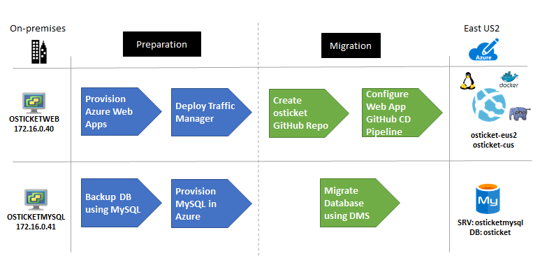
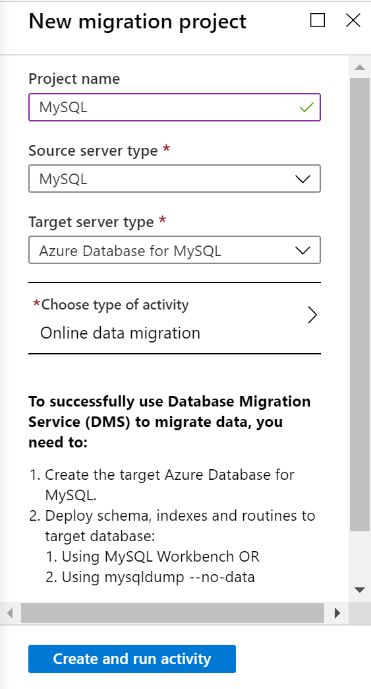
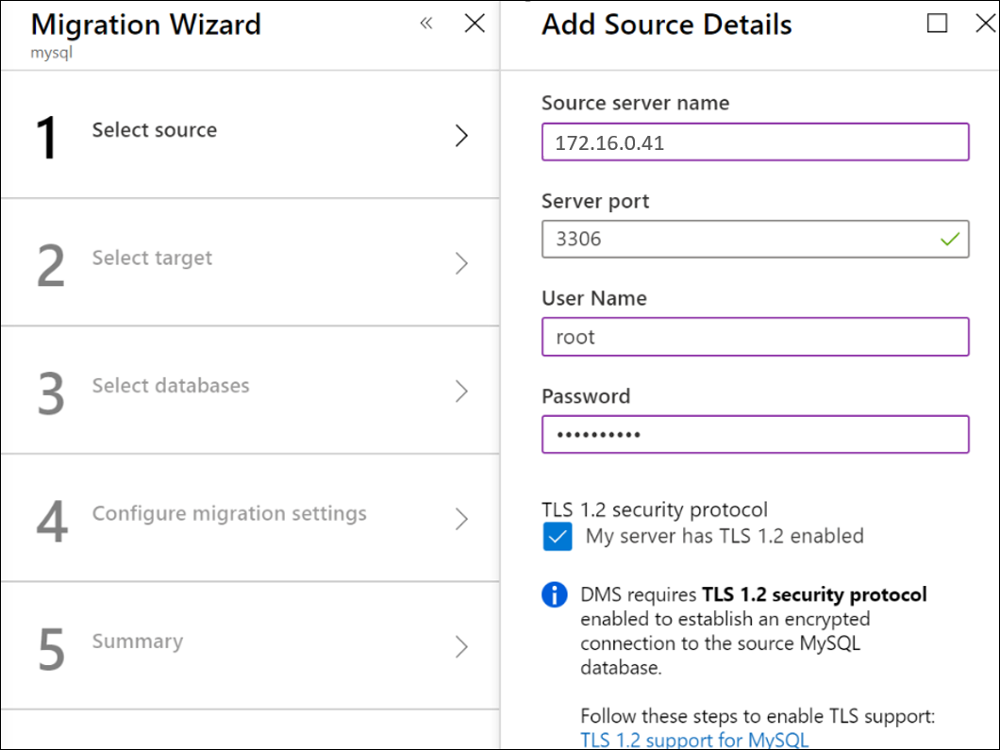
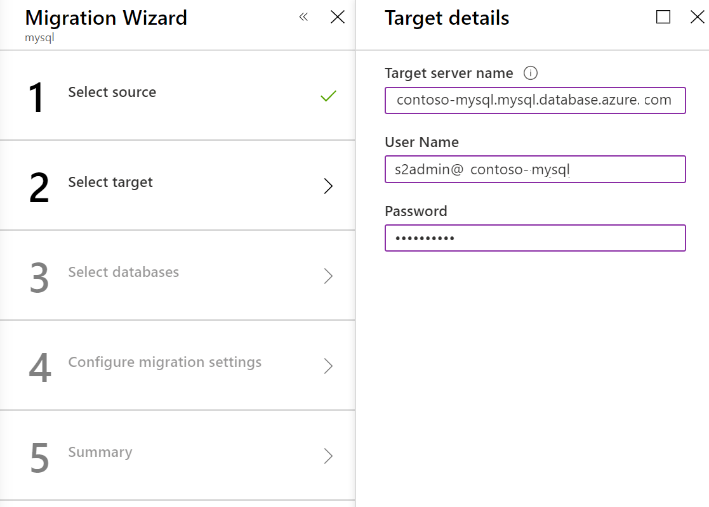
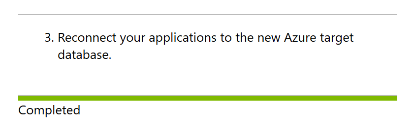

<!-- cSpell:ignore WEBVM SQLVM contosohost vcenter contosodc OSTICKETWEB OSTICKETMYSQL osTicket contosoosticket trafficmanager InnoDB binlog DBHOST DBUSER CNAME -->

# Refactor a Linux application by using Azure App Service, Traffic Manager, and Azure Database for MySQL

This article shows how the fictional company Contoso refactors a two-tier [LAMP-based](https://wikipedia.org/wiki/LAMP_software_bundle) application, migrating it from on-premises to Azure by using Azure App Service with GitHub integration and Azure Database for MySQL.

osTicket, the service desk application that we use in this example, is provided as open-source software. If you want to use it for your own testing purposes, you can download it from the [osTicket repo in GitHub](https://github.com/osTicket/osTicket).

## Business drivers

The IT leadership team has worked closely with business partners to understand what they want to achieve:

- **Address business growth.** Contoso is growing and moving into new markets. It needs additional customer service agents.
- **Scale.** The solution should be built so that Contoso can add more customer service agents as the business scales.
- **Improve resiliency.** In the past, issues with the system affected internal users only. With the new business model, external users will be affected, and Contoso needs the application up and running at all times.

## Migration goals

To determine the best migration method, the Contoso cloud team has pinned down their goals for this migration:

- The application should scale beyond current on-premises capacity and performance. Contoso is moving the application to take advantage of Azure's on-demand scaling.
- Contoso wants to move the application code base to a continuous delivery pipeline. As application changes are pushed to GitHub, Contoso wants to deploy those changes without tasks for operations staff.
- The application must be resilient, with capabilities for growth and failover. Contoso wants to deploy the application in two different Azure regions and set it up to scale automatically.
- Contoso wants to minimize database admin tasks after the application is moved to the cloud.

## Solution design

After pinning down their goals and requirements, Contoso designs and reviews a deployment solution, and identifies the migration process, including the Azure services that will be used for the migration.

## Current architecture

- The application is tiered across two virtual machines (VMs) (`OSTICKETWEB` and `OSTICKETMYSQL`).
- The VMs are located on VMware ESXi host `contosohost1.contoso.com` (version 6.5).
- The VMware environment is managed by vCenter Server 6.5 (`vcenter.contoso.com`), running on a VM.
- Contoso has an on-premises datacenter (`contoso-datacenter`), with an on-premises domain controller (`contosodc1`).

## Proposed architecture

Here's the proposed architecture:

- The web tier application on `OSTICKETWEB` will be migrated by building an Azure App Service web app in two Azure regions. The Contoso team will implement Azure App Service for Linux by using the PHP 7.0 Docker container.
- The application code will be moved to GitHub, and the Azure App Service web app will be configured for continuous delivery with GitHub.
- Azure App Service will be deployed in both the primary region (`East US 2`) and secondary region (`Central US`).
- Azure Traffic Manager will be set up in front of the two web apps in both regions.
- Traffic Manager will be configured in priority mode to force the traffic through `East US 2`.
- If the Azure app server in `East US 2` goes offline, users can access the failed over application in `Central US`.
- The application database will be migrated to the Azure Database for MySQL service by using Azure Database Migration Service. The on-premises database will be backed up locally, and restored directly to Azure Database for MySQL.
- The database will reside in the primary region (`East US 2`) in the database subnet (`PROD-DB-EUS2`) of the production network (`VNET-PROD-EUS2`).
- Since they're migrating a production workload, Azure resources for the application will reside in the production resource group `ContosoRG`.
- The Traffic Manager resource will be deployed in Contoso's infrastructure resource group `ContosoInfraRG`.
- The on-premises VMs in the Contoso datacenter will be decommissioned after the migration is done.

## Migration process

Contoso completes the migration process as follows:

1. As a first step, Contoso admins set up the Azure infrastructure, including provisioning Azure App Service, setting up Traffic Manager, and provisioning an Azure Database for MySQL instance.
2. After preparing the Azure infrastructure, they migrate the database by using Azure Database Migration Service.
3. After the database is running in Azure, they upload a GitHub private repository for Azure App Service with continuous delivery, and load it with the osTicket application.
4. In the Azure portal, they load the application from GitHub to the Docker container by running Azure App Service.
5. They tweak DNS settings and configure autoscaling for the application.

### Azure services

| Service | Description | Cost |
| --- | --- | --- |
| [Azure App Service](https://azure.microsoft.com/services/app-service/) | The service runs and scales applications by using Azure platform as a service (PaaS) for websites. | Pricing is based on the size of the instances and the features required. [Learn more](https://azure.microsoft.com/pricing/details/app-service/windows/). |
| [Azure Traffic Manager](https://azure.microsoft.com/services/traffic-manager/) | A load balancer that uses Domain Name System (DNS) to direct users to Azure or to external websites and services. | Pricing is based on the number of received DNS queries and the number of monitored endpoints. | [Learn more](https://azure.microsoft.com/pricing/details/traffic-manager/). |
| [Azure Database Migration Service](/azure/dms/dms-overview) | Azure Database Migration Service enables seamless migration from multiple database sources to Azure data platforms, with minimal downtime. | Learn about [supported regions](/azure/dms/dms-overview#regional-availability) and [Database Migration Service pricing](https://azure.microsoft.com/pricing/details/database-migration/). |
| [Azure Database for MySQL](/azure/mysql/) | The database is based on the open-source MySQL database engine. It provides a fully managed, enterprise-ready community MySQL database for application development and deployment. | Pricing is based on compute, storage, and backup requirements. [Learn more](https://azure.microsoft.com/pricing/details/mysql/server/). |

## Prerequisites

To run this scenario, Contoso must meet the following prerequisites:

| Requirements | Details |
| --- | --- |
| **Azure subscription** | Contoso created subscriptions earlier in this article series. If you don't have an Azure subscription, create a [free account](https://azure.microsoft.com/free/).    If you create a free account, you're the administrator of your subscription and can perform all actions.    If you use an existing subscription and you're not the administrator, you need to work with the admin to assign you Owner or Contributor permissions. |
| **Azure infrastructure** | Contoso set up their Azure infrastructure as described in [Azure infrastructure for migration](./contoso-migration-infrastructure.md). |

## Scenario steps

Here's the Contoso plan for completing the migration:

> [!div class="checklist"]
>
> - **Step 1: Provision Azure App Service**. Contoso admins will provision web apps in the primary and secondary regions.
> - **Step 2: Set up Traffic Manager**. They set up Traffic Manager in front of the web apps, for routing and load balancing traffic.
> - **Step 3: Provision Azure Database for MySQL**. In Azure, they provision an instance of Azure Database for MySQL.
> - **Step 4: Migrate the database**. They migrate the database by using Azure Database Migration Service.
> - **Step 5: Set up GitHub**. They set up a local GitHub repository for the application web sites and code.
> - **Step 6: Configure the web apps**. They configure the web apps with the osTicket websites.

## Step 1: Provision Azure App Service

Contoso admins provision two web apps (one in each region) by using Azure App Service.

1. They create a web app resource (`osticket-eus2`) in the primary region (`East US 2`) via Azure Marketplace.

2. They put the resource in the production resource group `ContosoRG`.

    

3. They create an App Service plan, `APP-SVP-EUS2`, in the primary region, and they use the standard size.

     

4. They select a Linux OS with PHP 7.0 runtime stack, which is a Docker container.

    

5. They create a second web app, `osticket-cus`, and an Azure App Service plan for **Central US**.

    

**Need more help?**

- Learn about [Azure App Service web apps](/azure/app-service/overview).
- Learn about [Azure App Service on Linux](/azure/app-service/overview#app-service-on-linux).

## Step 2: Set up Traffic Manager

Contoso admins set up Traffic Manager to direct inbound web requests to the web apps that are running on the osTicket web tier.

1. In Azure Marketplace, they create a Traffic Manager resource, `osticket.trafficmanager.net`. They use priority routing so that **East US 2** is the primary site. They place the resource in their existing infrastructure resource group, `ContosoInfraRG`. Note that Traffic Manager is global and not bound to a specific location.

    

2. They configure Traffic Manager with endpoints. They add the web app in East US 2 as the primary site, `osticket-eus2`, and the web app in Central US as the secondary site, `osticket-cus`.

    

3. After they add the endpoints, the admins can monitor them.

    

**Need more help?**

- Learn about [Traffic Manager](/azure/traffic-manager/traffic-manager-overview).
- Learn about [routing traffic to a priority endpoint](/azure/traffic-manager/traffic-manager-configure-priority-routing-method).

## Step 3: Provision Azure Database for MySQL

Contoso admins provision a MySQL database instance in the primary region, East US 2.

1. In the Azure portal, they create an Azure Database for MySQL resource.

    

2. They add the name `contosoosticket` for the Azure database. They add the database to the production resource group `ContosoRG` and then specify credentials for it.

3. The on-premises MySQL database is version 5.7, so they select this version for compatibility. They use the default sizes, which match their database requirements.

    

4. For **Backup Redundancy Options**, they select **Geo-Redundant**. This option allows them to restore the database in their secondary region (Central US) if an outage occurs. They can configure this option only when they provision the database.

    

5. They set up connection security. In the database, they select **Connection security** and then set up firewall rules to allow the database to access Azure services.

6. They add the local workstation client IP address to the start and end IP addresses. This allows the web apps to access the MySQL database, along with the database client that's performing the migration.

    

## Step 4: Migrate the database

There are several ways to move the MySQL database. Each option requires Contoso admins to create an Azure Database for MySQL instance for the target. After they create the instance, they can migrate the database by using either of two paths:

- Step 4a: Azure Database Migration Service
- Step 4b: MySQL Workbench backup and restore

### Step 4a: Migrate the database via Azure Database Migration Service

Contoso admins migrate the database via Azure Database Migration Service by following the [step-by-step migration tutorial](/azure/dms/tutorial-mysql-azure-mysql-online). They can perform online, offline, and hybrid (preview) migrations by using MySQL 5.6 or 5.7.

> [!NOTE]
> MySQL 8.0 is supported in Azure Database for MySQL, but the Database Migration Service tool does not yet support this version.

In brief, Contoso does the following:

- They ensure that all migration prerequisites are met:

  - The MySQL database server source must match the version that Azure Database for MySQL supports. Azure Database for MySQL supports MySQL Community Edition, the InnoDB storage engine, and migration across source and target with the same versions.

  - They enable binary logging in `my.ini` (Windows) or `my.cnf` (Unix). Failure to do this will cause the following error in the Migration Wizard: `Error in binary logging. Variable binlog_row_image has value 'minimal'. Please change it to 'full'.` For more information, see the [MySQL documentation](https://dev.mysql.com/doc/refman/5.7/en/replication-options-binary-log.html).

  - The user must have the `ReplicationAdmin` role.

  - Migrate the database schemas without foreign keys and triggers.

- They create a virtual private network (VPN) that connects via ExpressRoute or VPN to the on-premises network.

- They create an Azure Database Migration Service instance with a Premium SKU that's connected to the virtual network.

- They ensure that Azure Database Migration Service can access the MySQL database via the virtual network. This entails ensuring that all incoming ports are allowed from Azure to MySQL at the virtual network level, the network VPN, and the machine that hosts MySQL.

- They run the Database Migration Service tool and then do the following:

  1. Create a migration project that's based on the Premium SKU.

     

     

  2. Add a source (on-premises database).

     

  3. Select a target.

     

  4. Select the databases to migrate.

     

  5. Configure advanced settings.

     

  6. Start the replication and resolve any errors.

     

  7. Perform the final cutover.

     

     

     

  8. Reinstate any foreign keys and triggers.

  9. Modify applications to use the new database.

     

### Step 4b: Migrate the database (MySQL Workbench)

1. The Contoso admins check the [prerequisites and downloads MySQL Workbench](https://dev.mysql.com/downloads/workbench/?utm_source=tuicool).

2. They install MySQL Workbench for Windows in accordance with the [installation instructions](https://dev.mysql.com/doc/workbench/en/wb-installing.html). The machine that they install MySQL Workbench on must be accessible to the `osticketmysql` VM and to Azure via the internet.

3. In MySQL Workbench, they create a MySQL connection to `osticketmysql`.

    

4. They export the database as `osticket` to a local self-contained file.

    

5. After they've backed up the database locally, the admins create a connection to the Azure Database for MySQL instance.

    

6. Now, they can import (restore) the database in the Azure Database for MySQL instance from the self-contained file. A new schema, `osticket`, is created for the instance.

    

7. After they've restored the data, the admins can query it by using MySQL Workbench. The data is displayed in the Azure portal.

    

    

8. The admins update the database information on the web apps. On the MySQL instance, they open **Connection Strings**.

    

9. In the connection strings list, they select the web app settings and then copy them by selecting **Click to copy**.

    

10. They open a new file in Notepad, paste the string into it, and update the string to match the osTicket database, MySQL instance, and credentials settings.

    

11. They can verify the server name and sign-in via the **Overview** pane for the MySQL instance in the Azure portal.

    

## Step 5: Set up GitHub

Contoso admins create a new private GitHub repo and set up a connection to the osTicket database in Azure Database for MySQL. Then, they load the web app into Azure App Service.

1. They browse to the osTicket software public GitHub repo and fork it to the Contoso GitHub account.

    

2. After they fork the repo, they browse to the `include` folder and select the `ost-config.php` file.

    

3. The file opens in the browser, and they edit it.

    

4. In the editor, the admins update the database details, specifically for `DBHOST` and `DBUSER`.

    

5. They commit the changes.

    

6. For each web app (`osticket-eus2` and `osticket-cus`), in the Azure portal, they select **Application settings** on the left pane and then modify the settings.

    

7. They enter the connection string with the name `osticket`, and copy the string from Notepad into the **value area**. They select **MySQL** in the dropdown list next to the string, and save the settings.

    

## Step 6: Configure the web apps

As the final step in the migration process, Contoso admins configure the web apps with the osTicket websites.

1. In the primary web app, `osticket-eus2`, they open **Deployment option** and then set the source to **GitHub**.

    

2. They select the deployment options.

    

3. After they set the options, the configuration shows as **Pending** in the Azure portal.

    

4. After the configuration is updated and the osTicket web app is loaded from GitHub to the Docker container that runs the Azure App Service, the site shows as **Active**.

    

5. They repeat the preceding steps for the secondary web app, `osticket-cus`.
6. After the site is configured, it's accessible via the Traffic Manager profile. The DNS name is the new location of the osTicket application. [Learn more](/azure/app-service/app-service-web-tutorial-custom-domain#map-a-cname-record).

    

7. Contoso wants to use a DNS name that's easy to remember. On the **New Resource Record** pane, they create an alias, a CNAME, and a fully qualified domain name, `osticket.contoso.com`, which points to the Traffic Manager name in the DNS on their domain controllers.

    

8. They configure both the `osticket-eus2` and `osticket-cus` web apps to allow the custom host names.

    

### Set up autoscaling

Finally, the Contoso admins set up automatic scaling for the application. Automatic scaling ensures that, as agents use the application, the application instances increase and decrease according to business needs.

1. In App Service `APP-SVP-EUS2`, they open **Scale Unit**.

2. They configure a new autoscale setting with a single rule that increases the instance count by one when the CPU usage for the current instance is above 70 percent for 10 minutes.

    

3. They configure the same setting on `APP-SVP-CUS` to ensure that the same behavior applies if the application fails over to the secondary region. The only difference is that they set the default instance to 1, because this is for failovers only.

   

## Clean up after migration

With the migration complete, the osTicket application is refactored to run in an Azure App Service web app with continuous delivery by using a private GitHub repo. The application runs in two regions for increased resilience. The osTicket database runs in Azure Database for MySQL after migration to the PaaS platform.

To clean up after the migration, Contoso does the following:

- They remove the VMware VMs from the vCenter inventory.
- They remove the on-premises VMs from local backup jobs.
- They update internal documentation to show new locations and IP addresses.
- They review any resources that interact with the on-premises VMs, and update any relevant settings or documentation to reflect the new configuration.
- They reconfigure monitoring to point to the `osticket-trafficmanager.net` URL, to track that the application is up and running.

## Review the deployment

With the application now running, Contoso needs to fully operationalize and secure their new infrastructure.

### Security

The Contoso security team reviews the application to determine any security issues. They identify that the communication between the osTicket application and the MySQL database instance isn't configured for SSL. They do all this to ensure that the database traffic can't be hacked. [Learn more](/azure/mysql/howto-configure-ssl).

### Backups

- The osTicket web apps don't contain state data and thus don't require backup.
- The Contoso team doesn't need to configure backup for the database. Azure Database for MySQL automatically creates server backups and stores. The team elected to use geo-redundancy for the database, so it's resilient and production-ready. Backups can be used to restore their server to a point-in-time. [Learn more](/azure/mysql/concepts-backup).

### Licensing and cost optimization

- There are no licensing issues for the PaaS deployment.
- Contoso will use [Azure Cost Management + Billing](/azure/cost-management-billing/cost-management-billing-overview) to ensure that they stay within the budgets established by their IT leadership.
