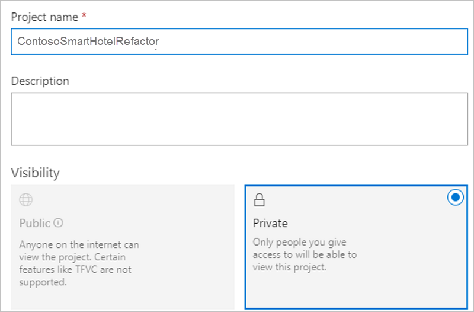

# Refactor an on-premises application to an App Service web app and a SQL managed instance

This article demonstrates how the fictional company Contoso refactors a two-tier Windows .NET application that's running on VMware virtual machines (VMs) as part of a migration to Azure. The Contoso team migrates the application front-end VM to an Azure App Service web app. The article also shows how Contoso migrates the application database to an Azure SQL managed instance.

The SmartHotel360 application that's used in this example is provided as open-source software. If you want to use it for your own testing purposes, you can download it from [GitHub](https://github.com/Microsoft/SmartHotel360).

## Business drivers

The Contoso IT leadership team worked closely with business partners to understand what they want to achieve with this migration:

- **Address business growth.** Contoso is growing, and there's pressure on the company's on-premises systems and infrastructure.
- **Increase efficiency.** Contoso needs to remove unnecessary procedures and streamline processes for developers and users. The business needs IT to be fast and not waste time or money, thus delivering faster on customer requirements.
- **Increase agility.** Contoso IT needs to be more responsive to the needs of the business. To succeed in a global economy, the company needs to be able to react faster than the changes in the marketplace. Reaction time must not get in the way or become a business blocker.
- **Scale.** As the business grows, Contoso IT must provide systems that can grow at the same pace.
- **Reduce costs.** Contoso wants to minimize licensing costs.

## Migration goals

To help determine the best migration method, the Contoso cloud team created these goals:

| Requirement domain | Details |
| --- | --- |
| **Application** | The application in Azure will remain as critical as it is today on-premises.    The application should have the same performance capabilities that it currently has on VMware.    The team doesn't want to invest in the application. For now, admins will just move the application safely to the cloud.    The team wants to stop supporting Windows Server 2008 R2, which the application currently runs on.    The team also wants to move from SQL Server 2008 R2 to a modern platform as a service (PaaS) database, which will minimize the need for management.    Contoso wants to take advantage of its investment in SQL Server licensing and Software Assurance when possible.    Contoso wants to mitigate the single point of failure on the web tier.   The application consists of an ASP.NET application and a Windows Communication Foundation (WCF) service running on a single VM. Contoso wants to spread these components across two web apps using App Service.|
| **Azure** | Contoso wants to move the application to Azure, but they don't want to run it on VMs. Contoso wants to use Azure PaaS services for the web and data tiers. |
| **DevOps** | Contoso wants to move to a DevOps model that uses Azure DevOps for builds and release pipelines. |

## Solution design

After determining goals and requirements, Contoso designs and reviews a deployment solution. The team also identifies a migration process, including the Azure services that they'll use for the migration.

### Current application

- The SmartHotel360 on-premises application is tiered across two VMs, WEBVM and SQLVM.
- The VMs are located on VMware ESXi 6.5 host contosohost1.contoso.com.
- The VMware environment is managed by vCenter Server 6.5 (vcenter.contoso.com), which runs on a VM.
- Contoso has an on-premises datacenter (contoso-datacenter) with an on-premises domain controller (contosodc1).
- The on-premises VMs in the Contoso datacenter will be decommissioned after the migration is done.

### Proposed solution

- For the application web tier, Contoso will use App Service. Contoso can use this PaaS service to deploy the application with just a few configuration changes. Contoso will use Visual Studio to make the changes, and they'll deploy two web apps, one for the website and one for the WCF service.
- To meet requirements for a DevOps pipeline, Contoso will use Azure DevOps for source code management with Git repos. They'll use automated builds and release to build the code and deploy it to App Service.

### Database considerations

During the solution design process, Contoso compares the features of Azure SQL Database with those of SQL Managed Instance. The team decides to use SQL Managed Instance, based on these considerations:

- SQL Managed Instance aims to deliver almost 100 percent compatibility with the latest on-premises SQL Server version. Microsoft recommends SQL Managed Instance for organizations that are running SQL Server on-premises or on infrastructure as a service (IaaS) VMs and that want to migrate their applications to a fully managed service with minimal design changes.
- Contoso plans to migrate a large number of applications from on-premises to IaaS VMs. Many of these VMs are provided by independent software vendors. The Contoso team realizes that using SQL Managed Instance can help ensure database compatibility for these applications. They'll use SQL Managed Instance rather than SQL Database, which might not be supported.
- Contoso can do a lift-and-shift migration to SQL Managed Instance by using the fully automated Azure Database Migration Service. Contoso can also reuse this service for future database migrations.
- SQL Managed Instance supports SQL Server Agent, an important component of the SmartHotel360 application. Contoso needs this compatibility. Otherwise, they'd have to redesign the maintenance plans required by the application.
- With Software Assurance, Contoso can exchange its current licenses for discounted rates on a SQL managed instance by using the Azure Hybrid Benefit for SQL Server. This enables Contoso to save as much as 30 percent by using SQL Managed Instance.
- The SQL managed instance is fully contained in the virtual network, so it provides better isolation and security for Contoso's data. Contoso can get the benefits of the public cloud while keeping the environment isolated from the public internet.
- SQL Managed Instance supports many security features, including Always Encrypted, dynamic data masking, Row-Level Security, and threat detection.

### Solution review

The Contoso team evaluates their proposed design by compiling a list of pros and cons:

| Consideration | Details |
| --- | --- |
| **Pros** | The SmartHotel360 application code doesn't require changes for migration to Azure.    Contoso can take advantage of its investment in Software Assurance by using the Azure Hybrid Benefit for both SQL Server and Windows Server.    After the migration, Contoso won't need to support Windows Server 2008 R2. For more information, see the [Microsoft Lifecycle Policy](/lifecycle).    Contoso can configure the web tier of the application with multiple instances, so that the web tier is no longer a single point of failure.    The database will no longer depend on the aging SQL Server 2008 R2.    SQL Managed Instance supports Contoso's technical requirements and goals.    The SQL managed instance will provide 100 percent compatibility with the current deployment while moving away from SQL Server 2008 R2.     Contoso can reuse Database Migration Service for future migrations.    The SQL managed instance has built-in fault tolerance that Contoso doesn't need to configure. This fault tolerance ensures that the data tier is no longer a single point of failover. |
| **Cons** | App Service supports only one application deployment for each web app. So two web apps must be provisioned, one for the website and one for the WCF service.    For the data tier, SQL Managed Instance might not be the best solution if Contoso wants to customize the operating system or the database server, or if they want to run third-party applications along with SQL Server. Running SQL Server on an IaaS VM could provide this flexibility. |

## Proposed architecture

:::image type="content" source="./media/contoso-migration-refactor-web-app-sql-managed-instance/architecture.png" alt-text="Diagram that shows the proposed architecture." lightbox="./media/contoso-migration-refactor-web-app-sql-managed-instance/architecture.png" border="false":::

### Migration process

1. Contoso provisions an Azure SQL managed instance and then migrates the SmartHotel360 database to it by using Database Migration Service.
1. Contoso provisions and configures web apps and deploys the SmartHotel360 application to them.

:::image type="content" source="./media/contoso-migration-refactor-web-app-sql-managed-instance/migration-process.png" alt-text="Diagram that shows the migration process." lightbox="./media/contoso-migration-refactor-web-app-sql-managed-instance/migration-process.png" border="false":::

### Azure services

| Service | Description | Cost |
| --- | --- | --- |
| [App Service migration assistant](/training/paths/migrate-dotnet-apps-azure) | A free, easy-to-use tool that can help you migrate .NET web applications from on-premises to the cloud with minimal or no code changes. | It's a downloadable tool, free of charge. |
| [Database Migration Service](/azure/dms/dms-overview) | An Azure service that you can use to migrate from multiple database sources to Azure data platforms with minimal downtime. | See [Azure Database Migration Service pricing](https://azure.microsoft.com/pricing/details/database-migration/) and [supported regions](/azure/dms/dms-overview#regional-availability).  |
| [SQL Managed Instance](/azure/azure-sql/managed-instance/sql-managed-instance-paas-overview) | A managed database service that represents a fully managed SQL Server instance on Azure. It uses the same code as the latest version of SQL Server database engine, and it has the latest features, performance improvements, and security patches. | Using a SQL managed instance on Azure incurs charges based on capacity. Learn more about [SQL Managed Instance pricing](https://azure.microsoft.com/pricing/details/azure-sql-managed-instance/single). |
| [Azure App Service](/azure/app-service/overview) | A service that can help you create powerful cloud applications that use a fully managed platform. | Pricing is based on size, location, and usage duration. Learn more about [App Service pricing](https://azure.microsoft.com/pricing/details/app-service/windows). |
| [Azure Pipelines](/azure/devops/pipelines/get-started/what-is-azure-pipelines) | A service that provides a continuous integration and continuous delivery (CI/CD) pipeline for application development. The pipeline starts with a Git repository for managing application code, a build system for producing packages and other build artifacts, and a release management system for deploying changes to dev, test, and production environments. | Learn about [Azure Pipelines pricing](https://azure.microsoft.com/pricing/details/devops/azure-devops-services).

## Prerequisites

To implement this scenario, Contoso must meet the following prerequisites:

| Requirement | Details |
| --- | --- |
| **Azure subscription** | Contoso created subscriptions in an earlier article in this series. If you don't have an Azure subscription, create a [free account](https://azure.microsoft.com/free).    If you create a free account, you're the administrator of your subscription and can perform all actions. If you use an existing subscription and you're not the administrator, the admin needs to assign Owner or Contributor permissions to you. |
| **Azure infrastructure** | Contoso set up an Azure infrastructure as described in [Azure infrastructure for migration](./contoso-migration-infrastructure.md). |

## Scenario steps

Here's how Contoso will run the migration:

> [!div class="checklist"]
>
> - **Step 1: Assess and migrate the web apps.**. Contoso uses the [App Service migration assistant](https://azure.microsoft.com/migration/web-applications) to run pre-migration compatibility checks and migrate the web apps to App Service.
> - **Step 2: Set up a SQL managed instance**. Contoso needs an existing managed instance to which the on-premises SQL Server database will migrate.
> - **Step 3: Migrate by using Database Migration Service**. Contoso migrates the application database by using Database Migration Service.
> - **Step 4: Set up Azure DevOps**. Contoso creates a new Azure DevOps project and imports the Git repo.
> - **Step 5: Configure connection strings**. Contoso configures connection strings so that the web tier web app, the WCF service web app, and the SQL managed instance can communicate.
> - **Step 6: Set up build and release pipelines in Azure DevOps**. In the final step, Contoso sets up build and release pipelines in Azure DevOps to create the application. The team then deploys the pipelines to two separate web apps.

## Step 1: Assess and migrate the web apps

Contoso admins assess and migrate their web apps by using the [App Service migration assistant](https://azure.microsoft.com/migration/web-applications). They use the [Migrate ASP.NET Apps to Azure](/training/paths/migrate-dotnet-apps-azure) learning path as a guide during the process. The admins perform these actions:

- They use the [App Service migration assessment](https://azure.microsoft.com/services/app-service/migration-assistant) tool to evaluate any dependencies between their web apps and to determine whether there are any incompatibilities between their on-premises web apps and what's supported by App Service.

- They download the App Service migration assistant and sign in to their Azure account.

- They choose a subscription, a resource group, and the website's domain name.

## Step 2: Set up a SQL managed instance

To set up an Azure SQL managed instance, Contoso needs a subnet that meets these requirements:

- The subnet must be dedicated. It must be empty. It can't contain any other cloud service. The subnet can't be a gateway subnet.
- After creating the managed instance, Contoso shouldn't add resources to the subnet.
- The subnet can't have a network security group associated with it.
- The subnet must have a user-defined route table. The only route assigned should be 0.0.0.0/0 next-hop internet.
- If an optional custom DNS is specified for the virtual network, the virtual IP address 168.63.129.16 for the recursive resolvers on Azure must be added to the list. Learn how to [configure a custom DNS for an Azure SQL managed instance](/azure/azure-sql/managed-instance/custom-dns-configure).
- The subnet must not have a service endpoint (storage or SQL) associated with it. Service endpoints should be disabled on the virtual network.
- The subnet must have at least 16 IP addresses. Learn how to [size the managed instance subnet](/azure/azure-sql/managed-instance/vnet-existing-add-subnet).
- In Contoso's hybrid environment, custom DNS settings are required. Contoso configures DNS settings to use one or more of the company's Azure DNS servers. Learn more about [DNS customization](/azure/azure-sql/managed-instance/custom-dns-configure).

### Set up a virtual network for the managed instance

Contoso admins set up the virtual network as follows:

1. They create a virtual network (VNET-SQLMI-EUS2) in the primary region (East US 2). They create the virtual network in the ContosoNetworkingRG resource group.
1. They assign an address space of 10.235.0.0/24. They make sure that the range doesn't overlap with any other networks in the enterprise.
1. They add two subnets to the network:
    - SQLMI-DB-EUS2 (10.235.0.0/25).
    - SQLMI-SAW-EUS2 (10.235.0.128/29). This subnet is used to attach a directory to the managed instance.

      

1. After the virtual network and subnets are deployed, they peer networks as follows:

    - Peer VNET-SQLMI-EUS2 with VNET-HUB-EUS2 (the hub virtual network for East US 2).

    - Peer VNET-SQLMI-EUS2 with VNET-PROD-EUS2 (the production network).

      

1. They set custom DNS settings. The DNS settings point first to Contoso's Azure domain controllers. Azure DNS is secondary. The Contoso Azure domain controllers are located as follows:

    - They're located in the PROD-DC-EUS2 subnet of the production network (VNET-PROD-EUS2) in the East US 2 region.

    - CONTOSODC3 address: 10.245.42.4

    - CONTOSODC4 address: 10.245.42.5

    - Azure DNS resolver: 168.63.129.16

    

**Need more help?**

- Read the [SQL Managed Instance overview](/azure/azure-sql/managed-instance/sql-managed-instance-paas-overview).
- Learn how to [create a virtual network for a SQL managed instance](/azure/azure-sql/managed-instance/vnet-existing-add-subnet).
- Learn how to [set up peering](/azure/virtual-network/virtual-network-manage-peering).
- Learn how to [update Azure Active Directory DNS settings](/azure/active-directory-domain-services/tutorial-create-instance).

### Set up routing

The managed instance is placed in a private virtual network. Contoso needs a route table to enable the virtual network to communicate with the Azure management service. If the virtual network can't communicate with the service that manages it, the virtual network becomes inaccessible.

Contoso considers these factors:

- The route table contains a set of rules (routes) that specify how packets that are sent from the managed instance should be routed in the virtual network.
- The route table is associated with subnets where managed instances are deployed. Each packet that leaves a subnet is handled based on the associated route table.
- A subnet can be associated with only one route table.
- There are no additional charges for creating route tables on Azure.

To set up routing, Contoso admins complete the following steps:

1. They create a user-defined route table in the **ContosoNetworkingRG** resource group:

    

1. To comply with SQL Managed Instance requirements, after the route table (MIRouteTable) is deployed, the admins add a route with an address prefix of **0.0.0.0/0**. They set the **Next hop type** value to **Internet**:

    

1. They associate the route table with the SQLMI-DB-EUS2 subnet in the VNET-SQLMI-EUS2 network:

    

**Need more help?**

Learn how to [set up routes for a managed instance](/azure/azure-sql/managed-instance/instance-create-quickstart).

### Create a managed instance

Next, Contoso admins provision a SQL managed instance by completing these steps:

1. Because the managed instance serves a business application, the admins deploy the managed instance in the company's primary region (East US 2). They add the managed instance to the ContosoRG resource group.
1. They select a pricing tier, compute size, and storage for the instance. Learn more about [SQL Managed Instance pricing](https://azure.microsoft.com/pricing/details/azure-sql-managed-instance/single).

    

    After the managed instance is deployed, two new resources appear in the ContosoRG resource group:

    - The SQL managed instance.

    - A virtual cluster, in case Contoso has multiple managed instances.

      

**Need more help?**

Learn how to [provision a managed instance](/azure/azure-sql/managed-instance/instance-create-quickstart).

## Step 3: Migrate by using Database Migration Service

Contoso admins migrate the managed instance by using Database Migration Service. They follow the instructions in the [step-by-step migration tutorial](/azure/dms/tutorial-sql-server-to-azure-sql). They can perform online, offline, and hybrid (preview) migrations.

Contoso admins complete the following steps:

- They create a Database Migration Service instance with a Premium SKU that's connected to the virtual network.
- They ensure that Database Migration Service can access the remote SQL Server instance via the virtual network. This step involves ensuring that all incoming ports are allowed from Azure to SQL Server at the virtual network level, the network VPN, and the machine that hosts SQL Server.
- They configure Database Migration Service:
  - Create a migration project.
  - Add a source (on-premises database).
  - Select a target.
  - Select the databases to migrate.
  - Configure advanced settings.
  - Start the replication.
  - Resolve any errors.
  - Perform the final cutover.

## Step 4: Set up Azure DevOps

Contoso needs to build the DevOps infrastructure and pipelines for the application. To do this, the Contoso admins create a new DevOps project, import the code, and then set up build and release pipelines.

1. In the Contoso Azure DevOps account, they create a new project, **ContosoSmartHotelRefactor**, and then select **Git** for version control.

    

1. They import the Git repo that currently holds their application code. They download it from the [public GitHub repository](https://github.com/Microsoft/SmartHotel360-Registration).

    

1. They connect Visual Studio to the repo and then clone the code to the developer machine by using Team Explorer.

    

1. They open the solution file for the application. The web app and WCF service have separate projects within the file.

    

## Step 5: Configure connection strings

The Contoso admins make sure that the web apps and database can communicate with each other. To do this, they configure connection strings in the code and in the web apps.

1. In the web app for the WCF service, SHWCF-EUS2, under **Settings** > **Application settings**, they add a new connection string named `DefaultConnection`.
1. They pull the connection string from the SmartHotel-Registration database and then update it with the correct credentials:

    

1. In Visual Studio, the admins open the SmartHotel.Registration.wcf project from the solution file. In the project, they update the `connectionStrings` section of the web.config file by adding the connection string:

     

1. They update the `client` section of the web.config file for SmartHotel.Registration.Web so that it points to the new location of the WCF service. The pointer is the URL of the WCF web app that hosts the service endpoint.

    

1. The admins commit and sync the code changes by using Team Explorer in Visual Studio.

## Step 6: Set up build and release pipelines in Azure DevOps

The Contoso admins now configure Azure DevOps to perform the build and release process.

1. In Azure DevOps, they select **Build and release** > **New pipeline**:

    

1. They select **Azure Repos Git** and the relevant repo:

    

1. Under **Select a template**, they select the ASP.NET template for their build:

     

1. They use the name **ContosoSmartHotelRefactor-ASP.NET-CI** for the build and then select **Save & queue**, which initiates the first build.

     

1. They select the build number so they can watch the process. After the process is finished, the admins can see the process feedback. They select **Artifacts** to review the build results:

    

    The **Artifacts explorer** window opens. The build results are visible in the **drop** folder.

    - The two .zip files are the packages that contain the applications.
    - These .zip files are used in the release pipeline for deployment to App Service.

     

1. They select **Releases** > **New pipeline**:

    

1. They select the deployment template for App Service:

    

1. They name the release pipeline **ContosoSmartHotel360Refactor** and, in the **Stage name** box, specify **SHWCF-EUS2** as the name of the WCF web app:

    

1. Under the stages, they select **1 job, 1 task** to configure deployment of the WCF service:

    

1. They verify that the subscription is selected and authorized, and then they select the app service name:

     

1. On the pipeline, they select **Artifacts**, select **Add an artifact**, select **Build** as the source type, and then build by using the **ContosoSmarthotel360Refactor** pipeline:

     

1. To enable the continuous deployment trigger, the admins select the lightning bolt button on the artifact:

     

1. They set the continuous deployment trigger to **Enabled**:

    

1. The admins go back to the stage **1 job, 1 task** and select **Deploy Azure App Service**:

    

1. Under **Select a file or folder**, they expand the **drop** folder, select the **SmartHotel.Registration.Wcf.zip** file that was created during the build, and then select **Save**:

    

1. They select **Pipeline** > **Stages**, and then select **Add** to add an environment for SHWEB-EUS2. They select another Azure App Service deployment.

    

1. They repeat the process to publish the web app **SmartHotel.Registration.Web.zip** file to the correct web app, and then select **Save**:

    

    The release pipeline is displayed, as shown here:

     

1. They go back to **Build**, select **Triggers**, and then select **Enable continuous integration**. This action enables the pipeline so that when changes are committed to the code, a full build and release occur.

    

1. They select **Save & queue** to run the full pipeline. A new build is triggered, which in turn creates the first release of the application to the App Service.

    

1. Contoso admins can follow the build and release pipeline process from Azure DevOps. After the build finishes, the release starts:

    

1. When the pipeline finishes, both sites are deployed and the application is running online:

    

    The application is successfully migrated to Azure.

## Clean up after the migration

After the migration, the Contoso team completes the following cleanup steps:

- They remove the on-premises VMs from the vCenter inventory.
- They remove the VMs from the local backup jobs.
- They update their internal documentation to show the new locations for the SmartHotel360 application. The documentation shows that the database runs in the SQL managed instance and that the front end runs in two web apps.
- They review any resources that interact with the decommissioned VMs, and they update any relevant settings or documentation to reflect the new configuration.

## Review the deployment

After the resources are migrated to Azure, Contoso needs to fully operationalize the new infrastructure and provide security for it.

### Security

- Contoso provides security for the new SmartHotel-Registration database. For more information, see [Azure SQL Database and SQL Managed Instance security](/azure/azure-sql/database/security-overview).
- In particular, Contoso updates the web apps to use SSL with certificates.

### Backups

- The Contoso team reviews the backup requirements for the database in SQL Managed Instance. For more information, see [Automated backups in Azure SQL Database](/azure/azure-sql/database/automated-backups-overview).
- They also learn about managing SQL Database backups and restores. For more information, see [automatic backups](/azure/azure-sql/database/automated-backups-overview).
- They consider implementing failover groups to provide regional failover for the database. For more information, see [Auto-failover groups overview](/azure/azure-sql/database/auto-failover-group-overview).
- They consider deploying the web app in the main region (East US 2) and the secondary region (Central US) for resilience. The team could configure Traffic Manager to ensure failover during regional outages.

### Licensing and cost optimization

- After all resources are deployed, Contoso assigns the Azure tags that they decided on during [infrastructure planning](./contoso-migration-infrastructure.md#set-up-tagging).
- All licensing is built into the cost of the PaaS services that Contoso consumes. This cost is deducted from the Enterprise Agreement.
- Contoso will use [Azure Cost Management and Billing](/azure/cost-management-billing/cost-management-billing-overview) to ensure that they operate within the budgets established by their IT leadership.

## Conclusion

In this article, Contoso refactored the SmartHotel360 application in Azure by migrating the application front-end VM to two App Service web apps. Contoso migrated the application database to an Azure SQL managed instance.
