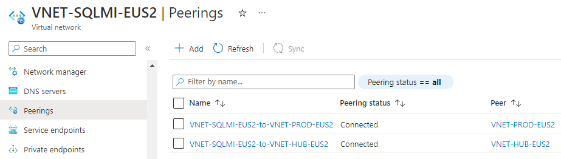
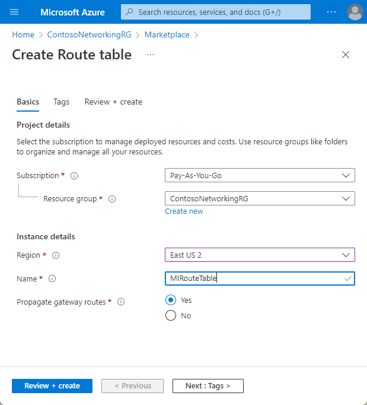
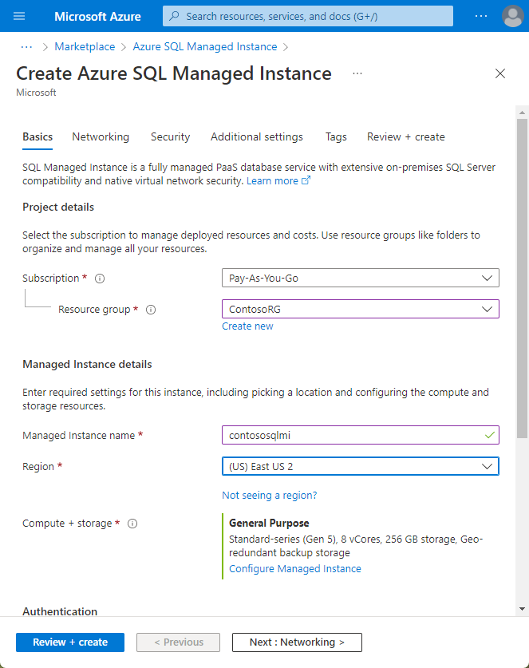

<!-- cSpell:ignore givenscj WEBVM SQLVM contosohost vcenter contosodc smarthotel SQLMI SHWCF SHWEB -->

# Refactor an on-premises app to an Azure App Service web app and Azure SQL Managed Instance

This article demonstrates how the fictional company Contoso refactors a two-tier Windows .NET app running on VMware VMs as part of a migration to Azure. They migrate the app front-end VM to an Azure App Service web app. It also shows how Contoso migrates the app database to Azure SQL Database Managed Instance.

The SmartHotel360 app used in this example is provided as open source. If you'd like to use it for your own testing purposes, you can download it from [GitHub](https://github.com/Microsoft/SmartHotel360).

## Business drivers

The IT leadership team has worked closely with business partners to understand what they want to achieve with this migration:

- **Address business growth.** Contoso is growing, and there is pressure on on-premises systems and infrastructure.
- **Increase efficiency.** Contoso needs to remove unnecessary procedures, and streamline processes for developers and users. The business needs IT to be fast and not waste time or money, thus delivering faster on customer requirements.
- **Increase agility.**  Contoso IT needs to be more responsive to the needs of the business. It must be able to react faster than the changes in the marketplace, to enable the success in a global economy. It mustn't get in the way, or become a business blocker.
- **Scale.** As the business grows successfully, Contoso IT must provide systems that are able to grow at the same pace.
- **Reduce costs.** Contoso wants to minimize licensing costs.

## Migration goals

The Contoso cloud team has pinned down goals for this migration. These goals were used to determine the best migration method.

<!-- markdownlint-disable MD033 -->

**Requirements** | **Details**
--- | ---
**App** | The app in Azure will remain as critical as it is today.    It should have the same performance capabilities as it currently does in VMware.    The team doesn't want to invest in the app. For now, admins will simply move the app safely to the cloud.    The team want to stop supporting Windows Server 2008 R2, on which the app currently runs.    The team also wants to move away from SQL Server 2008 R2 to a modern PaaS Database platform, which will minimize the need for management.    Contoso wants to take advantage of its investment in SQL Server licensing and Software Assurance where possible.    In addition, Contoso wants to mitigate the single point of failure on the web tier.
**Limitations** | The app consists of an ASP.NET app and a WCF service running on the same VM. They want to split this across two web apps using the Azure App Service.
**Azure** | Contoso wants to move the app to Azure, but doesn't want to run it on VMs. Contoso wants to use Azure PaaS services for both the web and data tiers.
**DevOps** | Contoso wants to move to a DevOps model, using Azure DevOps for their builds and release pipelines.

<!-- markdownlint-enable MD033 -->

## Solution design

After pinning down goals and requirements, Contoso designs and review a deployment solution, and identifies the migration process, including the Azure services that will be used for migration.

### Current app

- The SmartHotel360 on-premises app is tiered across two VMs (WEBVM and SQLVM).
- The VMs are located on VMware ESXi host **contosohost1.contoso.com** (version 6.5).
- The VMware environment is managed by vCenter Server 6.5 (**vcenter.contoso.com**), running on a VM.
- Contoso has an on-premises datacenter (contoso-datacenter), with an on-premises domain controller (**contosodc1**).
- The on-premises VMs in the Contoso datacenter will be decommissioned after the migration is done.

### Proposed solution

- For the app web tier, Contoso has decided to use Azure App Service. This PaaS service enables that to deploy the app with just a few configuration changes. Contoso will use Visual Studio to make the change, and deploy two web apps. One for the website, and one for the WCF service.
- To meet requirements for a DevOps pipeline, Contoso has selected Azure DevOps for source code management with Git repos. Automated builds and release will be used to build the code, and deploy it to the Azure App Service.

### Database considerations

As part of the solution design process, Contoso did a feature comparison between Azure SQL Database and SQL Server Managed Instance. The following considerations helped them to decide to go with Managed Instance.

- Managed Instance aims to deliver almost 100% compatibility with the latest on-premises SQL Server version. Microsoft recommends Managed instance for customers running SQL Server on-premises or on IaaS VM who want to migrate their apps to a fully managed service with minimal design changes.
- Contoso is planning to migrate a large number of apps from on-premises to IaaS. Many of these are ISV provided. Contoso realizes that using Managed Instance will help ensure database compatibility for these apps, rather than using SQL Database which might not be supported.
- Contoso can simply do a lift and shift migration to Managed Instance using the fully automated Azure Database Migration Service. With this service in place, Contoso can reuse it for future database migrations.
- SQL Managed Instance supports SQL Server Agent which is an important issue for the SmartHotel360 app. Contoso needs this compatibility, otherwise it will have to redesign maintenance plans required by the app.
- With Software Assurance, Contoso can exchange their existing licenses for discounted rates on a SQL Database Managed Instance using the Azure Hybrid Benefit for SQL Server. This can allow Contoso to save up to 30% on Managed Instance.
- SQL Managed Instance is fully contained in the virtual network, so it provides greater isolation and security for Contoso's data. Contoso can get the benefits of the public cloud, while keeping the environment isolated from the public Internet.
- Managed Instance supports many security features including Always-encrypted, dynamic data masking, row-level security, and threat detection.

### Solution review

Contoso evaluates their proposed design by putting together a pros and cons list.

<!-- markdownlint-disable MD033 -->

**Consideration** | **Details**
--- | ---
**Pros** | The SmartHotel360 app code won't need to be altered for migration to Azure.    Contoso can take advantage of their investment in Software Assurance using the Azure Hybrid Benefit for both SQL Server and Windows Server.    After the migration Windows Server 2008 R2 won't need to be supported. For more information, see the [Microsoft Lifecycle Policy](https://aka.ms/lifecycle).    Contoso can configure the web tier of the app with multiple instances, so that it's no longer a single point of failure.    The database will no longer depend on the aging SQL Server 2008 R2.    SQL Managed Instance supports Contoso's technical requirements and goals.    Managed Instance will provide 100% compatibility with their current deployment, while moving them away from SQL Server 2008 R2.    They can take advantage of their investment in Software Assurance and using the Azure Hybrid Benefit for SQL Server and Windows Server.    They can reuse the Azure Database Migration Service for additional future migrations.    SQL Managed Instance has built-in fault tolerance that Contoso doesn't need to configures. This ensures that the data tier is no longer a single point of failover.
**Cons** | Azure App Service only supports one app deployment for each web app. This means that two web apps must be provisioned (one for the website and one for the WCF service).    For the data tier, Managed Instance might not be the best solution if Contoso wants to customize the operating system or the database server, or if they want to run third-party apps along with SQL Server. Running SQL Server on an IaaS VM could provide this flexibility.

<!-- markdownlint-enable MD033 -->

## Proposed architecture

### Migration process

1. Contoso provisions an Azure SQL Database Managed Instance, and migrates the SmartHotel360 database to it using Azure Database Migration Service (DMS).
2. Contoso provisions and configures web apps, and deploys the SmartHotel360 app to them.

    

### Azure services

**Service** | **Description** | **Cost**
--- | --- | ---
[Azure Database Migration Service](https://docs.microsoft.com/azure/dms/dms-overview) | The Azure Database Migration Service enables seamless migration from multiple database sources to Azure data platforms with minimal downtime. | Learn about [supported regions](https://docs.microsoft.com/azure/dms/dms-overview#regional-availability) and [Database Migration Service pricing](https://azure.microsoft.com/pricing/details/database-migration).
[Azure SQL Database Managed Instance](https://docs.microsoft.com/azure/sql-database/sql-database-managed-instance) | Managed Instance is a managed database service that represents a fully managed SQL Server instance in the Azure cloud. It uses the same code as the latest version of SQL Server Database Engine, and has the latest features, performance improvements, and security patches. | Using a SQL Database Managed Instance running in Azure incurs charges based on capacity. Learn more about [Managed Instance pricing](https://azure.microsoft.com/pricing/details/sql-database/managed).
[Azure App Service](https://docs.microsoft.com/azure/app-service/overview) | Create powerful cloud apps using a fully managed platform | Cost based on size, location, and usage duration. [Learn more](https://azure.microsoft.com/pricing/details/app-service/windows).
[Azure Pipelines](https://docs.microsoft.com/azure/devops/pipelines/get-started/what-is-azure-pipelines) | Provides a continuous integration and continuous deployment (CI/CD) pipeline for app development. The pipeline starts with a Git repository for managing app code, a build system for producing packages and other build artifacts, and a Release Management system to deploy changes in dev, test, and production environments.

## Prerequisites

Here's Contoso needs to run this scenario:

<!-- markdownlint-disable MD033 -->

**Requirements** | **Details**
--- | ---
**Azure subscription** | Contoso created subscriptions during an early article. If you don't have an Azure subscription, create a [free account](https://azure.microsoft.com/pricing/free-trial).    If you create a free account, you're the administrator of your subscription and can perform all actions.    If you use an existing subscription and you're not the administrator, you need to work with the admin to assign you Owner or Contributor permissions.
**Azure infrastructure** | [Learn how](./contoso-migration-infrastructure.md) Contoso set up an Azure infrastructure.

<!--markdownlint-enable MD033 -->

## Scenario steps

Here's how Contoso will run the migration:

> [!div class="checklist"]
>
> - **Step 1: Set up a SQL Database Managed Instance.** Contoso needs an existing managed instance to which the on-premises SQL Server database will migrate.
> - **Step 2: Migrate with Azure Database Migration Service (DMS).** Contoso migrates the app database with the Azure Data Migration Service.
> - **Step 3: Provision web apps.** Contoso provisions the two web apps.
> - **Step 4: Set up Azure DevOps.** Contoso creates a new Azure DevOps project, and imports the Git repo.
> - **Step 5: Configure connection strings.** Contoso configures connection strings so that the web tier web app, the WCF service web app, and the SQL instance can communicate.
> - **Step 6: Set up build and release pipelines.** As a final step, Contoso sets up build and release pipelines to create the app, and deploys them to two separate web apps.

## Step 1: Set up a SQL Database Managed Instance

To set up an Azure SQL Database Managed Instance, Contoso needs a subnet that meets the following requirements:

- The subnet must be dedicated. It must be empty, and it can't contain any other cloud service. The subnet can't be a gateway subnet.
- After the Managed Instance is created, Contoso should not add resources to the subnet.
- The subnet can't have a network security group associated with it.
- The subnet must have a user-defined route table. The only route assigned should be 0.0.0.0/0 next-hop internet.
- If an optional custom DNS is specified for the virtual network, the virtual IP address `168.63.129.16` for the recursive resolvers in Azure must be added to the list. Learn how to [configure custom DNS for an Azure SQL Database Managed Instance](https://docs.microsoft.com/azure/sql-database/sql-database-managed-instance-custom-dns).
- The subnet must not have a service endpoint (storage or SQL) associated with it. Service endpoints should be disabled on the virtual network.
- The subnet must have a minimum of 16 IP addresses. Learn how to [size the Managed Instance subnet](https://docs.microsoft.com/azure/sql-database/sql-database-managed-instance-configure-vnet-subnet).
- In Contoso's hybrid environment, custom DNS settings are required. Contoso configures DNS settings to use one or more of the company's Azure DNS servers. Learn more about [DNS customization](https://docs.microsoft.com/azure/sql-database/sql-database-managed-instance-custom-dns).

### Set up a virtual network for the Managed Instance

Contoso admins set up the virtual network as follows:

1. They create a new virtual network (**VNET-SQLMI-EU2**) in the primary East US 2 region. It adds the virtual network to the **ContosoNetworkingRG** resource group.
2. They assign an address space of 10.235.0.0/24. They ensure that the range doesn't overlap with any other networks in its enterprise.
3. They add two subnets to the network:
    - **SQLMI-DS-EUS2** (10.235.0.0.25).
    - **SQLMI-SAW-EUS2** (10.235.0.128/29). This subnet is used to attach a directory to the Managed Instance.

      

4. After the virtual network and subnets are deployed, they peer networks as follows:

    - Peers **VNET-SQLMI-EUS2** with **VNET-HUB-EUS2** (the hub virtual network for the East US 2).
    - Peers **VNET-SQLMI-EUS2** with **VNET-PROD-EUS2** (the production network).

      

5. They set custom DNS settings. DNS points first to Contoso's Azure domain controllers. Azure DNS is secondary. The Contoso Azure domain controllers are located as follows:

    - Located in the **PROD-DC-EUS2** subnet, in the East US 2 production network (**VNET-PROD-EUS2**).
    - **CONTOSODC3** address: 10.245.42.4.
    - **CONTOSODC4** address: 10.245.42.5.
    - Azure DNS resolver: 168.63.129.16.

      

**Need more help?**

- Get an overview of [SQL Database Managed Instance](https://docs.microsoft.com/azure/sql-database/sql-database-managed-instance).
- Learn how to [create a virtual network for a SQL Database Managed Instance](https://docs.microsoft.com/azure/sql-database/sql-database-managed-instance-configure-vnet-subnet).
- Learn how to [set up peering](https://docs.microsoft.com/azure/virtual-network/virtual-network-manage-peering).
- Learn how to [update Azure Active Directory DNS settings](https://docs.microsoft.com/azure/active-directory-domain-services/tutorial-create-instance).

### Set up routing

The Managed Instance is placed in a private virtual network. Contoso needs a route table for the virtual network to communicate with the Azure Management Service. If the virtual network can't communicate with the service that manages it, the virtual network becomes inaccessible.

Contoso considers these factors:

- The route table contains a set of rules (routes) that specify how packets sent from the Managed Instance should be routed in the virtual network.
- The route table is associated with subnets in which Managed Instances are deployed. Each packet that leaves a subnet is handled based on the associated route table.
- A subnet can be associated with only one route table.
- There are no additional charges for creating route tables in Microsoft Azure.

 To set up routing Contoso admins do the following:

1. They create a user-defined route table in the **ContosoNetworkingRG** resource group.

    

2. To comply with Managed Instance requirements, after the route table (**MIRouteTable**) is deployed, they add a route that has an address prefix of 0.0.0.0/0. The **Next hop type** option is set to **Internet**.

    

3. They associate the route table with the **SQLMI-DB-EUS2** subnet (in the **VNET-SQLMI-EUS2** network).

    

**Need more help?**

Learn how to [set up routes for a Managed Instance](https://docs.microsoft.com/azure/sql-database/sql-database-managed-instance-get-started).

### Create a Managed Instance

Now, Contoso admins can provision a SQL Database Managed Instance:

1. Because the Managed Instance serves a business app, they deploy the Managed Instance in the company's primary East US 2 region. They add the Managed Instance to the **ContosoRG** resource group.
2. They select a pricing tier, size compute, and storage for the instance. Learn more about [Managed Instance pricing](https://azure.microsoft.com/pricing/details/sql-database/managed).

    

3. After the Managed Instance is deployed, two new resources appear in the **ContosoRG** resource group:

    - A virtual cluster in case Contoso has multiple Managed Instances.
    - The SQL Server Database Managed Instance.

      

**Need more help?**

Learn how to [provision a Managed Instance](https://docs.microsoft.com/azure/sql-database/sql-database-managed-instance-get-started).

## Step 2: Migrate with Azure Database Migration Service (DMS)

Contoso admins migrate it using Azure Database Migration Services (DMS) using the [step-by-step migration tutorial](https://docs.microsoft.com/azure/dms/tutorial-sql-server-azure-sql-online). They can perform both online, offline and hybrid (preview) migrations.

As a summary, you must perform the following:

- Create an Azure Database Migration Service (DMS) with a `Premium` SKU that is connected to the VNet.
- Ensure that the Azure Database Migration Service (DMS) can access the remote SQL Server via the virtual network. This would entail ensuring that all incoming ports are allowed from Azure to SQL Server at the virtual network level, the network VPN, and the machine that hosts SQL Server.
- Configure the Azure Database Migration Service:
  - Create a migration project.
  - Add a source (on-premises database).
  - Select a target.
  - Select the database(s) to migrate.
  - Configure advanced settings.
  - Start the replication.
  - Resolve any errors.
  - Perform the final cutover.

## Step 3: Provision web apps

With the database migrated, Contoso admins can now provision the two web apps.

1. They select **Web App** in the portal.

    

2. They provide an app name (**SHWEB-EUS2**), run it on Windows, and place it un the production resources group **ContosoRG**. They create a new web app and Azure App Service plan.

    

3. After the web app is provisioned, they repeat the process to create a web app for the WCF service (**SHWCF-EUS2**)

    

4. After they're done, they browse to the address of the apps to check they've been created successfully.

## Step 4: Set up Azure DevOps

Contoso needs to build the DevOps infrastructure and pipelines for the application. To do this, Contoso admins create a new DevOps project, import the code, and then set up build and release pipelines.

1. In the Contoso Azure DevOps account, they create a new project (**ContosoSmartHotelRefactor**), and select **Git** for version control.

    

2. They import the Git Repo that currently holds their app code. It's in a [public GitHub repository](https://github.com/Microsoft/SmartHotel360-Registration) and you can download it.

    

3. After the code is imported, they connect Visual Studio to the repo, and clone the code using Team Explorer.

    

4. After the repository is cloned to the developer machine, they open the Solution file for the app. The web app and wcf service each have separate project within the file.

    

## Step 5: Configure connection strings

Contoso admins need to make sure the web apps and database can all communicate. To do this, they configure connection strings in the code and in the web apps.

1. In the web app for the WCF service (**SHWCF-EUS2**) > **Settings** > **Application settings**, they add a new connection string named **DefaultConnection**.
2. The connection string is pulled from the **SmartHotel-Registration** database, and should be updated with the correct credentials.

    

3. Using Visual Studio, they open the **SmartHotel.Registration.wcf** project from the solution file. The **connectionStrings** section of the web.config file for the WCF service **SmartHotel.Registration.Wcf** should be updated with the connection string.

     

4. The **client** section of the web.config file for **SmartHotel.Registration.Web** should be changed to point to the new location of the WCF service. This is the URL of the WCF web app hosting the service endpoint.

    

5. After the changes are in the code, admins need to commit the changes. Using Team Explorer in Visual Studio, they commit and sync.

## Step 6: Set up build and release pipelines in Azure DevOps

Contoso admins now configure Azure DevOps to perform build and release process.

1. In Azure DevOps, they select **Build and release** > **New pipeline**.

    

2. They select **Azure Repos Git** and the relevant repo.

    

3. In **Select a template**, they select the ASP.NET template for their build.

     

4. The name **ContosoSmartHotelRefactor-ASP.NET-CI** is used for the build. They select **Save & Queue**.

     

5. This kicks off the first build. They select the build number to watch the process. After it's finished they can see the process feedback, and select **Artifacts** to review the build results.

    

6. The folder **Drop** contains the build results.

    - The two zip files are the packages that contain the apps.
    - These files are used in the release pipeline for deployment to Azure App Service.

     

7. They select **Releases** > **+New pipeline**.

    

8. They select the deployment template for Azure App Service.

    

9. They name the release pipeline **ContosoSmartHotel360Refactor**, and specify the name of the WCF web app (SHWCF-EUS2) for the **Stage** name.

    

10. Under the stages, they select **1 job, 1 task** to configure deployment of the WCF service.

    

11. They verify the subscription is selected and authorized, and select the **App service name**.

     

12. On the pipeline > **Artifacts**, they select **+Add an artifact**, and select to build with the **ContosoSmarthotel360Refactor** pipeline.

     

13. They select the lightning bolt on the artifact is checked., to enable continuous deployment trigger.

     

14. The continuous deployment trigger should be set to **Enabled**.

    

15. Now, they move back to the Stage 1 job, I tasks, and select **Deploy Azure App Service**.

    

16. In **Select a file or folder**, they locate the **SmartHotel.Registration.Wcf.zip** file that was creating during the build, and select **Save**.

    

17. They select **Pipeline** > **Stages**, **+Add** to add an environment for **SHWEB-EUS2**. They select another Azure App Service deployment.

    

18. They repeat the process to publish the web app (**SmartHotel.Registration.Web.zip**) file to the correct web app.

    

19. After it's saved, the release pipeline will show as follows.

     

20. They move back to **Build**, and select **Triggers** > **Enable continuous integration**. This enables the pipeline so that when changes are committed to the code, and full build and release occurs.

    

21. They select **Save & Queue** to run the full pipeline. A new build is triggered that in turn creates the first release of the app to the Azure App Service.

    

22. Contoso admins can follow the build and release pipeline process from Azure DevOps. After the build completes, the release will start.

    

23. After the pipeline finishes, both sites have been deployed and the app is up and running online.

    

At this point, the app is successfully migrated to Azure.

## Clean up after migration

After migration, Contoso needs to complete these cleanup steps:

- Remove the on-premises VMs from the vCenter inventory.
- Remove the VMs from local backup jobs.
- Update internal documentation to show the new locations for the SmartHotel360 app. Show the database as running in Azure SQL Managed Instance database, and the front end as running in two web apps.
- Review any resources that interact with the decommissioned VMs, and update any relevant settings or documentation to reflect the new configuration.

## Review the deployment

With the migrated resources in Azure, Contoso needs to fully operationalize and secure their new infrastructure.

### Security

- Contoso needs to ensure that their new **SmartHotel-Registration** database is secure. [Learn more](https://docs.microsoft.com/azure/sql-database/sql-database-security-overview).
- In particular, Contoso should update the web apps to use SSL with certificates.

### Backups

- Contoso needs to review backup requirements for the Azure SQL Managed Instance Database. [Learn more](https://docs.microsoft.com/azure/sql-database/sql-database-automated-backups).
- Contoso also needs to learn about managing SQL Database backups and restores. [Learn more](https://docs.microsoft.com/azure/sql-database/sql-database-automated-backups) about automatic backups.
- Contoso should consider implementing failover groups to provide regional failover for the database. [Learn more](https://docs.microsoft.com/azure/sql-database/sql-database-geo-replication-overview).
- Contoso needs to consider deploying the web app in the main East US 2 and Central US region for resilience. Contoso could configure Traffic Manager to ensure failover when regional outages occur.

### Licensing and cost optimization

- After all resources are deployed, Contoso should assign Azure tags based on their [infrastructure planning](./contoso-migration-infrastructure.md#set-up-tagging).
- All licensing is built into the cost of the PaaS services that Contoso is consuming. This will be deducted from the EA.
- Contoso will use [Azure Cost Management](https://azure.microsoft.com/services/cost-management) to ensure they stay within budgets established by their IT leadership.

## Conclusion

In this article, Contoso refactored the SmartHotel360 app in Azure by migrating the app front-end VM to two Azure App Service web apps. The app database was migrated to an Azure SQL Managed Instance.
