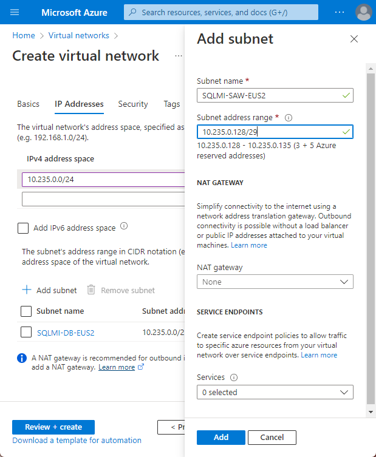
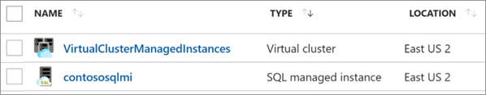

<!-- cSpell:ignore contoso's contosohost vcenter contosodc smarthotel SQLMI SHWCF SHWEB -->

# Refactor an on-premises application to an Azure App Service web app and a SQL managed instance

This article demonstrates how the fictional company Contoso refactors a two-tier Windows .NET application that's running on VMware virtual machines (VMs) as part of a migration to Azure. The Contoso team migrates the application front-end VM to an Azure App Service web app. The article also shows how Contoso migrates the application database to an Azure SQL managed instance.

The SmartHotel360 application that we use in this example is provided as open-source software. If you want to use it for your own testing purposes, you can download it from [GitHub](https://github.com/Microsoft/SmartHotel360).

## Business drivers

The Contoso IT leadership team has worked closely with business partners to understand what they want to achieve with this migration:

- **Address business growth.** Contoso is growing, and there is pressure on their on-premises systems and infrastructure.
- **Increase efficiency.** Contoso needs to remove unnecessary procedures and streamline processes for developers and users. The business needs IT to be fast and not waste time or money, thus delivering faster on customer requirements.
- **Increase agility.** Contoso IT needs to be more responsive to the needs of the business. It must be able to react faster than the changes in the marketplace, to enable success in a global economy. Reaction time must not get in the way, or become a business blocker.
- **Scale.** As the business grows successfully, Contoso IT must provide systems that are able to grow at the same pace.
- **Reduce costs.** Contoso wants to minimize licensing costs.

## Migration goals

To help determine the best migration method, the Contoso cloud team pinned down the following goals:

| Requirements | Details |
| --- | --- |
| **Application** | The application in Azure will remain as critical as it is today on-premises.    It should have the same performance capabilities as it currently does in VMware.    The team doesn't want to invest in the application. For now, admins will simply move the application safely to the cloud.    The team wants to stop supporting Windows Server 2008 R2, which the application currently runs on.    The team also wants to move away from SQL Server 2008 R2 to a modern platform as a service (PaaS) database, which will minimize the need for management.    Contoso wants to take advantage of its investment in SQL Server licensing and Software Assurance where possible.    In addition, Contoso wants to mitigate the single point of failure on the web tier. |
| **Limitations** | The application consists of an ASP.NET application and a Windows Communication Foundation (WCF) service running on the same VM. They want to spread these components across two web apps using the Azure App Service. |
| **Azure** | Contoso wants to move the application to Azure, but they don't want to run it on VMs. Contoso wants to use Azure PaaS services for both the web and data tiers. |
| **DevOps** | Contoso wants to move to a DevOps model that uses Azure DevOps for their builds and release pipelines. |

## Solution design

After pinning down their goals and requirements, Contoso designs and reviews a deployment solution. They also identify the migration process, including the Azure services that they'll use for the migration.

### Current application

- The SmartHotel360 on-premises application is tiered across two VMs, `WEBVM` and `SQLVM`.
- The VMs are located on VMware ESXi host contosohost1.contoso.com version 6.5.
- The VMware environment is managed by vCenter Server 6.5 (`vcenter.contoso.com`), which runs on a VM.
- Contoso has an on-premises datacenter (contoso-datacenter), with an on-premises domain controller (contosodc1).
- The on-premises VMs in the Contoso datacenter will be decommissioned after the migration is done.

### Proposed solution

- For the application web tier, Contoso has decided to use Azure App Service. This PaaS service enables them to deploy the application with just a few configuration changes. Contoso will use Visual Studio to make the change, and they'll deploy two web apps, one for the website and one for the WCF service.
- To meet requirements for a DevOps pipeline, Contoso will use Azure DevOps for source code management with Git repos. They'll use automated builds and release to build the code and deploy it to the Azure App Service.

### Database considerations

As part of the solution design process, Contoso did a feature comparison between Azure SQL Database and SQL Managed Instance. They decided to use SQL Managed Instance based on the following considerations:

- SQL Managed Instance aims to deliver almost 100 percent compatibility with the latest on-premises SQL Server version. Microsoft recommends SQL Managed Instance for customers who are running SQL Server on-premises or on infrastructure as a service (IaaS) VMs who want to migrate their applications to a fully managed service with minimal design changes.
- Contoso is planning to migrate a large number of applications from on-premises to IaaS VMs. Many of these VMs are provided by independent software vendors. Contoso realizes that using SQL Managed Instance will help ensure database compatibility for these applications. They'll use SQL Managed Instance rather than SQL Database, which might not be supported.
- Contoso can simply do a lift and shift migration to SQL Managed Instance by using the fully automated Azure Database Migration Service. With this service in place, Contoso can reuse it for future database migrations.
- SQL Managed Instance supports SQL Server Agent, an important component of the SmartHotel360 application. Contoso needs this compatibility; otherwise, they'll have to redesign the maintenance plans required by the application.
- With Software Assurance, Contoso can exchange their existing licenses for discounted rates on a SQL managed instance by using the Azure Hybrid Benefit for SQL Server. This allows Contoso to save up to 30 percent by using SQL Managed Instance.
- The SQL managed instance is fully contained in the virtual network, so it provides greater isolation and security for Contoso's data. Contoso can get the benefits of the public cloud, while keeping the environment isolated from the public internet.
- SQL Managed Instance supports many security features, including always-encrypted, dynamic data masking, row-level security, and threat detection.

### Solution review

Contoso evaluates their proposed design by putting together a pros and cons list, as shown in the following table:

| Consideration | Details |
| --- | --- |
| **Pros** | The SmartHotel360 application code doesn't require changes for migration to Azure.    Contoso can take advantage of their investment in Software Assurance by using the Azure Hybrid Benefit for both SQL Server and Windows Server.    After the migration, Windows Server 2008 R2 won't need to be supported. For more information, see the [Microsoft Lifecycle Policy](/lifecycle/).    Contoso can configure the web tier of the application with multiple instances, so that the web tier is no longer a single point of failure.    The database will no longer depend on the aging SQL Server 2008 R2.    SQL Managed Instance supports Contoso's technical requirements and goals.    The SQL managed instance will provide 100 percent compatibility with their current deployment, while moving them away from SQL Server 2008 R2.    Contoso can take advantage of their investment in Software Assurance and using the Azure Hybrid Benefit for SQL Server and Windows Server.    They can reuse Azure Database Migration Service for additional future migrations.    The SQL managed instance has built-in fault tolerance that Contoso doesn't need to configure. This ensures that the data tier is no longer a single point of failover. |
| **Cons** | Azure App Service supports only one application deployment for each web app. This means that two web apps must be provisioned, one for the website and one for the WCF service.    For the data tier, SQL Managed Instance might not be the best solution if Contoso wants to customize the operating system or the database server, or if they want to run third-party applications along with SQL Server. Running SQL Server on an IaaS VM could provide this flexibility. |

## Proposed architecture

### Migration process

1. Contoso provisions an Azure SQL managed instance and then migrates the SmartHotel360 database to it by using Azure Database Migration Service.
1. Contoso provisions and configures web apps and deploys the SmartHotel360 application to them.

    

### Azure services

| Service | Description | Cost |
| --- | --- | --- |
| [Azure App Service Migration Assistant](/learn/paths/migrate-dotnet-apps-azure/) | A free and simple path to seamlessly migrate .NET web applications from on-premises to the cloud with minimal to no code changes. | It's a downloadable tool, free of charge. |
| [Azure Database Migration Service](/azure/dms/dms-overview) | Azure Database Migration Service enables seamless migration from multiple database sources to Azure data platforms with minimal downtime. | Learn about [supported regions](/azure/dms/dms-overview#regional-availability) and [Azure Database Migration Service pricing](https://azure.microsoft.com/pricing/details/database-migration/). |
| [Azure SQL Managed Instance](/azure/azure-sql/managed-instance/sql-managed-instance-paas-overview) | SQL Managed Instance is a managed database service that represents a fully managed SQL Server instance in Azure. It uses the same code as the latest version of SQL Server Database Engine, and has the latest features, performance improvements, and security patches. | Using a SQL managed instance that runs in Azure incurs charges based on capacity. Learn more about [SQL Managed Instance pricing](https://azure.microsoft.com/pricing/details/azure-sql/sql-managed-instance/single/). |
| [Azure App Service](/azure/app-service/overview) | Helps create powerful cloud applications that use a fully managed platform. | Pricing is based on size, location, and usage duration. [Learn more](https://azure.microsoft.com/pricing/details/app-service/windows/). |
| [Azure Pipelines](/azure/devops/pipelines/get-started/what-is-azure-pipelines) | Provides a continuous integration and continuous deployment (CI/CD) pipeline for application development. The pipeline starts with a Git repository for managing application code, a build system for producing packages and other build artifacts, and a release management system to deploy changes in dev, test, and production environments. |

## Prerequisites

To run this scenario, Contoso must meet the following prerequisites:

| Requirements | Details |
| --- | --- |
| **Azure subscription** | Contoso created subscriptions earlier in this article series. If you don't have an Azure subscription, create a [free account](https://azure.microsoft.com/free/).    If you create a free account, you're the administrator of your subscription and can perform all actions.    If you use an existing subscription and you're not the administrator, you need to work with the admin to assign you Owner or Contributor permissions. |
| **Azure infrastructure** | Contoso set up their Azure infrastructure as described in [Azure infrastructure for migration](./contoso-migration-infrastructure.md). |

## Scenario steps

Here's how Contoso will run the migration:

> [!div class="checklist"]
>
> - **Step 1: Assess and migrate the web apps.**. Contoso uses the [Azure App Service Migration Assistant](https://azure.microsoft.com/migration/web-applications/) tool to run pre-migration compatibility checks and migrate their web apps to Azure App Service.
> - **Step 2: Set up a SQL managed instance**. Contoso needs an existing managed instance to which the on-premises SQL Server database will migrate.
> - **Step 3: Migrate via Azure Database Migration Service**. Contoso migrates the application database via Azure Database Migration Service.
> - **Step 4: Set up Azure DevOps**. Contoso creates a new Azure DevOps project and imports the Git repo.
> - **Step 5: Configure connection strings**. Contoso configures connection strings so that the web tier web app, the WCF service web app, and the SQL managed instance can communicate.
> - **Step 6: Set up build and release pipelines in Azure DevOps**. As a final step, Contoso sets up build and release pipelines in Azure DevOps to create the application. The team then deploys the pipelines to two separate web apps.

## Step 1: Assess and migrate the web apps

Contoso admins assess and migrate their web app using the [Azure App Service Migration Assistant](https://azure.microsoft.com/migration/web-applications/) tool. They use the [Microsoft Learn path](/learn/paths/migrate-dotnet-apps-azure/) as a guide during the process. In brief, the admins perform the following actions:

- They use the Azure [App Service migration assessment](https://azure.microsoft.com/services/app-service/migration-assistant/) tool to evaluate any dependencies between their web apps and to determine whether there are any incompatibilities between their on-premises web apps and what's supported on Azure App Service.

- They download the Azure App Service Migration Assistant and sign in to their Azure account.

- They choose a subscription, a resource group, and the website's domain name.

## Step 2: Set up a SQL managed instance

To set up an Azure SQL managed instance, Contoso needs a subnet that meets the following requirements:

- The subnet must be dedicated. It must be empty, and it can't contain any other cloud service. The subnet can't be a gateway subnet.
- After the managed instance is created, Contoso should not add resources to the subnet.
- The subnet can't have a network security group associated with it.
- The subnet must have a user-defined route table. The only route assigned should be `0.0.0.0/0` next-hop internet.
- If an optional custom DNS is specified for the virtual network, the virtual IP address `168.63.129.16` for the recursive resolvers in Azure must be added to the list. Learn how to [configure a custom DNS for an Azure SQL managed instance](/azure/azure-sql/managed-instance/custom-dns-configure).
- The subnet must not have a service endpoint (storage or SQL) associated with it. Service endpoints should be disabled on the virtual network.
- The subnet must have a minimum of 16 IP addresses. Learn how to [size the managed instance subnet](/azure/azure-sql/managed-instance/vnet-existing-add-subnet).
- In Contoso's hybrid environment, custom DNS settings are required. Contoso configures DNS settings to use one or more of the company's Azure DNS servers. Learn more about [DNS customization](/azure/azure-sql/managed-instance/custom-dns-configure).

### Set up a virtual network for the managed instance

Contoso admins set up the virtual network as follows:

1. They create a new virtual network (`VNET-SQLMI-EU2`) in the primary region (`East US 2`). It adds the virtual network to the `ContosoNetworkingRG` resource group.
1. They assign an address space of `10.235.0.0/24`. They ensure that the range doesn't overlap with any other networks in its enterprise.
1. They add two subnets to the network:
    - `SQLMI-DS-EUS2` (`10.235.0.0/25`).
    - `SQLMI-SAW-EUS2` (`10.235.0.128/29`). This subnet is used to attach a directory to the managed instance.

      

1. After the virtual network and subnets are deployed, they peer networks as follows:

    - Peers `VNET-SQLMI-EUS2` with `VNET-HUB-EUS2` (the hub virtual network for `East US 2`).

    - Peers `VNET-SQLMI-EUS2` with `VNET-PROD-EUS2` (the production network).

      

1. They set custom DNS settings. The DNS settings point first to Contoso's Azure domain controllers. Azure DNS is secondary. The Contoso Azure domain controllers are located as follows:

    - Located in the `PROD-DC-EUS2` subnet of the production network (`VNET-PROD-EUS2`) in the `East US 2` region.

    - `CONTOSODC3` address: `10.245.42.4`

    - `CONTOSODC4` address: `10.245.42.5`

    - Azure DNS resolver: `168.63.129.16`

    

**Need more help?**

- Read the [SQL Managed Instance overview](/azure/azure-sql/managed-instance/sql-managed-instance-paas-overview).
- Learn how to [create a virtual network for a SQL managed instance](/azure/azure-sql/managed-instance/vnet-existing-add-subnet).
- Learn how to [set up peering](/azure/virtual-network/virtual-network-manage-peering).
- Learn how to [update Azure Active Directory DNS settings](/azure/active-directory-domain-services/tutorial-create-instance).

### Set up routing

The managed instance is placed in a private virtual network. Contoso needs a route table for the virtual network to communicate with the Azure management service. If the virtual network can't communicate with the service that manages it, the virtual network becomes inaccessible.

Contoso considers these factors:

- The route table contains a set of rules (routes) that specify how packets that are sent from the managed instance should be routed in the virtual network.
- The route table is associated with subnets where managed instances are deployed. Each packet that leaves a subnet is handled based on the associated route table.
- A subnet can be associated with only one route table.
- There are no additional charges for creating route tables in Microsoft Azure.

To set up routing, Contoso admins do the following:

1. They create a user-defined route table in the `ContosoNetworkingRG` resource group.

    

1. To comply with SQL Managed Instance requirements, after the route table (`MIRouteTable`) is deployed, the admins add a route with an address prefix of `0.0.0.0/0`. The **Next hop type** option is set to **Internet**.

    

1. They associate the route table with the `SQLMI-DB-EUS2` subnet (in the `VNET-SQLMI-EUS2` network).

    

**Need more help?**

Learn how to [set up routes for a managed instance](/azure/azure-sql/managed-instance/instance-create-quickstart).

### Create a managed instance

Now, Contoso admins provision a SQL managed instance by doing the following:

1. Because the managed instance serves a business application, the admins deploy the managed instance in the company's primary region (East US 2). They add the managed instance to the `ContosoRG` resource group.
1. They select a pricing tier, size compute, and storage for the instance. Learn more about [SQL Managed Instance pricing](https://azure.microsoft.com/pricing/details/azure-sql/sql-managed-instance/single/).

    

    After the managed instance is deployed, two new resources appear in the `ContosoRG` resource group:

    - The SQL managed instance.

    - A virtual cluster, in case Contoso has multiple managed instances.

      

**Need more help?**

Learn how to [provision a managed instance](/azure/azure-sql/managed-instance/instance-create-quickstart).

## Step 3: Migrate via Azure Database Migration Service

Contoso admins migrate the managed instance via Azure Database Migration Service by following the instructions in the [step-by-step migration tutorial](/azure/dms/tutorial-sql-server-to-azure-sql). They can perform online, offline, and hybrid (preview) migrations.

In brief, Contoso admins do the following:

- They create an Azure Database Migration Service instance with a Premium SKU that's connected to the virtual network.
- They ensure that Database Migration Service can access the remote SQL Server via the virtual network. This would entail ensuring that all incoming ports are allowed from Azure to SQL Server at the virtual network level, the network VPN, and the machine that hosts SQL Server.
- They configure Azure Database Migration Service:
  - Create a migration project.
  - Add a source (on-premises database).
  - Select a target.
  - Select the databases to migrate.
  - Configure advanced settings.
  - Start the replication.
  - Resolve any errors.
  - Perform the final cutover.

## Step 4: Set up Azure DevOps

Contoso needs to build the DevOps infrastructure and pipelines for the application. To do this, the Contoso admins create a new DevOps project, import the code, and then set up build and release pipelines.

1. In the Contoso Azure DevOps account, they create a new project, `ContosoSmartHotelRefactor`, and then select **Git** for version control.

    

1. They import the Git repo that currently holds their application code. They download it from the [public GitHub repository](https://github.com/Microsoft/SmartHotel360-Registration).

    

1. They connect Visual Studio to the repo and then clone the code to the developer machine by using Team Explorer.

    

1. They open the solution file for the application. The web app and WCF service have separate projects within the file.

    

## Step 5: Configure connection strings

The Contoso admins make sure that the web apps and database can communicate with each other. To do this, they configure connection strings in the code and in the web apps.

1. In the web app for the WCF service, `SHWCF-EUS2`, under **Settings** > **Application settings**, they add a new connection string named `DefaultConnection`.
1. They pull the connection string from the `SmartHotel-Registration` database and then update it with the correct credentials.

    

1. In Visual Studio, the admins open the `SmartHotel.Registration.wcf` project from the solution file. In the project, they update the `connectionStrings` section of the `web.config` file with the connection string.

     

1. They change the `client` section of the `web.config` file for `SmartHotel.Registration.Web` to point to the new location of the WCF service. This is the URL of the WCF web app that hosts the service endpoint.

    

1. With the code changes now in place, the admins commit and sync them by using Team Explorer in Visual Studio.

## Step 6: Set up build and release pipelines in Azure DevOps

The Contoso admins now configure Azure DevOps to perform the build and release process.

1. In Azure DevOps, they select **Build and release** > **New pipeline**.

    

1. They select **Azure Repos Git** and the relevant repo.

    

1. In **Select a template**, they select the ASP.NET template for their build.

     

1. They use the name `ContosoSmartHotelRefactor-ASP.NET-CI` for the build and then select **Save & Queue**, which kicks off the first build.

     

1. They select the build number to watch the process. After it's finished, the admins can see the process feedback, and they select **Artifacts** to review the build results.

    

    The **Artifacts explorer** pane opens, and the **drop** folder displays the build results.

    - The two .zip files are the packages that contain the applications.
    - These .zip files are used in the release pipeline for deployment to Azure App Service.

     

1. They select **Releases** > **+ New pipeline**.

    

1. They select the deployment template for Azure App Service.

    

1. They name the release pipeline `ContosoSmartHotel360Refactor` and, in the **Stage name** box, specify `SHWCF-EUS2` as the name of the WCF web app.

    

1. Under the stages, they select **1 job, 1 task** to configure deployment of the WCF service.

    

1. They verify that the subscription is selected and authorized, and then they select the **app service name**.

     

1. On the pipeline, they select **Artifacts**, select **+ Add an artifact**, select **Build** as the source type, and then build with the `ContosoSmarthotel360Refactor` pipeline.

     

1. To enable the continuous deployment trigger, the admins select the lightning bolt icon on the artifact.

     

1. They set the continuous deployment trigger to **Enabled**.

    

1. The admins go back to the stage **1 job, 1 task** and then select **Deploy Azure App Service**.

    

1. In **Select a file or folder**, they expand the **drop** folder, select the `SmartHotel.Registration.Wcf.zip` file that was created during the build, and then select **Save**.

    

1. They select **Pipeline** > **Stages**, and then select **+ Add** to add an environment for `SHWEB-EUS2`. They select another Azure App Service deployment.

    

1. They repeat the process to publish the web app `SmartHotel.Registration.Web.zip` file to the correct web app, and then select **Save**.

    

    The release pipeline is displayed, as shown here:

     

1. They go back to **Build**, select **Triggers**, and then select the **Enable continuous integration** check box. This action enables the pipeline so that when changes are committed to the code, the full build and release occur.

    

1. They select **Save & Queue** to run the full pipeline. A new build is triggered, which in turn creates the first release of the application to the Azure App Service.

    

1. Contoso admins can follow the build and release pipeline process from Azure DevOps. After the build finishes, the release starts.

    

1. After the pipeline finishes, both sites have been deployed and the application is up and running online.

    

    The application has been successfully migrated to Azure.

## Clean up after the migration

After the migration, the Contoso team completes the following cleanup steps:

- They remove the on-premises VMs from the vCenter inventory.
- They remove the VMs from the local backup jobs.
- They update their internal documentation to show the new locations for the SmartHotel360 application. The documentation shows the database as running in the SQL managed instance, and the front end as running in two web apps.
- They review any resources that interact with the decommissioned VMs, and they update any relevant settings or documentation to reflect the new configuration.

## Review the deployment

With the resources now migrated to Azure, Contoso needs to fully operationalize and help secure their new infrastructure.

### Security

- Contoso helps ensure that their new `SmartHotel-Registration` database is secure. [Learn more](/azure/azure-sql/database/security-overview).
- In particular, Contoso updates the web apps to use SSL with certificates.

### Backups

- The Contoso team reviews the backup requirements for the database in Azure SQL Managed Instance. [Learn more](/azure/azure-sql/database/automated-backups-overview).
- They also learn about managing SQL Database backups and restores. Learn more about [automatic backups](/azure/azure-sql/database/automated-backups-overview).
- They consider implementing failover groups to provide regional failover for the database. [Learn more](/azure/azure-sql/database/auto-failover-group-overview).
- They consider deploying the web app in the main region (`East US 2`) and the secondary region (`Central US`) for resilience. The team could configure Traffic Manager to ensure failover during regional outages.

### Licensing and cost optimization

- After all resources are deployed, Contoso assigns Azure tags based on their [infrastructure planning](./contoso-migration-infrastructure.md#set-up-tagging).
- All licensing is built into the cost of the PaaS services that Contoso is consuming. This cost is deducted from the Enterprise Agreement.
- Contoso will use [Azure Cost Management + Billing](/azure/cost-management-billing/cost-management-billing-overview) to ensure that they stay within the budgets established by their IT leadership.

## Conclusion

In this article, Contoso refactored the SmartHotel360 application in Azure by migrating the application front-end VM to two Azure App Service web apps. The application database was migrated to an Azure SQL managed instance.
