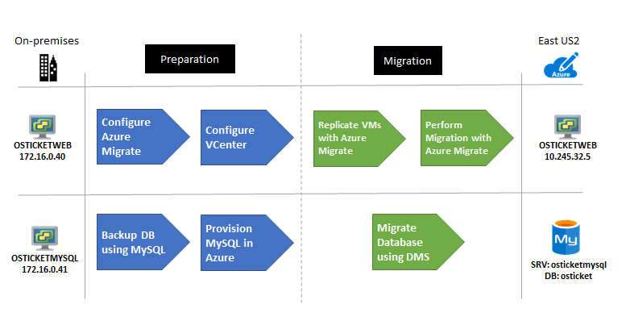
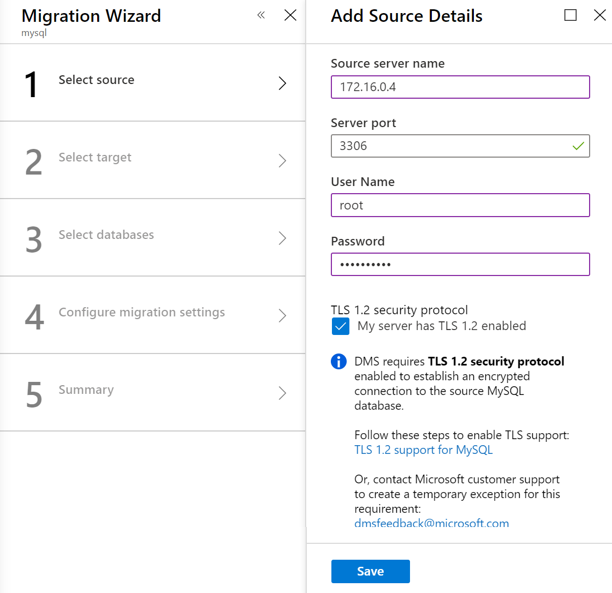
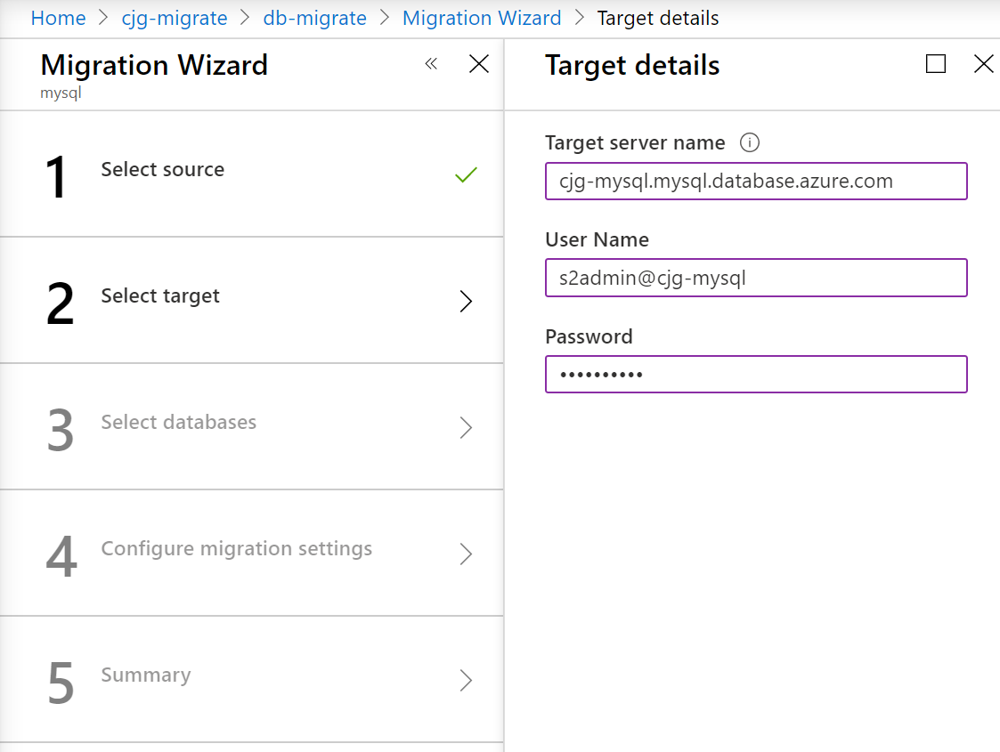
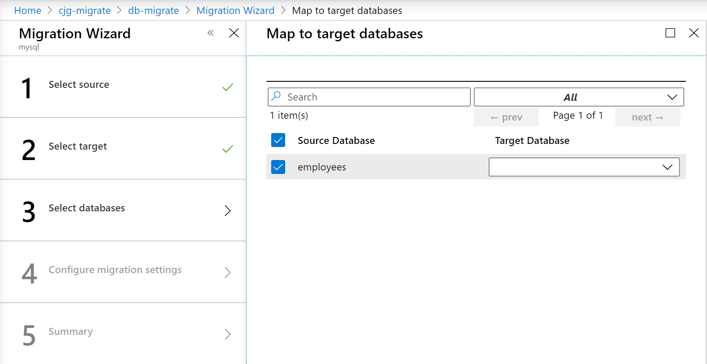
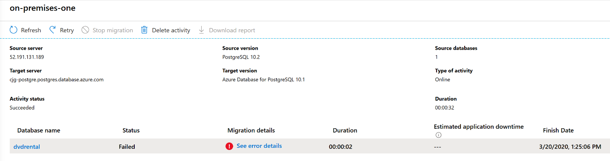
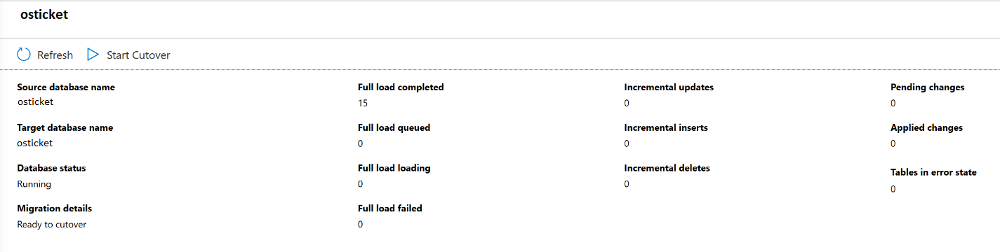
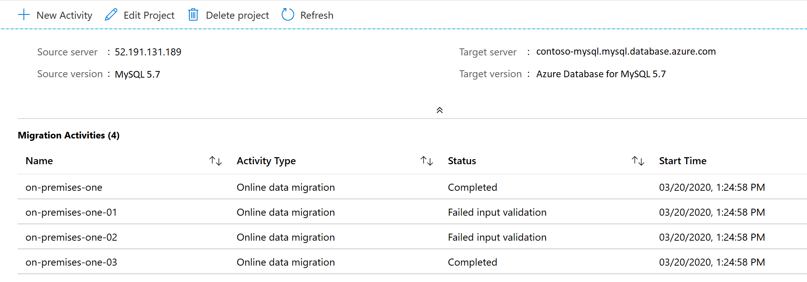

<!-- cSpell:ignore OSTICKETWEB OSTICKETMYSQL contosohost vcenter contosodc contosoosticket osticket InnoDB binlog systemctl NSGs -->

# Rehost an on-premises Linux application to Azure VMs and Azure Database for MySQL

This article shows how the fictional company Contoso rehosts a two-tier [LAMP-based](https://wikipedia.org/wiki/LAMP_software_bundle) application and migrates it from on-premises to Azure by using Azure Virtual Machines (VMs) and Azure Database for MySQL.

The service desk application used in this example, osTicket, is provided as open-source software. If you want to use it for your own testing, you can download it from [GitHub](https://github.com/osTicket/osTicket).

## Business drivers

The IT leadership team has worked closely with business partners to understand what they want to achieve:

- **Address business growth.** Contoso is growing, and as a result there's pressure on the on-premises systems and infrastructure.
- **Limit risk.** The service desk application is critical for the business. Contoso wants to move it to Azure with zero risk.
- **Extend.** Contoso doesn't want to change the application right now. The company wants to keep the application stable.

## Migration goals

The Contoso cloud team has pinned down goals for this migration to determine the best migration method:

- After migration, the application in Azure should have the same performance capabilities as it does today in the company's on-premises VMware environment. The application will remain as critical in the cloud as it is on-premises.
- Contoso doesn't want to invest in this application. It's important to the business, but in its current form Contoso simply wants to move it safely to the cloud.
- Having completed a couple of Windows application migrations, Contoso wants to learn how to use a Linux-based infrastructure in Azure.
- Contoso wants to minimize database admin tasks after the application is moved to the cloud.

## Proposed architecture

In this scenario:

- Currently the application is tiered across two VMs (`OSTICKETWEB` and `OSTICKETMYSQL`).
- The VMs are located on VMware ESXi host `contosohost1.contoso.com` (version 6.5).
- The VMware environment is managed by vCenter Server 6.5 (`vcenter.contoso.com`) and runs on a VM.
- Contoso has an on-premises datacenter (`contoso-datacenter`), with an on-premises domain controller (`contosodc1`).
- The web application on `OSTICKETWEB` will be migrated to an Azure infrastructure as a service (IaaS) VM.
- The application database will be migrated to the Azure Database for MySQL platform as a service.
- Because Contoso is migrating a production workload, the resources will reside in the production resource group `ContosoRG`.
- The `OSTICKETWEB` resource will be replicated to the primary region (East US 2) and placed in the production network (`VNET-PROD-EUS2`):
  - The web VM will reside in the front-end subnet (`PROD-FE-EUS2`).
- The application database will be migrated to Azure Database for MySQL by using [Azure Database Migration Service](/azure/dms/dms-overview).
- The on-premises VMs in the Contoso datacenter will be decommissioned after the migration is done.

    

## Migration process

Contoso will complete the migration process as follows:

To migrate the web VM:

- As a first step, Contoso sets up the Azure and on-premises infrastructure needed to deploy Azure Migrate.
- The company already has the [Azure infrastructure](./contoso-migration-infrastructure.md) in place, so it just needs to add and configure the replication of the VMs through the Azure Migrate: Server Migration tool.
- With everything prepared, Contoso can start replicating the VM.
- After replication is enabled and working, Contoso will complete the move by using Azure Migrate.

To migrate the database:

1. Contoso provisions a MySQL instance in Azure.
1. Contoso sets up Database Migration Service, ensuring access to the on-premises database server.
1. Contoso migrates the database to Azure Database for MySQL.

    

### Azure services

| Service | Description | Cost |
| --- | --- | --- |
| [Azure Migrate](/azure/migrate/migrate-services-overview) | Contoso uses Azure Migrate to assess its VMware VMs. Azure Migrate assesses the migration suitability of the machines. It provides sizing and cost estimates for running in Azure. | [Azure Migrate](https://azure.microsoft.com/pricing/details/azure-migrate/) is available at no additional charge. You might incur charges depending on the tools (first-party or ISV) you decide to use for assessment and migration. |
| [Azure Database Migration Service](/azure/dms/dms-overview) | Database Migration Service enables seamless migration from multiple database sources to Azure data platforms with minimal downtime. | Learn about [supported regions](/azure/dms/dms-overview#regional-availability) and [Database Migration Service pricing](https://azure.microsoft.com/pricing/details/database-migration/). |
| [Azure Database for MySQL](/azure/mysql/) | The database is based on the open-source MySQL database engine. It provides a fully managed enterprise-ready community MySQL database for application development and deployment. | Learn more about Azure Database for MySQL [pricing](https://azure.microsoft.com/pricing/details/mysql/server/) and scalability options. |

## Prerequisites

Here's what Contoso needs for this scenario.

| Requirements | Details |
| --- | --- |
| **Azure subscription** | Contoso created subscriptions during an earlier article. If you don't have an Azure subscription, create a [free account](https://azure.microsoft.com/free/).    If you create a free account, you're the administrator of your subscription and can perform all actions.    If you use an existing subscription and you're not the administrator, work with the admin to assign you Owner or Contributor permissions.    If you need more granular permissions, see [Manage Azure Site Recovery access with role-based access control (RBAC)](/azure/site-recovery/site-recovery-role-based-linked-access-control). |
| **Azure infrastructure** | Contoso set up the Azure infrastructure as described in [Azure infrastructure for migration](./contoso-migration-infrastructure.md). |
| **On-premises servers** | The on-premises vCenter Server should be running version 5.5, 6.0, 6.5, or 6.7.    An ESXi host running version 5.5, 6.0, 6.5, or 6.7.    One or more VMware VMs running on the ESXi host. |
| **On-premises VMs** | [Review Linux machines](/azure/virtual-machines/linux/endorsed-distros) that are endorsed to run on Azure. |

## Scenario steps

Here's how Contoso admins will complete the migration:

> [!div class="checklist"]
>
> - **Step 1: Prepare Azure for Azure Migrate: Server Migration.** Add the server migration tool to the Azure Migrate project.
> - **Step 2: Prepare on-premises VMware for Azure Migrate: Server Migration.** Prepare accounts for VM discovery and prepare to connect to Azure Virtual Machines after migrated.
> - **Step 3: Replicate VMs.** Set up replication and start replicating VMs to Azure Storage.
> - **Step 4: Migrate the application VM with Azure Migrate: Server Migration.** Run a test migration to make sure everything's working, and then run a full migration to move the VM to Azure.
> - **Step 5: Migrate the database.** Set up migration by using Azure Database Migration Service.

## Step 1: Prepare Azure for the Azure Migrate: Server Migration tool

Here are the Azure components Contoso needs to migrate the VMs to Azure:

- A virtual network in which Azure VMs will be located when they're created during migration.
- The Azure Migrate: Server Migration tool (OVA) provisioned and configured.

To set up the components, Contoso admins follow these steps:

1. Set up a network. Contoso already set up a network that can be used for Azure Migrate: Server Migration when it [deployed the Azure infrastructure](./contoso-migration-infrastructure.md).

1. Provision the Azure Migrate: Server Migration tool.

    1. From Azure Migrate, download the OVA image, and import it into VMware.

        

    1. Start the imported image, and configure the tool by using the following steps:

       1. Set up the prerequisites.

          

       1. Point the tool to the Azure subscription.

          

       1. Set the VMware vCenter credentials.

          

       1. Add any Linux-based credentials for discovery.

          

1. After the tool is configured, it takes some time for the tool to enumerate all the virtual machines. After the process is finished, the VMs populate in the Azure Migrate tool in Azure.

**Need more help?**

Learn about how to set up the [Azure Migrate: Server Migration tool](/azure/migrate/migrate-services-overview#azure-migrate-server-migration-tool).

## Step 2: Prepare on-premises VMware for Azure Migrate: Server Migration

After migrating to Azure, Contoso wants to be able to connect to the replicated VMs in Azure. There are a couple of things that the Contoso admins need to do:

- To access Azure VMs, they enable SSH on the on-premises Linux VM before migration. For Ubuntu, this step can be completed by using the following command: `sudo apt-get ssh install -y`.
- After the admins run the migration, they can check **boot diagnostics** to view a screenshot of the VM.
- If it doesn't work, they'll need to check that the VM is running, and review these [troubleshooting tips](https://social.technet.microsoft.com/wiki/contents/articles/31666.troubleshooting-remote-desktop-connection-after-failover-using-asr.aspx).
- Install the [Azure Linux agent](/azure/virtual-machines/extensions/agent-linux).

**Need more help?**

Learn about how to [prepare VMs for migration](/azure/migrate/prepare-for-migration).

## Step 3: Replicate VMs

Before Contoso admins can run a migration to Azure, they need to set up and enable replication.

With discovery finished, they can begin replication of the application VM to Azure.

1. In the Azure Migrate project, go to **Servers** > **Azure Migrate: Server Migration**, and select **Replicate**.

    

1. In **Replicate** > **Source settings** > **Are your machines virtualized?**, select **Yes, with VMware vSphere**.

1. In **On-premises appliance**, select the name of the Azure Migrate appliance that you set up, and then select **OK**.

    

1. In **Virtual machines**, select the machines you want to replicate:
    - If you've run an assessment for the VMs, you can apply VM sizing and disk type (premium/standard) recommendations from the assessment results. In **Import migration settings from an Azure Migrate assessment?**, select the **Yes** option.
    - If you didn't run an assessment, or you don't want to use the assessment settings, select the **No** option.
    - If you selected to use the assessment, select the VM group and assessment name.

    

1. In **Virtual machines**, search for VMs as needed, and select each VM you want to migrate. Then select **Next: Target settings**.

1. In **Target settings**, select the subscription and target region to which you'll migrate. Specify the resource group in which the Azure VMs will reside after migration. In **Virtual Network**, select the Azure virtual network/subnet to which the Azure VMs will be joined after migration.

1. In **Azure Hybrid Benefit**:

    - Select **No** if you don't want to apply Azure Hybrid Benefit. Then select **Next**.

1. In **Compute**, review the VM name, size, OS disk type, and availability set. VMs must conform with [Azure requirements](/azure/migrate/migrate-support-matrix-vmware#vmware-requirements).

    - **VM size:** If you use assessment recommendations, the VM size drop-down list contains the recommended size. Otherwise, Azure Migrate picks a size based on the closest match in the Azure subscription. Alternatively, pick a manual size in **Azure VM size**.
    - **OS disk:** Specify the OS (boot) disk for the VM. The OS disk is the disk that has the operating system bootloader and installer.
    - **Availability set:** If the VM should be in an Azure availability set after migration, specify the set. The set must be in the target resource group you specify for the migration.

1. In **Disks**, specify whether the VM disks should be replicated to Azure. Then select the disk type (standard SSD/HDD or premium-managed disks) in Azure, and select **Next**.
    - You can exclude disks from replication.
    - If you exclude disks, they won't be present on the Azure VM after migration.

1. In **Review + Start replication**, review the settings. Then select **Replicate** to start the initial replication for the servers.

> [!NOTE]
> You can update replication settings any time before replication starts in **Manage** > **Replicating machines**. Settings can't be changed after replication starts.

## Step 4: Migrate the VM with Azure Migrate: Server Migration

Contoso admins run a quick test migration and then a full migration to move the web VM.

### Run a test migration

1. In **Migration goals** > **Servers** > **Azure Migrate: Server Migration**, select **Test migrated servers**.

     

1. Select and hold (or right-click) the VM to test, and then select **Test migrate**.

    

1. In **Test Migration**, select the Azure virtual network in which the Azure VM will be located after the migration. We recommend you use a nonproduction virtual network.
1. The **Test migration** job starts. Monitor the job in the portal notifications.
1. After the migration finishes, view the migrated Azure VM in **Virtual Machines** in the Azure portal. The machine name has a suffix **-Test**.
1. After the test is done, select and hold (or right-click) the Azure VM in **Replicating machines**. Then select **Clean up test migration**.

    

### Migrate the VM

Now Contoso admins run a full migration to complete the move.

1. In the Azure Migrate project, go to **Servers** > **Azure Migrate: Server Migration**, and select **Replicating servers**.

    

1. In **Replicating machines**, select and hold (or right-click) the VM, and then select **Migrate**.
1. In **Migrate** > **Shut down virtual machines and perform a planned migration with no data loss**, select **Yes** > **OK**.
    - By default, Azure Migrate shuts down the on-premises VM and runs an on-demand replication to synchronize any VM changes that occurred since the last replication occurred. This action ensures no data loss.
    - If you don't want to shut down the VM, select **No**.
1. A migration job starts for the VM. Track the job in Azure notifications.
1. After the job finishes, you can view and manage the VM from the **Virtual Machines** page.

## Step 5: Provision Azure Database for MySQL

Contoso admins provision a MySQL database instance in the primary region (`East US 2`).

1. In the Azure portal, create an Azure Database for MySQL resource.

    

1. Add the name `contosoosticket` for the Azure database. Add the database to the production resource group `ContosoRG`, and specify credentials for it.
1. The on-premises MySQL database is version 5.7, so select this version for compatibility. Use the default sizes, which match database requirements.

     

1. For **Backup Redundancy Options**, select **Geo-Redundant**. This option allows you to restore the database in the secondary region (`Central US`) if an outage occurs. You can configure this option only when you provision the database.

     

1. In the `VNET-PROD-EUS2` network, go to **Service endpoints**, and add a service endpoint (a database subnet) for the SQL service.

    

1. After adding the subnet, create a virtual network rule that allows access from the database subnet in the production network.

    

## Step 6: Migrate the database

There are several ways to move the MySQL database. Each option requires the Contoso admins to create an Azure Database for MySQL instance for the target. After it's created, they can perform the migration by using two paths that are described in the following steps:

- 6a: Database Migration Service
- 6b: MySQL Workbench backup and restore

### Step 6a: Migrate the database via Database Migration Service

Contoso admins migrate the database via Database Migration Service by following the [step-by-step migration tutorial](/azure/dms/tutorial-mysql-azure-mysql-online). They can perform online, offline, and hybrid (preview) migrations by using MySQL 5.6 or 5.7.

> [!NOTE]
> MySQL 8.0 is supported in Azure Database for MySQL, but the Database Migration Service tool doesn't yet support that version.

As a summary, Contoso admins must perform the following tasks:

- Ensure all migration prerequisites are met:
  - The MySQL server database source must match the version that Azure Database for MySQL supports. Azure Database for MySQL supports MySQL Community Edition, the InnoDB storage engine, and migration across the source and target with the same versions.
  - Enable binary logging in `my.ini` (Windows) or `my.cnf` (Unix). Failure to do so will cause the following error in the Migration Wizard: `Error in binary logging. Variable binlog_row_image has value 'minimal.' Please change it to 'full.'` For more information, see the [MySQL documentation](https://dev.mysql.com/doc/refman/5.7/en/replication-options-binary-log.html).
  - User must have `ReplicationAdmin` role.
  - Migrate the database schemas without foreign keys and triggers.
- Create a virtual network that connects via Azure ExpressRoute or a VPN to your on-premises network.
- Create a Database Migration Service instance by using a `Premium` SKU that's connected to the virtual network.
- Ensure that the instance can access the MySQL database via the virtual network. Ensure that all incoming ports are allowed from Azure to MySQL at the virtual network level, the network VPN, and the machine that hosts MySQL.
- Run the Database Migration Service tool:
  - Create a migration project.

    

    

  - Add a source (on-premises database).

    

  - Select a target.

    

  - Select the databases to migrate.

    

  - Configure advanced settings.

    

  - Start the replication and resolve any errors.

    

  - Perform the final cutover. 

    

    

  - Reinstate any foreign keys and triggers.
  - Modify applications to use the new database.

    

### Step 6b: Migrate the database (MySQL Workbench)

Contoso admins migrate the database by using backup and restore with MySQL tools. They install MySQL Workbench, back up the database from `OSTICKETMYSQL`, and then restore it to Azure Database for MySQL.

### Install MySQL Workbench

1. Check the [prerequisites, and download MySQL Workbench](https://dev.mysql.com/downloads/workbench/?utm_source=tuicool).

1. Install MySQL Workbench for Windows by following the [installation instructions](https://dev.mysql.com/doc/workbench/en/wb-installing.html).

1. In MySQL Workbench, create a MySQL connection to `OSTICKETMYSQL`.

    

1. Export the database as `osticket` to a local self-contained file.

    

1. After the database is backed up locally, create a connection to the Azure Database for MySQL instance.

    

1. Now, import (restore) the database in the Azure Database for MySQL instance from the self-contained file. A new schema (`osticket`) is created for the instance.

    

### Connect the VM to the database

As the final step in the migration process, Contoso admins update the connection string of the application to point to the application database running on the `OSTICKETMYSQL` VM.

1. Make an SSH connection to the `OSTICKETWEB` VM by using PuTTY or another SSH client. The VM is private, so connect by using the private IP address.

    

    

1. Make sure that the `OSTICKETWEB` VM can communicate with the `OSTICKETMYSQL` VM. Currently, the configuration is hardcoded with the on-premises IP address `172.16.0.43`.

    **Before the update:**

    

    **After the update:**

    

1. Restart the service with `systemctl restart apache2`.

    

1. Finally, update the DNS records for `OSTICKETWEB` and `OSTICKETMYSQL` on one of the Contoso domain controllers.

    

    

**Need more help?**

- Learn about how to [run a test migration](/azure/migrate/tutorial-migrate-vmware#run-a-test-migration).
- Learn about how to [migrate VMs to Azure](/azure/migrate/tutorial-migrate-vmware#migrate-vms).

## Review the deployment

With the application now running, Contoso needs to fully operationalize and secure its new infrastructure.

## Clean up after migration

With migration complete, the osTicket application tiers are running on Azure VMs.

Now, Contoso needs to do the following tasks:

- Remove the VMware VMs from the vCenter inventory.
- Remove the on-premises VMs from local backup jobs.
- Update internal documentation to show new locations and IP addresses.
- Review any resources that interact with the on-premises VMs. Update any relevant settings or documentation to reflect the new configuration.
- Contoso used Azure Migrate with dependency mapping to assess the `OSTICKETWEB` VM for migration.

### Security

The Contoso security team reviews the VM and database to determine any security issues:

- They review the network security groups (NSGs) for the VM to control access. NSGs are used to ensure that only traffic allowed to the application can pass.
- They consider securing the data on the VM disks by using Azure Disk Encryption and Azure Key Vault.
- Communication between the VM and database instance isn't configured for SSL. They'll need to configure SSL to ensure that database traffic can't be hacked.

For more information, see [Security best practices for IaaS workloads in Azure](/azure/security/fundamentals/iaas).

### Business continuity and disaster recovery

For business continuity and disaster recovery, Contoso takes the following actions:

- **Keep data safe.** Contoso backs up the data on the application VM by using [Azure VM backup](/azure/backup/backup-azure-vms-introduction). The company doesn't need to configure backup for the database. Azure Database for MySQL automatically creates and stores server backups. Contoso selected to use geo-redundancy for the database so that it's resilient and production ready.
- **Keep applications up and running.** Contoso replicates the application VMs in Azure to a secondary region by using Site Recovery. For more information, see [Quickstart: Set up disaster recovery to a secondary Azure region for an Azure VM](/azure/site-recovery/azure-to-azure-quickstart).

### Licensing and cost optimization

- After deploying resources, Contoso assigns Azure tags as defined during the [Azure infrastructure](./contoso-migration-infrastructure.md#set-up-tagging) deployment.
- There are no licensing issues for the Contoso Ubuntu servers.
- Contoso will use [Azure Cost Management + Billing](/azure/cost-management-billing/cost-management-billing-overview) to ensure the company stays within budgets established by the IT leadership.
