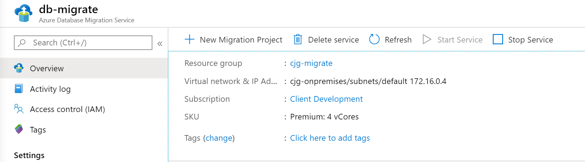
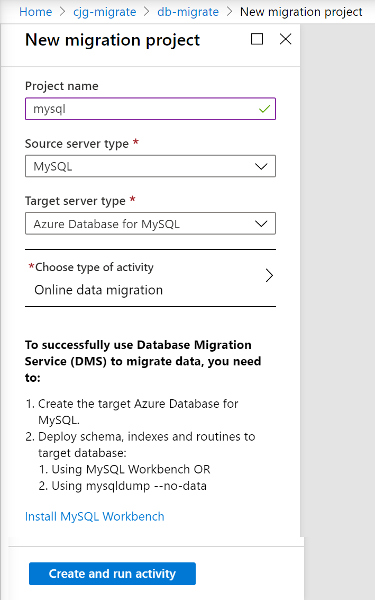

# Rehost an on-premises Linux app to Azure VMs and Azure Database for MySQL

This article shows how the fictional company Contoso rehosts a two-tier Linux-based Apache/MySQL/PHP (LAMP) app, migrating it from on-premises to Azure using Azure VMs and Azure Database for MySQL.

osTicket, the service desk app used in this example, is provided as open source. If you'd like to use it for your own testing, you can download it from [GitHub](https://github.com/osTicket/osTicket).

## Business drivers

The IT Leadership team has worked closely with business partners to understand what they want to achieve:

- **Address business growth.** Contoso is growing, and as a result there's pressure on the on-premises systems and infrastructure.
- **Limit risk.** The service desk app is critical for the business. Contoso wants to move it to Azure with zero risk.
- **Extend.** Contoso doesn't want to change the app right now. It simply wants to keep the app stable.

## Migration goals

The Contoso cloud team has pinned down goals for this migration, in order to determine the best migration method:

- After migration, the app in Azure should have the same performance capabilities as it does today in their on-premises VMware environment. The app will remain as critical in the cloud as it is on-premises.
- Contoso doesn't want to invest in this app. It's important to the business, but in its current form Contoso simply want to move it safely to the cloud.
- Having completed a couple of Windows app migrations, Contoso wants to learn how to use a Linux-based infrastructure in Azure.
- Contoso wants to minimize database admin tasks after the application is moved to the cloud.

## Proposed architecture

In this scenario:

- Currently the app is tiered across two VMs (`OSTICKETWEB` and `OSTICKETMYSQL`).
- The VMs are located on VMware ESXi host `contosohost1.contoso.com` (version 6.5).
- The VMware environment is managed by vCenter Server 6.5 (`vcenter.contoso.com`), running on a VM.
- Contoso has an on-premises datacenter (`contoso-datacenter`), with an on-premises domain controller (`contosodc1`).
- The web tier app on `OSTICKETWEB` will be migrated to an Azure IaaS VM.
- The app database will be migrated to the Azure Database for MySQL PaaS service.
- Since Contoso is migrating a production workload, the resources will reside in the production resource group `ContosoRG`.
- The `OSTICKETWEB` resource will be replicated to the primary region (East US 2), and placed in the production network (`VNET-PROD-EUS2`):
  - The web VM will reside in the front-end subnet (`PROD-FE-EUS2`).
- The app database will be migrated to Azure Database for MySQL using the [Azure Database Migration Service](https://docs.microsoft.com/azure/dms/dms-overview).
- The on-premises VMs in the Contoso datacenter will be decommissioned after the migration is done.

## Migration process

Contoso will complete the migration process as follows:

To migrate the web VM:

- As a first step, Contoso sets up the Azure and on-premises infrastructure needed to deploy Azure Migrate.
- They already have the [Azure infrastructure](./contoso-migration-infrastructure.md) in place, so Contoso just needs to add and configure the replication of the VMs through the Azure Migrate Server Migration tool.
- With everything prepared, Contoso can start replicating the VM.
- After replication is enabled and working, Contoso will complete the move using Azure Migrate.

To migrate the database:

1. Contoso provisions a MySQL instance in Azure.
2. Contoso sets up Azure Database Migration Service (DMS), ensuring access to the on-premises database server
3. Contoso migrates the database to Azure Database for MySQL

### Azure services

**Service** | **Description** | **Cost**
--- | --- | ---
[Azure Migrate](https://docs.microsoft.com/azure/migrate/migrate-overview) | Contoso uses the Azure Migrate service to assess its VMware VMs. Azure Migrate assesses the migration suitability of the machines. It provides sizing and cost estimates for running in Azure. | [Azure Migrate](https://azure.microsoft.com/en-us/pricing/details/azure-migrate/) is available at no additional charge, however, you may incur charges depending on the tools (first-party or ISV) you decide to use for assessment and migration.
[Azure Database Migration Service](https://docs.microsoft.com/azure/dms/dms-overview) | The Azure Database Migration Service enables seamless migration from multiple database sources to Azure data platforms with minimal downtime. | Learn about [supported regions](https://docs.microsoft.com/azure/dms/dms-overview#regional-availability) and [Database Migration Service pricing](https://azure.microsoft.com/pricing/details/database-migration).
[Azure Database for MySQL](https://docs.microsoft.com/azure/mysql) | The database is based on the open-source MySQL Server engine. It provides a fully managed enterprise-ready community MySQL database, as a service for app development and deployment. | Learn more about Azure Database for MySQL [pricing](https://azure.microsoft.com/en-us/pricing/details/mysql/) and scalability options.

## Prerequisites

Here's what Contoso needs for this scenario.

<!-- markdownlint-disable MD033 -->

**Requirements** | **Details**
--- | ---
**Azure subscription** | Contoso created subscriptions during an earlier article. If you don't have an Azure subscription, create a [free account](https://azure.microsoft.com/pricing/free-trial).   If you create a free account, you're the administrator of your subscription and can perform all actions.   If you use an existing subscription and you're not the administrator, you need to work with the admin to assign you Owner or Contributor permissions.   If you need more granular permissions, review [this article](https://docs.microsoft.com/azure/site-recovery/site-recovery-role-based-linked-access-control).
**Azure infrastructure** | Contoso set up the Azure infrastructure as described in [Azure infrastructure for migration](./contoso-migration-infrastructure.md).
**On-premises servers** | The on-premises vCenter server should be running version 5.5, 6.0, 6.5 or 6.7   An ESXi host running version 5.5, 6.0, 6.5 or 6.7   One or more VMware VMs running on the ESXi host.
**On-premises VMs** | [Review Linux machines](https://docs.microsoft.com/azure/virtual-machines/linux/endorsed-distros) that are endorsed to run on Azure.

<!-- markdownlint-enable MD033 -->

## Scenario steps

Here's how Contoso admins will complete the migration:

> [!div class="checklist"]
>
> - **Step 1: Prepare Azure for Azure Migrate Server Migration.** They add the Server Migration tool to their Azure Migrate project.
> - **Step 2: Prepare on-premises VMware for Azure Migrate Server Migration.** They prepare accounts for VM discovery, and prepare to connect to Azure VM after migrated.
> - **Step 3: Replicate VMs.** They set up replication, and start replicating VMs to Azure storage.
> - **Step 4: Migrate the app VM with Azure Migrate Server Migration.** They run a test migration to make sure everything's working, and then run a full migration to move the VM to Azure.
> - **Step 5: Migrate the database.** They set up migration using Azure Database Migration Service (DMS).

## Step 1: Prepare Azure for the Azure Migrate Server Migration tool

Here are the Azure components Contoso needs to migrate the VMs to Azure:

- A VNet in which Azure VMs will be located when they're created during migration.
- The Azure Migrate Server Migration tool (OVA) provisioned and configured.

They set these up as follows:

1. Set up a network-Contoso already set up a network that can be for Azure Migrate Server Migration when they [deployed the Azure infrastructure](./contoso-migration-infrastructure.md)

2. Provision the Azure Migrate Server Migration tool.

    - From Azure Migrate, download the OVA image and import it into VMWare

        

    - Start the imported image and configure the tool, this includes
      - Setup the prerequisites

        

      - Point the tool to the Azure subscription

        

      - Set the VMWare vCenter credentials

        

      - Add any linux based credentials for discovery

        

3. Once configured, it will take some time for the tool to enumerate all the virtual machines.  Once complete, you will see them populate in the Azure Migrate tool in Azure.

**Need more help?**

[Learn about](https://docs.microsoft.com/azure/migrate) setting up Azure Migrate Server Migration tool.

## Step 2: Prepare on-premises VMware for Azure Migrate Server Migration

After migrating to Azure, Contoso wants to be able to connect to the replicated VMs in Azure. To do this, there's a couple of things that the Contoso admins need to do:

   - To access Azure VM, they enable SSH on the on-premises Linux VM before migration. For Ubuntu this can be completed using the following command: **Sudo apt-get ssh install -y**.

   - After they run the migration they can check **Boot diagnostics** to view a screenshot of the VM.

   - If this doesn't work, they'll need to check that the VM is running, and review these [troubleshooting tips](https://social.technet.microsoft.com/wiki/contents/articles/31666.troubleshooting-remote-desktop-connection-after-failover-using-asr.aspx).

   - Install the Azure Linux agent - [https://docs.microsoft.com/en-us/azure/virtual-machines/extensions/agent-linux](https://docs.microsoft.com/en-us/azure/virtual-machines/extensions/agent-linux)

**Need more help?**

   - [Learn about](https://docs.microsoft.com/azure/migrate/contoso-migration-rehost-linux-vm#prepare-vms-for-migration) preparing VMs for migration

## Step 3: Replicate VM

Before Contoso admins can run a migration to Azure, they need to set up and enable replication.

With discovery completed, they can begin replication of the app VM to Azure.

1. In the Azure Migrate project > **Servers**, **Azure Migrate: Server Migration**, click **Replicate**.

    

2. In **Replicate**, > **Source settings** > **Are your machines virtualized?**, select **Yes, with VMware vSphere**.

3. In **On-premises appliance**, select the name of the Azure Migrate appliance that you set up > **OK**.

    

4. In **Virtual machines**, select the machines you want to replicate.
    - If you've run an assessment for the VMs, you can apply VM sizing and disk type (premium/standard) recommendations from the assessment results. To do this, in **Import migration settings from an Azure Migrate assessment?**, select the **Yes** option.
    - If you didn't run an assessment, or you don't want to use the assessment settings, select the **No** options.
    - If you selected to use the assessment, select the VM group, and assessment name.

    

5. In **Virtual machines**, search for VMs as needed, and check each VM you want to migrate. Then click **Next: Target settings**.

6. In **Target settings**, select the subscription, and target region to which you'll migrate, and specify the resource group in which the Azure VMs will reside after migration. In **Virtual Network**, select the Azure VNet/subnet to which the Azure VMs will be joined after migration.

7. In **Azure Hybrid Benefit**, select the following:

    - Select **No** if you don't want to apply Azure Hybrid Benefit. Then click **Next**.

8. In **Compute**, review the VM name, size, OS disk type, and availability set. VMs must conform with [Azure requirements](https://docs.microsoft.com/azure/migrate/migrate-support-matrix-vmware#vmware-requirements).

    - **VM size:** If you're using assessment recommendations, the VM size dropdown will contain the recommended size. Otherwise Azure Migrate picks a size based on the closest match in the Azure subscription. Alternatively, pick a manual size in **Azure VM size**.
    - **OS disk:** Specify the OS (boot) disk for the VM. The OS disk is the disk that has the operating system bootloader and installer.
    - **Availability set:** If the VM should be in an Azure availability set after migration, specify the set. The set must be in the target resource group you specify for the migration.

9. In **Disks**, specify whether the VM disks should be replicated to Azure, and select the disk type (standard SSD/HDD or premium-managed disks) in Azure. Then click **Next**.
    - You can exclude disks from replication.
    - If you exclude disks, won't be present on the Azure VM after migration.

10. In **Review and start replication**, review the settings, and click **Replicate** to start the initial replication for the servers.

> [!NOTE]
> You can update replication settings any time before replication starts, in **Manage** > **Replicating machines**. Settings can't be changed after replication starts.

## Step 4: Migrate the VM with Azure Migrate Server Migration

Contoso admins run a quick test migration, and then a full migration to move the web VM.

### Run a test migration

1. In **Migration goals** > **Servers** > **Azure Migrate: Server Migration**, click **Test migrated servers**.

     

2. Right-click the VM to test, and click **Test migrate**.

    

3. In **Test Migration**, select the Azure VNet in which the Azure VM will be located after the migration. We recommend you use a nonproduction VNet.
4. The **Test migration** job starts. Monitor the job in the portal notifications.
5. After the migration finishes, view the migrated Azure VM in **Virtual Machines** in the Azure portal. The machine name has a suffix **-Test**.
6. After the test is done, right-click the Azure VM in **Replicating machines**, and click **Clean up test migration**.

    

### Migrate the VM

Now Contoso admins run a full migration to complete the move.

1. In the Azure Migrate project > **Servers** > **Azure Migrate: Server Migration**, click **Replicating servers**.

    

2. In **Replicating machines**, right-click the VM > **Migrate**.
3. In **Migrate** > **Shut down virtual machines and perform a planned migration with no data loss**, select **Yes** > **OK**.
    - By default Azure Migrate shuts down the on-premises VM, and runs an on-demand replication to synchronize any VM changes that occurred since the last replication occurred. This ensures no data loss.
    - If you don't want to shut down the VM, select **No**
4. A migration job starts for the VM. Track the job in Azure notifications.
5. After the job finishes, you can view and manage the VM from the **Virtual Machines** page.

## Step 5: Provision Azure Database for MySQL

Contoso admins provision a MySQL database instance in the primary East US 2 region.

1. In the Azure portal, they create an Azure Database for MySQL resource.

    

2. They add the name **contosoosticket** for the Azure database. They add the database to the production resource group **ContosoRG**, and specify credentials for it.
3. The on-premises MySQL database is version 5.7, so they select this version for compatibility. They use the default sizes, which match their database requirements.

     

4. For **Backup Redundancy Options**, they select to use **Geo-Redundant**. This option allows them to restore the database in their secondary Central US region if an outage occurs. They can only configure this option when they provision the database.

     

5. In the **VNET-PROD-EUS2** network > **Service endpoints**, they add a service endpoint (a database subnet) for the SQL service.

    

6. After adding the subnet, they create a virtual network rule that allows access from the database subnet in  the production network.

    

## Step 6: Migrate the database

There are several ways to move the MySQL database.  Each require you to create a Azure DB for MySQL instance for the target. Once created, you can perform the migration using two paths:

- 6a: Azure Database Migration Service
- 6b: MySQL Workbench backup and restore

### Step 6a: Migrate the database (Azure Database Migration Service)

Contoso admins migrate the database using Azure Database Migration Services using the step-by-step guidance [here](https://docs.microsoft.com/en-us/azure/dms/tutorial-mysql-azure-mysql-online). They can perform both online, offline and hybrid (preview) migrations using MySQL 5.6 or 5.7.

> **NOTE** MySQL 8.0 is supported in Azure Database for MySQL, but the DMS tool does not yet support it

As a summary, you must perform the following:

- Ensure all migration prerequisites are met
  - MySQL server source must match the version that Azure Database for MySQL supports. Azure Database for MySQL supports - MySQL community edition, InnoDB engine and migration across source and target with same versions.
  - Enable binary logging in my.ini (Windows) or my.cnf (Unix). Failure to do this will cause a `Error in binary logging. Variable binlog_row_image has value 'minimal'. Please change it to 'full. For more details see https://go.microsoft.com/fwlink/?linkid=873009` error during the migration wizard.
  - User must have `ReplicationAdmin` role.
  - Migrate the database schemas without foreign keys and triggers
- Create a virtual network that connects via ExpressRoute or VPN to your on-premises network.
- Create an Azure Database Migration Service with a `Premium` SKU that is connected to the VNet
- Ensure that the Azure Database Migration Service can access the MySQL database via the Virtual Network.  This would entail ensuring that all incoming ports are allowed from Azure to MySQL at the Virtual Network level, the network VPN and the machine hosting MySQL.
- Run the Azure Database Migration Service Tool
  - Create a migration project

    
    
    

  - Add a source (on-premises database)

    

  - Select a target

    

  - Select the database(s) to migrate

    

  - Configure advanced settings

    

  - Start the replication, resolve any errors

    
  
    

  - Perform final cut-over
  
    

    

    
  
  - Reinstate any foreign keys and triggers

  - Modify applications to use the new database

    

### Step 6b: Migrate the database (MySQL Workbench)

Contoso admins migrate the database using backup and restore, with MySQL tools. They install MySQL Workbench, back up the database from OSTICKETMYSQL, 
and then restore it to Azure Database for MySQL Server.

### Install MySQL Workbench

1. They check the [prerequisites and downloads MySQL Workbench](https://dev.mysql.com/downloads/workbench/?utm_source=tuicool).
2. They install MySQL Workbench for Windows in accordance with the [installation instructions](https://dev.mysql.com/doc/workbench/en/wb-installing.html).
3. In MySQL Workbench, they create a MySQL connection to OSTICKETMYSQL.

    

4. They export the database as **osticket**, to a local self-contained file.

    

5. After the database has been backed up locally, they create a connection to the Azure Database for MySQL instance.

    

6. Now, they can import (restore) the database in the Azure Database for MySQL instance, from the self-contained file. A new schema (osticket) is created for the instance.

    

### Connect the VM to the database

As the final step in the migration process, Contoso admins update the connection string of the application to point to the app database running on the **OSTICKETMYSQL** VM.

1. They make an SSH connection to the **OSTICKETWEB** VM using Putty or another SSH client. The VM is private so they connect using the private IP address.

    

    

2. They need to make sure that the **OSTICKETWEB** VM can communicate with the **OSTICKETMYSQL** VM. Currently the configuration is hardcoded with the on-premises IP address 172.16.0.43.

    **Before the update:**

    

    **After the update:**

    

3. They restart the service with **systemctl restart apache2**.

    

4. Finally, they update the DNS records for **OSTICKETWEB** and **OSTICKETMYSQL**, on one of the Contoso domain controllers.

    

    

**Need more help?**

- [Learn about](https://docs.microsoft.com/azure/migrate/tutorial-migrate-vmware#run-a-test-migration) running a test migration.
- [Learn about](https://docs.microsoft.com/azure/migrate/tutorial-migrate-vmware#migrate-vms) migrating VMs to Azure.

## Review the deployment

With the app now running, Contoso need to fully operationalize and secure their new infrastructure.

## Clean up after migration

With migration complete, the osTicket app tiers are running on Azure VMs.

Now, Contoso needs to do the following:

- Remove the VMware VMs from the vCenter inventory.
- Remove the on-premises VMs from local backup jobs.
- Update internal documentation show new locations and IP addresses.
- Review any resources that interact with the on-premises VMs, and update any relevant settings or documentation to reflect the new configuration.
- Contoso used the Azure Migrate service with dependency mapping to assess the **OSTICKETWEB** VM for migration.

### Security

The Contoso security team review the VM and database to determine any security issues.

- They review the network security groups (NSGs) for the VM, to control access. NSGs are used to ensure that only traffic allowed to the application can pass.
- They consider securing the data on the VM disks using Disk encryption and Azure Key Vault.
- Communication between the VM and database instance isn't configured for SSL. They will need to do this to ensure that database traffic can't be hacked.

For more information, see [Security best practices for IaaS workloads in Azure](https://docs.microsoft.com/azure/security/fundamentals/iaas).

### BCDR

For business continuity and disaster recovery, Contoso takes the following actions:

- **Keep data safe.** Contoso backs up the data on the app VM using the Azure Backup service. [Learn more](https://docs.microsoft.com/azure/backup/backup-introduction-to-azure-backup?toc=%2fazure%2fvirtual-machines%2flinux%2ftoc.json). They don't need to configure backup for the database. Azure Database for MySQL automatically creates and stores server backups. They selected to use geo-redundancy for the database, so it's resilient and production-ready.
- **Keep apps up and running.** Contoso replicates the app VMs in Azure to a secondary region using Site Recovery. [Learn more](https://docs.microsoft.com/azure/site-recovery/azure-to-azure-quickstart).

### Licensing and cost optimization

- After deploying resources, Contoso assigns Azure tags, in accordance with decisions they made during the [Azure infrastructure](./contoso-migration-infrastructure.md#set-up-tagging) deployment.
- There are no licensing issues for the Contoso Ubuntu servers.
- Contoso will leverage [Azure Cost Management](https://azure.microsoft.com/en-us/services/cost-management/) to ensure they stay within budgets established by their IT leadership.
