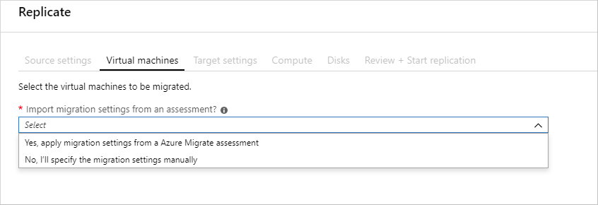

<!-- cSpell:ignore givenscj WEBVM SQLVM contosohost vcenter contosodc AOAG SQLAOG SQLAOGAVSET contosoadmin contosocloudwitness MSSQLSERVER BEPOOL contosovmsacc SHAOG NSGs inetpub iisreset -->

# Rehost an on-premises app on Azure VMs and SQL Server Always On availability groups

# Rehost an on-premises app with Azure Virtual Machines and SQL Server Always On availability groups

This article demonstrates how the fictional company Contoso rehosts a two-tier Windows .NET app running on VMware virtual machines (VMs) as part of a migration to Azure. Contoso migrates the app front-end VM to an Azure VM, and the app database to an Azure SQL Server VM, running in a Windows Server failover cluster with SQL Server Always On availability groups.

The SmartHotel360 app used in this example is provided as open source. If you'd like to use it for your own testing purposes, you can download it from [GitHub](https://github.com/Microsoft/SmartHotel360).

## Business drivers

The IT leadership team has worked closely with business partners to understand what they want to achieve with this migration:

- **Address business growth.** Contoso is growing, and as a result there is pressure on on-premises systems and infrastructure.

- **Increase efficiency.** Contoso needs to remove unnecessary procedures, and streamline processes for developers and users. The business needs IT to be fast and not waste time or money, thus delivering faster on customer requirements.

- **Increase agility.** Contoso IT needs to be more responsive to the needs of the business. It must be able to react faster than the changes in the marketplace, to enable the success in a global economy. IT mustn't get in the way, or become a business blocker.

- **Scale.** As the business grows successfully, Contoso IT must provide systems that are able to grow at the same pace.

## Migration goals

The Contoso cloud team has pinned down goals for this migration. These goals were used to determine the best migration method:

- After migration, the app in Azure should have the same performance capabilities as it does today in VMware. The app will remain as critical in the cloud as it is on-premises.

- Contoso doesn't want to invest in this app. It is important to the business, but in its current form Contoso simply want to move it safely to the cloud.

- The on-premises database for the app has had availability issues. Contoso would like to deploy it in Azure as a high-availability cluster, with failover capabilities.

- Contoso wants to upgrade from their current SQL Server 2008 R2 platform, to SQL Server 2017.

- Contoso doesn't want to use an Azure SQL Database for this app, and is looking for alternatives.

## Solution design

After pinning down their goals and requirements, Contoso designs and reviews a deployment solution, and identifies the migration process, including the Azure services that it will use for the migration.

### Current architecture

- The app is tiered across two VMs (WEBVM and SQLVM).
- The VMs are located on VMware ESXi host **contosohost1.contoso.com** (version 6.5).
- The VMware environment is managed by vCenter Server 6.5 (**vcenter.contoso.com**), running on a VM.
- Contoso has an on-premises datacenter (contoso-datacenter), with an on-premises domain controller (**contosodc1**).

### Proposed architecture

In this scenario:

- Contoso will migrate the app front-end WEBVM to an Azure IaaS VM.
  - The front-end VM in Azure will be deployed in the ContosoRG resource group (used for production resources).
  - It will be located in the Azure production network (VNET-PROD-EUS2) in the primary East US2 region.
- The app database will be migrated to an Azure SQL Server VM.
  - It will be located in Contoso's Azure database network (PROD-DB-EUS2) in the primary East US2 region.
  - It will be placed in a Windows Server failover cluster with two nodes, that uses SQL Server Always On availability groups.
  - In Azure the two SQL Server VM nodes in the cluster will be deployed in the ContosoRG resource group.
  - The VM nodes will be located in the Azure production network (VNET-PROD-EUS2) in the primary East US2 region.
  - VMs will run Windows Server 2016 with SQL Server 2017 Enterprise Edition. Contoso doesn't have licenses for this operating system, so it will use an image in the Azure Marketplace that provides the license as a charge to their Azure EA commitment.
  - Apart from unique names, both VMs use the same settings.
- Contoso will deploy an internal load balancer which listens for traffic on the cluster, and directs it to the appropriate cluster node.
  - The internal load balancer will be deployed in the ContosoNetworkingRG (used for networking resources).
- The on-premises VMs in the Contoso datacenter will be decommissioned after the migration is done.

    

### Database considerations

As part of the solution design process, Contoso did a feature comparison between Azure SQL Database and SQL Server. The following considerations helped them to decide to go with an Azure IaaS VM running SQL Server:

- Using an Azure VM running SQL Server seems to be an optimal solution if Contoso needs to customize the operating system or the database server, or if it might want to colocate and run third-party apps on the same VM.

### Solution review

Contoso evaluates their proposed design by putting together a pros and cons list.

<!-- markdownlint-disable MD033 -->

**Consideration** | **Details**
--- | ---
**Pros** | WEBVM will be moved to Azure without changes, making the migration simple.   The SQL Server tier will run on SQL Server 2017 and Windows Server 2016. This retires their current Windows Server 2008 R2 operating system, and running SQL Server 2017 supports Contoso's technical requirements and goals. IT provides 100% compatibility while moving away from SQL Server 2008 R2.   Contoso can take advantage of their investment in Software Assurance, using the Azure Hybrid Benefit.   A high availability SQL Server deployment in Azure provides fault tolerance so that the app data tier is no longer a single point of failover.
**Cons** | WEBVM is running Windows Server 2008 R2. The operating system is supported by Azure for specific roles (July 2018). [Learn more](https://support.microsoft.com/help/2721672/microsoft-server-software-support-for-microsoft-azure-virtual-machines).   The web tier of the app will remain a single point of failover.   Contoso will need to continue supporting the web tier as an Azure VM rather than moving to a managed service such as Azure App Service.   With the chosen solution, Contoso will need to continue managing two SQL Server VMs rather than moving to a managed platform such as Azure SQL Database Managed Instance. In addition, with Software Assurance, Contoso could exchange their existing licenses for discounted rates on Azure SQL Database Managed Instance.

<!-- markdownlint-enable MD033 -->

### Azure services

**Service** | **Description** | **Cost**
--- | --- | ---
[Azure Database Migration Service](https://docs.microsoft.com/azure/dms/dms-overview) | The Azure Database Migration Service enables seamless migration from multiple database sources to Azure data platforms with minimal downtime. | Learn about [supported regions](https://docs.microsoft.com/azure/dms/dms-overview#regional-availability) and [Database Migration Service pricing](https://azure.microsoft.com/pricing/details/database-migration).
[Azure Migrate](https://docs.microsoft.com/azure/migrate/migrate-overview) | Contoso uses the Azure Migrate service to assess its VMware VMs. Azure Migrate assesses the migration suitability of the machines. It provides sizing and cost estimates for running in Azure. | As of May 2018, Azure Migrate is a free service.

## Migration process

Contoso admins will migrate the app VMs to Azure.

- They'll migrate the front-end VM to Azure VM using Azure Migrate:
  - As a first step, they'll prepare and set up Azure components, and prepare the on-premises VMware infrastructure.
  - With everything prepared, they can start replicating the VM.
  - After replication is enabled and working, they migrate the VM by failing it over to Azure.
- Once they have verified the database, they will migrate the database to a SQL Server cluster in Azure, using the Data Migration Service (DMS).
  - As a first step they'll need to provision SQL Server VMs in Azure, set up the cluster and an internal load balancer, and configure Always On availability groups.
  - With this in place, they can migrate the database.
- After the migration, they'll enable Always On protection for the database.

    

## Prerequisites

Here's what Contoso needs to do for this scenario.

<!-- markdownlint-disable MD033 -->

**Requirements** | **Details**
--- | ---
**Azure subscription** | Contoso already created a subscription in an early article in this series. If you don't have an Azure subscription, create a [free account](https://azure.microsoft.com/pricing/free-trial).   If you create a free account, you're the administrator of your subscription and can perform all actions.   If you use an existing subscription and you're not the administrator, you need to work with the admin to assign you Owner or Contributor permissions.  
**Azure infrastructure** | Contoso set up the Azure infrastructure as described in [Azure infrastructure for migration](./contoso-migration-infrastructure.md).   Learn more about specific [prerequisites](https://docs.microsoft.com/azure/migrate/contoso-migration-rehost-linux-vm#prerequisites) requirements for Azure Migrate Server Migration.
**On-premises servers** | The on-premises vCenter server should be running version 5.5, 6.0, 6.5 or 6.7   An ESXi host running version 5.5, 6.0, 6.5 or 6.7   One or more VMware VMs running on the ESXi host.
**On-premises VMs** | [Review Linux machines](https://docs.microsoft.com/azure/virtual-machines/linux/endorsed-distros) that are endorsed to run on Azure.

<!-- markdownlint-enable MD033 -->

## Scenario steps

Here's how Contoso will run the migration:

> [!div class="checklist"]
>
> - **Step 1: Prepare a AOAG cluster.** Create a cluster for deploying two SQL Server VM nodes in Azure.
> - **Step 2: Deploy and set up the cluster.** Prepare an Azure SQL Server cluster. Databases are migrated into this existing cluster.
> - **Step 3: Deploy the Azure Load Balancer.** Deploy a load balancer to balance traffic to the SQL Server nodes.
> - **Step 4: Prepare Azure for Azure Migrate.** Create an Azure storage account to hold replicated data.
> - **Step 5: Prepare on-premises VMware for Azure Migrate.** Prepare accounts for VM discovery and agent installation. Prepare on-premises VMs so that users can connect to Azure VMs after migration.
> - **Step 6: Replicate VMs.** Enable VM replication to Azure.
> - **Step 7: Migrate the database with Data Migration Service (DMS).** Migrate the database to Azure using the Data Migration Service.
> - **Step 8: Protect the database.** Create an Always On availability group for the cluster.
> - **Step 9: Migrate the VMs with Azure Migrate** Run a test failover to make sure everything's working as expected. Then run a full failover to Azure.

## Step 1: Prepare a SQL Server Always On availability group cluster

Contoso admins set up the cluster as follows:

1. They create two SQL Server VMs by selecting SQL Server 2017 Enterprise Windows Server 2016 image in the Azure Marketplace.

    

2. In the **Create virtual machine Wizard** > **Basics**, they configure:

    - Names for the VMs: **SQLAOG1** and **SQLAOG2**.
    - Since machines are business-critical, they enable SSD for the VM disk type.
    - They specify machine credentials.
    - They deploy the VMs in the primary EAST US 2 region, in the ContosoRG resource group.

3. In **Size**, they start with D2s_V3 SKU for both VMs. They'll scale later as they need to.
4. In **Settings**, they do the following:

    - Since these VMs are critical databases for the app, they use managed disks.
    - They place the machines in the production network of the EAST US 2 primary region (**VNET-PROD-EUS2**), in the database subnet (**PROD-DB-EUS2**).
    - They create a new availability set: **SQLAOGAVSET**, with two fault domains and five update domains.

      

5. In **SQL Server settings**, they limit SQL connectivity to the virtual network (private), on default port 1433. For authentication they use the same credentials as they use onsite (**contosoadmin**).

    

**Need more help?**

- [Get help](https://docs.microsoft.com/azure/virtual-machines/windows/sql/virtual-machines-windows-portal-sql-server-provision#1-configure-basic-settings) provisioning a SQL Server VM.
- [Learn about](https://docs.microsoft.com/azure/virtual-machines/windows/sql/virtual-machines-windows-portal-sql-availability-group-prereq#create-sql-server-vms) configuring VMs for different SQL Server SKUs.

## Step 2: Deploy and set up the cluster

Here's how Contoso admins set up the cluster:

1. They set up an Azure storage account to act as the cloud witness.
2. They add the SQL Server VMs to the Active Directory domain in the Contoso on-premises datacenter.
3. They create the cluster in Azure.
4. They configure the cloud witness.
5. Lastly, they enable SQL Always On availability groups.

### Set up a storage account as cloud witness

To set up a cloud witness, Contoso needs an Azure Storage account that will hold the blob file used for cluster arbitration. The same storage account can be used to set up cloud witness for multiple clusters.

Contoso admins create a storage account as follows:

1. They specify a recognizable name for the account (**contosocloudwitness**).
2. They deploy a general all-purpose account, with LRS.
3. They place the account in a third region - South Central US. They place it outside the primary and secondary region so that it remains available in case of regional failure.
4. They place it in their resource group that holds infrastructure resources, **ContosoInfraRG**.

    

5. When they create the storage account, primary and secondary access keys are generated for it. They need the primary access key to create the cloud witness. The key appears under the storage account name > **Access Keys**.

    

### Add SQL Server VMs to Contoso domain

1. Contoso adds SQLAOG1 and SQLAOG2 to contoso.com domain.
2. Then, on each VM they install the Windows Failover Cluster Feature and Tools.

### Set up the cluster

Before setting up the cluster, Contoso admins take a snapshot of the OS disk on each machine.

1. Then, they run a script they've put together to create the Windows Failover Cluster.

    

2. After they've created the cluster, they verify that the VMs appear as cluster nodes.

     

### Configure the cloud witness

1. Contoso admins configure the cloud witness using the **Quorum Configuration Wizard** in Failover Cluster Manager.
2. In the wizard they select to create a cloud witness with the storage account.
3. After the cloud witness is configured, in appears in the Failover Cluster Manager snap-in.

    

### Enable SQL Server Always On availability groups

Contoso admins can now enable Always On:

1. In SQL Server Configuration Manager, they enable **Always On availability groups** for the **SQL Server (MSSQLSERVER)** service.

    

2. They restart the service for changes to take effect.

With Always On enabled, Contoso can set up the Always On availability group that will protect the SmartHotel360 database.

**Need more help?**

- [Read about](https://docs.microsoft.com/windows-server/failover-clustering/deploy-cloud-witness) cloud witness and setting up a storage account for it.
- [Get instructions](https://docs.microsoft.com/azure/virtual-machines/windows/sql/virtual-machines-windows-portal-sql-availability-group-tutorial) for setting up a cluster and creating an availability group.

## Step 3: Deploy the Azure Load Balancer

Contoso admins now want to deploy an internal load balancer that sits in front of the cluster nodes. The load balancer listens for traffic, and directs it to the appropriate node.

They create the load balancer as follows:

1. In the Azure portal > **Networking** > **Load Balancer**, they set up a new internal load balancer: **ILB-PROD-DB-EUS2-SQLAOG**.
2. They place the load balancer in the production network **VNET-PROD-EUS2**, in the database subnet **PROD-DB-EUS2**.
3. They assign it a static IP address: 10.245.40.100.
4. As a networking element, they deploy the load balancer in the networking resource group **ContosoNetworkingRG**.

    

After the internal load balancer is deployed, they need to set it up. They create a back-end address pool, set up a health probe, and configure a load balancing rule.

### Add a back-end pool

To distribute traffic to the VMs in the cluster, Contoso admins set up a back-end address pool that contains the IP addresses of the NICs for VMs that will receive network traffic from the load balancer.

1. In the load balancer settings in the portal, Contoso add a back-end pool: **ILB-PROD-DB-EUS-SQLAOG-BEPOOL**.
2. They associate the pool with availability set SQLAOGAVSET. The VMs in the set (**SQLAOG1** and **SQLAOG2**) are added to the pool.

    

### Create a health probe

Contoso admins create a health probe so that the load balancer can monitor the app health. The probe dynamically adds or removes VMs from the load balancer rotation, based on how they respond to health checks.

They create the probe as follows:

1. In the load balancer settings in the portal, Contoso creates a health probe: **SQLAlwaysOnEndPointProbe**.
2. They set the probe to monitor VMs on TCP port 59999.
3. They set an interval of 5 seconds between probes, and a threshold of 2. If two probes fail, the VM will be considered unhealthy.

    

### Configure the load balancer to receive traffic

Now, Contoso admins set up a load balancer rule to define how traffic is distributed to the VMs.

- The front-end IP address handles incoming traffic.
- The back-end IP pool receives the traffic.

They create the rule as follows:

1. In the load balancer settings in the portal, they add a new load balancing rule: **SQLAlwaysOnEndPointListener**.
2. They set a front-end listener to receive incoming SQL client traffic on TCP 1433.
3. They specify the back-end pool to which traffic will be routed, and the port on which VMs listen for traffic.
4. They enable floating IP (direct server return). This is always required for SQL Always On.

    

**Need more help?**

- [Get an overview](https://docs.microsoft.com/azure/load-balancer/load-balancer-overview) of Azure Load Balancer.
- [Learn about](https://docs.microsoft.com/azure/load-balancer/tutorial-load-balancer-basic-internal-portal) creating a load balancer.

## Step 4: Prepare Azure for Azure Migrate

Here are the Azure components Contoso needs to deploy Azure Migrate:

- A VNet in which VMs will be located when they're creating during failover.
- An Azure storage account to hold replicated data.

Contoso admins set these up as follows:

1. Contoso already created a network/subnet they can use for Azure Migrate when they [deployed the Azure infrastructure](./contoso-migration-rehost-vm-sql-ag.md).

    - The SmartHotel360 app is a production app, and WEBVM will be migrated to the Azure production network (VNET-PROD-EUS2) in the primary East US2 region.
    - WEBVM will be placed in the ContosoRG resource group, which is used for production resources, and in the production subnet (PROD-FE-EUS2).

2. Contoso admins create an Azure storage account (contosovmsacc20180528) in the primary region.

    - They use a general-purpose account, with standard storage, and LRS replication.

## Step 5: Prepare on-premises VMware for Azure Migrate

Here's what Contoso admins prepare on-premises:

- An account on the vCenter server or vSphere ESXi host, to automate VM discovery.
- On-premises VM settings, so that Contoso can connect to the replicated Azure VM after failover.

### Prepare an account for automatic discovery

Azure Migrate needs access to VMware servers to:

- Automatically discover VMs.
- Orchestrate replication, failover, and failback.
- At least a read-only account is required. You need an account that can run operations such as creating and removing disks, and turning on VMs.

Contoso admins set up the account as follows:

1. They create a role at the vCenter level.
2. They then assign that role the required permissions.

### Prepare to connect to Azure VMs after failover

After migration, Contoso wants to connect to the Azure VMs and allow Azure to manage the VMs. To do this, Contoso admins do the following before migration:

1. For access over the internet, they:

    - Enable RDP or SSH on the on-premises VM before migration.
    - Ensure that TCP and UDP rules are added for the **Public** profile.
    - Check that RDP or SSH is allowed in the operating system firewall.

2. For access over site-to-site VPN, they:

    - Enable RDP or SSH on the on-premises VM before migration.
    - Check that RDP or SSH is allowed in the operating system firewall.
    - For windows, Set the operating system's SAN policy on the on-premises VM to **OnlineAll**.

3. Install the Azure agent:

    - [Azure Linux Agent](https://docs.microsoft.com/azure/virtual-machines/extensions/agent-linux)
    - [Azure Windows Agent](https://docs.microsoft.com/azure/virtual-machines/extensions/agent-windows)

4. Miscellaneous

   - For windows, there should be no Windows updates pending on the VM when triggering a migration. If there are, they won't be able to log into the VM until the update completes.
   - After migration, they can check **Boot diagnostics** to view a screenshot of the VM. If this doesn't work, they should verify that the VM is running, and review these [troubleshooting tips](https://social.technet.microsoft.com/wiki/contents/articles/31666.troubleshooting-remote-desktop-connection-after-failover-using-asr.aspx).

5. Need more help?

   - [Learn about](https://docs.microsoft.com/azure/migrate/contoso-migration-rehost-vm#prepare-vms-for-migration) preparing VMs for migration.

## Step 6: Replicate the on-premises VMs to Azure

Before Contoso admins can run a migration to Azure, they need to set up and enable replication.

With discovery completed, you can begin replication of VMware VMs to Azure.

1. In the Azure Migrate project > **Servers**, **Azure Migrate: Server Migration**, click **Replicate**.

    

2. In **Replicate**, > **Source settings** > **Are your machines virtualized?**, select **Yes, with VMware vSphere**.

3. In **On-premises appliance**, select the name of the Azure Migrate appliance that you set up > **OK**.

    

4. In **Virtual machines**, select the machines you want to replicate.
    - If you've run an assessment for the VMs, you can apply VM sizing and disk type (premium/standard) recommendations from the assessment results. To do this, in **Import migration settings from an Azure Migrate assessment?**, select the **Yes** option.
    - If you didn't run an assessment, or you don't want to use the assessment settings, select the **No** options.
    - If you selected to use the assessment, select the VM group, and assessment name.

    

5. In **Virtual machines**, search for VMs as needed, and check each VM you want to migrate. Then click **Next: Target settings**.

6. In **Target settings**, select the subscription, and target region to which you'll migrate, and specify the resource group in which the Azure VMs will reside after migration. In **Virtual Network**, select the Azure VNet/subnet to which the Azure VMs will be joined after migration.

7. In **Azure Hybrid Benefit**, select the following:

    - Select **No** if you don't want to apply Azure Hybrid Benefit. Then click **Next**.
    - Select **Yes** if you have Windows Server machines that are covered with active Software Assurance or Windows Server subscriptions, and you want to apply the benefit to the machines you're migrating. Then click **Next**.

8. In **Compute**, review the VM name, size, OS disk type, and availability set. VMs must conform with [Azure requirements](https://docs.microsoft.com/azure/migrate/migrate-support-matrix-vmware#vmware-requirements).

    - **VM size:** If you're using assessment recommendations, the VM size dropdown will contain the recommended size. Otherwise Azure Migrate picks a size based on the closest match in the Azure subscription. Alternatively, pick a manual size in **Azure VM size**.
    - **OS disk:** Specify the OS (boot) disk for the VM. The OS disk is the disk that has the operating system bootloader and installer.
    - **Availability set:** If the VM should be in an Azure availability set after migration, specify the set. The set must be in the target resource group you specify for the migration.

9. In **Disks**, specify whether the VM disks should be replicated to Azure, and select the disk type (standard SSD/HDD or premium-managed disks) in Azure. Then click **Next**.
    - You can exclude disks from replication.
    - If you exclude disks, won't be present on the Azure VM after migration.

10. In **Review and start replication**, review the settings, and click **Replicate** to start the initial replication for the servers.

> [!NOTE]
> You can update replication settings any time before replication starts, in **Manage** > **Replicating machines**. Settings can't be changed after replication starts.

## Step 7: Migrate the database with Azure Database Migration Service (DMS)

Contoso admins migrate it using Azure Database Migration Services (DMS) with the step-by-step guidance [here](https://docs.microsoft.com/azure/dms/tutorial-sql-server-azure-sql-online). They can perform online, offline, and hybrid (preview) migrations.

As a summary, you must perform the following:

- Create an Azure Database Migration Service (DMS) with a `Premium` SKU that is connected to the VNet.
- Ensure that the Azure Database Migration Service (DMS) can access the remote SQL Server via the Virtual Network.  This would entail ensuring that all incoming ports are allowed from Azure to SQL Server at the Virtual Network level, the network VPN and the machine hosting SQL Server.
- Configure the Azure Database Migration Service:
  - Create a migration project.
  - Add a source (on-premises database).
  - Select a target.
  - Select the database(s) to migrate.
  - Configure advanced settings.
  - Start the replication.
  - Resolve any errors.
  - Perform the final cutover.

## Step 8: Protect the database with Always On

With the app database running on **SQLAOG1**, Contoso admins can now protect it using Always On availability groups. They configure Always On using SQL Management Studio, and then assign a listener using Windows clustering.

### Create an Always On availability group

1. In SQL Management Studio, they right-click **Always on High Availability** to start the **New Availability Group Wizard**.
2. In **Specify Options**, they name the availability group **SHAOG**. In **Select Databases**, they select the SmartHotel360 database.

    

3. In **Specify Replicas**, they add the two SQL nodes as availability replicas, and configure them to provide automatic failover with synchronous commit.

     

4. They configure a listener for the group (**SHAOG**) and port. The IP address of the internal load balancer is added as a static IP address (10.245.40.100).

    

5. In **Select Data Synchronization**, they enable automatic seeding. With this option, SQL Server automatically creates the secondary replicas for every database in the group, so Contoso don't have to manually back up and restore these. After validation, the availability group is created.

    

6. Contoso ran into an issue when creating the group. They aren't using Active Directory Windows Integrated security, and thus need to grant permissions to the SQL login to create the Windows Failover Cluster roles.

    

7. After the group is created, Contoso can see it in SQL Management Studio.

### Configure a listener on the cluster

As a last step in setting up the SQL deployment, Contoso admins configure the internal load balancer as the listener on the cluster, and brings the listener online. They use a script to do this.

### Verify the configuration

With everything set up, Contoso now has a functional availability group in Azure that uses the migrated database. Admins verify this by connecting to the internal load balancer in SQL Management Studio.

**Need more help?**

- Learn about creating an [availability group](https://docs.microsoft.com/azure/virtual-machines/windows/sql/virtual-machines-windows-portal-sql-availability-group-tutorial#create-the-availability-group) and [listener](https://docs.microsoft.com/azure/virtual-machines/windows/sql/virtual-machines-windows-portal-sql-availability-group-tutorial#configure-listener).
- Manually [set up the cluster to use the load balancer IP address](https://docs.microsoft.com/azure/virtual-machines/windows/sql/virtual-machines-windows-portal-sql-alwayson-int-listener#configure-the-cluster-to-use-the-load-balancer-ip-address).
- [Learn more](https://docs.microsoft.com/azure/storage/blobs/storage-dotnet-shared-access-signature-part-2) about creating and using SAS.

## Step 9: Migrate the VM with Azure Migrate

Contoso admins run a quick test failover, and then migrate the VM.

### Run a test failover

Running a test failover helps ensure that everything's working as expected before the migration.

1. They run a test failover to the latest available point in time (**Latest processed**).
2. They select **Shut down machine before beginning failover**, so that Azure Migrate attempts to shut down the source VM before triggering the failover. Failover continues even if shutdown fails.
3. Test failover runs:

    - A prerequisites check runs to make sure all of the conditions required for migration are in place.
    - Failover processes the data, so that an Azure VM can be created. If select the latest recovery point, a recovery point is created from the data.
    - An Azure VM is created using the data processed in the previous step.

4. After the failover finishes, the replica Azure VM appears in the Azure portal. They check that the VM is the appropriate size, that it's connected to the right network, and that it's running.
5. After verifying, They clean up the failover, and record and save any observations.

### Run a failover

1. After verifying that the test failover worked as expected, Contoso admins create a recovery plan for migration, and add WEBVM to the plan.

     

2. They run a failover on the plan. They select the latest recovery point, and specify that Azure Migrate should try to shut down the on-premises VM before triggering the failover.

    

3. After the failover, they verify that the Azure VM appears as expected in the Azure portal.

    

4. After verifying the VM in Azure, they complete the migration to finish the migration process, stop replication for the VM, and stop Azure Migrate billing for the VM.

    

### Update the connection string

As the final step in the migration process, Contoso admins update the connection string of the application to point to the migrated database running on the SHAOG listener. This configuration will be changed on the WEBVM now running in Azure. This configuration is located in the web.config of the ASP application.

1. Locate the file at `C:\inetpub\SmartHotelWeb\web.config`. Change the name of the server to reflect the FQDN of the AOG: shaog.contoso.com.

    

2. After updating the file and saving it, they restart IIS on WEBVM. They do this using `iisreset /restart` from a command prompt.
3. After IIS has been restarted, the application is now using the database running on the SQL MI.

**Need more help?**

- [Learn about](https://docs.microsoft.com/azure/site-recovery/tutorial-dr-drill-azure) running a test failover.
- [Learn](https://docs.microsoft.com/azure/site-recovery/site-recovery-create-recovery-plans) how to create a recovery plan.
- [Learn about](https://docs.microsoft.com/azure/site-recovery/site-recovery-failover) failing over to Azure.

### Clean up after migration

After migration, the SmartHotel360 app is running on an Azure VM, and the SmartHotel360 database is located in the Azure SQL cluster.

Now, Contoso needs to complete these cleanup steps:

- Remove the on-premises VMs from the vCenter inventory.
- Remove the VMs from local backup jobs.
- Update internal documentation to show the new locations and IP addresses for VMs.
- Review any resources that interact with the decommissioned VMs, and update any relevant settings or documentation to reflect the new configuration.
- Add the two new VMs (SQLAOG1 and SQLAOG2) should be added to production monitoring systems.

### Review the deployment

With the migrated resources in Azure, Contoso needs to fully operationalize and secure their new infrastructure.

### Security

The Contoso security team reviews the Azure VMs WEBVM, SQLAOG1 and SQLAOG2 to determine any security issues.

- The team reviews the network security groups (NSGs) for the VM to control access. NSGs are used to ensure that only traffic allowed to the application can pass.
- The team considers securing the data on the disk using Azure Disk Encryption and Key Vault.
- The team should evaluate transparent data encryption (TDE), and then enable it on the SmartHotel360 database running on the new SQL AOG. [Learn more](https://docs.microsoft.com/sql/relational-databases/security/encryption/transparent-data-encryption?view=sql-server-2017).

For more information, see [Security best practices for IaaS workloads in Azure](https://docs.microsoft.com/azure/security/fundamentals/iaas).

## BCDR

For business continuity and disaster recovery (BCDR), Contoso takes the following actions:

- To keep data safe, Contoso backs up the data on the WEBVM, SQLAOG1 and SQLAOG2 VMs using the Azure Backup service. [Learn more](https://docs.microsoft.com/azure/backup/backup-introduction-to-azure-backup?toc=%2fazure%2fvirtual-machines%2flinux%2ftoc.json).
- Contoso will also learn about how to use Azure Storage to back up SQL Server directly to blob storage. [Learn more](https://docs.microsoft.com/azure/virtual-machines/windows/sql/virtual-machines-windows-use-storage-sql-server-backup-restore).
- To keep apps up and running, Contoso replicates the app VMs in Azure to a secondary region using Site Recovery. [Learn more](https://docs.microsoft.com/azure/site-recovery/azure-to-azure-quickstart).

### Licensing and cost optimization

- Contoso has existing licensing for their WEBVM and will take advantage of the Azure Hybrid Benefit. Contoso will convert the existing Azure VMs to take advantage of this pricing.
- Contoso will use [Azure Cost Management](https://azure.microsoft.com/services/cost-management) to ensure they stay within budgets established by their IT leadership.

## Conclusion

In this article, Contoso rehosted the SmartHotel360 app in Azure by migrating the app front-end VM to Azure using the Azure Migrate service. Contoso migrated the app database to a SQL Server cluster provisioned in Azure using Azure Database Migration Service, and protected it in a SQL Server Always On availability group.
