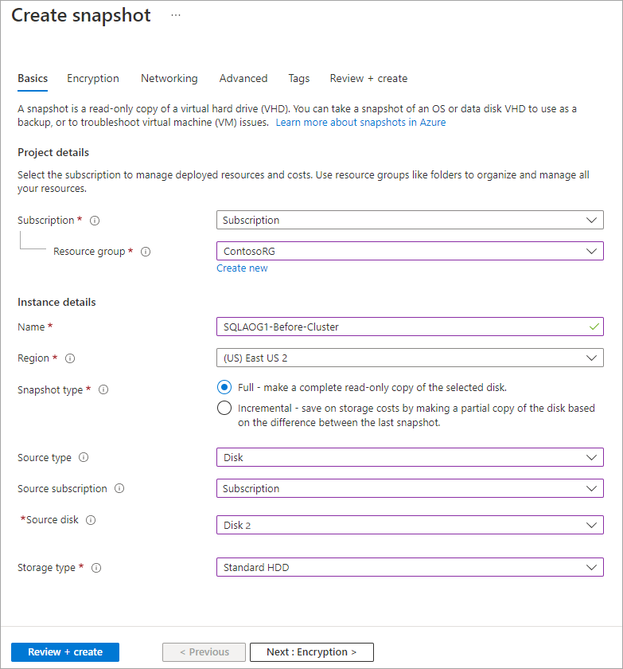

<!-- cSpell:ignore AOAG SQLAOG SQLAOGAVSET BEPOOL contosovmsacc SHAOG -->

# Rehost an on-premises application with Azure VMs and SQL Server Always On availability groups

This article demonstrates how the fictional company Contoso rehosts a two-tier Windows .NET application running on VMware virtual machines (VMs) as part of a migration to Azure. Contoso migrates the application front-end VM to an Azure VM, and the application database to another Azure VM with SQL Server, running in a Windows Server failover cluster with SQL Server Always On availability groups.

The SmartHotel360 application used in this example is provided as open-source software. If you want to use it for your own testing purposes, download it from [GitHub](https://github.com/Microsoft/SmartHotel360).

## Business drivers

The IT leadership team has worked closely with business partners to understand what they want to achieve with this migration. They want to:

- **Address business growth.** Contoso is growing, and as a result there's pressure on on-premises systems and infrastructure.
- **Increase efficiency.** Contoso needs to remove unnecessary procedures and streamline processes for developers and users. The business needs IT to be fast and not waste time or money to deliver faster on customer requirements.
- **Increase agility.** Contoso IT needs to be more responsive to the needs of the business. It must react faster than the changes in the marketplace to enable success in a global economy. IT mustn't get in the way or become a business blocker.
- **Scale.** As the business grows successfully, Contoso IT must provide systems that grow at the same pace.

## Migration goals

The Contoso cloud team has pinned down goals for this migration. These goals were used to determine the best migration method:

- After migration, the application in Azure should have the same performance capabilities as it does today in VMware. The application will remain as critical in the cloud as it is on-premises.
- Contoso doesn't want to invest in this application. It's important to the business, but in its current form, Contoso simply wants to move it safely to the cloud.
- The on-premises database for the application has had availability issues. Contoso want to deploy it in Azure as a high-availability cluster with failover capabilities.
- Contoso wants to upgrade from its current SQL Server 2008 R2 platform to SQL Server 2017.
- Contoso doesn't want to use Azure SQL Database for this application and is looking for alternatives.

## Solution design

After pinning down the company's goals and requirements, Contoso designs and reviews a deployment solution and identifies the migration process. The Azure services that it will use for the migration also are identified.

### Current architecture

- The application is tiered across two VMs (`WEBVM` and `SQLVM`).
- The VMs are located on VMware ESXi host `contosohost1.contoso.com` (version 6.5).
- The VMware environment is managed by vCenter Server 6.5 (`vcenter.contoso.com`) that runs on a VM.
- Contoso has an on-premises datacenter (`contoso-datacenter`) with an on-premises domain controller (`contosodc1`).

### Proposed architecture

In this scenario:

- Contoso will migrate the application front end `WEBVM` to an Azure infrastructure as a service (IaaS) VM.
  - The front-end VM in Azure will be deployed in the `ContosoRG` resource group (used for production resources).
  - It will be located in the Azure production network (`VNET-PROD-EUS2`) in the primary region (`East US 2`).
- The application database will be migrated to an Azure VM running SQL Server.
  - It will be located in Contoso's Azure database network (`PROD-DB-EUS2`) in the primary region (`East US 2`).
  - It will be placed in a Windows Server failover cluster with two nodes that uses SQL Server Always On availability groups.
  - In Azure, the two SQL Server VM nodes in the cluster will be deployed in the `ContosoRG` resource group.
  - The VM nodes will be located in the Azure production network (`VNET-PROD-EUS2`) in the primary region (`East US 2`).
  - VMs will run Windows Server 2016 with SQL Server 2017 Enterprise edition. Contoso doesn't have licenses for this operating system. It will use an image in Azure Marketplace that provides the license as a charge to the company's Azure Enterprise Agreement commitment.
  - Apart from unique names, both VMs use the same settings.
- Contoso will deploy an internal load balancer that listens for traffic on the cluster and directs it to the appropriate cluster node.
  - The internal load balancer will be deployed in `ContosoNetworkingRG` (used for networking resources).
- The on-premises VMs in the Contoso datacenter will be decommissioned after the migration is done.

    

### Database considerations

As part of the solution design process, Contoso did a feature comparison between Azure SQL Database and SQL Server. The following considerations helped the company to decide to use an Azure IaaS VM running SQL Server:

- Using an Azure VM running SQL Server seems to be an optimal solution if Contoso needs to customize the operating system or the database server, or if it might want to colocate and run third-party applications on the same VM.

### Solution review

Contoso evaluates its proposed design by putting together a list of pros and cons.

| Consideration | Details |
| --- | --- |
| **Pros** | `WEBVM` will be moved to Azure without changes, which makes the migration simple.    The SQL Server tier will run on SQL Server 2017 and Windows Server 2016, which retires the current Windows Server 2008 R2 operating system. Running SQL Server 2017 supports Contoso's technical requirements and goals. IT provides 100 percent compatibility while moving away from SQL Server 2008 R2.    Contoso can take advantage of its investment in Software Assurance by using the Azure Hybrid Benefit.    A high-availability SQL Server deployment in Azure provides fault tolerance so that the application data tier is no longer a single point of failover. |
| **Cons** | `WEBVM` is running Windows Server 2008 R2. The operating system is supported by Azure for specific roles (July 2018). To learn more, see [Microsoft server software support for Azure Virtual Machines](/troubleshoot/azure/virtual-machines/server-software-support).    The web tier of the application remains a single point of failover.    Contoso needs to continue supporting the web tier as an Azure VM rather than moving to a managed service such as Azure App Service.    With the chosen solution, Contoso will need to continue managing two SQL Server VMs rather than moving to a managed platform, such as Azure SQL Managed Instance. In addition, with Software Assurance, Contoso could exchange its existing licenses for discounted rates on Azure SQL Managed Instance. |

### Azure services

| Service | Description | Cost |
| --- | --- | --- |
| [Azure Database Migration Service](/azure/dms/dms-overview) | Azure Database Migration Service enables seamless migration from multiple database sources to Azure data platforms with minimal downtime. | Learn about [supported regions](/azure/dms/dms-overview#regional-availability) and [Azure Database Migration Service pricing](https://azure.microsoft.com/pricing/details/database-migration/). |
| [Azure Migrate](/azure/migrate/migrate-services-overview) | Contoso uses Azure Migrate to assess its VMware VMs. Azure Migrate assesses the migration suitability of the machines. It provides sizing and cost estimates for running in Azure. | Azure Migrate is available at no additional charge. They might incur charges depending on the tools (first-party or independent software vendor) they decide to use for assessment and migration. Learn more about [Azure Migrate pricing](https://azure.microsoft.com/pricing/details/azure-migrate/). |

## Migration process

The Contoso admins will migrate the application VMs to Azure.

- They'll migrate the front-end VM to Azure VM by using Azure Migrate:
  - As a first step, they'll prepare and set up Azure components and prepare the on-premises VMware infrastructure.
  - With everything prepared, they can start replicating the VM.
  - After replication is enabled and working, they migrate the VM by using Azure Migrate.
- After they've verified the database, they'll migrate the database to a SQL Server cluster in Azure by using Azure Database Migration Service.
  - As a first step, they'll need to provision SQL Server VMs in Azure, set up the cluster and an internal load balancer, and configure Always On availability groups.
  - With this in place, they can migrate the database.
- After the migration, they'll enable Always On availability groups for the database.

    

## Prerequisites

Here's what Contoso needs to do for this scenario.

| Requirements | Details |
| --- | --- |
| **Azure subscription** | Contoso already created a subscription in an earlier article in this series. If you don't have an Azure subscription, create a [free account](https://azure.microsoft.com/free/).    If you create a free account, you're the administrator of your subscription and can perform all actions.    If you use an existing subscription and you're not the administrator, work with the admin to assign you Owner or Contributor permissions.    |
| **Azure infrastructure** | Contoso set up the Azure infrastructure as described in [Azure infrastructure for migration](./contoso-migration-infrastructure.md).    Learn more about specific [prerequisites](./contoso-migration-devtest-to-iaas.md#prerequisites) requirements for Azure Migrate: Server Migration. |
| **On-premises servers** | The on-premises vCenter Server should be running version 5.5, 6.0, 6.5, or 6.7.    An ESXi host running version 5.5, 6.0, 6.5, or 6.7.    One or more VMware VMs running on the ESXi host. |
| **On-premises VMs** | [Review Linux machines](/azure/virtual-machines/linux/endorsed-distros) that are endorsed to run on Azure. |

## Scenario steps

Here's how Contoso will run the migration:

> [!div class="checklist"]
>
> - **Step 1: Prepare a SQL Server Always On availability group cluster.** Create a cluster for deploying two SQL Server VM nodes in Azure.
> - **Step 2: Deploy and set up the cluster.** Prepare a SQL Server cluster in Azure. Databases are migrated into this existing cluster.
> - **Step 3: Deploy Azure Load Balancer.** Deploy a load balancer to balance traffic to the SQL Server nodes.
> - **Step 4: Prepare Azure for Azure Migrate.** Create an Azure Storage account to hold replicated data.
> - **Step 5: Prepare on-premises VMware for Azure Migrate.** Prepare accounts for VM discovery and agent installation. Prepare on-premises VMs so that users can connect to Azure VMs after migration.
> - **Step 6: Replicate the on-premises VMs to Azure.** Enable VM replication to Azure.
> - **Step 7: Migrate the database via Azure Database Migration Service.** Migrate the database to Azure by using Azure Database Migration Service.
> - **Step 8: Protect the database with SQL Server Always On.** Create an Always On availability group for the cluster.
> - **Step 9: Migrate the VM with Azure Migrate.** Run a test migration to make sure everything's working as expected. Then run a migration to Azure.

## Step 1: Prepare a SQL Server Always On availability group cluster

To set up the cluster, the Contoso admins:

1. Create two SQL Server VMs by selecting SQL Server 2017 Enterprise Windows Server 2016 image in the Azure Marketplace.

    

1. In **Create Virtual Machine Wizard** > **Basics**, they configure:

    - Names for the VMs: `SQLAOG1` and `SQLAOG2`.
    - Because machines are business-critical, enable SSD for the VM disk type.
    - Specify machine credentials.
    - They deploy the VMs in the primary region (`East US 2`) in the `ContosoRG` resource group.

1. In **Size**, they start with `D2S v3` instances for both VMs. They'll scale later as needed.
1. In **Settings**, they do the following actions:

    - Because these VMs are critical databases for the application, they use managed disks.
    - They place the machines in the database subnet (`PROD-DB-EUS2`) of the production network (`VNET-PROD-EUS2`) in the primary region (`East US 2`).
    - They create a new availability set (`SQLAOGAVSET`) with two fault domains and five update domains.

      

1. In **SQL Server settings**, they limit SQL connectivity to the virtual network (private) on default port 1433. For authentication, they use the same credentials as used on-site (`contosoadmin`).

    

**Need more help?**

- Get help with how to [provision a SQL Server VM](/azure/azure-sql/virtual-machines/windows/create-sql-vm-portal#1-configure-basic-settings).
- Learn about how to [configure VMs for different SQL Server SKUs](/azure/azure-sql/virtual-machines/windows/availability-group-manually-configure-prerequisites-tutorial#create-sql-server-vms).

## Step 2: Deploy and set up the cluster

To set up the cluster, the Contoso admins:

1. Set up an Azure Storage account to act as the cloud witness.
1. Add the SQL Server VMs to the Active Directory domain in the Contoso on-premises datacenter.
1. Create the cluster in Azure.
1. Configure the cloud witness.
1. Enable SQL Always On availability groups.

### Set up a storage account as a cloud witness

To set up a cloud witness, Contoso needs an Azure Storage account that will hold the blob file used for cluster arbitration. The same storage account can be used to set up cloud witness for multiple clusters.

To create a storage account, the Contoso admins:

1. Specify a recognizable name for the account (`contosocloudwitness`).
1. Deploy a general all-purpose account, with LRS.
1. Place the account in a third region (`South Central US`). They place it outside the primary and secondary region so that it remains available during regional failure.
1. Place it in the resource group that holds infrastructure resources, `ContosoInfraRG`.

    

1. When they create the storage account, primary and secondary access keys are generated for it. They need the primary access key to create the cloud witness. The key appears under the storage account name > **Access keys**.

    

<!-- docutune:casing "Failover Cluster feature" -->

### Add SQL Server VMs to Contoso domain

1. Contoso adds `SQLAOG1` and `SQLAOG2` to the `contoso.com` domain.
1. On each VM, the admins install the Windows Failover Cluster feature and tools.

### Set up the cluster

Before the Contoso admins set up the cluster, they take a snapshot of the OS disk on each machine.

1. They run a script to create the Windows failover cluster.

    

1. After the cluster is created, they verify that the VMs appear as cluster nodes.

     

<!-- docsTest:casing "Failover Cluster Manager" -->

### Configure the cloud witness

1. The Contoso admins configure the cloud witness by using the **Quorum Configuration Wizard** in Failover Cluster Manager.
1. In the wizard, they select to create a cloud witness with the storage account.
1. After the cloud witness is configured, it appears in the Failover Cluster Manager snap-in.

    

### Enable SQL Server Always On availability groups

The Contoso admins can now enable Always On availability groups:

1. In SQL Server Configuration Manager, they enable **Always On availability groups** for the **SQL Server (MSSQLSERVER)** service.

    

1. They restart the service for changes to take effect.

With Always On availability groups enabled, Contoso can set up the Always On availability group that will protect the `SmartHotel360` database.

**Need more help?**

- Read about [cloud witness and setting up a storage account for it](/windows-server/failover-clustering/deploy-cloud-witness).

- Get instructions for how to [set up a cluster and create an availability group](/azure/azure-sql/virtual-machines/windows/availability-group-manually-configure-tutorial).

## Step 3: Deploy Azure Load Balancer

The Contoso admins now want to deploy an internal load balancer that sits in front of the cluster nodes. The load balancer listens for traffic and directs it to the appropriate node.

To create the load balancer, the Contoso admins:

1. In the Azure portal, go to **Networking** > **Load balancer**, and set up a new internal load balancer: `ILB-PROD-DB-EUS2-SQLAOG`.
1. Place the load balancer in the database subnet (`PROD-DB-EUS2`) of the production network (`VNET-PROD-EUS2`).
1. Assign it a static IP address (`10.245.40.100`).
1. As a networking element, deploy the load balancer in the networking resource group `ContosoNetworkingRG`.

    

After the internal load balancer is deployed, the Contoso admins need to set it up. They create a back-end address pool, set up a health probe, and configure a load-balancing rule.

### Add a back-end pool

To distribute traffic to the VMs in the cluster, the Contoso admins set up a back-end address pool that contains the IP addresses of the NICs for VMs that will receive network traffic from the load balancer.

1. In the load balancer settings in the portal, Contoso adds a back-end pool: `ILB-PROD-DB-EUS-SQLAOG-BEPOOL`.
1. The admins associate the pool with availability set `SQLAOGAVSET`. The VMs in the set (`SQLAOG1` and `SQLAOG2`) are added to the pool.

    

### Create a health probe

The Contoso admins create a health probe so that the load balancer can monitor the application health. The probe dynamically adds or removes VMs from the load balancer rotation based on how they respond to health checks.

To create the probe, the Contoso admins:

1. In the load balancer settings in the portal, create a health probe: `SQLAlwaysOnEndPointProbe`.
1. Set the probe to monitor VMs on TCP port 59999.
1. Set an interval of 5 seconds between probes and a threshold of 2. If two probes fail, the VM will be considered unhealthy.

    

### Configure the load balancer to receive traffic

Now, the Contoso admins set up a load balancer rule to define how traffic is distributed to the VMs.

- The front-end IP address handles incoming traffic.
- The back-end IP pool receives the traffic.

To create the rule, the Contoso admins:

1. In the load balancer settings in the portal, add a new rule: `SQLAlwaysOnEndPointListener`.
1. Set a front-end listener to receive incoming SQL client traffic on TCP port 1433.
1. Specify the back-end pool to which traffic will be routed and the port on which VMs listen for traffic.
1. Enable floating IP (direct server return), which is always required for SQL Server Always On.

    

**Need more help?**

- Get an overview of [Azure Load Balancer](/azure/load-balancer/load-balancer-overview).
- Learn about how to [create a load balancer](/azure/load-balancer/quickstart-load-balancer-standard-internal-portal).

## Step 4: Prepare Azure for Azure Migrate

Here are the Azure components Contoso needs to deploy Azure Migrate:

- A virtual network in which VMs will be located when they're migrated.
- An Azure Storage account to hold replicated data.

The Contoso admins set up these components:

1. Contoso already created a network/subnet it can use for Azure Migrate when it [deployed the Azure infrastructure](./contoso-migration-rehost-vm-sql-ag.md).

    - The SmartHotel360 application is a production application, and `WEBVM` will be migrated to the Azure production network (`VNET-PROD-EUS2`) in the primary region (`East US 2`).
    - `WEBVM` will be placed in the `ContosoRG` resource group, which is used for production resources, and in the production subnet (`PROD-FE-EUS2`).

1. The Contoso admins create an Azure Storage account (`contosovmsacc20180528`) in the primary region.

    - Use a general-purpose account with standard storage and LRS replication.

## Step 5: Prepare on-premises VMware for Azure Migrate

Here's what the Contoso admins prepare on-premises:

- An account on the vCenter Server or vSphere ESXi host to automate VM discovery.
- On-premises VM settings so that Contoso can connect to the replicated Azure VM after migration.

### Prepare an account for automatic discovery

Azure Migrate needs access to VMware servers to:

- Automatically discover VMs.
- Orchestrate replication and migration.
- At least a read-only account is required. They need an account that can run operations such as creating and removing disks and turning on VMs.

To set up the account, the Contoso admins:

1. Create a role at the vCenter level.
1. Assign that role the required permissions.

### Prepare to connect to Azure VMs after migration

After migration, Contoso wants to connect to the Azure VMs and allow Azure to manage the VMs. To do this, the Contoso admins do the following tasks before migration:

1. For access over the internet, they:

    - Enable RDP or SSH on the on-premises VM before migration.
    - Ensure that TCP and UDP rules are added for the **Public** profile.
    - Check that RDP or SSH is allowed in the operating system firewall.

1. For access over Site-to-Site VPN, they:

    - Enable RDP or SSH on the on-premises VM before migration.
    - Check that RDP or SSH is allowed in the operating system firewall.
    - For Windows, set the operating system's SAN policy on the on-premises VM to **OnlineAll**.

1. Install the Azure agent:

    - [Azure Linux agent](/azure/virtual-machines/extensions/agent-linux)
    - [Azure Windows agent](/azure/virtual-machines/extensions/agent-windows)

1. Miscellaneous

   - For Windows, there should be no Windows updates pending on the VM when triggering a migration. If there are, the Contoso admins won't be able to sign in to the VM until the update completes.
   - After migration, they can check **Boot diagnostics** to view a screenshot of the VM. If it doesn't work, they should verify that the VM is running and review these [troubleshooting tips](https://social.technet.microsoft.com/wiki/contents/articles/31666.troubleshooting-remote-desktop-connection-after-failover-using-asr.aspx).

**Need more help?**

Learn about how to [prepare VMs for migration](/azure/migrate/prepare-for-migration).

## Step 6: Replicate the on-premises VMs to Azure

Before the Contoso admins can run a migration to Azure, they need to set up and enable replication.

With discovery finished, they can begin replication of VMware VMs to Azure.

1. In the Azure Migrate project, they go to **Servers** > **Azure Migrate: Server Migration**, and select **Replicate**.

    

1. In **Replicate** > **Source settings** > **Are your machines virtualized?**, they select **Yes, with VMware vSphere**.

1. In **On-premises appliance**, they select the name of the Azure Migrate appliance that was set up, and then select **OK**.

    

1. In **Virtual machines**, they select the machines to replicate.
    - If the Contoso admins have run an assessment for the VMs, they can apply VM sizing and disk type (premium/standard) recommendations from the assessment results. In **Import migration settings from an Azure Migrate assessment?**, they select the **Yes** option.
    - If they didn't run an assessment or don't want to use the assessment settings, they select the **No** option.
    - If they selected to use the assessment, they select the VM group and assessment name.

    

1. In **Virtual machines**, they search for VMs as needed and check each VM to migrate. Then they select **Next: Target settings**.

1. In **Target settings**, they select the subscription, and target region to which they'll migrate, and specify the resource group in which the Azure VMs will reside after migration. In **Virtual Network**, they select the Azure virtual network/subnet to which the Azure VMs will be joined after migration.

1. In **Azure Hybrid Benefit**, the Contoso admins:

    - Select **No** if they don't want to apply Azure Hybrid Benefit. Then they select **Next**.
    - Select **Yes** if they have Windows Server machines that are covered with active Software Assurance or Windows Server subscriptions, and they want to apply the benefit to the machines they're migrating. Then they select **Next**.

1. In **Compute**, they review the VM name, size, OS disk type, and availability set. VMs must conform with [Azure requirements](/azure/migrate/migrate-support-matrix-vmware#vmware-requirements).

    - **VM size:** If they're using assessment recommendations, the VM size drop-down list contains the recommended size. Otherwise, Azure Migrate picks a size based on the closest match in the Azure subscription. Alternatively, they can pick a manual size in **Azure VM size.**
    - **OS disk:** They specify the OS (boot) disk for the VM. The OS disk is the disk that has the operating system bootloader and installer.
    - **Availability set:** If the VM should be in an Azure availability set after migration, they specify the set. The set must be in the target resource group specified for the migration.

1. In **Disks**, they specify whether the VM disks should be replicated to Azure. Then they select the disk type (standard SSD/HDD or premium managed disks) in Azure and select **Next**.
    - They can exclude disks from replication.
    - If disks are excluded, they won't be present on the Azure VM after migration.

1. In **Review + Start replication**, they review the settings. Then they select **Replicate** to start the initial replication for the servers.

> [!NOTE]
> Replication settings can be updated any time before replication starts in **Manage** > **Replicating machines**. Settings can't be changed after replication starts.

## Step 7: Migrate the database via Azure Database Migration Service

The Contoso admins migrate the database via Azure Database Migration Service by following the [step-by-step migration tutorial](/azure/dms/tutorial-sql-server-to-azure-sql). They can perform online, offline, and hybrid (preview) migrations.

As a summary, they must perform the following tasks:

- Use the Premium pricing tier to create an Azure Database Migration Service instance that connects to the virtual network.
- Ensure that the instance can access the remote SQL Server via the virtual network. Ensure that all incoming ports are allowed from Azure to SQL Server at the virtual network level, the network VPN, and the machine that hosts SQL Server.
- Configure the instance:
  - Create a migration project.
  - Add a source (on-premises database).
  - Select a target.
  - Select the databases to migrate.
  - Configure advanced settings.
  - Start the replication.
  - Resolve any errors.
  - Perform the final cutover.

## Step 8: Protect the database with SQL Server Always On

With the application database running on `SQLAOG1`, the Contoso admins can now protect it by using Always On availability groups. They configure SQL Server Always On by using SQL Server Management Studio and then assign a listener by using Windows clustering.

### Create an Always On availability group

1. In SQL Server Management Studio, they select and hold (or right-click) **Always On High Availability** to start the **New Availability Group Wizard**.
1. In **Specify Options**, they name the availability group `SHAOG`. In **Select Databases**, they select the `SmartHotel360` database.

    

1. In **Specify Replicas**, they add the two SQL nodes as availability replicas and configure them to provide automatic failover with synchronous commit.

     

1. They configure a listener for the group (`SHAOG`) and port. The IP address of the internal load balancer is added as a static IP address (`10.245.40.100`).

    

1. In **Select Data Synchronization**, they enable automatic seeding. With this option, SQL Server automatically creates secondary replicas for every database in the group, so Contoso doesn't have to manually back up and restore them. After validation, the availability group is created.

    

1. Contoso ran into an issue when creating the group. It isn't using Active Directory Windows integrated security and needs to grant permissions to the SQL login to create the Windows failover cluster roles.

    

1. After the group is created, it appears in SQL Server Management Studio.

### Configure a listener on the cluster

As a last step in setting up the SQL deployment, the Contoso admins configure the internal load balancer as the listener on the cluster and bring the listener online. They use a script to do this task.

### Verify the configuration

With everything set up, Contoso now has a functional availability group in Azure that uses the migrated database. The admins verify the configuration by connecting to the internal load balancer in SQL Server Management Studio.

**Need more help?**

- Learn about how to create an [availability group](/azure/azure-sql/virtual-machines/windows/availability-group-manually-configure-tutorial#create-the-availability-group) and [listener](/azure/azure-sql/virtual-machines/windows/availability-group-manually-configure-tutorial#configure-listener).
- Manually [set up the cluster to use the load balancer IP address](/azure/azure-sql/virtual-machines/windows/availability-group-load-balancer-portal-configure#configure-the-cluster-to-use-the-load-balancer-ip-address).
- Learn more about how to [create and use SAS](/azure/storage/common/storage-sas-overview).

## Step 9: Migrate the VM with Azure Migrate

The Contoso admins run a quick test failover and then migrate the VM.

### Run a test migration

Running a test migration helps ensure that everything's working as expected before the migration. The Contoso admins:

1. Run a test failover to the latest available point in time (`Latest processed`).
1. Select **Shut down machine before beginning failover** so that Azure Migrate attempts to shut down the source VM before triggering the failover. Failover continues even if shutdown fails.
1. A test failover runs:

    - A prerequisites check runs to make sure all of the conditions required for migration are in place.
    - Failover processes the data so that an Azure VM can be created. If the latest recovery point is selected, a recovery point is created from the data.
    - An Azure VM is created by using the data processed in the previous step.

1. After the failover finishes, the replica Azure VM appears in the Azure portal. They check that the VM is the appropriate size, that it's connected to the right network, and that it's running.
1. After verifying, they clean up the failover, and record and save any observations.

### Run a failover

1. After verifying that the test failover worked as expected, they create a recovery plan for migration, and add `WEBVM` to the plan.

     

1. They run a failover on the plan. They select the latest recovery point. They specify that Azure Migrate should try to shut down the on-premises VM before triggering the failover.

    

1. After the failover, they verify that the Azure VM appears as expected in the Azure portal.

    

1. After verifying the VM in Azure, they complete the migration to finish the migration process, stop replication for the VM, and stop Azure Migrate billing for the VM.

    

### Update the connection string

As the final step in the migration process, the Contoso admins update the connection string of the application to point to the migrated database running on the `SHAOG` listener. This configuration will be changed on the `WEBVM` now running in Azure. This configuration is located in the `web.config` of the ASP.NET application.

1. The Contoso admins locate the file at `C:\inetpub\SmartHotelWeb\web.config` and change the name of the server to reflect the FQDN of the Always On availability group: `shaog.contoso.com`.

    

1. After updating the file and saving it, they restart IIS on `WEBVM`. They use `iisreset /restart` from a command prompt.
1. After IIS is restarted, the application now uses the database running on the managed instance.

**Need more help?**

- Learn about how to [run a test failover](/azure/site-recovery/tutorial-dr-drill-azure).
- Learn how to [create a recovery plan](/azure/site-recovery/site-recovery-create-recovery-plans).
- Learn about [failing over to Azure](/azure/site-recovery/site-recovery-failover).

### Clean up after migration

After migration, the SmartHotel360 application is running on an Azure VM. The `SmartHotel360` database is located in the SQL Server cluster in Azure.

Now, Contoso needs to finish these cleanup steps:

- Remove the on-premises VMs from the vCenter inventory.
- Remove the VMs from local backup jobs.
- Update internal documentation to show the new locations and IP addresses for VMs.
- Review any resources that interact with the decommissioned VMs. Update any relevant settings or documentation to reflect the new configuration.
- Add the two new VMs (`SQLAOG1` and `SQLAOG2`) to production monitoring systems.

### Review the deployment

With the migrated resources in Azure, Contoso needs to fully operationalize and secure its new infrastructure.

### Security

The Contoso security team reviews the virtual machines `WEBVM`, `SQLAOG1`, and `SQLAOG2` to determine any security issues. They need to:

- Review the network security groups (NSGs) for the VM to control access. NSGs are used to ensure that only traffic allowed to the application can pass.
- Consider securing the data on the disk by using Azure Disk Encryption and Azure Key Vault.
- Evaluate transparent data encryption. Then enable it on the `SmartHotel360` database running on the new Always On availability group. Learn more about [transparent data encryption](/sql/relational-databases/security/encryption/transparent-data-encryption).

For more information, see [Security best practices for IaaS workloads in Azure](/azure/security/fundamentals/iaas).

## Business continuity and disaster recovery

For business continuity and disaster recovery, Contoso takes the following actions:

- To keep data safe, Contoso backs up the data on the `WEBVM`, `SQLAOG1`, and `SQLAOG2` VMs via [Azure VM backup](/azure/backup/backup-azure-vms-introduction).
- Contoso will also learn about how to use Azure Storage to back up SQL Server directly to Azure Blob Storage. Learn more about how to [use Azure Storage for SQL Server backup and restore](/azure/azure-sql/virtual-machines/windows/azure-storage-sql-server-backup-restore-use).
- To keep applications up and running, Contoso replicates the application VMs in Azure to a secondary region by using Site Recovery. Learn more about how to [set up disaster recovery to a secondary Azure region for an Azure VM](/azure/site-recovery/azure-to-azure-quickstart).

### Licensing and cost optimization

- Contoso has existing licensing for its `WEBVM` and will take advantage of the Azure Hybrid Benefit. Contoso will convert the existing Azure VMs to take advantage of this pricing.
- Contoso will use [Azure Cost Management + Billing](/azure/cost-management-billing/cost-management-billing-overview) to ensure the company stays within budgets established by the IT leadership.

## Conclusion

In this article, Contoso rehosted the SmartHotel360 application in Azure by migrating the application front-end VM to Azure by using Azure Migrate. Contoso migrated the application database to a SQL Server cluster provisioned in Azure by using Azure Database Migration Service and protected it in a SQL Server Always On availability group.
